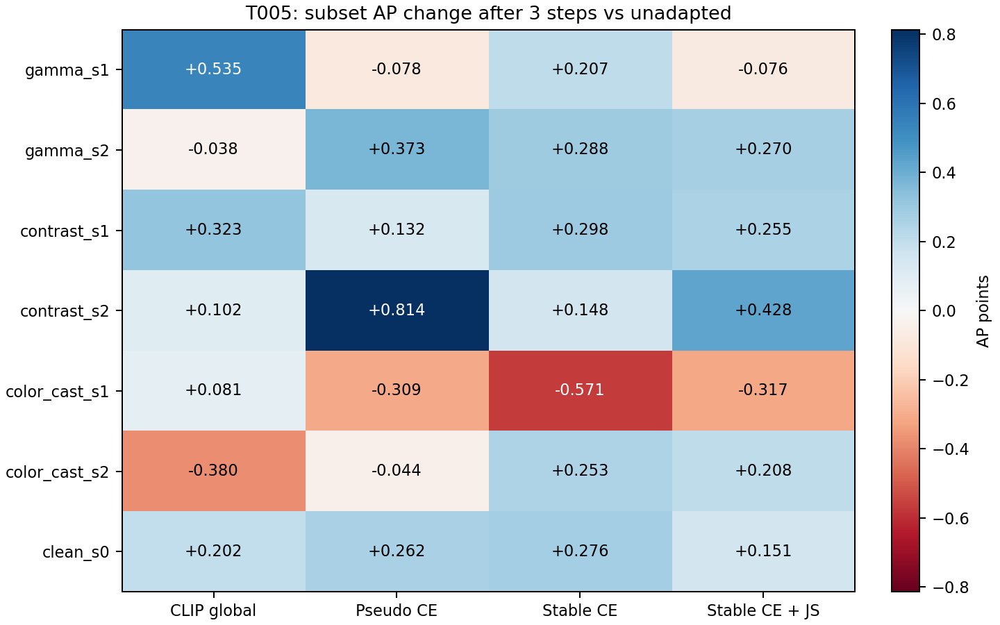
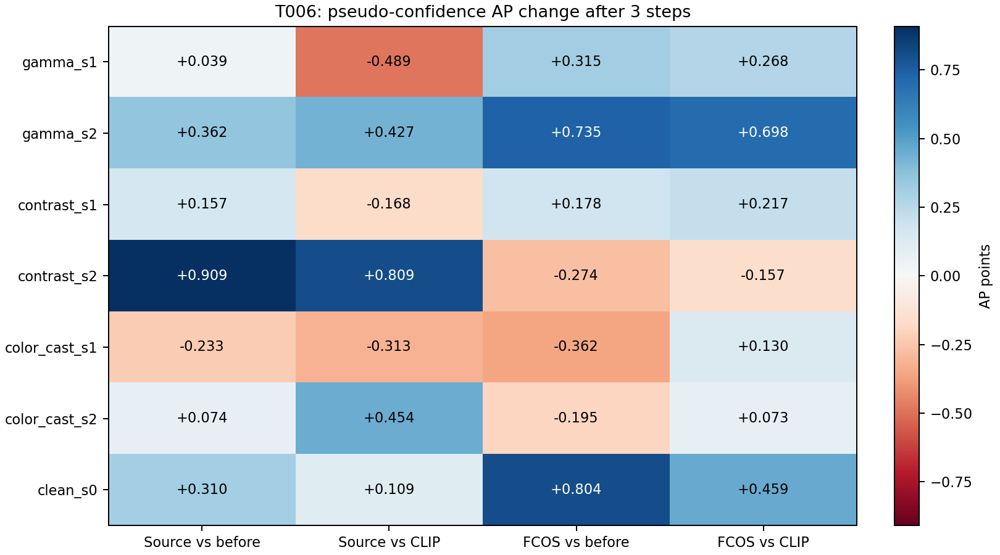
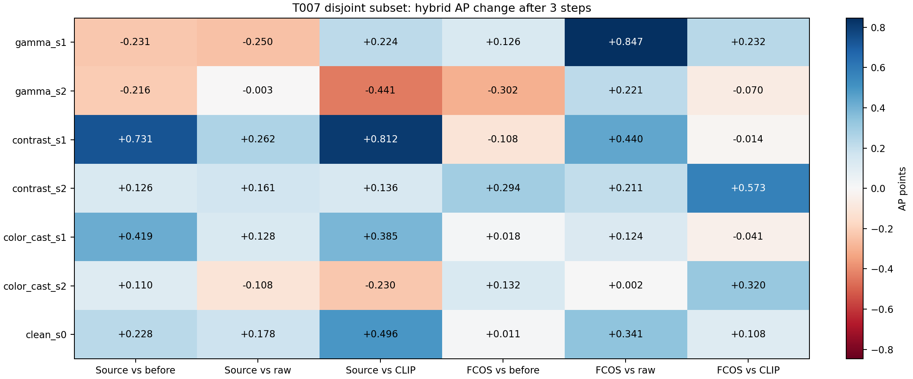

# Codex → ChatGPT

Codex: append implementation reports here using the template below. Do not overwrite prior reports unless correcting an error; preserve history so ChatGPT can reconstruct decisions.

## Report template

### TXXX — <task title>

**Status:** IN_PROGRESS | DONE | BLOCKED | NEEDS_REVIEW

**Commit(s):** <sha(s)>

**Files changed**
- ...

**Implementation decisions**
- ...

**Commands / tests / results**
```text
...
```

**Metrics / observations**
- ...

**Questions / blockers**
- ...

**Recommended next step**
- ...

---

No implementation report yet.

### T001 — Bootstrap started (2026-09-12)

**Status:** IN_PROGRESS

Read PROTOCOL.md and T001 at fa07679a. No baseline source exists to reuse.
Implementing bounded eight-coordinate differentiable ISP, pluggable mock
semantic guidance, frozen downstream consistency, functional episodic SGD,
tests and synthetic demo. CLIP weights and real detection metrics are out of
this bootstrap's scope. Detailed implementation sequence: research_log/T001_plan.md.

Stage 1 passed: python -m pytest tests/test_isp.py -q -> 4 passed in 15.55s. Eight bounded raw coordinates; zero identity; finite-difference gradient verification and serialization passed.

Stage 2 passed: python -m pytest tests/test_losses.py -q -> 4 passed in 19.11s. Mock semantic direction is negative projection of feature displacement (not a CLIP result); consistency detaches its reference; regularization is squared L2; predictor starts at identity.

Stage 3 passed: python -m pytest tests/test_adapt.py -q -> 5 passed in 12.94s. Functional SGD, episode reset, frozen downstream parameters and buffers, final enhanced-image prediction, consistency-only gradient, and two-step unroll finite-difference verification passed. User authorized A6000 execution; remote workspace created under wjq/TAISP.

R001 addressed: 7 adaptation tests passed in 9.57s. Diagnostics now include raw/physical phi, signed and absolute gradients per coordinate, and saturation rate (within 1e-4 of endpoints). Predictor outer-gradient test passes. Deliberately fully saturated input yields saturation=1 and zero gradient; current clamp retained as requested. Remote test environment prepared.

Stage 4 local validation: python -m pytest -q -> 17 passed, 1 skipped (no local CUDA) in 8.81s. python -m taisp.demo --config configs/baseline.yaml --output research_log/demo_cpu.json -> exit 0, total loss approximately 0 -> -0.44069603. README/config/demo complete. A6000 full suite and CUDA demo now being deployed; T001 remains IN_PROGRESS until final report.

### T001 — Minimal runnable framework, including R001 (2026-09-12)

**Status:** DONE (implementation complete; ready for research-lead acceptance)

**Commit(s):** `60853a6`, `99fd9bd`, `c78951d`, `aa2e2c2` (research review merge),
`5ce1f66`, **`54a9e64`** (final tested code). This report/evidence follows those commits.

**Files changed**
- `taisp/isp/{ops,module}.py`: gamma, channel gains, contrast, brightness,
  polynomial tone, signed sharpening; bounded eight-coordinate raw state.
- `taisp/models/parameter_predictor.py`: small identity-initialized predictor.
- `taisp/losses/{semantic,consistency,regularization}.py`: replaceable objectives.
- `taisp/tta/adapt.py`: per-image functional SGD, no labels, frozen downstream,
  final prediction and diagnostics, optional higher-order graph.
- Package initializers, `pyproject.toml`, `configs/baseline.yaml`, `taisp/demo.py`,
  `README.md`, `.gitignore`, `.gitattributes`, `scripts/run_a6000_smoke.sh`.
- `tests/test_{isp,losses,adapt,demo}.py`; project-local research logs/CPU demo and
  `research_log/remote_runs/20260912-003812-taisp-t001-a6000/` exact remote receipts.

**Implementation decisions**
- No baseline source existed; new logic uses PyTorch primitives, with no copied
  external code. Zero raw phi is identity; physical ranges are in README.
- Semantic mock is negative directional projection of encoder displacement,
  not claimed equivalent to CLIP. It has finite gradients at identity. CLIP
  preprocessing/text prompts remain a later task, behind the callable interface.
- Downstream is permanently frozen/eval, including BatchNorm state. Enhanced
  branch retains input gradients. Its tensor output must be differentiable and
  aligned for consistency (a real detector should expose pre-NMS features).
- Default adaptation detaches initialization/results and never updates predictor
  or owned ISP state. `differentiable=True` retains graph into phi0/predictor for
  future outer training; no source/meta optimizer or labels are in deployment.
- R001 diagnostics: K+1 raw/decoded states and component losses, saturation
  fraction within 1e-4 of endpoints, K gradient vectors (signed and absolute)
  and norms. Final state has no update gradient because there is no next update.
- Plain SGD, no early stopping or rollback mechanism. Clamp retained per R001.

**Commands / tests / results**
```text
Local: Python 3.12.7, torch 2.13.0+cpu, pytest 9.1.1, PyYAML 6.0.3
python -m pytest tests/test_isp.py -q      -> 4 passed in 15.55s
python -m pytest tests/test_losses.py -q   -> 4 passed in 19.11s
python -m pytest tests/test_adapt.py -q    -> 5 passed in 12.94s (before R001)
python -m pytest tests/test_adapt.py -q    -> 7 passed in 9.57s (after R001)
python -m pytest -q                      -> 17 passed, 1 CUDA skip in 8.81s
python -m taisp.demo --config configs/baseline.yaml --output research_log/demo_cpu.json
                                        -> exit 0
python -m pip install --no-deps --no-build-isolation -e .
                                        -> installed taisp 0.1.0, import passed
git diff --check                        -> passed

A6000: Python 3.12.12, torch 2.4.0+cu121, CUDA 12.1, pytest 9.1.1, PyYAML 6.0.3
python -m pytest -q                      -> 18 passed in 3.50s
python -m taisp.demo --config configs/baseline.yaml --device cuda:0 --output "$AUTODL_ARTIFACTS_DIR/demo_cuda.json"
                                        -> exit 0
Remote wrapper: bash scripts/run_a6000_smoke.sh -> exit 0
Release: 20260912-003750-taisp-t001
Run: 20260912-003812-taisp-t001-a6000
```

**Metrics / observations**
- CPU mock total: -1.03238264e-7 -> -0.44069603085517883.
- CUDA mock total: -5.16191356e-8 -> -0.44069597125053406.
- CUDA final gamma=0.77050513, RGB gains=[1.09458315,1.09608066,1.09628928],
  contrast=0.89547312, brightness=0.09697855, tone=0.09623994,
  sharpening=0.000001506. Negative projection loss can be negative by definition.
- Known-direction squared-target synthetic test decreases total to <25% of
  initial, moves gamma below 1 and brightness above 0, reports finite eight-
  coordinate gradients, and reproduces identical independent episodes.
- First-order ISP and two-step unroll finite-difference tests pass. Outer loss
  reaches both predictor output/initialization and predictor head weights.
- Demo saturation is 0 across all 11 states. Sharpening gradient is weak under
  the mean-RGB mock (1.16e-10 initially, -6.70e-6 at final update), without clipping.
  No coordinate stays below 1e-8 for every update. The spatially weighted ISP
  gradient test independently verifies all eight coordinates.
- Deliberate fully clipped image: saturation=1, image-loss gradient=0, no update.
  This observed limitation is exposed, as R001 requested; tests were not loosened.
- Frozen detector/backbone behavior is tested with a tiny feature model, not a
  pretrained detector. These are software smoke results, **not detection gains**.

**Questions / blockers**
- No T001 implementation blocker remains. Real CLIP, pretrained detection,
  dataset metrics and meta-training were not run, as requested for this stage.
- Server contains several wjq folders; used the existing login's writable
  `/home/liujianhua/wjq/TAISP`. Source, isolated test environment and run artifacts
  are present there; full recovery instructions are in research_log/T001_handoff.md.

**Recommended next step**
- Research lead accepts/revises T001 and defines T002's frozen real-model and
  semantic-objective contract. Evaluate whether the selected semantic features
  sufficiently supervise spatial operators before interpreting sharpening gains.
- CHATGPT_TO_CODEX.md remains research-lead-owned; its IN_PROGRESS marker was
  intentionally not rewritten by Codex. This mailbox is the completion report.

### T002 — Execution started (2026-09-12)

**Status:** IN_PROGRESS

User explicitly authorized immediate execution of queued tasks and future tasks
discovered by the 15-minute heartbeat. Reusing the accepted T001 code. Pre-result
choices, dependency/model pins, controlled-shift definitions and test sequence
are recorded in research_log/T002_plan.md. Primary consistency weight is zero.
Cached OpenAI CLIP ViT-B/32 and Faster R-CNN ResNet50 FPN COCO_V1 are available
on A6000. Preparing real gradients, isolated oracle analysis and fixed 200-image
COCO-val study; no learned prompts/source/meta-training will be introduced.

T002 Stages A/B: real CLIP gate 3 passed in 3.09s; real detector/oracle gate 2 passed in 4.12s. CLIP/detector parameters remain frozen, image/phi gradients pass, oracle RNG and model state checks pass. Fixed 200 COCO-val images prepared. CUDA bicubic-backward numerical nondeterminism (~1e-10) is documented in T002_plan; episode initial state remains exact.

T002 Stage C smoke complete: run 20260912-011042-taisp-t002-study-smoke finished with exit 0, 2 images / 12 corruption samples and all 25 comparison evaluations. Full fixed 200-image study follows with unchanged predeclared prompt bank, learning rates, shifts and loss weights. Source boundaries/protocol are documented in docs/T002.md.

T002 full attempt encountered a preprocessing bug on image 105335 (612x612), after 42 completed images: floating-point resize rounding produced 223 rather than 224 pixels and incompatible CLIP patch count. Repaired exact shortest-side dimension using integer arithmetic and added the real-shape regression. Failed run 20260912-011328-taisp-t002-coco200 is preserved. Rerun will use the same 200 IDs and unchanged scientific settings.

R003 parity diagnostic revealed a material one-pixel offset for odd resize/crop differences (round vs Hugging Face floor). The completed 200-image run 20260912-011915-taisp-t002-coco200-fixed is therefore preliminary, not final scientific evidence. Exact diagnostic/preliminary receipts are retained. Correcting only crop geometry, then rerunning the unchanged protocol as R003 instructs. No prompt/lr/severity/range tuning.

R003 parity correction validated: 27 model/regression tests passed in6.04s; all14 geometry cases exactly match pinned HF crop, maximum normalized RMSE0.005910955 (<declared0.02). Final same-subset run 20260912-013248-taisp-t002-coco200-final uses source0b8a888. Taylor dot-product postprocessing now includes sign agreement, Pearson/Spearman and 2000-draw image-cluster bootstrap95% CIs plus quantiles, with a known-relation unit test. Final quantitative report will use only this parity-corrected run.

---

# T002 final report — real semantic guidance and gradient alignment

2026-09-12. **Status: NEEDS_REVIEW. Implementation, fixed experiment and R003
diagnostics are complete; research-lead acceptance/next-task decision is pending.**

The generic frozen CLIP direction does **not demonstrate consistently useful
detector alignment** across these shifts. CLIP loss decreases after three steps
in 93.33% of observations, but a semantic step decreases the annotated detector
loss in only 47.58%. Subset AP changes are mixed. The appropriate next action is
targeted objective/coordinate and saturation diagnosis, not automatic meta-training.

## Exact final run and scope

- Final source: `0b8a888`; postprocessing introduced in `7f80b26`, with the
  additional descriptive observations renderer included in this report's commit.
- A6000 release `20260912-013244-taisp-t002-final-parity`.
- Run `20260912-013248-taisp-t002-coco200-final`, exit **0**, finished
  2026-09-12 01:41:17 +08:00; measured experiment time **499.2096 seconds**.
- 200 COCO-val2017 images, seed 20260912, 1,200 image/corruption observations;
  all 200 IDs and JPEG hashes are in the run's subset.json. No filtering by results.
- Six settings: gamma 1.5/2.0, contrast factors 0.6/0.3, RGB gains
  [1.2,1,0.8]/[1.4,1,0.6]. Original geometry and annotated evaluation are unchanged.
- Zero episodic phi. Generic prompt-bank projection, semantic SGD lr=0.1,
  1/3-step outputs, consistency/regularization weights zero. Oracle raw SGD lr=0.01
  is analysis-only. No prompt/rate/severity/ISP-range tuning occurred.
- Detector and CLIP weights are frozen; labels enter only taisp.analysis.
  No learned prompts, predictor/source/meta-training or ViT³ internals.

## Fixed-subset bbox AP (0–100 points)

Clean AP is **38.012**. These are subset metrics, not full-COCO benchmark results.
Mild gamma already scores slightly above clean, so these controlled changes are
not assumed to harm every image or every aggregate metric.

| Setting | Corrupted | CLIP 1 step | CLIP 3 steps | Oracle 1 step |
|---|---:|---:|---:|---:|
| gamma s1 | 38.145 | 38.350 | 38.669 | 38.180 |
| gamma s2 | 36.446 | 36.598 | 36.407 | 36.569 |
| contrast s1 | 36.175 | 36.368 | 36.497 | 36.441 |
| contrast s2 | 31.175 | 31.115 | 31.310 | 31.589 |
| color cast s1 | 37.642 | 37.664 | 37.723 | 37.287 |
| color cast s2 | 35.908 | 35.846 | 35.528 | 36.048 |

The 3-step change is +0.524 AP for gamma s1 but -0.380 for color cast s2.
Four settings improve slightly and two deteriorate at three steps; these small
subset differences are not evidence of a robust benchmark gain. Oracle loss and
AP also differ: the oracle is a diagnostic comparator, not a guaranteed AP bound.

## Alignment and actual one-step behavior

| Setting | Mean cosine | Median cosine | Positive alignment | Step reduces detector loss |
|---|---:|---:|---:|---:|
| gamma s1 | 0.0227 | 0.0514 | 53.5% | 48.0% |
| gamma s2 | 0.0017 | 0.0147 | 51.0% | 47.0% |
| contrast s1 | 0.1173 | 0.2055 | 60.5% | 53.0% |
| contrast s2 | 0.0274 | -0.0080 | 49.5% | 44.0% |
| color cast s1 | 0.0446 | 0.0731 | 56.0% | 46.0% |
| color cast s2 | 0.0580 | 0.0564 | 52.5% | 47.5% |

Overall mean cosine is **0.04530**, positive alignment **53.83%**. All saved
semantic/detector gradients are finite; neither has a zero-norm sample. The
cosine distribution is broad: overall p05/median/p95 = -0.8137 / 0.0559 / 0.8614.

## R003 first-order diagnostic

Compute `delta_det_linear = -0.1 * dot(g_det, g_sem)` from initial saved gradients.
Intervals below are 95% percentile image-cluster bootstrap intervals, 2,000
draws, seed 20260912. Overall resampling keeps all six conditions of each image
together. These are exploratory, without multiplicity adjustment.

| Setting | Sign agreement | Spearman linear vs observed [95% CI] | Spearman cosine vs observed |
|---|---:|---:|---:|
| overall | 54.75% [52.00,57.25] | 0.153 [0.094,0.213] | -0.129 |
| gamma s1 | 43.5% | -0.139 [-0.279,0.006] | 0.097 |
| gamma s2 | 48.0% | 0.059 [-0.095,0.214] | -0.005 |
| contrast s1 | 58.5% | 0.219 [0.069,0.361] | -0.200 |
| contrast s2 | 66.5% | 0.473 [0.348,0.596] | -0.410 |
| color cast s1 | 55.0% | 0.127 [-0.026,0.278] | -0.118 |
| color cast s2 | 57.0% | 0.087 [-0.071,0.243] | -0.048 |

Overall Pearson(linear, observed)=0.2920. The linear delta p05/median/p95 is
-0.007441 / -0.00004860 / 0.006937; observed delta is
-0.039749 / 0.00062436 / 0.042724. The local approximation has modest aggregate
association and large residuals, with stronger rank agreement for contrast than
gamma/color casts. Native proposal matching/sampling can change after a finite
step despite paired RNG; this diagnostic is piecewise smooth and distinct from AP.
The results do not isolate large-step curvature from assignment changes.
Full per-setting sign/correlation CIs, all Pearson values and distribution
quartiles are saved in linear_analysis.json/.md; no observations are trimmed.

## Saturation, coordinates and resources

| Setting | Mean saturation before → after 3 steps | Mean CLIP loss after 3 steps |
|---|---:|---:|
| gamma s1 | 2.662% → 5.229% | -0.001610 |
| gamma s2 | 3.911% → 8.329% | -0.002204 |
| contrast s1 | 0% → 0% | -0.001779 |
| contrast s2 | 0% → 0% | -0.001806 |
| color cast s1 | 6.261% → 3.431% | -0.001752 |
| color cast s2 | 9.911% → 3.835% | -0.001803 |

Gamma s2's after-adaptation saturation p95 is **31.16%**, and **30% of images**
exceed 10% saturated pixels. The hard-clamp remains unchanged in this study.
For a later separately defined ablation, a candidate is smooth clipping
`s_tau(z) = tau * (softplus(z/tau) - softplus((z-1)/tau))`, which maps into (0,1).
It trades exact boundary identity for smooth gradients, so identity bias and
task behavior would need measurement; it was not implemented or tested here.

Under the current raw parameter scaling, RGB gains have the largest average
absolute semantic gradients: gamma/R/G/B/contrast/brightness/tone/sharpening =
[0.01213,0.06431,0.06196,0.03443,0.03742,0.02331,0.00586,0.00478]. Spatial
sharpening is weakly supervised relative to gains; all coordinates remain finite.
Full physical changes at steps 1/3 and per-step raw/physical trajectories are in
results.md, observations.json and samples.jsonl. Gamma adaptation reduces gamma
slightly on average but also changes contrast/brightness; visual brightening alone
is not a task-alignment guarantee.

Mean three-step adaptation time is **0.120–0.124 s/image**, including diagnostics
and synchronization, excluding loading/oracle/evaluation. Mean peak allocated
memory during adaptation is approximately **842 MiB**, including loaded models.

## Models, data and software

- Remote Python 3.12.12, torch 2.4.0+cu121, torchvision 0.19.0+cu121,
  Transformers 4.44.2, pycocotools 2.0.10, NumPy 1.26.4, Pillow 12.3.0.
- OpenAI CLIP ViT-B/32 revision `3d74acf9a28c67741b2f4f2ea7635f0aaf6f0268`;
  weight SHA256 `a63082132ba4f97a80bea76823f544493bffa8082296d62d71581a4feff1576f`.
- Faster R-CNN ResNet50 FPN COCO_V1;
  weight SHA256 `258fb6c638b15964ddcdd1ae0748c5eef1be9e732750120cc857feed3faac384`.
- COCO annotation SHA256 `e8c7f7908f1d7278341fae127d0da654f102f11bd7b21d8aeefa635b8c810b6f`;
  complete source population: 5,000 images/36,781 annotations. Reused cached
  original annotations; exact independently sampled 200 IDs and JPEG hashes saved.
- Local analysis: Python 3.12.7, NumPy 1.26.4, SciPy 1.13.1, Matplotlib 3.9.2.

## Verification, repairs and commands

```text
T001 baseline local pytest: 17 passed, 1 CUDA skip in 26.71s
Real CLIP focused tests: 3 passed in 3.09s (before extra geometry regressions)
Frozen detector/oracle: 2 passed in 4.12s
Initial full real suite: 25 passed in 6.17s; two-image study smoke exit 0
After exact-shortest-side repair: full real suite 26 passed in 5.89s
Final crop parity/model suite: 27 passed in 6.04s (A6000)
Taylor/cluster known-relation test: 1 passed in 3.05s (local)
python -m taisp.analysis.run_t002 --data-root /home/liujianhua/wjq/TAISP/shared/coco200 --output "$AUTODL_ARTIFACTS_DIR/study"
  -> 200 images / 1200 samples / 25 evaluations, exit 0
python scripts/report_t002.py <final-study-directory> -> exit 0
python scripts/analyze_t002_linear.py <final-study-directory> -> exit 0
git diff --check -> passed
```

Three disclosed implementation observations:

1. CUDA antialiased bicubic backward is not bitwise deterministic. Independent
   reproduction and deterministic_algorithms identified the operator. Initial
   episode state is exact; update reproducibility uses atol=1e-8, rtol=1e-5 for
   observed ~1e-10 arithmetic variation. Forward preprocessing is deterministic.
2. First full run failed after 42 images at COCO 105335 (612x612), because float
   multiply/int produced 223 rather than 224. Exact integer shortest-side resize
   and the actual-shape regression repaired it; failed run receipts are retained.
3. R003 parity found an odd center-offset round/floor difference. That completed
   run is marked PRELIMINARY. Crop floor now matches Transformers' pinned processor;
   all 14 shape/content cases have exactly zero geometric discrepancy and max
   normalized RMSE 0.005911, below the predeclared 0.02 tolerance. The final run
   restarted with unchanged IDs/scientific settings after parity passed.

## Deliverables and next action

- Final [full tables/coordinates](../research_log/remote_runs/20260912-013248-taisp-t002-coco200-final/artifacts/study/results.md),
  [R003 correlations/CIs](../research_log/remote_runs/20260912-013248-taisp-t002-coco200-final/artifacts/study/linear_analysis.md).
- The same directory contains samples.jsonl, all predictions, subset/image hashes,
  environment.json, metrics.json, summary.json, observations.json, scatter.csv,
  linear_scatter.csv, PNG/PDF figures and completion.json. No final artifacts are
  taken from the failed or preliminary runs.
- Source additions: frozen CLIP/tensor preprocessing, frozen detector,
  analysis-only oracle/corruptions/COCO loader/runner, config/dependency pins,
  real-model and geometry tests, parity/report/linear-analysis scripts.
- No implementation blocker remains. Research lead should review the weak,
  heterogeneous alignment. Recommended next assigned study: diagnose generic
  versus image-conditioned degradation directions and CLIP feature/coordinate
  supervision, while separating native oracle assignment changes from local
  Taylor error. Saturation deserves a separately declared output-map comparison.
  Do not launch meta-training based on these results.
- User-authorized heartbeat executes future explicitly assigned tasks directly;
  it should consult this report/current project state before starting work.

## T003 — IN_PROGRESS (2026-09-12)
R004 synced; T002 closed. Baseline regression:27 real-model tests passed on A6000 (6.24s),12 focused local tests passed (7.43s). Pre-run formulas/prompts/temperature0.05/masks and comparisons recorded in research_log/T003_plan.md. Stage A will reuse final T002 receipts; all deployment conditioning is image-only and detached. No meta-training or output-map changes.

### T003 Stage A completed
Saved-gradient decomposition delivered in research_log/T003_stage_a/coordinates.md and coordinates.json. Overall outside-subspace norm fraction0.8244, energy0.7205; full signed contributions/sign agreement/energy and initial/post-step saturation strata retained. This is descriptive, not causal. Hand-computed coordinate/saturation test passed. Proceeding with unchanged predeclared Stage B/C settings.

### T003 smoke repair before full run
33 real tests passed; first smoke failed strict T002-gradient reuse (maxabs1.08e-4). Bounded repeat diagnostic reproduced native detector backward numerical variability despite exact forward loss, including within one process. Will compute one fresh g_det shared across all six variants and rerun generic in T003; no tolerance widening, prompts/lr/temperature/ISP changes. Diagnostic run20260912-030416 retained. First failed smoke source metadata typo documented separately; actual sourcec8ac8ff.

### T003 implementation and smoke complete
Fresh paired smoke20260912-030712 succeeded:33 real-model/regression tests passed7.28s,2 images/72 observations,full evaluation24.139s. Offline report/paired-bootstrap test passed. All six T003 variants will share a fresh initial detector gradient; generic rerun. Both failed cache-equality smokes preserved, no scientific hyperparameter changes. Full200-image run follows with temperature0.05,lr0.1,K3 and unchanged hard clamp.

### T003 full experiment running (03:12 Asia/Shanghai)
Run20260912-031123-taisp-t003-coco200;release20260912-031119-taisp-t003-full;source8d8913e. Fresh full A6000 suite34 passed7.79s.200 images/six controlled settings/six variants,7200 observations planned;first6 images completed normally. Status IN_PROGRESS,not DONE. Recovery and exact remaining reporting steps saved in research_log/T003_handoff.md. No full-result interpretation yet.

---

## T003 final report — NEEDS_REVIEW

2026-09-12, Asia/Shanghai. R004 assigned the study; R005 approved its implementation and within-run pairing. All requested T003 implementation, experiment and reporting deliverables are now complete. Research acceptance is pending. No experiment remains active.

## Main finding and recommendation

The deployable CLIP condition inference is too diffuse to materially repair generic guidance at the fixed temperature: soft-direction mean cosine is 0.04530 versus generic 0.04531, paired difference −0.00002 (95% CI −0.00805 to 0.00715). Soft gating gives cosine 0.05127, but the paired gain also crosses zero. Soft gating lowers saturation and shrinks the mean per-sample gradient norm to 32.98% of the raw norm, so these changes cannot be attributed solely to better update direction.

Correct-family information does expose a limited mechanism benefit: oracle direction plus oracle gate reaches cosine 0.09368, positive alignment 62.33%, and detector-loss benefit 50.58%. Against the contemporaneous generic these differences are +0.04837 cosine [0.00472, 0.09020], +8.50 percentage points positive alignment [4.33, 12.67], and +3.92 points beneficial steps [0.58, 7.08]. Its mean observed one-step loss delta is −0.000557 versus +0.001969 for generic; paired difference −0.002526 [−0.004398, −0.000648]. These exploratory effects are real evidence to review, not robust restoration across conditions.

Downstream AP remains mixed even with correct family information. Oracle-both improves gamma-s2 relative to generic but hurts gamma-s1, contrast-s1 and color-cast-s1; both color-cast severities remain below the corrupted-input AP. Oracle-prompt alone substantially improves gamma-s2 but harms contrast-s2 and color-cast-s1. Therefore condition identification is one bottleneck, and better identification alone does not establish a usable global CLIP supervisory signal. The full result does not support starting meta-training. A next separately assigned study should compare final-global versus layer/patch-local supervision, with condition inference treated as a distinct diagnostic. No T004 or meta-training is launched.

## Experiment and reproducibility

- Run `20260912-031123-taisp-t003-coco200`; release `20260912-031119-taisp-t003-full`; experiment source `8d8913e`; R005 postprocessing source `724c04f`. Exit 0 at 2026-09-12T03:45:51+08:00. Study elapsed 2049.095 seconds (34.15 minutes), excluding startup/tests.
- Same 200 COCO-val IDs as final T002, six settings, six variants: 7200 observations, 36 groups of 200 and 72 AP evaluations. No omitted images, hyperparameter selection or outcome-based rerun.
- Same frozen CLIP ViT-B/32 and FasterRCNN ResNet50-FPN COCO_V1. Same differentiable tensor preprocessing and hard-clamped eight-coordinate ISP. Initial phi=0, lr=0.1, K=3, consistency and regularization weights=0. Oracle native-loss sampling seed=20260912+image_id.
- Corruptions unchanged: gamma 1.5/2.0; contrast 0.6/0.3 about 0.5; RGB gains [1.2,1,0.8]/[1.4,1,0.6], with the same T002 implementations.
- Each image/case has one freshly computed annotated detector gradient/loss shared by all six variants. Generic adaptation is rerun in the same experiment. Clean/corrupted AP is reused on the identical subset; initial detector forward losses match T002 exactly for all 1200 cases. Labels/family selection are confined to analysis.

```sh
export OMP_NUM_THREADS=1
export TAISP_SOURCE_REVISION=8d8913e
export PATH=/home/liujianhua/wjq/TAISP/.venv/bin:$PATH
TAISP_REAL_MODELS=1 python -m pytest -q
python -m taisp.analysis.run_t003 --data-root /home/liujianhua/wjq/TAISP/shared/coco200 --baseline /home/liujianhua/wjq/TAISP/runs/20260912-013248-taisp-t002-coco200-final/artifacts/study --output "$AUTODL_ARTIFACTS_DIR/study"
# Local postprocessing from project root:
python -m scripts.report_t003 research_log/remote_runs/20260912-031123-taisp-t003-coco200/artifacts/study
```

## Exact conditioning and masks

All positive/negative prompts are the original T002 text; only grouping and weighting change. Positive bank:
- `a clear natural photograph`
- `a well-lit photograph with natural colors`
- `a sharp and clear photograph with good visibility`

darkness:
- `a dark underexposed photograph`
- `a poorly lit photograph with low visibility`

low_contrast:
- `a low contrast washed-out photograph`
- `a hazy photograph with faded details`

color_cast:
- `a photograph with an unnatural color cast`
- `a photograph with distorted and unbalanced colors`

Normalize each text embedding, average within each bank and normalize the bank. From original corrupted image only, z=normalize(CLIP(x)); w=softmax(z·t_neg / 0.05). No CLIP learned logit-scale factor. The episode direction is normalize(t_pos − sum(w_m t_neg,m)), without renormalizing the weighted negative mixture. Original features, weights, direction and gate are detached. They are never recomputed from adapted images.

Coordinate order: gamma, red_gain, green_gain, blue_gain, contrast, brightness, tone, sharpening. Masks are exactly:

```text
darkness:     [1,0,0,0,0,1,1,0]
low_contrast: [0,0,0,0,1,0,1,0]
color_cast:   [0,1,1,1,0,0,0,0]
```

Soft gate m=w@M. Actual update phi <- phi −0.1*(m*g_sem), with no norm compensation. Generic/soft/oracle_prompt use all coordinates. soft_gate uses soft direction and soft mask; soft_oracle_gate uses soft direction and the correct-family mask; oracle_both uses correct-family direction and mask. Oracle is a diagnostic with privileged family information, not a guaranteed performance upper bound.

## Overall paired findings

Each variant has 1200 observations from the same 200 images. Intervals: 2000 paired image-cluster percentile bootstrap draws, seed20260912, all six conditions travel together overall; exploratory, no multiplicity adjustment.

| Variant | Mean / median cosine | Positive alignment | Beneficial detector step | Paired Δ benefit, pp [95% CI] |
|---|---:|---:|---:|---:|
| generic | 0.04531 / 0.05630 | 53.83% | 46.67% | +0.000 [+0.000, +0.000] |
| soft | 0.04530 / 0.06837 | 53.25% | 49.00% | +2.333 [-0.500, +5.083] |
| oracle_prompt | 0.07074 / 0.10308 | 55.58% | 50.67% | +4.000 [+0.917, +7.169] |
| soft_gate | 0.05127 / 0.07416 | 54.00% | 47.17% | +0.500 [-2.667, +3.583] |
| soft_oracle_gate | 0.09505 / 0.11424 | 61.75% | 48.00% | +1.333 [-1.750, +4.417] |
| oracle_both | 0.09368 / 0.11896 | 62.33% | 50.58% | +3.917 [+0.583, +7.083] |

Generic Taylor sign agreement is 54.50%, Spearman 0.1472; oracle-both is 51.92%, Spearman 0.0377 (CI −0.0207 to 0.0952). Better effective cosine does not imply a reliable finite-step loss prediction. Native detector proposal/assignment behavior and observed backward numerical variability remain relevant.

## All six families/severities: AP1 / AP3

COCO subset AP in 0–100 points. Clean AP=38.012. Values below are measured, not full-COCO benchmark claims.

| Case | Corrupted | Generic | Soft | Oracle prompt | Soft gate | Soft + oracle gate | Oracle both |
|---|---:|---:|---:|---:|---:|---:|---:|
| gamma_s1 | 38.145 | 38.356 / 38.676 | 38.321 / 38.681 | 38.573 / 38.431 | 38.275 / 38.189 | 38.065 / 38.279 | 38.176 / 38.347 |
| gamma_s2 | 36.446 | 36.594 / 36.399 | 36.439 / 36.489 | 36.621 / 37.108 | 36.511 / 36.399 | 36.421 / 36.534 | 36.449 / 36.614 |
| contrast_s1 | 36.175 | 36.376 / 36.507 | 36.421 / 36.756 | 36.302 / 36.547 | 36.239 / 36.499 | 36.245 / 36.300 | 36.233 / 36.296 |
| contrast_s2 | 31.175 | 31.115 / 31.313 | 31.108 / 31.069 | 30.888 / 30.917 | 31.241 / 31.101 | 31.173 / 31.298 | 31.265 / 31.339 |
| color_cast_s1 | 37.642 | 37.667 / 37.723 | 37.632 / 37.657 | 37.274 / 37.267 | 37.566 / 37.727 | 37.707 / 37.667 | 37.314 / 37.311 |
| color_cast_s2 | 35.908 | 35.842 / 35.528 | 35.859 / 35.599 | 35.801 / 35.804 | 35.918 / 35.884 | 35.775 / 35.613 | 35.848 / 35.798 |

Full within-run AP1/AP3 differences, per-case cosine/positive alignment/beneficial-step changes, paired loss/saturation/latency CIs and Taylor Pearson/Spearman distributions are in [results.md](../research_log/remote_runs/20260912-031123-taisp-t003-coco200/artifacts/study/results.md) and [analysis.json](../research_log/remote_runs/20260912-031123-taisp-t003-coco200/artifacts/study/analysis.json). AP differences use the same fixed images, but no AP bootstrap intervals were computed; AP is not an average of per-image AP.

## Degradation-state inference

Overall top-1 family accuracy is 45.50% on these balanced synthetic settings (uniform-chance reference 33.33%). Weight entropy is approximately 98.1–98.4% of its maximum, and mean maximum weight is only about 0.40. Color-cast identification is poor; high contrast identification accuracy still produces diffuse weights. Family IDs are used only to calculate this analysis table.

| Case | Mean darkness / contrast / color weights | Correct top-1 | Normalized entropy |
|---|---:|---:|---:|
| gamma_s1 | 0.3350 / 0.3305 / 0.3345 | 38.5% | 0.9841 |
| gamma_s2 | 0.3478 / 0.3212 / 0.3310 | 43.0% | 0.9835 |
| contrast_s1 | 0.3158 / 0.3780 / 0.3062 | 61.0% | 0.9826 |
| contrast_s2 | 0.3114 / 0.3935 / 0.2951 | 71.5% | 0.9814 |
| color_cast_s1 | 0.3105 / 0.3561 / 0.3334 | 30.5% | 0.9831 |
| color_cast_s2 | 0.3014 / 0.3660 / 0.3327 | 28.5% | 0.9821 |

## Coordinate mechanism, saturation and runtime

T002 offline Stage A is complete in [coordinates.md](../research_log/T003_stage_a/coordinates.md): mean outside-subspace norm fraction0.8244, energy0.7205. Darkness and contrast have especially large cross-talk; contrast has essentially zero saturation. These are descriptive subspace diagnostics, not a causal decomposition of failure.

In T003, raw soft-direction outside-subspace energy is 72.41%; the soft gate still leaves 70.14% of effective energy outside the correct analysis subspace. Correct-family hard gates make that energy zero by construction, which is not itself evidence of task alignment.

| Variant | Raw / effective outside energy | Effective/raw norm ratio | Mean saturation3 | Own CLIP loss decreases at3 | Mean seconds3 |
|---|---:|---:|---:|---:|---:|
| generic | 72.05% / 72.05% | 1.0000 | 3.470% | 93.33% | 0.1179 |
| soft | 72.41% / 72.41% | 1.0000 | 3.463% | 93.50% | 0.1232 |
| oracle_prompt | 69.10% / 69.10% | 1.0000 | 3.250% | 94.75% | 0.1261 |
| soft_gate | 72.41% / 70.14% | 0.3298 | 2.651% | 97.58% | 0.1248 |
| soft_oracle_gate | 72.41% / 0.00% | 0.4413 | 2.438% | 94.67% | 0.1252 |
| oracle_both | 69.10% / 0.00% | 0.4672 | 2.414% | 93.92% | 0.1264 |

Gamma-s2 saturation after3 steps is 8.33% generic, 5.55% soft-gate, 3.20% oracle-both; p95 is 31.16%,20.35%,15.91% respectively. Yet beneficial one-step frequencies are45.5%,45.5%,52.5%, and the paired oracle-both improvement CI still includes zero within gamma-s2. Its post1 saturation buckets show harmful fractions47.5%,59.1%,28.6%,40.0% (N=120,44,21,15), without a monotonic pattern. Gamma-s1 has some high-saturation small groups with more harm, but these do not justify a broad causal claim. Both contrast settings remain at zero saturation across variants while still showing mixed detector/AP effects. A clamp ablation should remain a separate research decision.

Runtime includes condition inference/setup and three-step adaptation with diagnostics/GPU synchronization, excluding annotated loss/AP evaluation, image loading and common-CLIP diagnostics. Mean extra time versus generic is about5–9ms. Mean peak allocated GPU memory is about839MiB, with model residency included. Oracle timing includes the common conditioner invocation and is implementation timing, not a minimal theoretical oracle cost. Per-case latency/saturation paired intervals and complete raw/physical trajectories are retained.

## Validation, environment and observed failures

- Final A6000 full suite:34 passed in7.79s, immediately before full study. Relevant tests cover detached condition equations, masks/SGD, frozen parameter/buffer state, phi gradients, episode reset, detector oracle isolation and baseline preprocessing/evaluation.
- R005 postprocessing: paired-bootstrap and coordinate known-example tests2 passed in1.18s; full smoke renderer passed. Final receipt audit verified7200 rows,36 groups×200,200 IDs, all-zero fresh phi0, identical initial detector gradient/loss across variants, and effective-gradient=gate×raw-gradient.
- Two strict cached-equality smokes failed and are retained:20260912-030241 (native detector gradients max discrepancy1.08e-4) and20260912-030559 (three-step generic phi discrepancy6.2841e-7). Repeat diagnostic20260912-030416 reproduced same-process detector gradient variation despite exact forward loss. Protocol repair uses fresh paired gradients and fresh generic; equality tolerances were not widened.
- First failed smoke command mislabeled its revision35d074b; actual c8ac8ff was verified by local/remote SHA and documented in SOURCE_CORRECTION.md. A local fetch/report ordering mistake was fixed by waiting for SCP completion; no model/code change.
- Final cross-run audit: initial detector forward loss max difference0; detector gradient max difference0.0015283 versus T002; generic AP differences versus T002 are below0.01 points. Primary conclusions use within-T003 pairing, never cached T002 gradients.
- CUDA backward nondeterminism and this one-subset, one-seed exploratory study limit generalization. Confidence intervals reflect image sampling, not between-run numerical variance or multiple comparisons. No temperature/lr/prompt tuning was performed.

Remote environment: Python3.12.12, torch2.4.0, torchvision0.19.0+cu121, Transformers4.44.2, pycocotools2.0.10, NumPy1.26.4, Pillow12.3.0, CUDA12.1, RTX A6000. Local postprocessing uses Python3.12.7, NumPy1.26.4, SciPy1.13.1, Matplotlib3.9.2.

CLIP revision `3d74acf9a28c67741b2f4f2ea7635f0aaf6f0268`; weight SHA256 `a63082132ba4f97a80bea76823f544493bffa8082296d62d71581a4feff1576f`. Detector weight SHA256 `258fb6c638b15964ddcdd1ae0748c5eef1be9e732750120cc857feed3faac384`. Dataset annotation SHA256 `e8c7f7908f1d7278341fae127d0da654f102f11bd7b21d8aeefa635b8c810b6f`. The subset manifest retains exact IDs/image hashes.

## Artifacts and next action

- [Full paired tables](../research_log/remote_runs/20260912-031123-taisp-t003-coco200/artifacts/study/results.md), [all statistics](../research_log/remote_runs/20260912-031123-taisp-t003-coco200/artifacts/study/analysis.json), [AP figure](../research_log/remote_runs/20260912-031123-taisp-t003-coco200/artifacts/study/ap_change.pdf), [environment](../research_log/remote_runs/20260912-031123-taisp-t003-coco200/artifacts/study/environment.json), [completion](../research_log/remote_runs/20260912-031123-taisp-t003-coco200/artifacts/study/completion.json).
- Raw7200 rows exceed GitHub single-file size; lossless [samples.jsonl.gz](../research_log/remote_runs/20260912-031123-taisp-t003-coco200/artifacts/study/samples.jsonl.gz) is tracked instead, with [SHA256/round-trip receipt](../research_log/remote_runs/20260912-031123-taisp-t003-coco200/artifacts/study/samples_archive.json) and [decompression instructions](../research_log/remote_runs/20260912-031123-taisp-t003-coco200/artifacts/study/ARCHIVE.md). Raw JSONL remains local and on A6000; no receipt was deleted. All72 prediction files are retained.
- Remote experiment artifacts remain in /home/liujianhua/wjq/TAISP/runs/20260912-031123-taisp-t003-coco200/artifacts/study. Reports and recovery notes are mirrored to the remote project research_log.
- Source changes: conditioned_clip.py, optional gate in adapt.py, run_t003.py/config, coordinate/report scripts and focused tests. All existing model/data/ISP/oracle/evaluator owners were reused. No learned prompts, predictor/source/meta-training, detector updates, smooth clamp or ViT³ structures.
- T003 status NEEDS_REVIEW. Await research lead acceptance/next explicit task; heartbeat executes newly assigned work directly and avoids rerunning this completed experiment.

## T004 — IN_PROGRESS (R006 accepted)
T003 closed. Baseline local9 passed10.77s/A6000 real suite34 passed7.69s. Pre-run contract research_log/T004_plan.md fixes last-layer postnorm/projected7x7 CLIP tokens, detector score>=0.5/top20 overlap weights/uniform empty fallback, generic/oracle directions, no masks, lr0.1/K3, original fixed200 IDs, and norm-matched one-step diagnostics. No intermediate layer search or training.

### T004 implementation/smoke complete
Patch feature gate15 passed5.23s on A6000;full suite42 passed8.52s. Smoke20260912-050701 completed2 images/72 variant observations/all AP evaluations in27.5378s,exit0. Exact geometry,postnorm/projection,frozen-state/gradient/reset,original-only detector weights,fallback and norm-match/partition tests passed. Report pipeline succeeded. Same predeclared settings proceed to full200;no training or tuning.

### T004 full fixed-subset run active
Run20260912-051214-taisp-t004-coco200;release20260912-051210-taisp-t004-full;source4817825. Fresh42 real-model/regression tests passed8.17s;first4/200 images processed normally.7200 primary observations/72 AP evaluations plus norm-matched loss and patch-partition diagnostics planned. IN_PROGRESS; no full results yet. Peak memory is adaptation-phase allocation, not total detector-setup peak. Recovery/next reporting steps in research_log/T004_handoff.md.

---

## T004 final report — NEEDS_REVIEW

2026-09-12, Asia/Shanghai. R006 cfdec6e assigned this study after accepting T003. All T004 implementation, fixed-subset experiment and report deliverables are complete. No active experiment remains; research acceptance is pending.

## Finding and recommendation

Last-layer patch-token supervision does not provide a supported overall improvement in deployable semantic-gradient alignment. Global-generic mean cosine is0.04531, versus0.01529 for uniform patches and0.02003 for region-weighted patches; paired differences are−0.03002 [−0.08513,0.02399] and−0.02528 [−0.07905,0.02981]. Primary beneficial detector-loss steps rise slightly from47.17% to48.58%/48.75%, but both paired intervals cross zero. These results do not support global pooling being the main bottleneck under the tested readout.

The positive oracle result must be separated from the representation effect. Norm-matched region-oracle updates benefit51.50% of samples, +4.33 percentage points [1.17,7.58] versus global-generic. Contrast-s2 contributes a+11.0-point improvement [2.0,19.5]. However, holding the oracle text choice fixed, the same norm-matched region-oracle improvement over norm-matched global-oracle is only+1.58 points [−1.92,5.08]. Region-oracle cosine is lower than global-oracle by−0.06353 [−0.11187,−0.01523]; uniform-oracle is lower by−0.05464 [−0.10160,−0.00666]. Thus the oracle-only positive frequency signal does not establish a patch-representation advantage.

Region selection reduces effective patches from49 to24.09 on average, but it does not materially beat uniform patches in the overall paired mechanism metrics. With generic text, region-minus-uniform cosine is+0.00474 [−0.02486,0.03413], beneficial-step gain+0.17pp [−3.00,3.50]. With oracle text the corresponding differences are−0.00889 [−0.03941,0.02089] and+0.83pp [−2.17,3.58].

AP remains heterogeneous. Region-oracle AP3 improves over corrupted input in five of six settings, including+0.353 on contrast-s2 and+0.039 on color-cast-s2, but gamma-s1 drops0.039. Against the stronger contemporaneous global-generic, region-oracle gains0.224 AP on gamma-s2,0.261 on contrast-s2 and0.418 on color-cast-s2, while losing0.574 on gamma-s1 and also losing on contrast-s1/color-cast-s1. Preserve these positive and negative cases; aggregate cosine alone is not a performance predictor.

The evidence remains weak/mixed even with oracle family information and norm matching. Under the R006 decision rule, recommend that the next explicitly assigned task compare a different self-supervised signal (for example frozen detector consistency or self-distillation), rather than meta-learning this CLIP directional loss. No T005, meta-training or spatially varying ISP is launched. This conclusion concerns the tested final-layer projected patch readout and fixed region weighting, not every possible CLIP feature/signal.

## Experiment receipt

- Run `20260912-051214-taisp-t004-coco200`; release `20260912-051210-taisp-t004-full`; experiment source `4817825`. Final report helper source `8cd0eb0` adds matched-text controls without changing experiment data/settings.
- Exit0 at2026-09-12T05:56:05+08:00; study elapsed2612.53855 seconds (43.54 minutes), excluding test/model startup.
- Same200 COCO-val IDs and six corruptions as T002/T003; six primary variants;7200 observations,36 groups×200,72 AP evaluations, plus7200 norm-matched one-step diagnostics. No sample exclusion or tuning.
- Same frozen CLIP ViT-B/32 and FasterRCNN ResNet50-FPN COCO_V1; same hard-clamped global8D ISP. phi0=0,lr0.1,K3,consistency/reg0,seed20260912. Annotated native-loss sampling seed20260912+image_id.
- A fresh g_det/loss is computed once per image/case and shared across all variants. No cached cross-run detector gradients are used. Generic and oracle global baselines are rerun in T004. Clean/corrupted AP uses identical T002 subset receipts.

```sh
export OMP_NUM_THREADS=1
export TAISP_SOURCE_REVISION=4817825
export PATH=/home/liujianhua/wjq/TAISP/.venv/bin:$PATH
TAISP_REAL_MODELS=1 python -m pytest -q
python -m taisp.analysis.run_t004 --data-root /home/liujianhua/wjq/TAISP/shared/coco200 --baseline /home/liujianhua/wjq/TAISP/runs/20260912-013248-taisp-t002-coco200-final/artifacts/study --output "$AUTODL_ARTIFACTS_DIR/study"
# Local report from project root:
python -m scripts.report_t004 research_log/remote_runs/20260912-051214-taisp-t004-coco200/artifacts/study
```

## Exact representations and weighting

Global baseline uses the existing final normalized CLS embedding. Local features use the parity-correct differentiable shortest-side224 resize/floor center crop; take last_hidden_state[:,1:], apply frozen vision post_layernorm, then the same visual_projection768→512, then per-token L2 normalization. This yields7×7 patch features. No intermediate block was selected. Pinned embedding code confirms row-major flatten(2).transpose(1,2) after CLS. Patch-wise text alignment is diagnostic and was not directly guaranteed by global CLIP pretraining; patch tokens retain global self-attention context.

Uniform loss is the average negative projected enhanced-minus-original token displacement. Region loss is the weighted sum of the same per-token scores. The original image reference is detached and re-encoded under no_grad within each loss call, as in the global baseline. CLIP weights/buffers remain frozen; gradients reach phi through enhanced pixels.

Detector-region weights use exactly one frozen eval/no_grad detector inference on original corrupted input: score>=0.5,descending top20. Map original xyxy boxes with the exact integer resized width/height and floor crop offsets, clip to224 crop, intersect each32×32 patch. Raw weight is sum(score×intersection_area/1024), then normalize over49 patches. If no visible valid region exists, use uniform1/49. Boxes/scores/support/weights are fixed and detached for the episode; no annotation, corruption ID, detector gradient or adapted-image prediction determines them.

All six primary variants update all eight ISP coordinates with the same fixed lr; there are no oracle masks. The extra diagnostic rescales each initial semantic gradient to the contemporaneous global-generic gradient norm and takes one step. Labels do not determine scaling. No zero gradients occurred. Maximum norm-target absolute discrepancy is1.1921e-7 from floating arithmetic. Primary fixed-lr AP remains the deployment comparison.

Positive text bank (unchanged):
- `a clear natural photograph`
- `a well-lit photograph with natural colors`
- `a sharp and clear photograph with good visibility`

darkness:
- `a dark underexposed photograph`
- `a poorly lit photograph with low visibility`

low_contrast:
- `a low contrast washed-out photograph`
- `a hazy photograph with faded details`

color_cast:
- `a photograph with an unnatural color cast`
- `a photograph with distorted and unbalanced colors`

Normalize text embeddings, average each bank and normalize its mean. Generic direction remains normalize(t_pos−normalized aggregate negative mean); oracle direction uses the correct analysis-family negative bank. T004 reuses stored bank construction but never runs the T003 condition classifier prepare() method. No learned prompts.

## Overall primary and norm-matched results

Each variant contains1200 observations. Intervals below use2000 paired image-cluster percentile bootstrap draws,seed20260912; all six conditions follow each sampled image. Exploratory95% intervals, no multiplicity adjustment.

| Variant | Mean gradient norm | Mean / median cosine | Positive alignment | Primary loss benefit | Norm-matched benefit | Norm-matched Δbenefit pp vs global-generic [95% CI] |
|---|---:|---:|---:|---:|---:|---:|
| global_generic | 0.12575 | 0.04531 / 0.05628 | 53.83% | 47.17% | 47.17% | +0.000 [+0.000, +0.000] |
| global_oracle | 0.12457 | 0.07074 / 0.10302 | 55.58% | 50.83% | 49.92% | +2.750 [-0.250, +5.833] |
| patch_generic | 0.03470 | 0.01529 / 0.04155 | 51.92% | 48.58% | 48.33% | +1.167 [-2.333, +4.252] |
| patch_oracle | 0.03510 | 0.01610 / 0.02802 | 51.67% | 48.58% | 48.00% | +0.833 [-2.417, +4.085] |
| region_generic | 0.04038 | 0.02003 / 0.04505 | 52.83% | 48.75% | 48.00% | +0.833 [-2.417, +4.000] |
| region_oracle | 0.04179 | 0.00721 / 0.03496 | 51.58% | 49.42% | 51.50% | +4.333 [+1.167, +7.583] |

Mean raw local-gradient norms are0.0347–0.0418 compared with0.12575 global-generic. Norm matching is therefore essential to interpreting the apparent stability. Even matched region-oracle mean loss delta remains+0.000276; its paired mean-loss improvement versus global-generic−0.001484 has interval[−0.003298,+0.000568], crossing zero. Beneficial-step frequency and mean-loss change answer different questions.

### Visual effect with text choice held fixed

Both sides of the norm-matched comparison use each image/case global-generic target norm.

| Local variant | Global control | Δcosine [95% CI] | Δprimary benefit pp [95% CI] | Δmatched benefit pp [95% CI] |
|---|---|---:|---:|---:|
| patch_generic | global_generic | -0.030 [-0.085, +0.024] | +1.417 [-2.167, +4.919] | +1.167 [-2.333, +4.252] |
| patch_oracle | global_oracle | -0.055 [-0.102, -0.007] | -2.250 [-5.419, +1.000] | -1.917 [-5.250, +1.500] |
| region_generic | global_generic | -0.025 [-0.079, +0.030] | +1.583 [-1.917, +5.083] | +0.833 [-2.417, +4.000] |
| region_oracle | global_oracle | -0.064 [-0.112, -0.015] | -1.417 [-4.585, +1.917] | +1.583 [-1.917, +5.083] |

## All family/severity AP1 / AP3

COCO subset AP in0–100 points; clean AP38.012. No full-COCO benchmark claim, no per-image AP averaging or AP confidence intervals.

| Case | Corrupted | Global generic | Global oracle | Uniform generic | Uniform oracle | Region generic | Region oracle |
|---|---:|---:|---:|---:|---:|---:|---:|
| gamma_s1 | 38.145 | 38.351 / 38.680 | 38.568 / 38.437 | 38.177 / 38.253 | 38.152 / 38.481 | 38.211 / 38.112 | 38.184 / 38.106 |
| gamma_s2 | 36.446 | 36.573 / 36.388 | 36.619 / 37.113 | 36.488 / 36.486 | 36.490 / 36.558 | 36.492 / 36.604 | 36.492 / 36.612 |
| contrast_s1 | 36.175 | 36.369 / 36.508 | 36.301 / 36.553 | 36.154 / 36.136 | 36.212 / 36.191 | 36.172 / 36.138 | 36.315 / 36.434 |
| contrast_s2 | 31.175 | 31.115 / 31.267 | 30.888 / 31.016 | 31.389 / 31.267 | 31.320 / 31.277 | 31.388 / 31.369 | 31.363 / 31.528 |
| color_cast_s1 | 37.642 | 37.668 / 37.724 | 37.274 / 37.266 | 37.399 / 37.718 | 37.349 / 37.324 | 37.738 / 37.804 | 37.688 / 37.664 |
| color_cast_s2 | 35.908 | 35.841 / 35.528 | 35.801 / 35.784 | 35.828 / 35.813 | 35.839 / 35.795 | 35.891 / 35.784 | 35.963 / 35.947 |

All per-case gradient statistics, paired deltas versus global-generic, same-text global controls, region-versus-uniform intervals, norm-matched/Taylor analyses, AP differences, saturation and runtime are in [results.md](../research_log/remote_runs/20260912-051214-taisp-t004-coco200/artifacts/study/results.md) and [analysis.json](../research_log/remote_runs/20260912-051214-taisp-t004-coco200/artifacts/study/analysis.json). No negative family is omitted.

## Patch evidence and coordinate mechanism

Original detector predictions cover62.12% of the crop patch grid on average. Mean selected boxes7.16, visible boxes6.24. Exactly11/1200 image/cases use uniform fallback (0.92%). Region weights affect63.03% of patches including fallback and have effective count24.09 versus49 for uniform weighting. Weights are based on predictions, not GT object masks.

| Local variant | Effective patches | Object / background initial gradient norm | Object / background weighted loss3 | Partition-gradient residual max |
|---|---:|---:|---:|---:|
| patch_generic | 49.00 | 0.02134 / 0.01943 | -0.000158 / -0.000152 | 9.17e-05 |
| patch_oracle | 49.00 | 0.02183 / 0.01942 | -0.000162 / -0.000161 | 0.000117 |
| region_generic | 24.09 | 0.03958 / 0.00080 | -0.000407 / -0.000013 | 8.87e-08 |
| region_oracle | 24.09 | 0.04097 / 0.00083 | -0.000426 / -0.000014 | 6.8e-08 |

Region background weighted loss is zero by construction when object support exists. The small nonzero overall background contribution comes from the11 uniform fallback cases. Uniform-patch object and background gradient norms are similar despite different support sizes; selecting object tokens does not guarantee task-aligned gradients. The raw records retain object/background gradients, all49 weighted/unweighted patch scores at1/3 steps, boxes, scores, weights and support.

Gradient-energy percentages below normalize squared coordinates per observation before averaging. RGB gains still dominate local objectives (approximately73–74% combined), so token readout has not removed coordinate cross-talk.

| Variant | Gamma | Red | Green | Blue | Contrast | Brightness | Tone | Sharpen |
|---|---:|---:|---:|---:|---:|---:|---:|---:|
| global_generic | 3.41 | 29.00 | 26.18 | 12.30 | 19.14 | 8.55 | 0.82 | 0.60 |
| global_oracle | 5.20 | 28.21 | 27.61 | 12.40 | 16.19 | 8.49 | 1.27 | 0.63 |
| patch_generic | 4.53 | 32.29 | 27.66 | 13.21 | 13.47 | 7.69 | 0.94 | 0.21 |
| patch_oracle | 4.20 | 32.35 | 28.40 | 12.86 | 13.32 | 7.81 | 0.87 | 0.19 |
| region_generic | 5.46 | 31.89 | 27.82 | 14.07 | 12.43 | 6.93 | 1.16 | 0.22 |
| region_oracle | 4.96 | 31.34 | 28.76 | 13.43 | 13.10 | 7.12 | 1.05 | 0.24 |

## Semantic progress, saturation and costs

Local own semantic losses decrease after3 steps in96.67–98.08% of observations, yet primary detector-loss benefit remains48.58–49.42%. Mean saturation3 drops from3.47% global-generic to2.75% uniform-generic and2.37% region-generic. These reductions accompany substantially smaller raw gradients and do not establish improved semantic direction. Both contrast settings remain at essentially zero saturation.

| Variant | Own semantic loss decreases at3 | Mean saturation3 | Adapt seconds3 | Deployment seconds3 | Adaptation peak MiB |
|---|---:|---:|---:|---:|---:|
| global_generic | 93.33% | 3.470% | 0.1106 | 0.1106 | 841.8 |
| global_oracle | 94.75% | 3.250% | 0.1122 | 0.1122 | 841.9 |
| patch_generic | 96.67% | 2.753% | 0.1143 | 0.1143 | 842.0 |
| patch_oracle | 98.08% | 2.386% | 0.1096 | 0.1096 | 842.0 |
| region_generic | 97.08% | 2.372% | 0.1088 | 0.1386 | 841.9 |
| region_oracle | 97.58% | 2.335% | 0.1091 | 0.1390 | 842.0 |

Region deployment time includes the original detector inference/map, averaging29.86ms extra setup; that inference is diagnostic-only and excluded for the global/uniform paths. Adaptation timing includes its diagnostics and GPU synchronization but excludes annotated-loss/AP/norm-match/partition computation. Peak memory is adaptation-phase allocated memory only; detector-setup peak was not separately recorded. Variant execution order was fixed, so millisecond differences are descriptive and not a hardware-optimized speed benchmark.

## Validation and reproducibility

- Baseline:9 local tests passed10.77s;34 A6000 tests passed7.69s. New feature/preprocessing/adapt gate15 passed5.23s.
- Smoke run20260912-050701-taisp-t004-study-smoke:42 real-model tests passed8.52s;2 images/72 observations/all AP evaluations,27.53785s,exit0. No smoke-driven setting changes.
- Full run starts with42 real-model/regression tests passed8.17s. Tests cover odd/rectangular/square crop geometry, direct post-LN/projection equivalence, frozen model state, finite phi gradients, repeated fresh episodes, region overlap/score/top-k/fallback, original-only detector invocation, norm matching and partition gradients.
- Final analysis-related tests3 passed6.85s. Complete receipt audit passed:7200 rows,36 groups×200,200 IDs, all-zero fresh phi0, exact shared g_det/loss across variants, patch weight normalization and norm-match target checks. Figure visually inspected.
- No T004 implementation or experiment failures. Two documentation trailing-CR lines were normalized after git diff --check identified them; no scientific change.
- Recomputed uniform patch partition gradients differ from the saved total by at most1.1682e-4; region partition residuals are below9e-8. These discrepancies are retained rather than assuming bitwise CUDA backward reproducibility. CPU partition sum tests pass. All scientific comparisons use fresh within-run detector gradients.
- One fixed200-image subset and one seed; intervals reflect image resampling, not run-to-run numerical uncertainty or multiplicity control. Oracle directions are analysis-only. No meta-training, learned prompts, intermediate-layer search, predictor/source training, smooth clamp, detector update or ViT³ mechanism was introduced.

Remote environment: Python3.12.12,torch2.4.0,torchvision0.19.0+cu121,Transformers4.44.2,pycocotools2.0.10,NumPy1.26.4,Pillow12.3.0,CUDA12.1,RTX A6000. Local reports use Python3.12.7,NumPy1.26.4,SciPy1.13.1,Matplotlib3.9.2.

CLIP revision `3d74acf9a28c67741b2f4f2ea7635f0aaf6f0268`; SHA256 `a63082132ba4f97a80bea76823f544493bffa8082296d62d71581a4feff1576f`. Detector SHA256 `258fb6c638b15964ddcdd1ae0748c5eef1be9e732750120cc857feed3faac384`. Annotation SHA256 `e8c7f7908f1d7278341fae127d0da654f102f11bd7b21d8aeefa635b8c810b6f`. The subset manifest retains exact image IDs/hashes.

## Delivery and next action

- [Full paired tables](../research_log/remote_runs/20260912-051214-taisp-t004-coco200/artifacts/study/results.md), [all analysis](../research_log/remote_runs/20260912-051214-taisp-t004-coco200/artifacts/study/analysis.json), [AP figure](../research_log/remote_runs/20260912-051214-taisp-t004-coco200/artifacts/study/ap_change.pdf), [raw7200 observations](../research_log/remote_runs/20260912-051214-taisp-t004-coco200/artifacts/study/samples.jsonl), [receipt audit](../research_log/remote_runs/20260912-051214-taisp-t004-coco200/artifacts/study/receipt_audit.json), [environment](../research_log/remote_runs/20260912-051214-taisp-t004-coco200/artifacts/study/environment.json), [completion](../research_log/remote_runs/20260912-051214-taisp-t004-coco200/artifacts/study/completion.json).
- Raw samples.jsonl is96,709,726 bytes, below GitHub single-file limit; retained unchanged without compression. SHA25681a75284aed074427f82e6b743d62192ef5cf93882f4f7ab2f31ad34d92c56ca. All72 prediction files and raw logs are retained.
- Remote artifacts: /home/liujianhua/wjq/TAISP/runs/20260912-051214-taisp-t004-coco200/artifacts/study; reports/recovery notes mirrored under project research_log.
- Source: shared CLIP geometry/patch extension, spatial loss, region mapper, spatial diagnostics/runner/config/tests and report script. Existing ISP, adaptation, detector, COCO and oracle/evaluator owners were reused.
- T004 NEEDS_REVIEW. Await research lead acceptance/next explicit task. Heartbeat executes newly assigned work directly; do not rerun this completed study or start meta-training automatically.

## T005 IN_PROGRESS — R007 acknowledged

T004 accepted/closed. T005 pre-run definitions in research_log/T005_plan.md;
fixed-ROI signal and detached stable support implemented. Baseline42real tests
pass; ROI5tests pass. Native CE/JS/fallback CPU unit tests pass. GPU repeated
update discrepancy1.49682e-5 retained; validating reset on real CPU with unchanged
1e-6 tolerance and GPU nonzero gradients/frozen model checks. No full run yet.
No meta-training, spatial ISP, annotation inputs or tuned hyperparameters added.

### T005 implementation checkpoint — ready for fixed full study

50real tests passed87.80s; smoke20260912-064017 completed2images/56rows/all63AP
evaluations27.37618s,exit0. CPU repeated episode same1e-6 tolerance passes; GPU
freeze/nonzero-gradient checks pass. Four analysis tests passed11.02s. Exact
sharedgdet/zero phi0/weight sums/normtargets audited. Smoke only checks software;
no result-driven change. Sourcef64151a, report helper and raw smoke receipts
committed next. Starting unchanged200-image study plus clean controls directly.

### T005 full study launched — IN_PROGRESS

Run20260912-064836-taisp-t005-coco200,release20260912-064831-taisp-t005-full,source9fb96c1.
Fresh51-test suite then fixed200images,6corruptions+clean,4variants,5600rows/63AP
evaluations. Full results pending. Recovery:research_log/T005_handoff.md.
Do not launch duplicate, tune or beginT006 while active.

---

# T005 final report — detector-native self-supervision

**Status: NEEDS_REVIEW. All requested T005 deliverables are complete; research acceptance pending. No active experiment.**

Completed 2026-09-12 at07:33:51+08:00, exit0. Run `20260912-064836-taisp-t005-coco200`, release `20260912-064831-taisp-t005-full`, source/report helper `9fb96c1` (study implementation `f64151a`). The fixed study evaluated200 images, six corruptions plus clean, four objectives,5,600 observations,56 adapted and7 contemporaneous unadapted AP evaluations. Study elapsed2,619.637s (43.66min, excluding the preceding test/model startup).

## Research answer

Detector-native objectives provide a modest, supported initial alignment improvement over CLIP-global on the corrupted subset. Their positive paired mean-cosine differences survive the predeclared image-cluster intervals, and norm-matched one-step benefit rates improve by roughly3–4 percentage points. This signal is not explained solely by gradient magnitude. However, primary fixed-step beneficial-update rates remain near50%, their paired rate intervals cross zero, and AP remains family-dependent. Every detector-native objective beats CLIP atAP3 on gamma-s2, contrast-s2 and color-cast-s2 but loses on gamma-s1, contrast-s1 and color-cast-s1.

Stable filtering and JS do not establish an additional overall mechanism benefit over simple pseudo-confidence. Stable-minus-pseudo and JS-minus-stable cosine/benefit intervals cross zero; in the norm-matched mean-loss comparison stable is worse than pseudo. Clean subset AP is not damaged in this run, but clean ISP state changes are roughly2.4–2.7 times CLIP at3steps and are comparable to corrupted-image changes. This is not evidence of a clean-input identity mechanism.

**Recommendation to the research lead:** retain simple detector pseudo-confidence as the cheaper reference signal; do not claim stable-view consistency as the contribution or start meta-learning. The task decision rule remains unresolved for broad downstream utility: alignment improves, but AP is mixed and color-cast-s1 shows loss/AP disagreement. A next explicit task can test cross-detector transfer or an independent representation before committing to a final objective. No T006, tuning, spatial ISP or training was started.

## Exact implementation and protocol

- Reused existing8D global ISP, identity initialization, hard clamp, functional episodic SGD, frozen Faster R-CNN COCO_V1, CLIP-global baseline, COCO loader, corruption definitions, annotated oracle/evaluator and norm-matching helper. New files: `taisp/models/detector_signal.py`, `taisp/losses/detector_native.py`, `taisp/analysis/run_t005.py`, `configs/t005.yaml`, `scripts/report_t005.py`, and three corresponding test files. Existing detector/ISP/adaptation implementation was unchanged.
- Original base and horizontal-flip inference is eval/no_grad. Retain foreground detections with score>=0.5, descending stable-score top20 in each view. Flip mapping uses `(W-x2,y1,W-x1,y2)`. Same-class candidate matches require IoU>=0.5, sorted by descending IoU, then base index, then flip index; greedy unused-endpoint selection. This is deterministic greedy matching, not a maximum-cardinality assignment.
- Support retains each view's own predicted box. Boxes/classes/scores are detached and fixed for all steps. The enhanced flip view is the horizontal flip of the same ISP-enhanced base image. ROI logits use frozen transform/backbone, fixed boxes scaled by actual resized dimensions, box_roi_pool/box_head/box_predictor. RPN, proposal selection and NMS are bypassed in the differentiable path. Full91 logits include background; pseudo targets are original foreground predictions.
- `det_pseudo`: base-view CE weighted by normalized original base confidence. `det_stable`: mean base/flip CE, object weights from arithmetic mean of their original confidences and normalized to sum1. `det_stable_js`: stable CE plus weighted natural-log Jensen-Shannon divergence with fixed coefficient1.0. No box-regression objective. No CLIP contribution to these three objectives.
- Empty support returns differentiable zero loss: exact zero gradient and unchanged phi. No labels or replacement pseudo-targets are introduced, and fallback observations remain in every aggregate. The unchanged ISP(phi0) output can differ from raw input by identity-arithmetic roundoff; no-update is exact relative to that initial ISP output.
- Same200 IDs, seed20260912, GPU0, threads1, phi0=0, raw lr0.1,K3, external consistency/reg0. Gamma powers1.5/2.0; contrast factors0.6/0.3 around0.5; RGB cast gains[1.2,1.0,0.8]/[1.4,1.0,0.6]. Fixed order CLIP-global,pseudo,stable,stable+JS. No prompt/support/lr/JS tuning after smoke.
- One fresh annotated oracle gradient/loss per image/case is shared by all four variants, confined to analysis. Extra one-step norm match scales each nonzero self-gradient to the same-case CLIP norm, without labels; zero remains zero. Primary deployment results use ordinary fixed raw-phi lr.

The pre-run contract is [T005_plan.md](../research_log/T005_plan.md). Corrupted overall keeps all six cases together when resampling200 image clusters; clean is separate. Intervals use2,000 percentile draws, seed20260912, exploratory without multiplicity adjustment. All1,200 corrupted episodes per variant stay in paired comparisons. Undefined zero-gradient cosine is stored asnull and explicitly zero-coded for aggregate cosine/positive-rate measures; valid-only cosine is separately reported. AP uses official COCO subset evaluation, not averaging per-image AP, and AP differences have no confidence intervals.

## Corrupted overall: raw and norm-matched mechanism

| Variant | Mean norm | Mean / median cosine* | Positive% | Raw benefit% | Norm-matched benefit% | Mean raw / matched detector-loss delta |
|---|---:|---:|---:|---:|---:|---:|
| global_generic | 0.12575 | 0.04532 / 0.05640 | 53.83 | 46.83 | 46.83 | +0.001969 / +0.001969 |
| det_pseudo | 0.48955 | 0.11757 / 0.19214 | 58.17 | 50.25 | 50.58 | -0.001557 / -0.001549 |
| det_stable | 0.39935 | 0.12431 / 0.18084 | 57.92 | 50.00 | 50.00 | -0.001655 / +0.000151 |
| det_stable_js | 0.42919 | 0.12271 / 0.18259 | 58.17 | 50.17 | 50.50 | -0.001944 / -0.000005 |

*Zero-coded aggregate cosine. Nonzero-gradient counts:1,200/1,196/1,194/1,194; valid-only means0.04532/0.11796/0.12494/0.12332. Four pseudo and six stable episodes have no support (the two stable variants share the same six episodes).

| Variant vs CLIP | Delta cosine [95%CI] | Delta positive pp [CI] | Delta raw benefit pp [CI] | Delta matched benefit pp [CI] | Delta raw mean loss [CI] | Delta matched mean loss [CI] |
|---|---:|---:|---:|---:|---:|---:|
| det_pseudo | 0.072 [0.008, 0.135] | 4.333 [-1.000, 9.333] | 3.417 [-0.252, 7.167] | 3.750 [0.500, 7.333] | -0.003526 [-0.006962, -0.000041] | -0.003517 [-0.005618, -0.001643] |
| det_stable | 0.079 [0.019, 0.139] | 4.083 [-1.000, 9.000] | 3.167 [-0.667, 6.917] | 3.167 [0.083, 6.333] | -0.003623 [-0.006931, -0.000245] | -0.001818 [-0.003617, -0.000049] |
| det_stable_js | 0.077 [0.017, 0.137] | 4.333 [-0.669, 9.167] | 3.333 [-0.250, 7.000] | 3.667 [0.331, 7.250] | -0.003912 [-0.007374, -0.000448] | -0.001974 [-0.003965, -0.000113] |

Native raw gradients are approximately3.2–3.9 times the CLIP mean norm. Norm matching retains modest benefit-frequency/mean-loss advantages over CLIP, but stable matched mean loss remains slightly positive (+0.000151) and stable+JS is essentially zero (-0.000005). Even the raw native mean-loss estimates have individual intervals crossing zero; paired differences relative to CLIP are better determined. Do not confuse superiority to a weak baseline with reliable improvement on each image.

## Stable filtering and JS ablations

| Contrast | Delta cosine [CI] | Delta raw benefit pp [CI] | Delta matched benefit pp [CI] | Delta matched mean loss [CI] |
|---|---:|---:|---:|---:|
| det_stable minus det_pseudo | 0.007 [-0.022, 0.037] | -0.250 [-3.500, 3.000] | -0.583 [-3.667, 2.419] | +0.001699 [+0.000599, +0.002798] |
| det_stable_js minus det_stable | -0.002 [-0.006, 0.003] | 0.167 [-2.250, 2.583] | 0.500 [-2.083, 3.167] | -0.000155 [-0.000873, +0.000531] |

The stable-versus-pseudo comparison changes both support selection and use of the flip view; it does not isolate either component alone. JS-versus-stable holds support and views fixed. The added JS term shows no supported overall advantage at the predeclared coefficient. No alternative coefficient was searched.

## All AP results and negative families

AP is in0–100 subset points. Before predictions were rerun in T005, including clean.

| Case | Before | CLIP1 /3 | Pseudo1 /3 | Stable1 /3 | Stable+JS1 /3 |
|---|---:|---:|---:|---:|---:|
| gamma_s1 | 38.145 | 38.349 / 38.680 | 37.976 / 38.067 | 38.001 / 38.352 | 38.080 / 38.069 |
| gamma_s2 | 36.446 | 36.582 / 36.409 | 36.866 / 36.819 | 36.727 / 36.734 | 36.785 / 36.717 |
| contrast_s1 | 36.175 | 36.369 / 36.498 | 36.546 / 36.307 | 36.819 / 36.473 | 36.844 / 36.430 |
| contrast_s2 | 31.175 | 31.115 / 31.277 | 31.854 / 31.989 | 31.393 / 31.323 | 30.957 / 31.603 |
| color_cast_s1 | 37.642 | 37.669 / 37.723 | 37.397 / 37.333 | 37.138 / 37.071 | 37.330 / 37.325 |
| color_cast_s2 | 35.908 | 35.846 / 35.528 | 35.795 / 35.864 | 36.097 / 36.161 | 36.094 / 36.116 |
| clean_s0 | 38.012 | 38.148 / 38.214 | 38.349 / 38.274 | 38.297 / 38.288 | 38.173 / 38.163 |

| Case | Pseudo deltaAP3 vs CLIP | Stable deltaAP3 vs CLIP | Stable+JS deltaAP3 vs CLIP |
|---|---:|---:|---:|
| gamma_s1 | -0.613 | -0.328 | -0.611 |
| gamma_s2 | +0.411 | +0.325 | +0.308 |
| contrast_s1 | -0.191 | -0.025 | -0.068 |
| contrast_s2 | +0.712 | +0.046 | +0.326 |
| color_cast_s1 | -0.390 | -0.652 | -0.398 |
| color_cast_s2 | +0.336 | +0.633 | +0.588 |
| clean_s0 | +0.060 | +0.074 | -0.051 |

The strongest pseudo-confidence case is contrast-s2: raw beneficial-step gain+12pp [2,21], cosine gain+0.203 [0.083,0.319], AP3+0.814 versus unadapted and+0.712 versus CLIP. This is a useful local signal, not an all-family conclusion. In color-cast-s1, stable confidence increases beneficial annotated-loss steps by+12.5pp [4,21] versus CLIP while AP3 falls0.652 points versus CLIP (0.571 versus unadapted). This direct loss/AP disagreement warrants the confirmation-bias concern in the task decision rule; it does not prove the underlying cause. Gamma-s1 also favors the CLIP baseline.



## Clean control

| Variant | Clean deltaAP1 /3 vs before | Mean raw phi norm1 /3 | Phi norm3 p95 | Saturation3% |
|---|---:|---:|---:|---:|
| global_generic | +0.136 / +0.202 | 0.01552 / 0.02877 | 0.05841 | 3.158 |
| det_pseudo | +0.338 / +0.262 | 0.04694 / 0.07799 | 0.21287 | 2.592 |
| det_stable | +0.285 / +0.276 | 0.03955 / 0.06956 | 0.17908 | 2.864 |
| det_stable_js | +0.162 / +0.151 | 0.04200 / 0.07306 | 0.19563 | 3.057 |

No clean AP degradation is observed at1 or3steps in this subset. This does not establish general safety: AP has no interval here, no margin was predeclared, and the same finite-step objective still changes clean images substantially relative to CLIP. All200 clean images have nonempty base/stable support.

## Support, confidence and no-update cases

Across corrupted images, original base/flip counts average7.160/7.232; stable count5.947. Mean stable/base fraction84.75%, symmetric match rate83.33% (ratios defined as0 for empty inputs). Selected base confidence mean0.8313, median0.8764, p05/p950.5431/0.9988. Stable mean confidence0.8659, median0.9121, p05/p950.6074/0.9989. Thus matching increases selected confidence but does not establish improved adaptation.

Pseudo has4/1200 no-update cases (0.33%); stable and stable+JS each6/1200 (0.50%). All16 variant observations have exact zero phi/gradient and zero measured oracle-loss change; none is excluded.

| Variant | Support | N | Mean cosine* | Raw benefit% | Matched benefit% | Mean raw loss delta |
|---|---|---:|---:|---:|---:|---:|
| det_pseudo | 0 | 4 | 0.00000 | 0.00 | 0.00 | +0.000000 |
| det_pseudo | 1-2 | 234 | 0.10989 | 48.29 | 49.15 | -0.000304 |
| det_pseudo | 3-5 | 416 | 0.08095 | 52.40 | 47.84 | -0.000689 |
| det_pseudo | 6+ | 546 | 0.14962 | 49.82 | 53.66 | -0.002767 |
| det_stable | 0 | 6 | 0.00000 | 0.00 | 0.00 | +0.000000 |
| det_stable | 1-2 | 330 | 0.15170 | 49.09 | 49.70 | +0.000374 |
| det_stable | 3-5 | 424 | 0.10193 | 49.29 | 49.53 | -0.002445 |
| det_stable | 6+ | 440 | 0.12703 | 52.05 | 51.36 | -0.002436 |
| det_stable_js | 0 | 6 | 0.00000 | 0.00 | 0.00 | +0.000000 |
| det_stable_js | 1-2 | 330 | 0.14733 | 50.91 | 52.73 | +0.000431 |
| det_stable_js | 3-5 | 424 | 0.10050 | 49.76 | 49.53 | -0.002844 |
| det_stable_js | 6+ | 440 | 0.12730 | 50.68 | 50.45 | -0.002884 |

Support strata are descriptive and select different episodes for pseudo versus stable; they are not causal matched subgroup contrasts. Per-family support counts/confidence distributions and strata, including clean, are preserved in the full analysis.

## Coordinate, loss and Taylor diagnostics

| Variant | Gamma% | Red% | Green% | Blue% | Contrast% | Brightness% | Tone% | Sharpen% |
|---|---:|---:|---:|---:|---:|---:|---:|---:|
| global_generic | 3.41 | 29.00 | 26.18 | 12.30 | 19.14 | 8.55 | 0.82 | 0.60 |
| det_pseudo | 8.46 | 20.51 | 27.24 | 12.73 | 18.16 | 9.38 | 1.27 | 1.93 |
| det_stable | 8.66 | 21.60 | 25.96 | 12.49 | 18.40 | 9.25 | 1.25 | 1.89 |
| det_stable_js | 8.63 | 22.00 | 25.97 | 12.39 | 18.21 | 9.15 | 1.24 | 1.91 |

Energy is squared-coordinate fraction per episode, then averaged; zero-gradient episodes contribute0. RGB gains still carry about60% of native gradient energy versus67.5% for CLIP. This is descriptive, not a claim of eliminating coordinate conflict. Native own losses decrease on93.83%/95.08%/94.58% of corrupted episodes for pseudo/stable/JS, while beneficial annotated-loss steps stay near50%. Stable mean CE falls0.15444 to0.12960; adding JS lowers its mean JS from0.00804 to0.00635 but does not improve overall alignment or AP reliably.

| Variant | Mean Taylor prediction | Mean observed loss delta | Raw Taylor sign agreement% | Raw Spearman [CI] | Matched Spearman [CI] |
|---|---:|---:|---:|---:|---:|
| global_generic | -0.000068 | +0.001969 | 54.17 | 0.144 [0.083, 0.202] | 0.144 [0.083, 0.202] |
| det_pseudo | -0.008168 | -0.001557 | 59.08 | 0.325 [0.255, 0.391] | 0.165 [0.097, 0.230] |
| det_stable | -0.004427 | -0.001655 | 58.08 | 0.287 [0.221, 0.355] | 0.134 [0.062, 0.204] |
| det_stable_js | -0.004746 | -0.001944 | 58.17 | 0.283 [0.222, 0.348] | 0.146 [0.076, 0.214] |

Taylor uses -0.1 times the initial dot product with the shared annotated detector gradient. Native raw correlations improve but remain modest; norm-matched correlations return to roughly0.13–0.17. The annotated detector loss includes native proposal/matching/sampling behavior, so finite-step results are not guaranteed by the local derivative. No cached cross-run gradient comparisons are used.

## Costs and saturation

| Variant | Adapt / deployment seconds3 | Adapt peak MiB | Saturation3% |
|---|---:|---:|---:|
| global_generic | 0.1136 / 0.1136 | 841.7 | 3.470 |
| det_pseudo | 0.1444 / 0.1729 | 1855.2 | 3.488 |
| det_stable | 0.2806 / 0.3398 | 2653.7 | 2.951 |
| det_stable_js | 0.2795 / 0.3387 | 2653.7 | 2.949 |

Deployment adds original base setup28.48ms for pseudo and base plus flip/matching59.19ms for stable variants. Recorded mean setup peaks are1188.9MiB base and1192.1MiB flip/matching. Peaks are total allocated memory in the shared study process with both models resident, not isolated minimal deployment footprints. Adaptation timing includes existing diagnostics/synchronization; annotated oracle/AP/norm/extra CE-JS analyses are excluded. Fixed variant order and no optimization mean these are descriptive costs. Stable roughly doubles pseudo deployment latency without supported overall extra benefit.

## Validation, commands and retained failures

- Baseline:11 local ISP/adapt tests6.38s;42 real tests8.23s. Fixed ROI5tests4.67s, run20260912-063355-taisp-t005-roi-tests.
- Native loss gate20260912-063551-taisp-t005-loss-tests:14pass/1fail5.45s, GPU repeat discrepancy maxabs1.49682e-5 at unchanged1e-6 tolerance. Failed log retained. CUDA backward variability was already observed in T003/T004. The same numerical repeated-episode assertion now passes on realCPU; GPU finite nonzero phi gradients, frozen parameters/buffers and phi0 reset remain checked. Corrected gate15passed81.40s, run20260912-063641-taisp-t005-repeat-tests. No loss/optimizer/model change was made to improve outcomes.
- Empty-support unit tests initially assumed bitwise equality with raw input; phi was exactly0 but existing ISP identity arithmetic has roundoff. Corrected the test reference to exact unchanged ISP(phi0), with no tolerance widening or ISP change. An initial local command used a nonexistent test filename; corrected after inventory, no source failure.
- Real smoke20260912-064017-taisp-t005-study-smoke:50tests87.80s;2images56rows/all63APevaluations27.37618s,exit0. Four focused report/norm/paired tests11.02s. Figure label overlap was corrected by aspect auto; final figure visually inspected. No scientific change after smoke.
- Full run starts with51 real-model/regression tests passed85.36s. Tests cover flip geometry/matching ties, original-only no-grad support, label-free signatures, RPN bypass,91-class fixed ROI output, frozen model state, nonzero phi gradient, CE/JS equation including background, empty support, episode reset and zero-preserving aggregate statistics.
- Final raw audit passes5,600rows/28groupsx200/1,400image-cases/63metrics, exact sharedgdet/loss/support, zero phi0, finite gradients, normalized supportweights and nonzero norm-match targets. All fallback phi/gradient/loss deltas are exactly0. Raw bytes50,817,303; SHA256 `87554e26f6452d2063e92a50fb27d4cb9dcd5931dfd62942f48b6fac47e7bd87`.
- No full-study execution failure, tuning, dropped image, detector update, learned prompt/predictor, meta/source training, smooth clamp, spatial ISP or ViT³ mechanism. One fixed subset/seed; intervals reflect image resampling, not run-to-run numerical uncertainty.

Full launch (from the verified release, exact command also in run.sh/meta.json):

```bash
export TAISP_SOURCE_REVISION=9fb96c1 TAISP_REAL_MODELS=1
/home/liujianhua/wjq/TAISP/.venv/bin/python -m pytest -q && /home/liujianhua/wjq/TAISP/.venv/bin/python -m taisp.analysis.run_t005 --data-root /home/liujianhua/wjq/TAISP/shared/coco200 --output "$AUTODL_ARTIFACTS_DIR/study"
```

Local postprocessing:

```text
D:/anaconda3/python.exe -m scripts.report_t005 research_log/remote_runs/20260912-064836-taisp-t005-coco200/artifacts/study
```

Environment: Python3.12.12, torch2.4.0, torchvision0.19.0+cu121, Transformers4.44.2, pycocotools2.0.10, NumPy1.26.4, Pillow12.3.0, CUDA12.1, RTX A6000. Local analysis Python3.12.7, NumPy1.26.4, SciPy1.13.1, Matplotlib3.9.2. Known nvidia-smi/NVML driver-library mismatch is present; CUDA experiment completed successfully without changing system drivers.

CLIP revision `3d74acf9a28c67741b2f4f2ea7635f0aaf6f0268`, SHA256 `a63082132ba4f97a80bea76823f544493bffa8082296d62d71581a4feff1576f`. Detector SHA256 `258fb6c638b15964ddcdd1ae0748c5eef1be9e732750120cc857feed3faac384`. Annotation SHA256 `e8c7f7908f1d7278341fae127d0da654f102f11bd7b21d8aeefa635b8c810b6f`. Exact image IDs/hashes in subset.json. CLIP remains only the historical global baseline with the unchanged3 positive and6 negative prompts, listed verbatim in environment.json.

## Deliverables and recovery

- [Full per-case paired tables and support strata](../research_log/remote_runs/20260912-064836-taisp-t005-coco200/artifacts/study/results.md), [all statistics](../research_log/remote_runs/20260912-064836-taisp-t005-coco200/artifacts/study/analysis.json), [AP figure PDF](../research_log/remote_runs/20260912-064836-taisp-t005-coco200/artifacts/study/ap_change.pdf).
- [Raw5,600 observations](../research_log/remote_runs/20260912-064836-taisp-t005-coco200/artifacts/study/samples.jsonl), [all AP metrics](../research_log/remote_runs/20260912-064836-taisp-t005-coco200/artifacts/study/metrics.json), [receipt audit](../research_log/remote_runs/20260912-064836-taisp-t005-coco200/artifacts/study/receipt_audit.json), [environment/prompts](../research_log/remote_runs/20260912-064836-taisp-t005-coco200/artifacts/study/environment.json), [completion](../research_log/remote_runs/20260912-064836-taisp-t005-coco200/artifacts/study/completion.json). All63 prediction files, raw logs, configs and run metadata retained.
- Raw JSONL fits the GitHub single-file limit and remains uncompressed. Remote original artifacts: `/home/liujianhua/wjq/TAISP/runs/20260912-064836-taisp-t005-coco200/artifacts/study`. Reports and recovery mirrored under remote project research_log.
- T005 NEEDS_REVIEW; await research acceptance/next explicit task. Heartbeat may execute new tasks directly, but must not rerun completed T005 or infer authorization for meta-learning from this modest signal.

## T006 IN_PROGRESS — R008 acknowledged

T005accepted/closed. Following coordination/LATEST.md continuation.
Pre-run contract research_log/T006_plan.md. FCOSCOCO_V1target being pinned;
initialPython downloadcertificatefailure retried withsystemCA, noTLSbypass or
targetreplacement. Target remains analysis/evaluation-only; existing source
det_pseudo deployment unchanged. No fullstudy or meta-training started.

## T006 full study launched — 2026-09-12T09:25:30+08:00

Status IN_PROGRESS. Full run `20260912-092401-taisp-t006-coco200`, release `20260912-092347-taisp-t006-full`, source `d7d0510`
(pushed main). Configuration unchanged from predeclared T006_plan.md. Full54test
suite precedes fixed200images,6corruptions+clean,two variants,two detectors;
expected2800rows/70AP evaluations. No full scientific conclusions yet.

FCOS pin available in T006_fcos_pin.json; target/isolation4tests passed20.60s.
Smoke `20260912-091109-taisp-t006-study-smoke`:53realtests passed100.40s,
2images28rows70APevals16.28047s,exit0. Audit confirms shared source/target oracle
gradients and initiallosses, fixed support, zero phi, CLIP-only normreference,
signed contributions/Taylor calculations. Report pipeline andfigure checked;
focused reporttest passed4.67s. Allsmoke receipts committed. Exactdeployment
command and recovery in research_log/T006_handoff.md.

Source adaptation is exactly identical onCPU with/without target object;
targetforward trap is not called by adapt. Targetnative GPUphi gradient nonzero,
allweights/buffers frozen, RNGunchanged. FCOS is analysis/evaluation only.
Operational failures: initialmodel SSLfixed with systemCA, oneSSHtimeout;
smokeSFTP stalled, existing legacySCP retry succeeded withverifiedarchivehash.
No scientific change, target substitution or TLSbypass. Fullrun remains active;
will report allnegative cases andconfirmation-bias interpretation at completion.

[2026-09-12T09:26:39+08:00] Fullrun20260912-092401-taisp-t006-coco200 passed54real tests102.35s (7knownwarnings); first2/200images completed15.1s, no blocking error. Experiment remains active; next heartbeat monitors existingrun and collects only after completion. Rootproject logs mirrored remote.

---

# T006 final cross-detector transfer report

Status: **NEEDS_REVIEW**. Full study completed; no active experiment. T001–T005 accepted/closed.

## Interpretation for R008

T006 supports a modest transferable direction signal relative to CLIP, with mixed downstream performance. It does not support a pure source-only explanation, but it also does not establish a broadly beneficial detector-agnostic restoration method. No meta-training, T007, learned gate, new prompt, spatial ISP, smooth clamp or outcome-driven tuning was started.

Across six corruptions, pseudo-confidence improves FCOS cosine from -0.01162 to 0.08159: paired gain +0.093 [0.036, 0.152]. Positive target alignment rises from 48.33% to 56.75%. Target beneficial-step rate rises from 48.92% to 54.33%, paired +5.42 pp [0.58, 10.25]; after matching to the same-case CLIP gradient norm it is 56.17%, paired +7.25 pp [2.58, 12.00]. These exploratory image-cluster intervals support some transfer beyond the source detector and beyond a gradient-norm increase alone.

However, ordinary pseudo target mean loss change is +0.001474 (worse), versus CLIP +0.000718. Their paired difference +0.000756 has CI [-0.001843, 0.003888], so there is no supported improvement in raw mean target loss. A larger beneficial fraction can coexist with larger harmful changes. Norm matching gives target mean change -0.000434; its paired difference versus CLIP is -0.001152 [-0.001803, -0.000516]. The absolute matched mean CI [-0.000920, 0.000038] still crosses zero. This is evidence about direction versus update magnitude, not an evaluated deployment controller; norm-matched AP was not run or claimed.

At K=3, FCOS pseudo AP exceeds CLIP on 5/6 corruptions, but exceeds no adaptation on only 3/6. Gamma-s1/s2 and contrast-s1 improve versus no adaptation; contrast-s2 and both color-cast levels degrade. At K=1 it loses to CLIP on 4/6 conditions. The strong source contrast-s2 gain (+0.909 AP at K3 versus before) coincides with a target decline (-0.274 AP). Thus favorable oracle alignment and useful AP are distinct findings. No AP confidence intervals or full-COCO claims are made.

The source s2-versus-s1 split repeats: pseudo-minus-CLIP AP3 macro is +0.563 on s2 and -0.324 on s1. It does not transfer as the same severity-only rule: FCOS pseudo-minus-CLIP AP3 macro is +0.205 for both severities; target alignment and norm-matched benefit improve in both s1 and s2. Target AP3 versus no adaptation macro is only +0.044 / +0.089. These are arithmetic means of the three official condition AP values, not pooled COCO AP. A severity-only explanation is not supported by the target results.

Annotated source-target directions have mean cosine 0.366 [0.325, 0.405] and positive agreement 75.17%; about 24.83% are nonpositive. The detectors share substantial but incomplete low-dimensional direction agreement. Both losses decrease for 31.00% of ordinary pseudo episodes, versus 23.67% for CLIP: paired +7.33 pp [3.33, 11.00]. Matched pseudo jointly benefits 29.67%, paired +6.00 pp [2.50, 9.42]. This is partial joint transfer, not universal agreement.

Clean AP3 improves by +0.310 on source and +0.804 on FCOS versus before. Nevertheless clean mean phi3 norm is 0.07801 versus CLIP 0.02877 (about 2.71x), with support on all 200 clean images. The current signal has no measured identity/no-adaptation behavior on clean inputs. Clean AP improvement on this fixed subset does not remove that limitation.

Recommended research judgment: retain simple source pseudo-confidence as a modest cross-detector reference; do not call it pure detector-loss gaming, robust restoration, or severity-conditional transfer. The mismatch between raw/matched losses and between source/target AP warrants research review of update magnitude and loss-to-AP coupling. A second architecture with the same ResNet-50 backbone family and COCO training is one transfer test, not independence from training distribution or proof across detector families. Await the research lead's next explicit task.

## Implementation and isolation

FCOS_ResNet50_FPN_Weights.COCO_V1 is analysis/evaluation only. Version, checkpoint hash and inference defaults were fixed before smoke and full results: score 0.2, NMS 0.6, topk 1000, max 100 detections, center radius 1.5; shorter-side 800/max 1333, size-divisible 32, RGB mean [.485,.456,.406], std [.229,.224,.225]. Installed FCOS.forward was inspected: the oracle changes only the top-level training flag to select native classification+bbox_regression+bbox_ctrness; children remain eval and the top flag is restored. Normal eval inference supplies AP.

The source remains frozen Faster R-CNN COCO_V1 with exactly the T005 base-view fixed pseudo-box/class/confidence ROI CE. Original support is detached, score >=0.5, top20; confidence weights sum to 1. There is no target in the adaptation signature or objective. Independent annotated source/target gradients are computed once per image-case at fresh zero 8D phi and shared across variants only in the analysis driver. Both models receive the exact same enhanced tensors at K1/3. No target or annotation influences support, update, step size or CLIP norm matching.

The real isolation test compares source adaptation before the target object exists against adaptation after target construction, with target.forward trapped: CPU phi and enhanced image are exactly equal. FCOS native GPU phi gradients are finite/nonzero, all parameters/buffers remain unchanged, no parameter gradients accumulate, and CUDA RNG is unchanged. Existing source/deploy label-isolation tests and all regressions pass.

## Runtime, completeness and reproducibility

Full run `20260912-092401-taisp-t006-coco200`, release `20260912-092347-taisp-t006-full`, source/report `d7d0510`; driver `8c0f480`, target isolation `6429337`. Started 09:24:05+08; finished 2026-09-12T09:51:22+08, exit 0. Study 1527.182541 seconds after tests/model setup, 200 images, 2,800 rows, 1,400 paired image-cases, 14 groups ×200, 70 official AP evaluations. Full real-model suite: 54 passed, 7 known warnings, 102.35 seconds.

Baseline 51 real tests in 84.76s; target/isolation run 20260912-090851: 4 passed in 20.60s. Smoke 20260912-091109: 53 real tests in 100.40s, 2 images / 28 rows / 70 AP evaluations in 16.280468s, exit 0. Local report/projection/joint/Taylor test passed in 4.67s. Smoke and full-run raw receipts retained; the full figure was inspected.

Audit passes: same 200 IDs as T005; both oracle gradients/initial losses and fixed source support shared across paired variants; fresh phi0 zero; finite 8D gradients; score-normalized weights; CLIP-only norm reference; signed products/Taylor calculations; all 70 prediction files; FCOS metadata agrees with all corresponding predeclared fields. The pin file additionally records its cache path. Four pseudo fallback cases (contrast-s2: 2, color-cast-s1: 1, color-cast-s2: 1) have exact-zero phi, self-gradient, source/target raw/matched loss deltas. All remain in denominators. None occurred on clean.

Observed numerical reproducibility limit: contemporaneous source AP/benefit values differ slightly from T005 despite the unchanged scientific protocol (e.g. source gamma-s1 pseudo AP3: 38.185 versus 38.067). This study reports fresh paired source/target measurements; it does not substitute historical numbers. The prior CUDA backward repeatability discrepancy and CPU exact-isolation test are documented; no bitwise CUDA repeat guarantee or result-driven rerun is claimed.

Observed operational failures: initial FCOS Python download failed certificate verification; using the system CA bundle resolved it without disabling TLS verification. One download SSH timeout was retried. Smoke SFTP transfer stalled; only its matching scp process was stopped and the workflow's legacy SCP retry succeeded with matching archive hash. Full receipt packaging's first SSH connection closed (exit 255); retry succeeded. Full archive 31,081,757 bytes, SHA256 `1c121d5904a0df5dd5b1a72d3e658752dbbfa9343a8d69be83c3c95d75071553`, verified locally. No experiment/model/data changes followed these failures. Known NVML mismatch warning remains; CUDA completed successfully and system drivers were not changed.

Environment: Python 3.12.12, torch 2.4.0, torchvision 0.19.0+cu121, Transformers 4.44.2, pycocotools 2.0.10, NumPy 1.26.4, Pillow 12.3.0, CUDA 12.1, RTX A6000. Local reporting Python 3.12.7, NumPy 1.26.4, SciPy 1.13.1, Matplotlib 3.9.2.

Raw samples.jsonl: 23,544,440 bytes; SHA256 `eec9ff8b8a8c14442d0b4a5d25cd4fb896caca63b3e92892bd9f41a960f9ee70`. Retain uncompressed locally, remotely and in GitHub. No incomplete result or negative family excluded.

## Commands and pins

```bash
export TAISP_SOURCE_REVISION=d7d0510 TAISP_REAL_MODELS=1; /home/liujianhua/wjq/TAISP/.venv/bin/python -m pytest -q && /home/liujianhua/wjq/TAISP/.venv/bin/python -m taisp.analysis.run_t006 --data-root /home/liujianhua/wjq/TAISP/shared/coco200 --output "$AUTODL_ARTIFACTS_DIR/study"
```

Local report: `D:/anaconda3/python.exe -m scripts.report_t006 research_log/remote_runs/20260912-092401-taisp-t006-coco200/artifacts/study`.

- clip_revision: `3d74acf9a28c67741b2f4f2ea7635f0aaf6f0268`
- clip_sha256: `a63082132ba4f97a80bea76823f544493bffa8082296d62d71581a4feff1576f`
- detector_sha256: `258fb6c638b15964ddcdd1ae0748c5eef1be9e732750120cc857feed3faac384`
- annotation_sha256: `e8c7f7908f1d7278341fae127d0da654f102f11bd7b21d8aeefa635b8c810b6f`
- FCOS SHA256: `99b0c9b7cfb1527d782db86b91d207f00547c792fb4103fc612b651d0a07b9e7`

## Mean oracle-loss deltas

After minus before; lower is better. Loss units differ across models. Paired pseudo-minus-CLIP intervals use2000 image-cluster draws, seed20260912; all selected cases travel together, exploratory without multiplicity adjustment.

| Group | Detector | CLIP loss1 /3 | Pseudo loss1 /3 | Pseudo matched loss1 | Paired raw loss1 [CI] | Paired matched loss1 [CI] |
|---|---|---:|---:|---:|---:|---:|
| corrupted_overall | source | +0.001947 / +0.003362 | -0.001573 / -0.003171 | -0.001188 | -0.003519 [-0.006977, +0.000069] | -0.003135 [-0.005183, -0.001272] |
| corrupted_overall | target | +0.000718 / +0.001609 | +0.001474 / +0.001357 | -0.000434 | +0.000756 [-0.001843, +0.003888] | -0.001152 [-0.001803, -0.000516] |
| severity_s1 | source | +0.000275 / +0.000743 | -0.001153 / -0.001400 | -0.000895 | -0.001428 [-0.004815, +0.001985] | -0.001170 [-0.003162, +0.000776] |
| severity_s1 | target | +0.000576 / +0.000901 | +0.001264 / +0.002500 | -0.000464 | +0.000689 [-0.001214, +0.002624] | -0.001040 [-0.001669, -0.000488] |
| severity_s2 | source | +0.003618 / +0.005981 | -0.001993 / -0.004943 | -0.001482 | -0.005611 [-0.010634, -0.000177] | -0.005100 [-0.008328, -0.002075] |
| severity_s2 | target | +0.000860 / +0.002317 | +0.001684 / +0.000213 | -0.000404 | +0.000824 [-0.003158, +0.005601] | -0.001264 [-0.002254, -0.000301] |
| clean_s0 | source | -0.000354 / -0.002588 | -0.003936 / -0.000924 | -0.000292 | -0.003583 [-0.008827, +0.002035] | +0.000062 [-0.003741, +0.003902] |
| clean_s0 | target | +0.000447 / +0.000441 | +0.001180 / +0.001413 | -0.000287 | +0.000733 [-0.002208, +0.003941] | -0.000733 [-0.001864, +0.000237] |

## Taylor and coordinate diagnostics

Prediction: -0.1 times self/oracle gradient dot product at phi0. Hard clamp, finite updates and detector nonlinearities remain unchanged.

| Detector / step | Predicted mean [CI] | Observed mean [CI] | Pearson [CI] | Sign agreement% [CI] |
|---|---:|---:|---:|---:|
| source / raw_taylor | -0.008168 [-0.012576, -0.004383] | -0.001573 [-0.004721, +0.001690] | 0.445 [0.315, 0.578] | 59.500 [56.417, 62.502] |
| source / matched_taylor | -0.001494 [-0.002176, -0.000873] | -0.001188 [-0.002721, +0.000305] | 0.347 [0.199, 0.477] | 56.250 [53.165, 59.333] |
| target / raw_taylor | -0.002920 [-0.005483, -0.000641] | +0.001474 [-0.001070, +0.004583] | 0.377 [0.267, 0.608] | 81.083 [78.833, 83.333] |
| target / matched_taylor | -0.000534 [-0.000893, -0.000199] | -0.000434 [-0.000920, +0.000038] | 0.620 [0.478, 0.801] | 87.083 [85.083, 89.000] |

Signed mean self-gradient × oracle-gradient products; positive predicts decrease. Cross-model loss units differ. No coordinate removed/reweighted.

| Coordinate | Source raw dot | FCOS raw dot | Source matched dot | FCOS matched dot |
|---|---:|---:|---:|---:|
| gamma | +0.00825676 | +0.00369666 | +0.00211127 | +0.00104817 |
| red_gain | +0.01432041 | +0.00848020 | +0.00218911 | +0.00125309 |
| green_gain | +0.02264708 | +0.00673138 | +0.00325713 | +0.00108613 |
| blue_gain | +0.01245762 | +0.00184613 | +0.00237059 | +0.00029132 |
| contrast | +0.01636288 | +0.00569074 | +0.00367262 | +0.00115522 |
| brightness | +0.00640894 | +0.00239942 | +0.00108894 | +0.00041613 |
| tone | +0.00061673 | +0.00036509 | +0.00012805 | +0.00008945 |
| sharpening | +0.00061323 | -0.00000600 | +0.00012657 | -0.00000218 |

All source mean dots are positive. FCOS sharpening is slightly negative while other means are positive; this small descriptive difference does not establish a coordinate-specific mechanism. Red/green gains and contrast contribute appreciably to the respective positive sums. Raw per-coordinate values remain available.

## Artifacts and recovery

- [results.md](../research_log/remote_runs/20260912-092401-taisp-t006-coco200/artifacts/study/results.md)
- [analysis.json](../research_log/remote_runs/20260912-092401-taisp-t006-coco200/artifacts/study/analysis.json)
- [samples.jsonl](../research_log/remote_runs/20260912-092401-taisp-t006-coco200/artifacts/study/samples.jsonl)
- [metrics.json](../research_log/remote_runs/20260912-092401-taisp-t006-coco200/artifacts/study/metrics.json)
- [receipt_audit.json](../research_log/remote_runs/20260912-092401-taisp-t006-coco200/artifacts/study/receipt_audit.json)
- [environment.json](../research_log/remote_runs/20260912-092401-taisp-t006-coco200/artifacts/study/environment.json)
- [completion.json](../research_log/remote_runs/20260912-092401-taisp-t006-coco200/artifacts/study/completion.json)
- [transfer_ap.pdf](../research_log/remote_runs/20260912-092401-taisp-t006-coco200/artifacts/study/transfer_ap.pdf)

Remote originals: `/home/liujianhua/wjq/TAISP/runs/20260912-092401-taisp-t006-coco200/artifacts/study`. No active run; await research review/new task. Recovery: T006_handoff.md and project_state.md.

## Complete per-case report
# T006 cross-detector transfer results

Source d7d0510; 200 images, 2800 variant observations, smoke=None.

Source-only frozen Faster R-CNN fixed ROI pseudo-confidence. Target FCOS is analysis/evaluation only. Both detectors evaluate identical enhanced images. Global8D ISP,lr0.1,K3,identity initialization, hard clamp. No target in support/update and no oracle information in norm matching.

## Source / target official AP1 / AP3 (0–100 points)

| Detector | Case | Before AP / AP50 / AP75 | CLIP AP1 /3 | Pseudo AP1 /3 | Pseudo AP50 1 /3 | Pseudo AP75 1 /3 |
|---|---|---:|---:|---:|---:|---:|
| source | gamma_s1 | 38.145 / 59.245 / 39.676 | 38.350 / 38.674 | 37.971 / 38.185 | 58.937 / 59.480 | 39.882 / 40.545 |
| source | gamma_s2 | 36.446 / 57.604 / 39.152 | 36.598 / 36.380 | 36.859 / 36.808 | 57.823 / 57.288 | 39.201 / 39.064 |
| source | contrast_s1 | 36.175 / 57.631 / 37.976 | 36.368 / 36.501 | 36.550 / 36.332 | 57.109 / 57.324 | 38.748 / 38.314 |
| source | contrast_s2 | 31.175 / 49.548 / 32.807 | 31.115 / 31.275 | 31.850 / 32.084 | 50.468 / 51.695 | 33.139 / 33.819 |
| source | color_cast_s1 | 37.642 / 58.493 / 41.783 | 37.668 / 37.722 | 37.423 / 37.409 | 58.011 / 58.051 | 41.159 / 41.384 |
| source | color_cast_s2 | 35.908 / 55.616 / 39.212 | 35.846 / 35.528 | 35.793 / 35.982 | 55.464 / 55.470 | 38.649 / 38.664 |
| source | clean_s0 | 38.012 / 59.424 / 40.742 | 38.139 / 38.213 | 38.390 / 38.322 | 59.457 / 59.755 | 41.360 / 40.928 |
| target | gamma_s1 | 42.233 / 61.389 / 44.866 | 42.080 / 42.279 | 42.119 / 42.548 | 61.425 / 61.948 | 44.701 / 44.822 |
| target | gamma_s2 | 40.219 / 58.698 / 41.879 | 40.553 / 40.256 | 40.662 / 40.954 | 58.836 / 59.190 | 42.755 / 42.366 |
| target | contrast_s1 | 41.892 / 61.002 / 43.654 | 42.300 / 41.853 | 41.909 / 42.070 | 60.948 / 60.877 | 43.708 / 43.932 |
| target | contrast_s2 | 35.307 / 51.443 / 37.148 | 35.297 / 35.191 | 34.894 / 35.033 | 51.859 / 51.777 | 36.751 / 36.646 |
| target | color_cast_s1 | 41.642 / 60.590 / 43.958 | 41.408 / 41.150 | 41.366 / 41.280 | 60.258 / 59.938 | 43.701 / 43.814 |
| target | color_cast_s2 | 39.386 / 57.186 / 42.878 | 39.385 / 39.118 | 39.263 / 39.191 | 57.150 / 57.268 | 42.180 / 41.553 |
| target | clean_s0 | 43.270 / 62.668 / 46.317 | 43.625 / 43.614 | 43.535 / 44.073 | 62.908 / 63.480 | 46.658 / 47.189 |

CLIP AP50/AP75 and all before/CLIP deltas are retained in analysis.json; official aggregate AP has no invented per-image intervals.

## Paired mechanism vs CLIP

All episodes included. *Undefined cosine zero-coded here; valid-only distributions retained separately.95% intervals use2000 paired image-cluster draws.

| Group | Detector | Variant | Cosine* | Positive% | Raw benefit% | Matched benefit% | Delta cosine [CI] | Delta raw benefit pp [CI] | Delta matched benefit pp [CI] |
|---|---|---|---:|---:|---:|---:|---:|---:|---:|
| corrupted_overall | source | global_generic | 0.04531 | 53.83 | 47.33 | 47.33 | 0.000 [0.000, 0.000] | 0.000 [0.000, 0.000] | 0.000 [0.000, 0.000] |
| corrupted_overall | source | det_pseudo | 0.11757 | 58.17 | 51.17 | 50.58 | 0.072 [0.009, 0.135] | 3.833 [-0.083, 7.667] | 3.250 [0.331, 6.333] |
| corrupted_overall | target | global_generic | -0.01162 | 48.33 | 48.92 | 48.92 | 0.000 [0.000, 0.000] | 0.000 [0.000, 0.000] | 0.000 [0.000, 0.000] |
| corrupted_overall | target | det_pseudo | 0.08159 | 56.75 | 54.33 | 56.17 | 0.093 [0.036, 0.152] | 5.417 [0.583, 10.250] | 7.250 [2.583, 12.000] |
| severity_s1 | source | global_generic | 0.06156 | 56.67 | 49.17 | 49.17 | 0.000 [0.000, 0.000] | 0.000 [0.000, 0.000] | 0.000 [0.000, 0.000] |
| severity_s1 | source | det_pseudo | 0.07817 | 55.33 | 53.83 | 49.33 | 0.017 [-0.059, 0.094] | 4.667 [-1.000, 10.000] | 0.167 [-4.500, 4.833] |
| severity_s1 | target | global_generic | -0.01275 | 48.67 | 50.17 | 50.17 | 0.000 [0.000, 0.000] | 0.000 [0.000, 0.000] | 0.000 [0.000, 0.000] |
| severity_s1 | target | det_pseudo | 0.08054 | 57.50 | 54.83 | 56.83 | 0.093 [0.023, 0.167] | 4.667 [-1.333, 10.833] | 6.667 [0.333, 13.000] |
| severity_s2 | source | global_generic | 0.02905 | 51.00 | 45.50 | 45.50 | 0.000 [0.000, 0.000] | 0.000 [0.000, 0.000] | 0.000 [0.000, 0.000] |
| severity_s2 | source | det_pseudo | 0.15697 | 61.00 | 48.50 | 51.83 | 0.128 [0.055, 0.203] | 3.000 [-2.333, 8.167] | 6.333 [1.833, 10.671] |
| severity_s2 | target | global_generic | -0.01048 | 48.00 | 47.67 | 47.67 | 0.000 [0.000, 0.000] | 0.000 [0.000, 0.000] | 0.000 [0.000, 0.000] |
| severity_s2 | target | det_pseudo | 0.08263 | 56.00 | 53.83 | 55.50 | 0.093 [0.025, 0.156] | 6.167 [0.333, 11.833] | 7.833 [2.333, 13.167] |
| gamma_s1 | source | global_generic | 0.02272 | 53.50 | 48.50 | 48.50 | 0.000 [0.000, 0.000] | 0.000 [0.000, 0.000] | 0.000 [0.000, 0.000] |
| gamma_s1 | source | det_pseudo | 0.09152 | 54.50 | 49.00 | 44.00 | 0.069 [-0.037, 0.174] | 0.500 [-8.500, 9.500] | -4.500 [-12.500, 3.000] |
| gamma_s1 | target | global_generic | -0.06115 | 44.00 | 44.50 | 44.50 | 0.000 [0.000, 0.000] | 0.000 [0.000, 0.000] | 0.000 [0.000, 0.000] |
| gamma_s1 | target | det_pseudo | 0.09756 | 59.50 | 55.50 | 56.00 | 0.159 [0.057, 0.262] | 11.000 [0.500, 21.500] | 11.500 [2.000, 21.500] |
| gamma_s2 | source | global_generic | 0.00171 | 51.00 | 45.50 | 45.50 | 0.000 [0.000, 0.000] | 0.000 [0.000, 0.000] | 0.000 [0.000, 0.000] |
| gamma_s2 | source | det_pseudo | 0.14609 | 62.50 | 46.00 | 50.00 | 0.144 [0.037, 0.256] | 0.500 [-8.000, 9.000] | 4.500 [-2.512, 12.000] |
| gamma_s2 | target | global_generic | -0.01435 | 45.50 | 42.50 | 42.50 | 0.000 [0.000, 0.000] | 0.000 [0.000, 0.000] | 0.000 [0.000, 0.000] |
| gamma_s2 | target | det_pseudo | 0.06411 | 51.50 | 47.00 | 50.50 | 0.078 [-0.027, 0.191] | 4.500 [-4.500, 14.012] | 8.000 [-1.000, 17.500] |
| contrast_s1 | source | global_generic | 0.11737 | 60.50 | 52.50 | 52.50 | 0.000 [0.000, 0.000] | 0.000 [0.000, 0.000] | 0.000 [0.000, 0.000] |
| contrast_s1 | source | det_pseudo | 0.07089 | 55.50 | 59.50 | 51.50 | -0.046 [-0.170, 0.075] | 7.000 [-1.000, 15.500] | -1.000 [-9.000, 6.512] |
| contrast_s1 | target | global_generic | 0.01877 | 51.50 | 53.00 | 53.00 | 0.000 [0.000, 0.000] | 0.000 [0.000, 0.000] | 0.000 [0.000, 0.000] |
| contrast_s1 | target | det_pseudo | 0.08143 | 57.50 | 55.00 | 57.50 | 0.063 [-0.052, 0.175] | 2.000 [-7.012, 12.000] | 4.500 [-4.512, 14.000] |
| contrast_s2 | source | global_generic | 0.02743 | 49.50 | 44.50 | 44.50 | 0.000 [0.000, 0.000] | 0.000 [0.000, 0.000] | 0.000 [0.000, 0.000] |
| contrast_s2 | source | det_pseudo | 0.23024 | 66.00 | 52.50 | 51.50 | 0.203 [0.083, 0.319] | 8.000 [-2.000, 17.500] | 7.000 [-1.500, 15.500] |
| contrast_s2 | target | global_generic | -0.05844 | 46.50 | 47.00 | 47.00 | 0.000 [0.000, 0.000] | 0.000 [0.000, 0.000] | 0.000 [0.000, 0.000] |
| contrast_s2 | target | det_pseudo | 0.14291 | 60.50 | 60.50 | 60.50 | 0.201 [0.082, 0.312] | 13.500 [3.000, 23.500] | 13.500 [3.500, 23.500] |
| color_cast_s1 | source | global_generic | 0.04461 | 56.00 | 46.50 | 46.50 | 0.000 [0.000, 0.000] | 0.000 [0.000, 0.000] | 0.000 [0.000, 0.000] |
| color_cast_s1 | source | det_pseudo | 0.07209 | 56.00 | 53.00 | 52.50 | 0.027 [-0.071, 0.129] | 6.500 [-2.500, 15.012] | 6.000 [-1.500, 13.500] |
| color_cast_s1 | target | global_generic | 0.00413 | 50.50 | 53.00 | 53.00 | 0.000 [0.000, 0.000] | 0.000 [0.000, 0.000] | 0.000 [0.000, 0.000] |
| color_cast_s1 | target | det_pseudo | 0.06264 | 55.50 | 54.00 | 57.00 | 0.059 [-0.045, 0.166] | 1.000 [-8.012, 10.500] | 4.000 [-5.500, 13.000] |
| color_cast_s2 | source | global_generic | 0.05802 | 52.50 | 46.50 | 46.50 | 0.000 [0.000, 0.000] | 0.000 [0.000, 0.000] | 0.000 [0.000, 0.000] |
| color_cast_s2 | source | det_pseudo | 0.09460 | 54.50 | 47.00 | 54.00 | 0.037 [-0.076, 0.153] | 0.500 [-7.500, 9.000] | 7.500 [-0.500, 15.500] |
| color_cast_s2 | target | global_generic | 0.04133 | 52.00 | 53.50 | 53.50 | 0.000 [0.000, 0.000] | 0.000 [0.000, 0.000] | 0.000 [0.000, 0.000] |
| color_cast_s2 | target | det_pseudo | 0.04086 | 56.00 | 54.00 | 55.50 | -0.000 [-0.099, 0.096] | 0.500 [-9.000, 9.500] | 2.000 [-6.512, 10.500] |
| clean_s0 | source | global_generic | 0.04171 | 54.00 | 48.50 | 48.50 | 0.000 [0.000, 0.000] | 0.000 [0.000, 0.000] | 0.000 [0.000, 0.000] |
| clean_s0 | source | det_pseudo | 0.05014 | 54.00 | 51.50 | 52.50 | 0.008 [-0.108, 0.117] | 3.000 [-5.500, 12.000] | 4.000 [-4.000, 12.012] |
| clean_s0 | target | global_generic | -0.04640 | 48.50 | 49.00 | 49.00 | 0.000 [0.000, 0.000] | 0.000 [0.000, 0.000] | 0.000 [0.000, 0.000] |
| clean_s0 | target | det_pseudo | 0.00687 | 50.50 | 51.50 | 53.00 | 0.053 [-0.061, 0.166] | 2.500 [-6.512, 12.000] | 4.000 [-5.500, 13.000] |

## Detector agreement and joint pseudo-step outcomes

| Group | Source-target cosine [CI] | Agreement positive% | Raw both / source-only / target-only / neither% | Matched both / source-only / target-only / neither% |
|---|---:|---:|---:|---:|
| corrupted_overall | 0.366 [0.325, 0.405] | 75.17 | 31.00 / 20.17 / 23.33 / 25.50 | 29.67 / 20.92 / 26.50 / 22.92 |
| severity_s1 | 0.345 [0.293, 0.392] | 74.50 | 32.17 / 21.67 / 22.67 / 23.50 | 28.67 / 20.67 / 28.17 / 22.50 |
| severity_s2 | 0.387 [0.342, 0.431] | 75.83 | 29.83 / 18.67 / 24.00 / 27.50 | 30.67 / 21.17 / 24.83 / 23.33 |
| gamma_s1 | 0.360 [0.287, 0.427] | 76.00 | 30.50 / 18.50 / 25.00 / 26.00 | 25.50 / 18.50 / 30.50 / 25.50 |
| gamma_s2 | 0.402 [0.329, 0.474] | 75.00 | 25.00 / 21.00 / 22.00 / 32.00 | 28.00 / 22.00 / 22.50 / 27.50 |
| contrast_s1 | 0.360 [0.279, 0.436] | 75.00 | 34.50 / 25.00 / 20.50 / 20.00 | 31.00 / 20.50 / 26.50 / 22.00 |
| contrast_s2 | 0.417 [0.344, 0.493] | 76.00 | 37.50 / 15.00 / 23.00 / 24.50 | 33.00 / 18.50 / 27.50 / 21.00 |
| color_cast_s1 | 0.315 [0.242, 0.382] | 72.50 | 31.50 / 21.50 / 22.50 / 24.50 | 29.50 / 23.00 / 27.50 / 20.00 |
| color_cast_s2 | 0.340 [0.272, 0.402] | 76.50 | 27.00 / 20.00 / 27.00 / 26.00 | 31.00 / 23.00 / 24.50 / 21.50 |
| clean_s0 | 0.291 [0.221, 0.361] | 70.50 | 27.00 / 24.50 / 24.50 / 24.00 | 27.50 / 25.00 / 25.50 / 22.00 |

## Severity: macro-average of3 condition AP deltas for pseudo

Descriptive arithmetic means of official condition AP; not pooled detections or new COCO AP.

| Severity | Detector | DeltaAP1 /3 vs before | DeltaAP1 /3 vs CLIP |
|---|---|---:|---:|
| s1 | source | -0.006 / -0.012 | -0.147 / -0.324 |
| s1 | target | -0.124 / +0.044 | -0.131 / +0.205 |
| s2 | source | +0.324 / +0.448 | +0.314 / +0.563 |
| s2 | target | -0.031 / +0.089 | -0.139 / +0.205 |

## Clean control and resource costs

| Variant | Clean phi norm1 /3 | Clean source deltaAP3 | Clean target deltaAP3 | Corrupted adapt / deploy sec3 | Adapt peak MiB | Fallback% |
|---|---:|---:|---:|---:|---:|---:|
| global_generic | 0.01552 / 0.02877 | +0.202 | +0.345 | 0.1143 / 0.1143 | 968.0 | 0.00 |
| det_pseudo | 0.04694 / 0.07801 | +0.310 | +0.804 | 0.1470 / 0.1759 | 1981.9 | 0.33 |

Full signed-coordinate dot products, source-target agreement, Taylor correlations/predictions, raw/matched paired mean-loss intervals, joint-outcome paired intervals, support/confidence, phi trajectories and saturation are in analysis.json. Both models and CLIP are resident during memory measurements; target evaluation is excluded from deployment timing. No family is dropped.




## T007 IN_PROGRESS — 2026-09-12T10:48:56+08:00

R009acknowledged,T006closed. Disjointsubset algorithmc5dc90a andfullmanifest55e83e0 pushed before newdatasetmodelexecution;200IDs/JPEGhashes,annotationhash andzerooverlap in research_log/T007_subset.json. Hybrid/driver4e87904 implements current-phi CLIPnorm,eps1e-12,zeroexactfallback;no target/labels. Realmodelsmoke20260912-104530-taisp-t007-study-smoke passed58tests126.41s; firstimagecomplete. No fullstudy yet; recovery T007_handoff.md. Report/ratioflip tests pass. No tuning/newgate/meta.

[2026-09-12T10:52:27+08:00] LaunchedT007fullrun20260912-105119-taisp-t007-coco200,release20260912-105102-taisp-t007-full,source0df7e13 aftervalidatedsmoke. Priorfull deploy105051connectionclosed duringupload/extraction; retrysucceeded, noexperimentfromfailedrelease. Fresh59tests beforefixeddisjoint200;handoffrecordsactualrun.

[2026-09-12T10:54:02+08:00] Fullrun20260912-105119-taisp-t007-coco200 passed59realtests127.00s(8knownwarnings). Study nowloading frozenmodels;no blockingerror,no duplicate.

---

# T007 final disjoint-set trust-radius report

Status: **NEEDS_REVIEW**. Full study completed without changing the predeclared protocol. No active experiment. T001–T006 accepted/closed; no T008 or meta-training started.

## Decision against the three requested endpoints

The disjoint subset partially replicates a finite-step scale benefit, but the three endpoints do not jointly establish a robust method. Hybrid improves FCOS beneficial-step frequency relative to raw pseudo and reduces average clean update magnitude. Its mean FCOS loss contrast against raw pseudo remains uncertain, and AP versus no adaptation remains mixed. The appropriate interpretation is **partial scale-benefit replication with unresolved loss-to-AP coupling**, not “hybrid confirmed,” complete failure out of sample, or a new direction/alignment mechanism.

1. **FCOS finite-step loss: partial support.** Across 1,200 corrupted episodes, raw pseudo is beneficial on 53.33% and hybrid on 56.67%; paired improvement +3.33 pp [1.33, 5.67]. Mean one-step loss change is +0.000471 for raw and -0.000423 for hybrid. Hybrid-minus-raw is -0.000894 [-0.002396, 0.000533], crossing zero. Hybrid's absolute mean change CI [-0.000753, -0.000083] is negative, and hybrid-minus-CLIP is -0.000958 [-0.001500, -0.000417]. These are distinct estimands: a supported absolute decrease and gain over CLIP do not imply a supported mean-loss gain over raw pseudo. K3 target mean changes are +0.000106 raw and -0.001047 hybrid; target benefit rates are 55.17% and 57.50% (descriptive K3 values).

2. **Hybrid versus no-adapt cross-detector AP: mixed.** At K3, hybrid FCOS AP exceeds raw pseudo on all six corrupted conditions, by +0.847/+0.221/+0.440/+0.211/+0.124/+0.002 points in gamma-s1, gamma-s2, contrast-s1, contrast-s2, color-s1, color-s2 order. But versus no adaptation it improves only four: +0.126/-0.302/-0.108/+0.294/+0.018/+0.132. The six-condition arithmetic mean gain is only +0.027 AP, not pooled COCO AP. At K1, target AP is lower than no adaptation on five of six corruptions. Source AP3 is lower on both gamma conditions (-0.231/-0.216); only contrast-s2 and the two color conditions improve on both detectors simultaneously at K3. Positive fixed-subset AP differences are descriptive, not statistically established AP improvements.

3. **Clean phi magnitude: supported average reduction, not identity preservation.** Mean clean phi1 decreases from 0.042264 raw to 0.015372 hybrid; phi3 decreases from 0.072558 to 0.038796, a 46.53% reduction in the ratio of means. Paired phi3 difference is -0.033762 [-0.043407, -0.024599]. Yet hybrid remains above CLIP phi3=0.029245 and adapts 199/200 clean inputs. Clean AP3 versus before is +0.228 source and only +0.011 FCOS; at K1 both decline (-0.091/-0.030). Clean hybrid source oracle loss3 increases +0.001705 while raw decreases -0.001518, despite the positive source AP3 difference. Smaller phi does not by itself guarantee universally safer finite-step behavior.

The hybrid direction is mathematically unchanged for a nonzero source gradient. Corrupted FCOS cosine is 0.130072 raw versus 0.130071 hybrid; source cosine is 0.129820 versus 0.129819. Same-forward collinearity error across all steps is at most 1.11e-15 when reconstructed in float64. Separate CUDA raw/hybrid forwards yield a maximum per-episode oracle-cosine difference of 0.001384; the average differences are around 1e-6, with unchanged positive-alignment rates. This is numerical variability, not higher cosine from norm matching.

Recommended next action: research review of this partial confirmation and the remaining loss/AP discrepancy. Preserve the signal as a diagnostic reference, but do not meta-train this inner objective or claim all three conditions passed. No controller, clipping, learned radius, prompt change or further experiment was added to improve the observed outcome.

## Sign flips, scale distribution and clean limitations

On corrupted inputs, raw harmful to hybrid beneficial FCOS loss1 flips occur in 7.92% [6.33, 9.75], while the reverse occurs in 4.58% [3.42, 5.83]. Both detectors jointly benefit on 30.50% hybrid versus 30.67% raw; paired -0.17 pp [-3.00, 2.58] does not support a joint-benefit increase. Thus the target benefit-rate gain does not imply a corresponding source or joint gain.

In the predeclared initial norm-ratio >=4 stratum (483 observations), favorable flips are 12.63% and reverse flips 5.80%. In the ratio <1 stratum (283, including nine zero-support cases), favorable/reverse flips are 8.13%/6.36%. Clean favorable/reverse flips are 7.00%/6.00%; in its ratio <1 stratum they are 8.47%/11.86%. These conditional descriptive results do not create a deployment gate.

The hybrid is not a cap: if CLIP's norm exceeds the source norm, it enlarges the source step. Initial scale exceeds one on 274/1,200 corrupted episodes (22.83%) and 58/200 clean images (29.00%). Hybrid phi3 exceeds raw phi3 on 289 corrupted episodes (24.08%) and 57 clean images (28.50%), despite lower means. This observed amplification is part of the specified equation and was left unchanged.

The initial detector/CLIP norm-ratio median is 2.889 corrupted and 2.422 clean. Scale-factor medians are 0.340 and 0.390, but means are 7.129 and 13.999 because small nonzero detector gradients produce large factors. P95 scale is 16.859 corrupted and 42.857 clean. The resulting hybrid norm remains tied to the CLIP norm; a large multiplicative factor is not itself a large absolute gradient. All four step distributions are retained below and in analysis.json. There were no zero CLIP norm cases.

## Frozen protocol and implementation

The deterministic new subset was committed before any new-subset model execution: algorithm/protocol `c5dc90a`, complete 200 IDs/JPEG hashes `55e83e0`. From all 5,000 COCO-val2017 IDs, exclude every historical ID, sort the remaining 4,800, sample 200 using Python random.Random(20260913), then sort the sample. Overlap is exactly zero; no images were replaced based on model outcomes. The annotation file is identical to the historical official file. Manifest SHA256: `1738d9d504233513893cc4a3f3b1e0a2f58d4665eb4df522e87255082fade1ea`.

Hybrid/driver implementation `4e87904`; smoke/report/full-run source `0df7e13`. The global eight-dimensional ISP starts at zero each episode, uses the unchanged hard clamp, lr=0.1 and K1/K3. Frozen Faster R-CNN COCO_V1 provides original-image detached score>=0.5 top20 support, fixed classes/boxes/confidence weights, and the unchanged T005 ROI CE. Frozen historical CLIP-global supplies only its gradient norm at each current phi. Update: g_det * norm(g_clip)/(norm(g_det)+1e-12). Empty support/zero source gradient gives exact no-update. No CLIP direction, target signal, annotation, synthetic severity or clean indicator enters the update.

FCOS COCO_V1 remains analysis/evaluation only, with the T006 pin unchanged: score0.2, NMS0.6, topk1000, max100 detections, center radius1.5, shorter-side800/max1333, size-divisible32, RGB mean [.485,.456,.406], std [.229,.224,.225]. Native annotated source/target gradients at phi0 and before losses are freshly computed once per image-case and shared by all variants in the analysis driver. Both detectors evaluate the same enhanced outputs. No-adapt predictions are a shared baseline, yielding 98 AP evaluations for seven conditions ×two detectors ×(one baseline+three variants×two steps).

Tests cover algebra including eps, exact zero source/CLIP norm behavior, current-phi recomputation, episodic reset, unchanged fixed support, source/CLIP frozen parameters and buffers, no accumulated model gradients, and no target/annotation adapter argument or analysis import. Real CPU repeat outputs are exactly equal; no bitwise CUDA repeat guarantee is claimed. Every step records both gradients/norms, scale, update, phi, saturation, support and timing. Step3 gradients are terminal diagnostics only, with no fourth update. Reported implementation time includes that terminal diagnostic work; it is not a claim for a minimal deployment implementation.

## Execution and evidence

Full run `20260912-105119-taisp-t007-coco200`, release `20260912-105102-taisp-t007-full`, source/report `0df7e13`. Started 2026-09-12T10:51:25+08; finished 11:35:47+08, exit0. Full suite: **59 real-model/regression tests passed in 127.00s**, eight known warnings. Study after tests/model setup: **2527.919981s**, 200 images, 4,200 adaptation rows, 1,400 image-cases, 21 groups ×200, 98 official AP evaluations.

Smoke `20260912-104530-taisp-t007-study-smoke`, release `20260912-104516-taisp-t007-smoke`, source `4e87904`: 58 real tests passed126.41s; two images,42rows,98APevals,35.857011s,exit0. Local algebra/selection/isolation four tests passed13.39s; report flip/ratio/unequal-cluster test passed1.19s. Smoke and full reports/figures were inspected. No experimental rerun or hyperparameter tuning was performed after results.

Full audit passes: exact committed manifest and zero historical overlap; complete pairing and counts; shared fixed support plus both annotated gradients/before losses; zero phi0; finite gradients; confidence weights; signed coordinate products; every-step norm-transfer and update equations; terminal step not applied; all prediction files. Each of raw and hybrid has nine corrupted fallback episodes (gamma1/2:1 each, contrast1/2:2 each, color1:1,color2:2), and one clean fallback. Their trajectories, source/target loss1/3 changes and self-gradients are exactly zero. All remain in denominators. Forty zero hybrid-gradient diagnostic steps correspond to ten empty episodes ×four recorded steps.

Operational failures: first full deployment `20260912-105051` encountered connection closure during upload and then extraction SSH failure (exit255); a fresh deployment succeeded before the single full run was started. First post-run packaging connection timed out (exit255); retry and complete download succeeded. Archive45,709,998 bytes, SHA256 `45312112a35ce567a0e93e136897f0d3de63324d74f802d3b020ec29cdae81d9`, verified locally. No scientific/data/model changes followed these failures. Known NVML mismatch warning remains; CUDA ran successfully without driver changes.

Raw samples.jsonl is 35,250,130 bytes, SHA256 `fd41b75af58e6b8eaffdc79405ee2cd604acf85505df9d402f4c9ea2c1d2f20a`. It is retained uncompressed along with all predictions, environment, subset, metrics, logs and receipt audit. Preserve every negative condition. Bootstrap uses 2,000 paired image-cluster percentile draws, seed20260912; selected conditions travel together, clean separately. Ratio-stratum fractions use cluster sums/counts for unequal case counts. Intervals are exploratory without multiplicity adjustment; AP has no fabricated per-image intervals. Source and target native loss units differ.

## Model pins, environment and commands

- clip_revision: `3d74acf9a28c67741b2f4f2ea7635f0aaf6f0268`
- clip_sha256: `a63082132ba4f97a80bea76823f544493bffa8082296d62d71581a4feff1576f`
- detector_sha256: `258fb6c638b15964ddcdd1ae0748c5eef1be9e732750120cc857feed3faac384`
- annotation_sha256: `e8c7f7908f1d7278341fae127d0da654f102f11bd7b21d8aeefa635b8c810b6f`
- FCOS SHA256: `99b0c9b7cfb1527d782db86b91d207f00547c792fb4103fc612b651d0a07b9e7`

Environment: Python3.12.12, torch2.4.0, torchvision0.19.0+cu121, Transformers4.44.2, pycocotools2.0.10, NumPy1.26.4, Pillow12.3.0, CUDA12.1, RTX A6000. Local analysis Python3.12.7, NumPy1.26.4, SciPy1.13.1, Matplotlib3.9.2. Exact prompts, package versions, model pins and evaluated IDs are in environment.json.

```bash
export TAISP_SOURCE_REVISION=0df7e13 TAISP_REAL_MODELS=1; /home/liujianhua/wjq/TAISP/.venv/bin/python -m pytest -q && /home/liujianhua/wjq/TAISP/.venv/bin/python -m taisp.analysis.run_t007 --data-root /home/liujianhua/wjq/TAISP/shared/coco200_t007 --output "$AUTODL_ARTIFACTS_DIR/study"
```

Local reporting: `PYTHONUTF8=1 D:/anaconda3/python.exe -m scripts.report_t007 research_log/remote_runs/20260912-105119-taisp-t007-coco200/artifacts/study`.

## Absolute mechanism endpoints

Losses are after minus before (lower is better); beneficial means strictly negative. Undefined zero-gradient cosine is explicitly zero-coded for all-episode aggregates and separately retained as null in raw data.

| Group | Detector | Variant | Cosine | Benefit1 /3 % | Mean loss1 /3 | Both benefit1 % |
|---|---|---|---:|---:|---:|---:|
| corrupted_overall | source | global_generic | 0.055548 | 50.00 / 48.50 | -0.000088 / +0.001277 | 25.17 |
| corrupted_overall | target | global_generic | 0.038648 | 49.58 / 50.58 | +0.000535 / +0.000895 | 25.17 |
| corrupted_overall | source | det_pseudo | 0.129820 | 52.92 / 51.92 | -0.001257 / -0.001766 | 30.67 |
| corrupted_overall | target | det_pseudo | 0.130072 | 53.33 / 55.17 | +0.000471 / +0.000106 | 30.67 |
| corrupted_overall | source | det_pseudo_clip_radius | 0.129819 | 52.17 / 52.08 | -0.001354 / -0.001047 | 30.50 |
| corrupted_overall | target | det_pseudo_clip_radius | 0.130071 | 56.67 / 57.50 | -0.000423 / -0.001047 | 30.50 |
| severity_s1 | source | global_generic | 0.045217 | 48.67 / 48.33 | +0.000799 / +0.001446 | 24.67 |
| severity_s1 | target | global_generic | 0.033651 | 50.50 / 50.83 | +0.000402 / +0.000712 | 24.67 |
| severity_s1 | source | det_pseudo | 0.109690 | 52.50 / 49.83 | -0.000917 / -0.000914 | 30.17 |
| severity_s1 | target | det_pseudo | 0.114729 | 52.50 / 55.17 | +0.000434 / +0.000699 | 30.17 |
| severity_s1 | source | det_pseudo_clip_radius | 0.109693 | 49.50 / 52.83 | +0.000315 / -0.001026 | 29.33 |
| severity_s1 | target | det_pseudo_clip_radius | 0.114727 | 56.17 / 57.67 | -0.000438 / -0.000980 | 29.33 |
| severity_s2 | source | global_generic | 0.065880 | 51.33 / 48.67 | -0.000976 / +0.001107 | 25.67 |
| severity_s2 | target | global_generic | 0.043646 | 48.67 / 50.33 | +0.000668 / +0.001078 | 25.67 |
| severity_s2 | source | det_pseudo | 0.149950 | 53.33 / 54.00 | -0.001598 / -0.002617 | 31.17 |
| severity_s2 | target | det_pseudo | 0.145415 | 54.17 / 55.17 | +0.000507 / -0.000487 | 31.17 |
| severity_s2 | source | det_pseudo_clip_radius | 0.149945 | 54.83 / 51.33 | -0.003023 / -0.001068 | 31.67 |
| severity_s2 | target | det_pseudo_clip_radius | 0.145414 | 57.17 / 57.33 | -0.000408 / -0.001113 | 31.67 |
| clean_s0 | source | global_generic | 0.043354 | 53.00 / 53.50 | -0.001385 / -0.001226 | 27.50 |
| clean_s0 | target | global_generic | -0.033059 | 45.50 / 47.50 | -0.000187 / +0.000495 | 27.50 |
| clean_s0 | source | det_pseudo | 0.078017 | 52.00 / 58.50 | -0.002690 / -0.001518 | 30.00 |
| clean_s0 | target | det_pseudo | 0.149065 | 59.50 / 57.50 | -0.000940 / -0.000230 | 30.00 |
| clean_s0 | source | det_pseudo_clip_radius | 0.078021 | 50.00 / 46.00 | -0.001005 / +0.001705 | 26.50 |
| clean_s0 | target | det_pseudo_clip_radius | 0.149069 | 60.50 / 58.50 | -0.001199 / -0.002147 | 26.50 |

## Per-step norm-ratio and scale distributions

Scale is not bounded above by one; no clipping was added. Step3 is diagnostic only.

| Group | Step | Detector norm mean | CLIP norm mean | Hybrid norm mean | Ratio median /p95 | Scale mean /median /p95 |
|---|---:|---:|---:|---:|---:|---:|
| corrupted_overall | 0 | 0.457523 | 0.118464 | 0.117202 | 2.889 / 20.045 | 7.129 / 0.340 / 16.859 |
| corrupted_overall | 1 | 0.421240 | 0.113642 | 0.112380 | 2.763 / 20.904 | 7.097 / 0.355 / 18.233 |
| corrupted_overall | 2 | 0.379943 | 0.107036 | 0.105774 | 2.684 / 20.430 | 8.435 / 0.361 / 20.460 |
| corrupted_overall | 3 | 0.357166 | 0.102296 | 0.101034 | 2.529 / 19.645 | 8.182 / 0.387 / 25.460 |
| clean_s0 | 0 | 0.422641 | 0.154714 | 0.153723 | 2.422 / 14.875 | 13.999 / 0.390 / 42.857 |
| clean_s0 | 1 | 0.373122 | 0.137857 | 0.136866 | 2.272 / 17.521 | 13.975 / 0.429 / 42.425 |
| clean_s0 | 2 | 0.333646 | 0.127715 | 0.126724 | 2.010 / 15.261 | 16.118 / 0.489 / 43.126 |
| clean_s0 | 3 | 0.304035 | 0.113142 | 0.112151 | 2.063 / 14.640 | 18.536 / 0.472 / 71.175 |

Mean corrupted deployment time for CLIP/raw/hybrid is0.1147/0.2131/0.3455s per3step episode; peaks965.8/1960.2/2741.0MiB. All models are resident in the shared process, so these are measured implementation costs rather than isolated minimal footprints. Target analysis is excluded from adaptation/deployment timing.

## Artifacts and recovery

- [results.md](../research_log/remote_runs/20260912-105119-taisp-t007-coco200/artifacts/study/results.md)
- [analysis.json](../research_log/remote_runs/20260912-105119-taisp-t007-coco200/artifacts/study/analysis.json)
- [samples.jsonl](../research_log/remote_runs/20260912-105119-taisp-t007-coco200/artifacts/study/samples.jsonl)
- [metrics.json](../research_log/remote_runs/20260912-105119-taisp-t007-coco200/artifacts/study/metrics.json)
- [receipt_audit.json](../research_log/remote_runs/20260912-105119-taisp-t007-coco200/artifacts/study/receipt_audit.json)
- [environment.json](../research_log/remote_runs/20260912-105119-taisp-t007-coco200/artifacts/study/environment.json)
- [subset.json](../research_log/remote_runs/20260912-105119-taisp-t007-coco200/artifacts/study/subset.json)
- [completion.json](../research_log/remote_runs/20260912-105119-taisp-t007-coco200/artifacts/study/completion.json)
- [transfer_ap.pdf](../research_log/remote_runs/20260912-105119-taisp-t007-coco200/artifacts/study/transfer_ap.pdf)

- [Precommitted disjoint manifest](../research_log/T007_subset.json)
- [Predeclared protocol](../research_log/T007_plan.md)

Remote originals: `/home/liujianhua/wjq/TAISP/runs/20260912-105119-taisp-t007-coco200/artifacts/study`. Root project research_log mirrors recovery and final reports. No active run; await R009/T007 research review and an explicit subsequent task.

## Full per-condition AP, paired contrasts, clean control and ratio strata
# T007 disjoint-set trust-radius results

Source 0df7e13; images=200, rows=4200, smoke=None.

Frozen source pseudo direction, current-phi CLIP norm, eps1e-12, lr0.1,K1/3. Target FCOS/annotations analysis-only. Hybrid cosine is not a new direction. Both detectors evaluate the same enhanced images.

## Official subset AP / AP50 / AP75

| Detector | Case | Variant | Before AP /50 /75 | After1 AP /50 /75 | After3 AP /50 /75 | DeltaAP3 vs before / CLIP / raw |
|---|---|---|---:|---:|---:|---:|
| source | gamma_s1 | global_generic | 41.873 / 65.199 / 46.543 | 41.643 / 64.847 / 46.244 | 41.417 / 64.817 / 45.660 | -0.456 / +0.000 / -0.474 |
| source | gamma_s1 | det_pseudo | 41.873 / 65.199 / 46.543 | 41.438 / 65.143 / 45.974 | 41.891 / 65.325 / 46.802 | +0.018 / +0.474 / +0.000 |
| source | gamma_s1 | det_pseudo_clip_radius | 41.873 / 65.199 / 46.543 | 41.875 / 65.253 / 46.404 | 41.642 / 65.389 / 45.934 | -0.231 / +0.224 / -0.250 |
| target | gamma_s1 | global_generic | 44.262 / 62.926 / 48.480 | 44.023 / 62.778 / 48.591 | 44.156 / 62.304 / 48.419 | -0.106 / +0.000 / +0.615 |
| target | gamma_s1 | det_pseudo | 44.262 / 62.926 / 48.480 | 43.197 / 61.230 / 48.314 | 43.541 / 62.237 / 47.895 | -0.721 / -0.615 / +0.000 |
| target | gamma_s1 | det_pseudo_clip_radius | 44.262 / 62.926 / 48.480 | 44.184 / 62.714 / 48.314 | 44.388 / 62.607 / 49.967 | +0.126 / +0.232 / +0.847 |
| source | gamma_s2 | global_generic | 39.843 / 62.510 / 44.158 | 39.722 / 62.392 / 44.130 | 40.068 / 62.371 / 44.366 | +0.224 / +0.000 / +0.437 |
| source | gamma_s2 | det_pseudo | 39.843 / 62.510 / 44.158 | 39.475 / 61.953 / 43.321 | 39.630 / 62.350 / 43.350 | -0.213 / -0.437 / +0.000 |
| source | gamma_s2 | det_pseudo_clip_radius | 39.843 / 62.510 / 44.158 | 39.665 / 62.143 / 43.742 | 39.627 / 61.772 / 43.727 | -0.216 / -0.441 / -0.003 |
| target | gamma_s2 | global_generic | 41.704 / 59.672 / 46.389 | 41.485 / 59.646 / 45.489 | 41.471 / 59.833 / 45.201 | -0.233 / +0.000 / +0.290 |
| target | gamma_s2 | det_pseudo | 41.704 / 59.672 / 46.389 | 40.966 / 59.475 / 45.685 | 41.180 / 59.540 / 45.261 | -0.523 / -0.290 / +0.000 |
| target | gamma_s2 | det_pseudo_clip_radius | 41.704 / 59.672 / 46.389 | 41.529 / 59.740 / 45.798 | 41.401 / 59.708 / 45.611 | -0.302 / -0.070 / +0.221 |
| source | contrast_s1 | global_generic | 40.503 / 62.040 / 44.283 | 40.546 / 62.009 / 44.798 | 40.423 / 62.216 / 44.624 | -0.081 / +0.000 / -0.549 |
| source | contrast_s1 | det_pseudo | 40.503 / 62.040 / 44.283 | 41.066 / 62.395 / 44.860 | 40.972 / 62.713 / 44.174 | +0.469 / +0.549 / +0.000 |
| source | contrast_s1 | det_pseudo_clip_radius | 40.503 / 62.040 / 44.283 | 40.737 / 61.979 / 44.371 | 41.234 / 62.986 / 44.435 | +0.731 / +0.812 / +0.262 |
| target | contrast_s1 | global_generic | 42.150 / 59.554 / 46.317 | 41.918 / 59.395 / 45.871 | 42.056 / 59.357 / 46.157 | -0.094 / +0.000 / +0.454 |
| target | contrast_s1 | det_pseudo | 42.150 / 59.554 / 46.317 | 41.578 / 59.003 / 45.093 | 41.602 / 59.258 / 45.178 | -0.548 / -0.454 / +0.000 |
| target | contrast_s1 | det_pseudo_clip_radius | 42.150 / 59.554 / 46.317 | 41.978 / 59.432 / 45.895 | 42.042 / 59.473 / 46.258 | -0.108 / -0.014 / +0.440 |
| source | contrast_s2 | global_generic | 34.561 / 53.997 / 37.688 | 34.461 / 53.991 / 37.262 | 34.551 / 53.968 / 37.532 | -0.010 / +0.000 / +0.025 |
| source | contrast_s2 | det_pseudo | 34.561 / 53.997 / 37.688 | 34.447 / 53.811 / 36.833 | 34.526 / 54.185 / 37.199 | -0.035 / -0.025 / +0.000 |
| source | contrast_s2 | det_pseudo_clip_radius | 34.561 / 53.997 / 37.688 | 34.665 / 54.012 / 37.691 | 34.687 / 54.625 / 37.662 | +0.126 / +0.136 / +0.161 |
| target | contrast_s2 | global_generic | 35.109 / 50.755 / 37.931 | 34.808 / 50.323 / 37.473 | 34.830 / 50.352 / 37.651 | -0.279 / +0.000 / -0.362 |
| target | contrast_s2 | det_pseudo | 35.109 / 50.755 / 37.931 | 34.757 / 50.175 / 37.767 | 35.192 / 51.168 / 38.049 | +0.083 / +0.362 / +0.000 |
| target | contrast_s2 | det_pseudo_clip_radius | 35.109 / 50.755 / 37.931 | 35.079 / 50.868 / 38.022 | 35.403 / 51.063 / 38.753 | +0.294 / +0.573 / +0.211 |
| source | color_cast_s1 | global_generic | 42.293 / 64.347 / 45.831 | 42.388 / 64.732 / 45.684 | 42.326 / 64.478 / 45.356 | +0.034 / +0.000 / -0.257 |
| source | color_cast_s1 | det_pseudo | 42.293 / 64.347 / 45.831 | 42.922 / 65.377 / 47.071 | 42.584 / 65.134 / 46.269 | +0.291 / +0.257 / +0.000 |
| source | color_cast_s1 | det_pseudo_clip_radius | 42.293 / 64.347 / 45.831 | 42.448 / 64.798 / 45.921 | 42.711 / 64.882 / 46.175 | +0.419 / +0.385 / +0.128 |
| target | color_cast_s1 | global_generic | 42.066 / 61.410 / 45.547 | 42.211 / 61.481 / 45.821 | 42.125 / 61.435 / 45.684 | +0.059 / +0.000 / +0.165 |
| target | color_cast_s1 | det_pseudo | 42.066 / 61.410 / 45.547 | 41.995 / 61.550 / 45.518 | 41.960 / 61.450 / 45.557 | -0.106 / -0.165 / +0.000 |
| target | color_cast_s1 | det_pseudo_clip_radius | 42.066 / 61.410 / 45.547 | 42.020 / 61.415 / 45.576 | 42.084 / 61.608 / 45.653 | +0.018 / -0.041 / +0.124 |
| source | color_cast_s2 | global_generic | 40.102 / 61.634 / 43.847 | 40.246 / 61.662 / 43.968 | 40.441 / 62.231 / 44.328 | +0.340 / +0.000 / +0.122 |
| source | color_cast_s2 | det_pseudo | 40.102 / 61.634 / 43.847 | 40.309 / 61.753 / 43.839 | 40.319 / 61.706 / 44.243 | +0.218 / -0.122 / +0.000 |
| source | color_cast_s2 | det_pseudo_clip_radius | 40.102 / 61.634 / 43.847 | 40.095 / 61.702 / 43.948 | 40.211 / 61.869 / 43.615 | +0.110 / -0.230 / -0.108 |
| target | color_cast_s2 | global_generic | 40.051 / 58.234 / 43.306 | 39.852 / 58.185 / 43.262 | 39.863 / 58.275 / 43.425 | -0.188 / +0.000 / -0.318 |
| target | color_cast_s2 | det_pseudo | 40.051 / 58.234 / 43.306 | 40.249 / 58.307 / 43.609 | 40.182 / 58.293 / 43.615 | +0.130 / +0.318 / +0.000 |
| target | color_cast_s2 | det_pseudo_clip_radius | 40.051 / 58.234 / 43.306 | 40.121 / 58.357 / 43.451 | 40.183 / 58.201 / 43.353 | +0.132 / +0.320 / +0.002 |
| source | clean_s0 | global_generic | 42.898 / 66.355 / 45.985 | 42.677 / 66.469 / 46.177 | 42.630 / 66.519 / 45.758 | -0.268 / +0.000 / -0.318 |
| source | clean_s0 | det_pseudo | 42.898 / 66.355 / 45.985 | 42.793 / 66.348 / 45.834 | 42.948 / 66.339 / 45.744 | +0.050 / +0.318 / +0.000 |
| source | clean_s0 | det_pseudo_clip_radius | 42.898 / 66.355 / 45.985 | 42.807 / 66.405 / 46.375 | 43.126 / 66.588 / 45.877 | +0.228 / +0.496 / +0.178 |
| target | clean_s0 | global_generic | 44.023 / 63.552 / 48.743 | 44.021 / 63.716 / 48.557 | 43.925 / 63.655 / 48.991 | -0.098 / +0.000 / +0.232 |
| target | clean_s0 | det_pseudo | 44.023 / 63.552 / 48.743 | 43.925 / 62.987 / 48.588 | 43.693 / 62.947 / 48.282 | -0.330 / -0.232 / +0.000 |
| target | clean_s0 | det_pseudo_clip_radius | 44.023 / 63.552 / 48.743 | 43.993 / 63.661 / 48.354 | 44.034 / 63.450 / 48.547 | +0.011 / +0.108 / +0.341 |

All K1/K3 AP/AP50/AP75 deltas retained in analysis.json; no invented AP CIs.

## Paired one-step finite behavior

| Group | Detector | Contrast | Delta cosine [CI] (not a direction gain) | Delta benefit pp [CI] | Delta mean loss [CI] |
|---|---|---|---:|---:|---:|
| corrupted_overall | source | det_pseudo_clip_radius-minus-det_pseudo | -0.000 [-0.000, 0.000] | -0.750 [-4.333, 2.583] | -0.000097 [-0.002457, +0.002210] |
| corrupted_overall | target | det_pseudo_clip_radius-minus-det_pseudo | -0.000 [-0.000, 0.000] | 3.333 [1.333, 5.667] | -0.000894 [-0.002396, +0.000533] |
| corrupted_overall | source | det_pseudo_clip_radius-minus-global_generic | 0.074 [0.010, 0.143] | 2.167 [-1.333, 5.833] | -0.001266 [-0.002935, +0.000203] |
| corrupted_overall | target | det_pseudo_clip_radius-minus-global_generic | 0.091 [0.037, 0.147] | 7.083 [2.167, 11.917] | -0.000958 [-0.001500, -0.000417] |
| corrupted_overall | source | det_pseudo-minus-global_generic | 0.074 [0.010, 0.143] | 2.917 [-0.833, 6.667] | -0.001169 [-0.003839, +0.001308] |
| corrupted_overall | target | det_pseudo-minus-global_generic | 0.091 [0.037, 0.147] | 3.750 [-0.833, 8.583] | -0.000064 [-0.001698, +0.001664] |
| severity_s1 | source | det_pseudo_clip_radius-minus-det_pseudo | 0.000 [-0.000, 0.000] | -3.000 [-7.833, 1.671] | +0.001232 [-0.001729, +0.003983] |
| severity_s1 | target | det_pseudo_clip_radius-minus-det_pseudo | -0.000 [-0.000, 0.000] | 3.667 [1.000, 6.500] | -0.000873 [-0.002903, +0.001017] |
| severity_s1 | source | det_pseudo_clip_radius-minus-global_generic | 0.064 [-0.012, 0.144] | 0.833 [-3.837, 5.833] | -0.000484 [-0.002738, +0.001659] |
| severity_s1 | target | det_pseudo_clip_radius-minus-global_generic | 0.081 [0.012, 0.154] | 5.667 [-0.333, 12.000] | -0.000840 [-0.001612, -0.000162] |
| severity_s1 | source | det_pseudo-minus-global_generic | 0.064 [-0.012, 0.144] | 3.833 [-1.337, 9.167] | -0.001716 [-0.004861, +0.001486] |
| severity_s1 | target | det_pseudo-minus-global_generic | 0.081 [0.012, 0.154] | 2.000 [-3.833, 8.333] | +0.000033 [-0.002075, +0.002320] |
| severity_s2 | source | det_pseudo_clip_radius-minus-det_pseudo | -0.000 [-0.000, -0.000] | 1.500 [-3.167, 5.833] | -0.001426 [-0.005024, +0.002000] |
| severity_s2 | target | det_pseudo_clip_radius-minus-det_pseudo | -0.000 [-0.000, 0.000] | 3.000 [0.167, 6.167] | -0.000916 [-0.002933, +0.000933] |
| severity_s2 | source | det_pseudo_clip_radius-minus-global_generic | 0.084 [0.015, 0.152] | 3.500 [-1.167, 8.333] | -0.002048 [-0.004342, +0.000203] |
| severity_s2 | target | det_pseudo_clip_radius-minus-global_generic | 0.102 [0.036, 0.168] | 8.500 [2.833, 14.667] | -0.001076 [-0.001678, -0.000470] |
| severity_s2 | source | det_pseudo-minus-global_generic | 0.084 [0.015, 0.152] | 2.000 [-2.833, 6.833] | -0.000622 [-0.004444, +0.002999] |
| severity_s2 | target | det_pseudo-minus-global_generic | 0.102 [0.036, 0.168] | 5.500 [-0.167, 11.333] | -0.000161 [-0.002107, +0.002091] |
| gamma_s1 | source | det_pseudo_clip_radius-minus-det_pseudo | 0.000 [-0.000, 0.000] | -7.500 [-15.500, 0.000] | +0.000521 [-0.003867, +0.005225] |
| gamma_s1 | target | det_pseudo_clip_radius-minus-det_pseudo | 0.000 [-0.000, 0.000] | 3.500 [-1.000, 8.500] | -0.001798 [-0.004716, +0.000617] |
| gamma_s1 | source | det_pseudo_clip_radius-minus-global_generic | 0.114 [0.007, 0.224] | 1.000 [-7.000, 8.500] | -0.000962 [-0.004478, +0.002739] |
| gamma_s1 | target | det_pseudo_clip_radius-minus-global_generic | 0.105 [-0.000, 0.210] | 11.500 [2.500, 21.000] | -0.000984 [-0.001872, +0.000019] |
| gamma_s1 | source | det_pseudo-minus-global_generic | 0.114 [0.007, 0.224] | 8.500 [0.500, 16.500] | -0.001483 [-0.006614, +0.003304] |
| gamma_s1 | target | det_pseudo-minus-global_generic | 0.105 [-0.000, 0.210] | 8.000 [-1.512, 18.000] | +0.000814 [-0.001910, +0.003971] |
| gamma_s2 | source | det_pseudo_clip_radius-minus-det_pseudo | -0.000 [-0.000, -0.000] | 0.500 [-8.000, 9.000] | -0.004706 [-0.010272, +0.000364] |
| gamma_s2 | target | det_pseudo_clip_radius-minus-det_pseudo | -0.000 [-0.000, 0.000] | 3.000 [-2.500, 8.500] | -0.002614 [-0.005140, -0.000176] |
| gamma_s2 | source | det_pseudo_clip_radius-minus-global_generic | 0.115 [0.009, 0.217] | -2.000 [-10.000, 6.000] | -0.002137 [-0.006101, +0.001636] |
| gamma_s2 | target | det_pseudo_clip_radius-minus-global_generic | 0.070 [-0.032, 0.175] | 11.500 [1.500, 21.000] | -0.001265 [-0.002387, -0.000188] |
| gamma_s2 | source | det_pseudo-minus-global_generic | 0.115 [0.009, 0.217] | -2.500 [-10.500, 5.500] | +0.002569 [-0.002909, +0.008338] |
| gamma_s2 | target | det_pseudo-minus-global_generic | 0.070 [-0.032, 0.175] | 8.500 [-1.000, 17.500] | +0.001348 [-0.001478, +0.004212] |
| contrast_s1 | source | det_pseudo_clip_radius-minus-det_pseudo | -0.000 [-0.000, 0.000] | -8.500 [-16.500, -1.000] | +0.004884 [-0.000913, +0.010098] |
| contrast_s1 | target | det_pseudo_clip_radius-minus-det_pseudo | 0.000 [-0.000, 0.000] | 4.000 [-1.000, 9.000] | -0.000913 [-0.004831, +0.002697] |
| contrast_s1 | source | det_pseudo_clip_radius-minus-global_generic | 0.080 [-0.042, 0.207] | 1.000 [-7.000, 9.500] | -0.000116 [-0.004107, +0.003742] |
| contrast_s1 | target | det_pseudo_clip_radius-minus-global_generic | 0.074 [-0.039, 0.191] | 7.500 [-1.512, 17.000] | -0.001174 [-0.002775, +0.000304] |
| contrast_s1 | source | det_pseudo-minus-global_generic | 0.080 [-0.042, 0.207] | 9.500 [1.000, 18.500] | -0.005000 [-0.010751, +0.000908] |
| contrast_s1 | target | det_pseudo-minus-global_generic | 0.074 [-0.039, 0.191] | 3.500 [-6.000, 13.000] | -0.000261 [-0.004055, +0.003845] |
| contrast_s2 | source | det_pseudo_clip_radius-minus-det_pseudo | -0.000 [-0.000, -0.000] | -1.500 [-8.500, 5.000] | +0.000408 [-0.007734, +0.008942] |
| contrast_s2 | target | det_pseudo_clip_radius-minus-det_pseudo | 0.000 [-0.000, 0.000] | 6.500 [1.500, 11.500] | +0.000241 [-0.004200, +0.004545] |
| contrast_s2 | source | det_pseudo_clip_radius-minus-global_generic | 0.124 [0.010, 0.240] | 5.000 [-3.500, 13.500] | -0.001191 [-0.005446, +0.003218] |
| contrast_s2 | target | det_pseudo_clip_radius-minus-global_generic | 0.199 [0.086, 0.315] | 14.500 [5.500, 24.000] | -0.001859 [-0.003394, -0.000551] |
| contrast_s2 | source | det_pseudo-minus-global_generic | 0.124 [0.010, 0.240] | 6.500 [-1.512, 15.000] | -0.001600 [-0.010935, +0.006750] |
| contrast_s2 | target | det_pseudo-minus-global_generic | 0.199 [0.086, 0.315] | 8.000 [-1.500, 17.000] | -0.002099 [-0.006487, +0.002684] |
| color_cast_s1 | source | det_pseudo_clip_radius-minus-det_pseudo | 0.000 [-0.000, 0.000] | 7.000 [0.000, 14.000] | -0.001709 [-0.006630, +0.002949] |
| color_cast_s1 | target | det_pseudo_clip_radius-minus-det_pseudo | -0.000 [-0.000, 0.000] | 3.500 [-1.000, 8.000] | +0.000092 [-0.002843, +0.003063] |
| color_cast_s1 | source | det_pseudo_clip_radius-minus-global_generic | -0.001 [-0.105, 0.102] | 0.500 [-7.500, 8.500] | -0.000375 [-0.003917, +0.002890] |
| color_cast_s1 | target | det_pseudo_clip_radius-minus-global_generic | 0.064 [-0.048, 0.173] | -2.000 [-11.500, 7.000] | -0.000362 [-0.000846, +0.000075] |
| color_cast_s1 | source | det_pseudo-minus-global_generic | -0.001 [-0.105, 0.102] | -6.500 [-15.500, 2.000] | +0.001334 [-0.003838, +0.006304] |
| color_cast_s1 | target | det_pseudo-minus-global_generic | 0.064 [-0.048, 0.173] | -5.500 [-14.500, 3.500] | -0.000455 [-0.003574, +0.002687] |
| color_cast_s2 | source | det_pseudo_clip_radius-minus-det_pseudo | 0.000 [-0.000, 0.000] | 5.500 [-2.500, 13.500] | +0.000020 [-0.003905, +0.004089] |
| color_cast_s2 | target | det_pseudo_clip_radius-minus-det_pseudo | -0.000 [-0.000, 0.000] | -0.500 [-5.000, 4.500] | -0.000374 [-0.003057, +0.002293] |
| color_cast_s2 | source | det_pseudo_clip_radius-minus-global_generic | 0.013 [-0.095, 0.119] | 7.500 [-0.500, 16.000] | -0.002814 [-0.006218, +0.000647] |
| color_cast_s2 | target | det_pseudo_clip_radius-minus-global_generic | 0.036 [-0.065, 0.140] | -0.500 [-9.500, 9.000] | -0.000105 [-0.000494, +0.000263] |
| color_cast_s2 | source | det_pseudo-minus-global_generic | 0.013 [-0.095, 0.119] | 2.000 [-6.500, 10.500] | -0.002835 [-0.007320, +0.001585] |
| color_cast_s2 | target | det_pseudo-minus-global_generic | 0.036 [-0.065, 0.140] | 0.000 [-9.012, 9.500] | +0.000269 [-0.002420, +0.003067] |
| clean_s0 | source | det_pseudo_clip_radius-minus-det_pseudo | 0.000 [-0.000, 0.000] | -2.000 [-10.500, 6.500] | +0.001685 [-0.002700, +0.006267] |
| clean_s0 | target | det_pseudo_clip_radius-minus-det_pseudo | 0.000 [-0.000, 0.000] | 1.000 [-4.000, 6.000] | -0.000259 [-0.002163, +0.001380] |
| clean_s0 | source | det_pseudo_clip_radius-minus-global_generic | 0.035 [-0.074, 0.147] | -3.000 [-12.000, 5.500] | +0.000379 [-0.003741, +0.004691] |
| clean_s0 | target | det_pseudo_clip_radius-minus-global_generic | 0.182 [0.069, 0.292] | 15.000 [5.500, 24.000] | -0.001012 [-0.002081, +0.000160] |
| clean_s0 | source | det_pseudo-minus-global_generic | 0.035 [-0.074, 0.147] | -1.000 [-10.000, 8.000] | -0.001306 [-0.006535, +0.003679] |
| clean_s0 | target | det_pseudo-minus-global_generic | 0.182 [0.069, 0.292] | 14.000 [5.000, 23.000] | -0.000753 [-0.002661, +0.001417] |

## Clean and corrupted update magnitudes

| Group | Variant | Phi1 /3 | Saturation before /1 /3 % | Deploy sec3 | Peak MiB | Fallback% |
|---|---|---:|---:|---:|---:|---:|
| corrupted_overall | global_generic | 0.01185 / 0.02484 | 3.228 / 2.314 / 2.552 | 0.1147 | 965.8 | 0.00 |
| corrupted_overall | det_pseudo | 0.04575 / 0.08406 | 3.228 / 2.673 / 2.779 | 0.2131 | 1960.2 | 0.75 |
| corrupted_overall | det_pseudo_clip_radius | 0.01172 / 0.03130 | 3.228 / 2.132 / 2.311 | 0.3455 | 2741.0 | 0.75 |
| clean_s0 | global_generic | 0.01547 / 0.02925 | 2.218 / 2.015 / 2.582 | 0.1154 | 962.6 | 0.00 |
| clean_s0 | det_pseudo | 0.04226 / 0.07256 | 2.218 / 2.057 / 2.841 | 0.2130 | 1959.5 | 0.50 |
| clean_s0 | det_pseudo_clip_radius | 0.01537 / 0.03880 | 2.218 / 1.564 / 1.940 | 0.3414 | 2741.7 | 0.50 |

## Target loss sign flips by initial detector / CLIP norm ratio

Strict harmful>0 and beneficial<0; zeros separate. Strata only analyze outcomes, never control deployment.

| Group | Ratio | N | Raw harmful to hybrid beneficial% [CI] | Reverse% [CI] | Either zero% [CI] |
|---|---|---:|---:|---:|---:|
| corrupted_overall | all | 1200 | 7.917 [6.333, 9.750] | 4.583 [3.417, 5.833] | 0.750 [0.000, 2.000] |
| corrupted_overall | [0,1) | 283 | 8.127 [4.029, 12.617] | 6.360 [3.802, 9.059] | 3.180 [0.000, 8.511] |
| corrupted_overall | [1,2) | 173 | 1.734 [0.000, 3.933] | 0.578 [0.000, 1.786] | 0.000 [0.000, 0.000] |
| corrupted_overall | [2,4) | 261 | 3.065 [1.163, 5.357] | 3.065 [1.141, 5.200] | 0.000 [0.000, 0.000] |
| corrupted_overall | [4,inf) | 483 | 12.629 [9.829, 15.529] | 5.797 [3.788, 8.138] | 0.000 [0.000, 0.000] |
| clean_s0 | all | 200 | 7.000 [3.500, 10.500] | 6.000 [3.000, 9.500] | 0.500 [0.000, 1.500] |
| clean_s0 | [0,1) | 59 | 8.475 [1.695, 16.949] | 11.864 [5.085, 20.339] | 1.695 [0.000, 5.085] |
| clean_s0 | [1,2) | 31 | 0.000 [0.000, 0.000] | 0.000 [0.000, 0.000] | 0.000 [0.000, 0.000] |
| clean_s0 | [2,4) | 43 | 4.651 [0.000, 11.628] | 0.000 [0.000, 0.000] | 0.000 [0.000, 0.000] |
| clean_s0 | [4,inf) | 67 | 10.448 [4.478, 17.910] | 7.463 [1.493, 14.925] | 0.000 [0.000, 0.000] |

Step0/1/2/3 detector/CLIP/update norms, ratios/scales, collinearity, support, source/target loss1/3 and joint fractions are saved in analysis.json. Step3 gradients are terminal diagnostics, not an additional update. Raw observations retain every trajectory and failure/fallback.




## T008 final offline report — NEEDS_REVIEW

R010/T008 completed using frozen T007 run `20260912-105119-taisp-t007-coco200` only. Plan `a85e3b3`; matching/analysis `cff2193`; final code `38627d4`. No deployment changes, inference/adaptation rerun, T009, gate, cap, localization loss or meta-training.

**Conclusion: mixed/unclear target AP failure; qualified source confidence/FP lead.** FCOS hybrid-minus-raw reduces retained FP05 by -0.1833 [-0.3592,-0.0233] at K1 and -0.3183 [-0.5533,-0.1150] at K3 per image. K1 FP50 also decreases, but class-aware recall/IoU advantages remain uncertain overall. Source hybrid-minus-no-adapt raises both class-presence score and FP counts; clean source FP50 rises +0.100 [+0.015,+0.185]. Yet target gamma-s2/contrast-s1 and source gamma-s1/gamma-s2 AP3 failures remain mixed/unclear at condition level. Do not claim a resolved localization or ranking cause.

Clean adaptation changes recall on 20.60% source /15.58% FCOS of 199 GT-valid images; smaller phi is not score-only or geometry-preserving behavior. Aggregate clean geometry harm is not established. Initial-ratio strata do not support a simple shrink-only mechanism: ratio<1 improves target recall75/IoU, while ratio[2,4) reduces FP but also lowers IoU at K3. All strata/negative conditions are retained, analysis-only.

Branch recommendation: review the qualified FP/objectness lead and clean concern, while keeping target failure explicitly unresolved. The premises for choosing one universal geometry/ranking branch or declaring broad proxy improvement are not met. No next method or larger experiment has been started.

**Evidence:** 98 saved prediction files, 19,600 unique proxy rows, 22,400 paired rows; all three methods vs no-adapt plus hybrid-vs-raw, source/target, K1/K3, seven conditions. Matching/denominator tests: **7 passed in4.23s**. Offline analysis/report/plot exit0; 2,816 quadrant partitions checked. Inputs/output hashes, all per-GT/TP distributions, CIs, ties and undefined cases are saved. One no-GT image excluded from GT-based denominators; 12 crowd-bearing images retained under explicitly non-COCO proxy FP rules. FCOS FP05 only counts native retained >=.2 detections. Native BLAS/OpenMP failures and minimal fixes are recorded; no model/data/protocol change.

Full report: [research_log/T008_report.md](../research_log/T008_report.md). [All computed tables](../research_log/T008/tables.md), [full statistics](../research_log/T008/analysis.json), [receipt](../research_log/T008/receipt.json), [tests](../research_log/T008/test_receipt.txt). No scientific blocker remains for delivering T008; causal interpretation remains a stated result limitation. Await research review/new explicit task.


## T009 — IN_PROGRESS: cohort and SSD compatibility complete

R011 accepted; current method remains frozen. Protocol/selection92aa4df and full cohort manifest **e98a7fd** were pushed before any T009 model execution. 1,000 unique COCO-val IDs, zero overlap with historical200 and T007200, seed20260914, five fixed200-image blocks preserving random selection order. Manifest SHA256155bb6f047d374342623f48488bcb2b33601a4ecbd372976a433c1b289546e49.

Exact SSD300-VGG16 COCO_V1 adapterb492c9d: compatibility retryrun20260912-143109-taisp-t009-ssd-compat-retry passed1test66.32s. Verified allCOCOcategorymapping,serialization/COCOeval,frozenparams/buffers,exactGPUinference repeat and exactCPUhybridK3/source-support/enhanced-image equivalence with SSDabsent/present. Weight SHA256b556d3b43ab6c3f63d81bfb8835fe8756ac22da664357da100dccf96b6a6b42d. Metadata [T009_ssd_pin.json](../research_log/T009_ssd_pin.json) committed before scientific study.

Initialcompatibilityrun142824 failed downloading weights due Pythoncertificate-chain error; normal systemcurl verifiedTLS and fetched the same official bytes; no insecureTLS flag, model substitution or code/config change. Failure and retry logs are retained. Localpycocotools absent; fourcohort/block-evaluation tests passed in pinnedremoteenvironment1.52s.

K3-only three-detector driver/report0f35e71 reuse accepted adaptation andCOCOeval; no oracleloss/targetgradient/proxymining. Next: complete regression and two-image smoke, then fixed1,000 study. No full-study scientific result yet; no T010/meta.


### T009 regression/smoke completion (before full run)

Run `20260912-143436-taisp-t009-study-smoke`, release143351, sourcebe5c797: **70 real-model/regression tests passed in183.95s**,9knownwarnings. Two-image K3 end-to-end smoke completed42rows/84predictionfiles/252official aggregate/partial-block AP evaluations in16.453258s,exit0. Receipt audit verifies committedcohort/modelpins,sharedsupport,phi0,all3updates,normtransfer and terminaldiagnostic notapplied. Smoke outcomes are not used for tuning or scientific acceptance; report/figure explicitly mark partialcoverage. No adaptation/driver changes after tests. Proceeding to the predeclared full1,000 study.


### T009 formal study launched — IN_PROGRESS

Formal run **`20260912-144439-taisp-t009-coco1000`**, release `20260912-144331-taisp-t009-full`, source/report **`69bfb66`**, started2026-09-12 14:44+08 onA6000. First6/1000images completed normally. The fixed1,000-image cohort andfiveblocks are being evaluated on sourceFasterR-CNN,FCOS,andSSD atK3 forfourmethods/sevencases. Expected21,000sample rows,84predictionfiles,504officialaggregate/blockevaluations. No methodchange following smoke. The70-test regression already covers the unchanged driver/adaptation; subsequentreport/figure labeling was verified separately.

No formal scientific result is available yet. Preserveprotocol while running; no newloss/gate/cap/meta/T010. Recovery [T009_handoff.md](../research_log/T009_handoff.md); raw outputs will remain under `runs/20260912-144439-taisp-t009-coco1000/artifacts/study` onA6000 and be committed/mirrored after completion.

## T009 final report — NEEDS_REVIEW

Formal run **20260912-144439-taisp-t009-coco1000** completed **2026-09-12 16:41:56+08**, exit0. Source/report **69bfb66**, release20260912-144331-taisp-t009-full. Exactly **1,000 images /21,000 adaptive observations /84 prediction JSONs /504 official AP evaluations**; driver elapsed7,011.39484s. Cohort e98a7fd (zero historical overlap;five predeclared200-imageblocks) and SSD pinbe5c797 preceded model study. The70real-model/regression tests andisolation/smoke receipts remain valid; no adaptation/driver change afterthem.

**Predeclared external AP criterion passes, with very small effects.** Hybrid-minus-no-adapt macro corruption AP: **FCOS +0.070272**, **SSD +0.032161**; each has **4/5** positive fixedblocks. Hybrid-minus-raw aggregate: **+0.089203/+0.033084**, but only **3/5** positiveblocks for eachtarget. This is the specified sign-replication result, not evidence of a large practical gain or uniform block/condition superiority. Source macrovsno-adapt +0.067182 is supportiveonly. No AP confidenceinterval is claimed.

Negative conditions vsno-adapt remain sourcegamma-s2 −0.018303,sourcecontrast-s1 −0.032253,FCOSgamma-s2 −0.105360,SSDcolor-cast-s2 −0.047085. FCOSblock3 andSSDblock1 arenegative vsno-adapt;allnegative raw-referenceblocks/AP50/AP75results are preserved.

Clean mean||phi3|| hybrid0.036655 vsraw0.080144 (**−54.263%**), yet **993/1,000 cleanimages stillupdate**. Clean AP changes source−0.017911/FCOS+0.060947/SSD−0.004121 are smallmixed values,notformalsafety/equivalence. Hybrid meanphi is larger onclean thanovercorruptions(0.030878). Initialscale>1 in30.90%clean/25.95%corrupted cases,so this is notashrink-only mechanism. Meanhybridlatency~0.314s withsupportsetupandterminaldiagnostics,targetevalexcluded. Fullsafety/runtime/normratio/scale distributions are retained.

[Full report](../research_log/T009_report.md) contains exactcommits,weights/hashes,environment,commands,failures,limitations,andrecommended researchdisposition. [Complete504-row AP/AP50/AP75 tables andpaired deltas](../research_log/remote_runs/20260912-144439-taisp-t009-coco1000/artifacts/study/AP_tables.csv), [allmacro/block/safety tables](../research_log/remote_runs/20260912-144439-taisp-t009-coco1000/artifacts/study/results.md), [statistics](../research_log/remote_runs/20260912-144439-taisp-t009-coco1000/artifacts/study/analysis.json), [completion](../research_log/remote_runs/20260912-144439-taisp-t009-coco1000/artifacts/study/completion.json), [runlog](../research_log/remote_runs/20260912-144439-taisp-t009-coco1000/train.log).

Raw audit verifiedcohort/modelpins,allsharedsupport/phi0/threeupdates/hybridscale. Independent reportaudit reconstructs4,536pairedmetricdeltas andallmacro/signcounts. Raw samplesSHA `cdbe9cf51feb17dc5ec2e60f0ea396227f4b4af301b2f6dc135f7382f0e8910c`;[84prediction hashes](../research_log/T009/receipt_audit.json). Allrawdata remain at `/home/liujianhua/wjq/TAISP/runs/20260912-144439-taisp-t009-coco1000/artifacts/study/`. Immutablearchive `shared/t009_raw_receipts.tar.gz`,371,572,557bytes,SHA `346679ead129558154ddf40bfec25c5b6e370927076875cd718b44b84376b76d`. Its localdownload is stillrunning; thiscommitdeliverscompletedscience/derivedtables/logs,withlosslessrawarchivaldeliveryfollowing. No inference rerun is needed.

Recommended disposition: completed frozenexternalvalidation,very small positive signreplication,identitypreservation unresolved. PerR011 the researchleadmaydefine a label-free need-to-adapt/identity study; **no T010,meta-training,newloss/gate/cap hasstarted**. Awaitformalreview whilefinishingrawarchive synchronization.

## T010 — IN_PROGRESS: offline protocol predeclared

R012 accepted;T009closed. [T010 plan](../research_log/T010_plan.md) fixes sevenidentityscalars,zero-norm/empty-support conventions, pooled7,000-row ranks, deterministicties, full42configurationgrid and2anchors, fivefixedblocks, unchangedCOCOeval andreceipt-derivedtiming formula beforegatedAP. Availablehybriddiagnostics include bothgradientvectors andpseudo loss; fullavailabilityaudit follows. No model/adaptation rerun or deploymentchange. BaselineAP/blocktests2passed1.29s; firstremoteattemptwrongcwdexit4 correctedwithoutcodechanges. Proceedingwithscore/rank/composition testsandpre-AP artifacts. No T011/meta.

### T010 full pre-AP decisions frozen

Preparation32a89e3 completed7,000hybridrows/allsevenreconstructablescores,42gates+2anchors. All42ranks useexact1,750/3,500/5,250pooledrows withpredeclaredtiepolicy;70zero-vectorcosines coded0aspredeclared. Full [score/decision/distribution artifacts](../research_log/T010/preparation/manifest.json) andhashes arecommitted beforeanygatedAP. SourceJSONL/cohortSHA matchfrozenT009. Localcore/preparationtests7passed11.83s; nextstepCPUofficialcomposition/APsmoke andfullgrid. No targetorlabelquantityentereddecisions,noinference rerun.

### T010 offline regression/smoke complete

Source901560f,run20260912-180743-taisp-t010-offline-smoke:13affectedtests passed2.35s;twoimagefull44-configsmoke produced2,772officialAProws/21panelsin16.57865s,exit0. 0%/100% composedpredictionhashes matchexactanchors;924detector-conditiondecisions auditedagainstsamepreparationmatrix. Reportcriterionunit passed;all44configsretained,smokefeasibilitynotassessed. Full7,000-rowdecisionsprecommitted901560f andunchanged. ProceedingtothefullCPU-onlygridwith12workers;no modelrerun/newgate/tuning.

### T009 raw archival delivery complete; T010 full grid launched

T009archivefullydownloaded;all84predictionSHA valuesmatchremoteaudit. RawpredictionJSONs andlosslesssamples.jsonl.gz nowincludedinarchivaldelivery. Original125,507,835-bytesamplespreservedlocally/remotely;Gzip31,110,348bytes SHA31d808e7094b539a9f9b02a8ac2b6b7761d8fc3db8387fdc2dfb71ca638633a2,roundtripmatchesoriginal. [Deliveryreceipt](../research_log/T009/archive_delivery.json). T009closedperR012;scientificresultsunchanged.

T010 formalrun **20260912-181436-taisp-t010-coco1000-offline**,release181357,
source/report**9efe032**,started18:14:44+08. Fresh**14affectedoffline/regressiontests passed2.45s**;12CPUworkers nowevaluateallfrozen42gates+2anchors,expect5,544AProws. Preparationanddecisions901560f remainunchanged. No model/adaptationrerun. Finalscientificreportpending;noT011/meta. Recovery[T010_handoff.md](../research_log/T010_handoff.md).

## T010 final report — NEEDS_REVIEW

**Completed:** run `20260912-181436-taisp-t010-coco1000-offline`, source/report **9efe032**, release `20260912-181357-taisp-t010-full`, exit 0 at **2026-09-12 18:36:59+08**. All 42 fixed gates plus two anchors, 1,000 images /7,000 observations /21 detector-condition panels /six groups /5,544 official AP rows /792 macro rows are retained. Of the AP rows, 5,292 are newly composed evaluations and 252 exactly reuse accepted T009 anchors. No model, ISP or adaptation inference rerun. Pre-AP scores/matrices/cutoffs were committed **901560f** before gated AP; all seven scores available, 70 zero-vector cosines coded zero as predeclared.

**Decision: 9/42 gates meet the predeclared developmental promising-signal rule, with weak effects.** All matches are listed in the [full report](../research_log/T010_report.md); no losing configuration was dropped. All nine still lose some FCOS macro AP versus full hybrid. This is development-set feasibility, not an independently validated gate or strong restoration gain.

For research review, the simplest useful candidate is **support_confidence_low_50**: original source-support mean confidence, adapt-low at the pooled median (cohort cutoff **0.8499477751114789**, one boundary observation). It needs no gradient just to decide whether to adapt. Clean selected coverage **49.7%**, actual nonzero updates **49.0%**, corruption coverage **50.05%**, mean effective clean ||phi3|| **0.017600** (−51.985% versus full hybrid). FCOS macro AP **+0.036793** versus no-adapt /**−0.033478** versus full hybrid; SSD **+0.032926** /**+0.000766**. Positive blocks are **4/5 FCOS, 5/5 SSD**. Clean AP changes source **−0.014279**, FCOS **+0.074100**, SSD **+0.015711**.

Limitations remain explicit: source block1 and FCOS block3 are negative; FCOS gamma-s2 −0.076671, SSD color-cast-s2 −0.027269 and SSD gamma-s1 −0.010162 remain negative. Clean/corruption selection rates are almost equal, so this does not establish selective clean/need recognition. No matched-coverage random control was authorized; retained AP cannot be attributed causally to need discrimination rather than thinning updates. Every score/orientation/coverage, family and block is preserved. No threshold refinement, feature combination or deployment gate was added.

Fresh formal affected suite: **14 passed in 2.45s**. Full evaluation elapsed **1,330.08296s** with 12 CPU workers. Earlier two-image all-grid smoke: 13 tests passed, 2,772 AP rows, exit0. Final audit verifies the archive and 21 panel hashes, 252 exact anchors, all input prediction hashes, 924 shared detector-condition decisions, 33,264 paired metric deltas and all macro/sign/44-rule outcomes. Final standalone plot was inspected. Operational cwd/SSH/plot-import failures and minimal fixes are retained in the report; no method or dataset changes occurred.

Evidence: [all AP/AP50/AP75 rows and reference deltas](../research_log/remote_runs/20260912-181436-taisp-t010-coco1000-offline/artifacts/study/AP_tables.csv), [all block macros](../research_log/remote_runs/20260912-181436-taisp-t010-coco1000-offline/artifacts/study/macro_tables.csv), [all 44 configuration summaries](../research_log/remote_runs/20260912-181436-taisp-t010-coco1000-offline/artifacts/study/results.md), [completion/hashes](../research_log/remote_runs/20260912-181436-taisp-t010-coco1000-offline/artifacts/study/completion.json), [arithmetic audit](../research_log/remote_runs/20260912-181436-taisp-t010-coco1000-offline/artifacts/study/arithmetic_audit.json), [pre-AP manifest](../research_log/T010/preparation/manifest.json), [all safety/coverage/timing](../research_log/T010/preparation/safety.json). Raw inputs: T009 archival commit **a23b618**. Full T010 run archive SHA256 `485bd11b924ac81ec63a6c6f29baae16ac430c673fccc8c0052eb24f91d8227f`; remote run root `/home/liujianhua/wjq/TAISP/runs/20260912-181436-taisp-t010-coco1000-offline/`.

Recommended next decision: review whether to freeze exactly one scalar rule for a new disjoint cohort. The proposed candidate is for review only. **No T011, learned gate, feature combination, new objective, predictor, spatial ISP or meta-training has started.**

## T011 — IN_PROGRESS: matched-random protocol predeclared

R013 accepted; T010 closed. [T011 plan](../research_log/T011_plan.md) freezes the exact support_confidence_low_50 vector/cutoff, 200 seeds2026091600..2026091799, SHA256 identity ranks within all35condition×block strata, exact candidate count matching, both-target percentile/median criteria and corrected tails before any new AP. The 200 masks will be committed before evaluation. Reuse frozen T009 predictions and official T010 COCOeval; fresh baseline14tests passed2.31s. No model/ISP/adaptation or new-cohort execution, candidate switch, threshold refinement or meta-training.

### T011 full random controls frozen before AP

All 200 seeds and **200 unique** random masks are committed with the three anchors. Every draw exactly matches all **35 condition×block candidate counts**. The candidate vector remains byte-identical to T010; no threshold or rank recalibration. [Preparation manifest](../research_log/T011/preparation/manifest.json), [matching counts](../research_log/T011/preparation/matching.json). Preparation code b49405d; matrix SHA2568e9458588ca3a614a32b86fd5c39a58a8618c53ccd7fe17ac190b9940f42deb9. Six selector/preparation/batch/statistic tests passed11.17s. Next: batched official offline smoke and full200-control evaluation. No scientific outcome has been evaluated for these controls yet.

### T011 official smoke and report complete

Run `20260912-194144-taisp-t011-offline-smoke`, source **8dd776d**, exit 0:
**20 affected tests passed in 3.14s**; 203 configurations / 189 panels / 12,789
official AP rows in 85.972176s. Report verifies 189 exact T010 candidate/endpoint
evaluations and 4,263 shared decisions; plotting and all-tie smoke statistics pass.
This two-image fixture provides no scientific result. All 200 full selectors were
committed **8dd776d** before AP. Proceeding to frozen 1,000-image CPU evaluation
with 24 workers and batches of 25; no model/adaptation rerun or candidate change.

### T011 full matched-control study launched — IN_PROGRESS

Run **20260912-195353-taisp-t011-coco1000-offline**, release `20260912-195321-taisp-t011-full`,
source/report **8b2143f**, started **19:54:03+08**. Fresh **20 affected tests
passed in 2.90s**; 24 CPU workers now evaluate the frozen 203 configurations.
All 200 random masks were committed **8dd776d** before AP; deployed matrix SHA
is identical. Expected **25,578 official AP rows**, including all 200 controls,
fixed candidate and endpoints. Automatic report follows evaluation.
[Exact command](../research_log/T011/full_run_meta.json),
[recovery handoff](../research_log/T011_handoff.md). Final scientific result pending;
no candidate/threshold/model/adaptation changes and no T012 or meta-training.

## T011 final report — NEEDS_REVIEW

**Completed** run `20260912-195353-taisp-t011-coco1000-offline`, source/report **8b2143f**,
release `20260912-195321-taisp-t011-full`, at **20:39:00+08**, exit 0.
All **200 precommitted random selectors +3 anchors**, 1,000 images /7,000 observations /
189 batched panels /25,578 official AP rows /3,654 macro rows are retained.
Masks and seeds committed **8dd776d before any T011 AP**, exactly matching the
frozen support_confidence_low_50 candidate in all 35 condition × block strata.
No model/ISP/adaptation rerun, threshold adjustment or candidate switch.

**R013 joint criterion FAILS.** FCOS candidate macro AP +0.036793 versus no-adapt
is below random p95 +0.058859: strict percentile **47%**, corrected upper tail
**107/201 = 0.532338**, and only **2/5** blocks exceed the random median. SSD
candidate +0.032926 exceeds random p95 +0.032105: percentile **96%**, tail
**9/201 = 0.044776**, **4/5** blocks. Source is at 99%, 5/5 blocks, but cannot
replace the failed independent FCOS criterion. All three clean AP bounds pass.

**96/200 random selectors (48%) satisfy the original R012 rule.** The candidate's
FCOS gain is typical of matched thinning; SSD retains a small developmental
advantage. The evidence does not establish the required cross-detector need-to-adapt
signal. FCOS blocks 1–3 and SSD block 4 lose to random medians. Original negative
conditions (FCOS gamma-s2, SSD gamma-s1/color-cast-s2) remain in every table.

Clean mean effective phi3 is candidate **0.017600**, random mean **0.018218**,
full hybrid **0.036655**. Most reduction therefore also occurs with matched random
thinning. Effective nonzero clean coverage is 49.0% versus random mean 49.355%;
selected coverage is exactly 49.7% for all. Receipt-derived timings are descriptive.

Formal tests: **20 passed in 2.90s**; full CPU evaluation **2,688.745720s**, 24 workers,
batches of 25. Final verification: full archive/report/189 panel hashes, **378 exact
T010 candidate/endpoint evaluations**, **4,263 shared decisions**, **153,468 paired
metric deltas**, all macros/signs/randomization summaries and all decision outcomes.
Plot generated and visually inspected. Archive SHA
`ba1b20f2c022eda264da19d057b267b7ace60a17ae6c1e82dd3c4e39bcc01ebe`.

[Full report](../research_log/T011_report.md),
[all AP/AP50/AP75 and deltas](../research_log/remote_runs/20260912-195353-taisp-t011-coco1000-offline/artifacts/study/AP_tables.csv),
[all distributions](../research_log/remote_runs/20260912-195353-taisp-t011-coco1000-offline/artifacts/study/analysis.json),
[arithmetic audit](../research_log/remote_runs/20260912-195353-taisp-t011-coco1000-offline/artifacts/study/arithmetic_audit.json),
[exact command](../research_log/T011/full_run_meta.json).

**Per R013, stop scalar threshold refinement, feature combinations, learned gating
and meta-training on these scalars; do not validate this gate on a new cohort.**
Preserve SSD/source positives as developmental evidence only. Await research review;
no T012, new GPU experiment, new objective, spatial ISP or predictor has started.

## T012 — IN_PROGRESS: fixed half-dose protocol

R014 accepted; T011 closed. [T012 plan](../research_log/T012_plan.md) fixes alpha=.5 at every accepted hybrid step, unchanged T009 cohort/models/support/ISP/lr/K, reused endpoint and T011 controls, diagnostics and exact five-part rule. Fresh remote baseline4 passed/1 opt-in skipped in1.56s. Reusing the accepted update loop and T009 driver; algebra/isolation tests precede real smoke. No alpha search, new cohort or gate.

### T012 real-model regression and repaired smoke complete

Core/reference10real tests passed63.51s; full **90real-model/regression tests
passed222.54s**. First smoke then stopped before adaptation on tuple/list prompt
comparison (identical text); minimal serialization comparison fix and test added.
Failure run20260912-211448 retained, no scientific changes.

Repaired run **20260912-212148-taisp-t012-study-smoke-fixed**, source **dddc238**:
9focused tests passed2.30s (one previously passed real test opt-in skipped), two
images/14episodes/21newpredictionfiles/189official AP rows completed7.205856s, exit0.
All14originalsupports exactly matchT009,126reusedendpointAPs exact, allhalf-step
algebra/reference hashes verified. Report/plot validated; criteria unassessed onsmoke.
Proceeding to exactly the authorized1000image/5block fixedalpha=.5 study.

### T012 formal fixed half-dose run launched — IN_PROGRESS

Run **20260912-212537-taisp-t012-coco1000-half-dose**, release `20260912-212421-taisp-t012-full`,
source **3c82267** (code/report dddc238), started **21:25:48+08**.
Fresh latest93-test real-model/regression gate is running, then the authorized
1,000-image/7,000-episode half-dose study and automatic R014 report.
No alpha/model/support/ISP/cohort change. T009 endpoints and T011 controls frozen.
[Exact command](../research_log/T012_full_run_meta.json), [handoff](../research_log/T012_handoff.md).
Final scientific result pending. No T013, alpha sweep, new cohort or meta-training.

### T012 formal regression green; study remains IN_PROGRESS

Run20260912-212537/source3c82267: **93real-model/regression tests passed in222.69s**.
The fixed1000-image study is now executing; latest observed290/1000images.
All reference/model/config checks passed. Final AP/report pending; no interim
scientific interpretation or parameter change.

## T012 final scientific report — NEEDS_REVIEW

**Completed** run `20260912-212537-taisp-t012-coco1000-half-dose`, source **3c82267** (code/report dddc238),
release `20260912-212421-taisp-t012-full`, at **22:22:35+08**, exit 0.
Fresh **93real-model/regression tests passed222.69s**; 1,000images/7,000episodes/
21newpredictionfiles/126newofficialAP +252exactT009endpoints = **378AP rows**.
Driver inference/evaluation elapsed **3,162.497668s**. Fixedalpha=.5 throughout.

**R014 joint criterion FAILS.** Half-minus-no-adapt macro AP: **FCOS +0.061752,
SSD +0.016939**; half-minus-full **−0.008520/−0.015221**. Positive blocks are
**5/5 FCOS,3/5 SSD**. FCOS exceeds T011 random aggregate median(+0.037841),
but SSD is below its median(+0.019289). Blocks above random medians are only
**3/5 FCOS,2/5 SSD**. FCOS percentile97.5%/tail.029851 is a retained positive
developmental signal; SSD percentile43%/tail.572139 prevents a joint claim.

Clean mean phi3 half **0.019448760** / full **0.036655454** = **0.530583**
(46.9417% lower), meeting the .65 bound. Yet **993/1000 clean images stillupdate**.
Clean AP source−0.056870/FCOS+0.022727/SSD−0.022981 satisfies the−.10 tolerance.
Thus criteria1,4,5 pass; criteria2,3 fail. Continuous half dose is not halfcompute
(~.331s measured source/support+adapt versus historicalfull~.314s); timing isdescriptive.

Every negative retained: SSDblocks1/3 andsourceblocks1/4 vsno-adapt; FCOSblocks1/4
andSSDblocks1/3/5 belowrandommedians; sourcecontrast-s1/s2,FCOSgamma-s2 and
SSDcolor-cast-s2 negative vsno-adapt. All full-reference losses andAP50/AP75 saved.

Full report verifies **7000exactoriginalT009supportsets**, allhalf-updatealgebra/
identity/empty-support checks, model/config/ID/referenceSHA pins,252reusedendpoints
and21rawprediction hashes. Independentlocalarithmetic checks **2268pairedmetric
deltas**, all378AProws/macros/signs/controlcomparisons and7000paireddose rows.
Plot generated andvisuallychecked. Initialprompttuple/JSONlist comparison failure
andtransientSSH/GitHub failures are recorded; onlyminimaloperationalrepairs,
no science/model/prompt/cohortchanges.

[Full report](../research_log/T012_report.md),
[all AP and contrasts](../research_log/remote_runs/20260912-212537-taisp-t012-coco1000-half-dose/artifacts/study/AP_tables.csv),
[all safety/dose/random distributions](../research_log/remote_runs/20260912-212537-taisp-t012-coco1000-half-dose/artifacts/study/analysis.json),
[arithmetic audit](../research_log/remote_runs/20260912-212537-taisp-t012-coco1000-half-dose/artifacts/study/arithmetic_audit.json),
[exact command](../research_log/T012_full_run_meta.json).

Raw7000samples/21predictions are preserved on A6000 and hashed. Immutable rawarchive
102,728,966bytes SHA `6ce8db0e5957ee805ce9bd0057a122a410c1f6805ddefe8adfc8fde3e97e20c2`
is **still downloading**; localverification/GitHubrawarchival follow separately.
Derivedreportarchive SHA046e543450523a7faa78d19f0ee38ee87d413c353cbcebd66299809e3e3a7522
is downloaded andverified. [Delivery status](../research_log/T012/raw_archive_delivery.json).

**Per R014 stop scalar gating and alpha/dose sweeps; do not try .25/.75, add a cap,
or meta-learn this rule.** The tested global dose does notmeetthejointtradeoff.
Awaitresearchreview; noT013/newcohort/spatialISP/predictor/meta hasstarted.

### T012 raw archival delivery complete

The 102,728,966-byte rawarchive finished downloading; SHA
`6ce8db0e5957ee805ce9bd0057a122a410c1f6805ddefe8adfc8fde3e97e20c2` verified.
All **21 original prediction JSONs** (314,186,349 bytes) and **7,000-row samples.jsonl**
(60,392,049 bytes, SHAedd356414275c1ee828a9fe53bf4ef47f33ef57328ef5993ada44f0532407884)
match the formal report receipt and are included in archival delivery.
[Delivery receipt](../research_log/T012/raw_archive_delivery.json).
No inference rerun or scientific changes. T012 remains NEEDS_REVIEW; no active
experiment/transfer and no new task in the R014 queue.

## T013-A IN_PROGRESS — initialization plumbing locally green

R015 synchronized5e8afe6; T012 CLOSED. Pre-code plan **cd3060c** committed/pushed.
Training-only entry point reuses acceptedfull-hybrid loop with explicitphi0 and
stop-gradient update, preserving deployment signatures/outputs. Localfocused
**11passed/3skipped10.43s**. SyntheticCPU predictorSGD seed20260913,8steps,
outerloss **.005294277333 -> .001558897318**; software check only.
Full local84passed/14skipped/1failed due missingpycocotools; next verify onexisting
A6000environment andrun oneoptional real-model synthetic-image smoke.
NoCOCOtraining/newcohort/realpredictortraining orT013-B.

## T013-A final report — NEEDS_REVIEW

Plan **cd3060c** preceded code **bfd2484**. Required first-order initialization
plumbing is complete; deployment signatures/behavior unchanged. New training-only
entry point preserves graph to explicit phi0 / existing ParameterPredictor while
stopping gradients through the accepted full-hybrid vector. No model Hessians.

Focused local tests: **11 passed,3 skipped,10.43s**; complete A6000 regression:
**89 passed,10 skipped,5.09s**. Local full suite's single missing-pycocotools failure
is retained; the existing remote environment passes it. Exact mock trajectories,
reset/empty fallback, identity state Jacobian, head and nonzero-head trunk gradients
pass. Synthetic CPU seed20260913,8 outerSGD steps: **.005294277333 -> .001558897318**.
This is gradient software validation, not detection-performance evidence.

**Optional real CUDA bitwise parity failed** (maxphi error2.11827e-5); unchanged
strict assertion/failure retained. Same-fixture diagnostic measures repeated original
path drift8.58842e-6 versus connected drift9.04803e-6, image difference5.06639e-6.
Outer phi0/head gradient norms **.1245225221/.0540611036** are finite/nonzero;
all frozen parameters/buffers/support unchanged. GPU bitwise equivalence is not
established; no tolerance relaxation or algorithm change. No autograd/memory blocker.

Release **20260913-000723-taisp-t013a-plumbing**, receipt run
**20260913-000838-taisp-t013a-feasibility-fixed**. Report records first venv127,
SSH255, an uncaptured manual resume, strict CUDA failure and diagnostic commands.
No combined successful-run claim: regression and diagnostic exit0, strictsmokeexit1.

[Full report](../research_log/T013A_report.md),
[synthetic receipt](../research_log/T013A/synthetic_sanity.json),
[remote regression](../research_log/remote_runs/20260913-000838-taisp-t013a-feasibility-fixed/regression.log),
[failed strict smoke](../research_log/remote_runs/20260913-000838-taisp-t013a-feasibility-fixed/smoke.log),
[CUDA gradient/numerical diagnostic](../research_log/remote_runs/20260913-000838-taisp-t013a-feasibility-fixed/artifacts/cuda_diagnostic.json).

Await R015 review of this bounded package, including optional numerical limitation.
No active job/transfer. No T013-B, COCO training, real predictor/source/meta-training,
new split/cohort, spatial ISP, gate/alpha/cap search started.

## T013-B IN_PROGRESS — fidelity gate passed, source microset frozen

Plan **b73bcd2**; analysis **42072e7**. All12 exact/FD references valid;
median FO/exact cosine **.9980674725590613**,12/12positive,allfinite,forwardexact.
PartB allowed. Microset **fc88531** fixes train2017IDs65088,426525,541157,129068
and file/annotation hashes before optimizer. Existing image directory contains
unreadable/root symlinks; selected only readable images as planned, no newdata.
Focused affected tests **23passed/2skipped17.88s**. Launch next: eight clean/corrupt
episodes,3SGDsteps1e-3 onexistingpredictor, all models frozen, noAP/targets.

## T013-B final report — NEEDS_REVIEW

**Both bounded parts completed.** Pre-outcome plan **b73bcd2**, analysis **42072e7**,
preoptimizer train microset **fc88531**, source smoke **1685fb6**.

Part A:12fixedfloat64 ISP episodes, EXACT reference validated by central FD1e-5
(mincos **.9999999999999998**,maxgradienterror5.7693e-12). FO/EXACT median cosine
**.9980674725590613**,12/12positive,allfinite; allforwardstate/image differenceszero.
Predeclared gatePASS. This is mock-objective fidelity, not exact realmodelmeta-gradient.

PartB: **20260913-014612-taisp-t013b-source-three-steps**, release014535, completed
**01:46:40+08exit0**. Fullregression **93passed,10skipped,5.94s**. Fourprecommitted
train2017images/eightfixedclean-corrupt episodes, exactly3SGDsteps1e-3, predictoronly.
Meanouterloss **.474083306 -> .472119273 -> .475948031 -> .473895423**, nonmonotonic.
Cleanloss **.355870174 -> .351741889**;corruptloss **.592296437 -> .596048958** worsens.
Finalpredictorchange **.000527524506**. Headgradients nonzeroallsteps; trunkzeroat
zeroheadinitialization thennonzero. Allfinite; detector/CLIP parameters andbuffers
unchanged, gradientsNone, nofullsaturation/emptysupport. PeakCUDA **3712453632bytes**,
smoke **15.003842537s**. Cleanphi3mean .071202720 -> .090419135 remainslargerthan
corrupt(.019964728 -> .019958154). No identity/detection/generalizationimprovementclaim.

Initial available-data scan hit inaccessible/root symlinks; selected onlyexisting
readable trainimages withvalidannotations, preserving plannedseed. No downloads,
permissionchanges,valsubstitution,modelrunfailure,retry,lrchange orfourthupdate.
Deployment/ISP/predictorarchitecture/acceptedlosses/T013AstrictCUDAassertion unchanged.

[Full report](../research_log/T013B_report.md),
[12episode table](../research_log/T013B/part_a/audit.csv),
[precommitted train microset](../research_log/T013B_train_microset.json),
[full source receipt](../research_log/remote_runs/20260913-014612-taisp-t013b-source-three-steps/artifacts/smoke/receipt.json),
[run log and exact command](../research_log/remote_runs/20260913-014612-taisp-t013b-source-three-steps/train.log).

All32episode measurements, fourstep summaries, supports/checkpoint/metadata retained.
Noactivejob/transfer. Readyforresearchreview; **noT013-C/longertraining/scheduleselection/
architecturechange/val-FCOS-SSD/AP/newtargetcohort/spatialISP/gating-dosework** started.

## T013-C IN_PROGRESS — fixed diagnostic prepared

R017/d7ed09c acceptedT013-B. Pre-real plan **cdd5c58** fixes8episodes/supportpins,
originalinitialization, three independentone-step probes at1e-3 and conditioning
energy decomposition. **14focusedpassed/1skipped16.99s**; baseline7passed15.42s.
Next fullnon-real A6000regression and boundeddiagnostic. No longertraining/newdata.

## T013-C final report — NEEDS_REVIEW

Pre-realplan **cdd5c58**, analysis **68a6b07**. Run **20260913-030301-taisp-t013c-conflict-conditioning**,
release030230, completed **03:03:31+08exit0**. Remote **95passed/10skipped6.28s**;
focused14passed/1skipped16.99s. ExactT013Bmicroset/supportpins reused, no newdata.

Measuredclean/corrupt aggregatecosines **phi-.747507938,head-.726191498**;
headnorms .098302461/.400939679. Same-imagephi cosines+.3080,-.3427,-.5167,+.5889.
Full8x8matrix/all8phi0/headgradients retained; trunkgradients exactlyzero atinitialhead.

Exactly3 independentoriginalcopies, oneSGDstep1e-3 each. Joint/clean-only/corrupt-only
actualgroupdeltas(clean,corrupt): **(-.003568106,-.006689828)**,
**(-.002963094,-.000711638)**, **(-.006151966,-.000044076)**.
Thus groupcross-harm requiredforR017's strongobjective-conflictdiagnosis isNOTobserved.
Predicted/actualsignagreement3/8,6/8,3/8;Pearson.332738,.032157,-.698274.
Originalno-update repeatmaxepisode lossdifference **.006211102**,maxphi3diff**.002021194**,
phi0difference0. This limits causal attribution to FOerror/curvature/innerloop/numerics.
No forcedsingle-bottleneck conclusion; no testtolerance oralgorithm changed.

JointWh+b decomposition: **bias96.172876%** ofcomponentenergy(excludingcrossterm),
centeredacross-episodeoutputenergy **.170529%** ofactualtotal. Actualtotalenergy
sharesWh2.7933%,bias70.1926%,cross27.0141%; nonorthogonaldescriptive decomposition.
Smallnonzeroimageconditioning exists butsharedoffsetdominates; noheadredesign.
Allfrozenmodels/buffers unchanged, .gradNone, allresultsfinite. PeakCUDA4840772096bytes,
diagnostic16.318372116s. No activejob/transfer, all40episode measurements/4checkpoints saved.

[Full report](../research_log/T013C_report.md), [complete tables](../research_log/T013C/tables.md),
[raw receipt](../research_log/remote_runs/20260913-030301-taisp-t013c-conflict-conditioning/artifacts/audit/receipt.json),
[exact run/log](../research_log/remote_runs/20260913-030301-taisp-t013c-conflict-conditioning/train.log).

Awaitresearchreview. **NoT013-D,longertraining,LR/optimizersearch,identityregularizer,
predictorredesign,val/FCOS/SSD/AP,newcohort,spatialISP,gating/dose** started.

## T013-D IN_PROGRESS — predeclared repeatability audit prepared

R018 acceptedT013-C. Plan **78ef20e** precedes newoutcomes. Baseline9passed18.05s;
focused **12passed17.15s**. Exactly12no-update gradientrepeats, savedT013C effects
onrepeatabilityscale, andtwo algebra-onlydecompositions. Originalcheckpoint/model/
manifest/support/priorreceipthashes pinned. Nooptimizer ordeploymentchanges.

## 2026-09-13T03:43:30.9991492+08:00 — T013-D NEEDS_REVIEW: 12-repeat audit complete

R018 scope completed under plan78ef20e/source81097bf. Full report:
[research_log/T013D_report.md](../research_log/T013D_report.md),
[complete tables](../research_log/T013D/tables.md),
[artifact SHA256 manifest](../research_log/T013D/artifact_manifest.json).

- Run20260913-033722-taisp-t013d-repeatability-common-mode, release20260913-033259-taisp-t013d-repeatability.
  Started03:37:26+08, finished03:38:31+08, exit0; elapsed54.85233s, peakCUDA3714830848bytes.
- Local baseline9passed18.05s; focused12passed17.15s; remote98passed10skipped6.17s,
  then real primary96episode evaluations. Exactly12repeats, zerooptimizersteps.
- Same manifest/support/prior/checkpoint hashes, original state exactly reproduced;
  source/CLIP frozen states and gradients unchanged, all primary finite.
- Aggregate cosine negative12/12 in phi/head. Median-.734025333/-.712936294;
  min/max[-.858740,-.501629]/[-.840695,-.477615]. Robust sign on fixedmicroset,
  variable magnitude; image541157clean individual cosine reaches.455802.
- Max no-update per-episode loss deviation.0383286476, phi3coordinate.00664875843.
  Most T013C effects within no-update range. Joint-probe corrupt loss effect is
  2.59890x range/8.20314xstd with0/12 equal-or-larger controls; retain this exception.
  Descriptive only, not pvalues/CIs or evidence of repeatable optimizer superiority.
- Saved-data literal W/b/Wh/output reconstruction maxerror0. Wh alone centered
  energy6.105020%, common93.894980%; fulloutput centered.170529%. Bias removal
  does not increase centeredenergy/pairwise separation. Centered rank7 but leading
  two singular values dominate. No counterfactual model execution or redesign.
- Optional deterministic branch raised at CLIP visual projection F.linear/CuBLAS
  requiring CUBLAS_WORKSPACE_CONFIG; exact traceback saved and branch stopped.
  No environment workaround, rerun, or tolerance modification.
- Added analysis/repeatability module, focusedtests, offline table renderer; exact
  command in retained runmeta. All12raw gradients/states/losses and comparisons saved.

Await research review. No T013-E, longertraining, regularizer, biasremoval, featurecentering,
predictorredesign, target/AP or newdata started. The15minuteheartbeat remains active.

## 2026-09-13T04:54:23.3490338+08:00 — T013-E IN_PROGRESS under R019

T013-D accepted/closed. Plan604528c pins same microset/support/original/model hashes
and all prior T013D control receipts. Baseline6passed10.06s; focused9passed7.14s.
Analysis-only runner prepared: CUBLAS_WORKSPACE_CONFIG=:4096:8 before Python,
deterministic algorithms enabled; exactly3no-update repeats must match bitwise
before exactly3 independent fixed one-step SGD1e-3 probes. No tolerance relaxation,
method change, data expansion or follow-on training. Fullremote regression next.

### 2026-09-13T04:57:15.4407989+08:00 — T013-E setup-only failure repaired

First run045510/sourceb1278c4:101passed10skipped5.91s, then initial frozen-mode assertion
before any sample outputs. CLIP outer loss wrapper initially training=True; shared
inner loop already sets it eval. Local reproduction retained in T013E/initial_wrapper_diagnostic.txt.
Added only clip.eval() before initial isolation; focused9passed6.99s. Failedrun retained,
no primary repeats/probes existed. Deterministic gate/settings/tolerances unchanged.

## 2026-09-13T05:01:31.3830697+08:00 — T013-E NEEDS_REVIEW: deterministic Stage A blocked

[Full report](../research_log/T013E_report.md),
[disposition](../research_log/T013E/disposition.json),
[artifact hashes](../research_log/T013E/artifact_manifest.json).

- Plan604528c preceded codeb1278c4; setup-only repaira585749. Same frozeninputs/seed,
  K3/innerlr.1/outercoefficient.001, no model/data/preprocessing/objective change.
- Finalrun20260913-045756-taisp-t013e-deterministic-replay-fixed, release045732,
  started04:58:00+08, finished04:58:30+08exit1. Remote101passed10skipped5.83s.
  Localbaseline6passed10.06s; focused9passed7.14s and afterrepair9passed6.99s.
- CUBLAS_WORKSPACE_CONFIG=:4096:8 was exported before Python/torch; deterministic
  algorithms=True, cudnn.benchmark=False. Environment/initialstate hashes saved.
- Exact failure: upsample_bicubic2d_aa_backward_out_cuda does not have a deterministic
  implementation. Occurs at torch.autograd.grad(clip,probe) in accepted sharedinnerloop,
  after the earlier CuBLAS projection requirement was satisfied. Full traceback saved.
- Zero complete no-update repeats; gate NOT_REACHED (not passed), zero joint/clean/corrupt
  SGD probes. No new loss/phi3/gradient/cross-harm findings or probecheckpoints exist.
- Initial source/CLIP parameter-buffer hashes and .grad=None passed, originalcheckpoint
  exact, ISP unchanged. Postfailure isolation was not recorded; do not count it passed.
- Per R019 unsupported-operator stop rule: no retries, warn_only, deterministic disable,
  CPUfallback, alternatekernel/resize, tolerance or precision change after this error.
- Earlier045510 setup-only frozen-mode assertion before samples is also retained. CLIP
  outerloss wrapper starts training=True; existinginnerloop sets eval before compute.
  Minimal repair moved clip.eval() before newinitialcheck; no scientificoutcome discarded.
- Implementation reuses T013C computation/SGD and adds exactgate, priorrangecomparison,
  Spearman and fixeddecision; conditionalrealprobe path remains unexecuted due unmetgate.

The R019 finite-step discriminator remains unanswered. T013D localconflict/commonmode
findings remain latest scientific evidence. Stop for research decision; no T013-F,
longertraining, regularizer, biasremoval, centering/redesign, target/AP/newdata started.

## 2026-09-13T05:56:13.8490767+08:00 — T013-F IN_PROGRESS under R020

T013-E accepted/closed. Pre-outcomeplan0ef7ef7; exact T013C original and three saved
one-step checkpoints hash-verifiable, so no new gradient construction or optimizer.
Analysis-only runner ready:8 matched cycles with fixedblockrotation, baseline-first
odd/probe-first even, rawrows saved before null-corrected summary. Use exact7/8 and
strictabsmedian>maxabsnull rule. Baseline6passed8.31s; focused10passed7.06s.
Next remote regression and boundedreplay. No preprocessing/model/objective change.

## 2026-09-13T06:05:35.5593680+08:00 — T013-F NEEDS_REVIEW: fixed matched replay complete

[Full report](../research_log/T013F_report.md), [all tables](../research_log/T013F/tables.md),
[artifact SHA256 manifest](../research_log/T013F/artifact_manifest.json).

- Plan0ef7ef7/source0bfdd19. Exact saved T013C original/joint/clean/corrupt checkpoint
  bytes and original gradients used; no direction recomputation or optimizer inT013F.
- Run20260913-055654-taisp-t013f-matched-checkpoints, release055629;05:56:58–06:01:34+08
  exit0. Remote105passed10skipped5.78s; localbaseline6passed8.31s,focused10passed7.06s.
- Exactly8retainedcycles/64evaluations/512rawrows, fixedblockrotation and odd/evenrole
  reversal. Allrawfiles saved before summaries. Zeroempty supports; maxsaturation.0568152368.
  All predictor/checkpoint/template/source/CLIP/ISP isolation/hashchecks passed.
- Predeclared decision: measurement_limited_unresolved_or_mixed. One effect resolves:
  joint checkpoint on pooled8episode group, correctedmedian-.00503579760,7/8negative,
  absmedian/nullmax=1.049953 (nullmax.00479621300). Preserve this narrow rulepass.
- Joint checkpoint clean/corrupt corrected medians-.00387978251/-.00613804255,
  signs8/8 and7/8negative, but below respective nullmax.00786287524/.00941403583.
- Clean checkpoint clean/corrupt medians-.00283594034/+.000463171862, signs5negative/4positive;
  corrupt checkpoint clean/corrupt medians-.00489598629/+.00298669096, signs5negative/5positive.
  All subgroup effects unresolved. Neither resolved cross-harm nor both-group benefit.
- All8 paired/null/corrected values, per-episode differences, statevectors and hashes
  retained;83run files1494476bytes. Elapsed267.411184s,peakCUDA4842729984bytes.
- No failures/retries. No confidenceintervals/populationclaims, newdata/targets/AP,
  preprocessing/kernel/loss/architecture/deployment change, or method selection.

Stop for research review. No T013-G, longertraining, regularizer, biasremoval, centering,
predictorredesign, deterministic-kernel work, spatialISP/gating/dose experiment started.

## 2026-09-13T07:01:40.4102208+08:00 — T013-G IN_PROGRESS under R021

T013F accepted/closed. Pre-outcomeplan21eaa31 pins original/jointcheckpoint, T013Creceipt,
all H/G/headgradient/output arrays and fixed8*float32eps reconstruction bound.
Baseline5passed13.51s. Offlinefloat64 factorization implementation andsynthetic tests
added; no realmodel/ISP evaluation, optimizer, data ormethodchange. Localfocusedtest
nativeabort diagnosed as duplicateOpenMP runtime (minimal NumPy+torchmatmul reproduction
retained). Will use pinned remoteCPU environment for focused/fulltests andofflineaudit;
no unsafe runtime flag or changedtolerance. No newscientific summariescomputed yet.

## 2026-09-13T07:08:24.9918219+08:00 — T013-G NEEDS_REVIEW: mixed/common-term domination

[Full report](../research_log/T013G_report.md), [complete matrices/tables](../research_log/T013G/tables.md),
[artifact hashes](../research_log/T013G/artifact_manifest.json).

- Plan21eaa31/sourcea7a5494; allsaved T013C arrays/filehashes verified, original/joint
  trunk identical. Offlinefloat64CPU only, zero auditmodelcalls/optimizer/newdata.
- Run20260913-070237-taisp-t013g-offline-factorization, release070203;07:02:42–07:02:52+08
  exit0. RemoteCPUfocused8passed2.29s; regression107passed11skipped5.18s.
  Localbaseline5passed13.51s; localnewfocusedabort was duplicateOpenMP runtime,
  confirmed minimalNumPy+torchrepro, retained; no unsafeflag or formula/tolerancechange.
- Feature normmu.3977067973, totalenergy1.3846080924, centered.1192425194 (8.612005%),
  participationrank1.685413594. Fourrho=[1.665578097,.615811614,1.746249831,1.200824906],
  median1.433201502; allcorrupt features nearest ownclean amongfour (diagnostic only).
- normA.05781624365,normC.04867108510,cos(A,C).2572822233;
  rC=.4570598744,rCout=.5297500659. R021 fixedtriage=mixed_common_term_domination.
- All7savedidentity/checkpoint/output comparisons pass fixed8eps32 bound.
  Per-episodeWmaxerror7.956641568e-9,bias0; algebraicfloat64A+Cerror6.9389e-18;
  savedexecutedphi0reconstructionmaxerror1.628323801e-11 (maxboundratio.0817011).
- Outputenergies bias1.690688908e-7,A4.358394862e-9,C4.184892837e-10; full2.408641323e-7.
  CenteredA1.286345467e-10,C1.632458587e-10; positivecenteredA-Ccross1.188630969e-10;
  fullcentered4.107435022e-10 (.170529127%). Centeredvariation is notcancelled;
  dominantsharedbias and positivecommoncross terms overwhelm its relativeenergy.
- Exactlytwo algebraiccounterfactuals retained (common-only,covariance-only), fullpairwise
  matrices andallcross terms/errors saved. No loss/AP/model evaluation or redesign claim.

Both conditionvariation andcovariance are non-negligible on thismicroset. Do not classify
as representation-insensitive or negligiblecovariance collapse. Stop forresearchreview;
no T013H,training,regularizer,biasremoval,centering,predictorredesign,newbackbone/data/AP,
spatialISP/gating/dose/deterministickernel work started.

---

## T013-H — NEEDS_REVIEW — 2026-09-13T08:16:55.6400851+08:00

R022/4802c88 executed; T013-G closed. Plan/cohort f67e8d8 preceded all new model calls;
code553e02c; run20260913-081117-taisp-t013h-source-replication, release081014.
Full report: research_log/T013H_report.md. Tables: research_log/T013H/tables.md.
Raw run and76-file SHAmanifest retained under research_log/remote_runs andT013H.

- Precommitted32newtrainimages selected by seed20260913 hash; original4 andall5000val
  IDs excluded, including1400known T002–T012 IDs from20receipts. Fourfixed8imageblocks,
  clean+onecorrupt, balanced8percorruption. ManifestSHA99f15bc4329b8431a6718bc1c2ae1ef3fa6221db0869a7cc593ef95bdca2d357.
- Exactly64primaryrecords fromoriginalzerohead, K3/lr.1, unchanged source/CLIP pins.
  Existing16Dfeatures captured in sameforward; full8Dphi0gradients/headgradients saved.
  No optimizer/predictor/deployment change; sourceannotations analysisouteronly.
- Baseline7passed1.47s; focused6passed1.60s; regression111passed10skipped6.16s.
  Tenexplicitpretrainedtestskips; following primarycollection usesrealmodels. No newblocker.
  Run08:11:21–08:12:06+08exit0, collection34.17053717s, peakCUDA4024015360bytes.
- All64frozen/gradNone/predictor/ISPisolation checks pass; empty0/64, maxsat.2382955104.
  Threefixed8eps32gradient reconstructions pass; maximumerror/bound.02075525.
- Overallmedianrho1.068435713,rC.2707775423,rCout.3246896334. Featurecentered8.62149813percent,
  effective rank2.005216624. Fullcenteredoutput.0287439153percent; blocks
  [.0518793024,.0381815423,.0291102942,.0330229464]percent. Fixedstructurecriterion PASS.
- Nuance: centeredA-Ccross is NEGATIVE -1.987731969e-10, cosA,C=-.6138247850.
  This largercohort haspartialcenteredcancellation aswellas commonoffsetdomination;
  do notgeneralize T013G positivecross/no-cancellation finding.
- Four-foldalgebra fitsmoments onlyother24images; allvectors/indices/deltas retained.
  Covarianceutility39/64negative,19/32clean,20/32corrupt, mediancos.1344034354.
  Foldcounts7,8,13,11. Overallcountmisses40: utility FAIL, jointadvancement FAIL.
  Full/common both29/64negative (12clean/17corrupt). Covmeanfirstorderchange
  -8.722545644e-8 overall, +1.975883560e-9clean, -1.764267964e-7corrupt.
  No finite-step/AP improvement was measured by thesecounterfactuals.

Recommendation: review the recorded negative utility result under the frozen rule.
Centeredvariation is present but hasnot metthe task-utility criterion. No thresholdrelaxation,
repeat/cohortselection or promotionofcovariance-only/biasremoval/centering. STOP afterT013-H;
no T013-I,training,regularization,redesign,targetAP,spatialISP,gating,dose orkernelwork started.

---

## T013-I — NEEDS_REVIEW — 2026-09-13T09:17:33.9758946+08:00

R023/c016e51 executed; T013-H accepted/closed, its39/64negativeutility remainsfailed.
Plan5723ecd preceded newfitmetrics, codec6d2c6e; run20260913-091200-taisp-t013i-linear-capacity,
release091116,09:12:05–09:12:13+08exit0. Reportresearch_log/T013I_report.md,
complete tablesT013I/tables.md, rawrun and137-file SHAmanifest retained.

- OnlyexactHrecords/cohort/audit used; allthreehashes checkedagainst Hreceipt.
  Same4fixed8imagefolds,48train/16heldout episodes, clean/corrupt pairsstaytogether.
  Newanalysis module reusesHfold/cosine/factorization; no predictor/deployment edits.
- Fixedfloat64SVD minnorm fit, eps64*maxshape*smax tolerance. All4ranks16,
  Bnorm[2679.0722,1722.6801,3140.0943,3327.3198], conditions[4128.5463,3548.2432,2907.7138,2936.0734].
  Finiteallfits/predictions; largecoefficients/anisotropy reported, noregularization.
- Exactly128default_rng(20260913) pairpermutations, fold-local24pairshuffles preserving
  clean/corrupt positions andmarginals. All512nullcoefs/mappings/heldoutpredictions retained.
  Total516SVDfits; audit.517752671s CPU; zero modelcalls/optimizer/newdata.
- Baseline6passed1.54s; focused9passed1.66s; fullCPU116passed11skipped5.91s.
  Testscover SVDreconstruction/minnorm/cutoff, pairfoldisolation, nullmarginals/determinism,
  residualpooledmetrics, exactgateandtailboundaries. No newblocker.
- LinearpooledresidualSSE19.35733960 vscommonresidualenergy14.02064791,
  R2=-.3806308900, medianresidualcos=.06836475594, positivedots33/64 (15clean18corrupt).
  FoldR2[-6.226104798,-.1384326675,-.1545159727,-.1046360453]:0/4positive.
  CleanR2=-2.597423311, corruptedR2=.009309191867. Fullcase/family/foldgroups retained.
- NullR2observed100percentile,95th=-.5450267464,0null>=observed,correctedtail1/129=.007751938.
  Nullcosobserved72.65625percentile,95th=.2305152311,35null>=observed,tail36/129=.279069767.
  Residualdotcountnull54.6875percentile,95th40,58null>=33 (14ties),tail59/129=.457364341.
  R2betterthanmatchednull isretained butabsoluteR2andcosinegatefail; nozero-informationtheorem.
- R023fixedconjunction FAIL (onlyR2above-null95flag passes). No threshold/seed/nullchange.
  CommonreferenceR2=0; HcovreferenceR2=.000798436, residualdots40/64 butfullgradient
  descent39/64unchanged. ReferenceHdelta maxerror3.176373552e-22 withinunchanged8eps32bound.
  Linearfullgradientdescent37/64, meanprediction-4.647974066e-5; thesearenotfinite-step/APresults.

UnderR023 closecurrentfrozen16Dfeature+linear-head learned-initialization branch: insufficient
heldoutsample-specific gradientpredictability tojustifylongertraining/common-modesuppression.
Returnresearchpivotdecision toresearchlead; no pivotimplemented. STOPafterT013-I, no newmodelrun,
meta-training, biasremoval/centering/covdeployment, redesign, regularizer, targetAP, spatialISP,
gating/dose orT013-J started. Hnegativegateisnotretroactivelyrescued.

---

## T014-A — BLOCKED — 2026-09-13T10:18:39.2228037+08:00

R024/f5da87a executed through the identity check; task is NOT complete.
Plan/cohort90ad9e3 predatedmodeloutcomes; code767ba1c. Run20260913-101408-taisp-t014a-spatial-action,
release101321;10:14:13–10:14:28+08exit1. Fullreportresearch_log/T014A_report.md;
blocker.json/tables and13-file SHAmanifest underT014A; allrawreceipts fetched.

- Fixedfirst4imagesperHblock =>16images/32episodes, originalcachedHsupports/masks;
  allinput/sourcehashespinned. Newanalysis/testhelperonly; noISP/deploymentmodifications.
- Syntheticmask/identity/sharedstate/gradient/emptybehavior/geometrygate tests passed:
  baseline8passed1skipped1.75s; focused10passed2.02s; regression123passed10skipped6.84s.
- Realstage:6episodespass; seventhrecord savedbutfailed;25unexecuted. Sameimagecotangent
  sharedbydirectglobalandregionalISPchainrule, no repeateddetectorlosstocomparegradients.
- Failedindex6/image410054/clean_s0/pseudo/brightnesscoordinate5. Directgradient
  -.022996962070465088; obj.20501339435577393,bg-.22801098227500916;
  regionalsum-.02299758791923523. Error6.258487701416016e-7, frozenbound
  1e-7+1e-5absdirect=3.2996962070465087e-7; ratio1.8966860306870073.
  Whole-vectorrelativeL2=1.0989012348867046e-6. Onlythiscoordinatefailed.
- All7savedsource/ISPfreeze/gradNone/hashchecks passed. Regional/globalimagesbitwiseequal;
  identitymaxerror5.960464478e-8. Failedrecordtaskgradientsum passesmax2.980232239e-8.
  Supports3,maskarea.316496, so notempty. Allvectorsfinite.14source-loss calls,
  zeroCLIP/optimizer/finite-stepspatialupdates. Peakmemory/completionnotrecordedonassertion.
- Savedfloat32contributionsstillfailwhenlastadditionisdoneinfloat64. Cancellation/
  accumulatedfloat32reduction isplausible butrootcauseunconfirmed; no numericalpathchange.

Scientificgeometry/advancementgate NOT_REACHED; no partial-cohortR_task/Delta_D conclusion.
No tolerance relaxation, alternatekernel/precision, replacementimage orrerun. R024's blocker
rule andprecommittedplan stopapply. Requestresearchreviewofnumericalreconstruction before
continuation; do notinterpret asnegative spatialcapacity. NoT014-B/deployment/CLIPscaling/
training/redesign/gate-dose/FCOS/SSD/AP/newtargetdata started. No activejob remains.

---

## T014-A1 — NEEDS_REVIEW — 2026-09-13T11:47:49.6295582+08:00

R025/c584887 completed. Plan89cac87 predates outcomes; code0ad53b6.
Run20260913-113401-taisp-t014a1-common-jacobian, release20260913-113310-taisp-t014a1-common-jacobian;
11:34:06–11:34:35+08, exit0. Fullreport research_log/T014A1_report.md; six Stage-C numerical
receipts, full64objective checks, all8Dvectors andgeometry inT014A1/tables.md. Exactcommands
inreport andrawmeta.json/run.sh; environment/inputhashes inrawenvironment.json.

- Analysis-only common globalISP8columnJVP, shared task/pseudo cotangents andfloat64
  independentglobal/object/background reductions. Existinglosses/models/ISP andgeometry unchanged.
- FrozenA16image/32episode manifest, Hsupports/cohort/environment andsourceweight/state hashes
  checkedbefore/after. OldfailedA record andblocker.json unchanged; oldA remainsBLOCKED evidence.
- Baseline10passed2.09s; focused11passed2.17s; fullregression128passed10skipped6.48s.
  Python3.12.12 torch2.4.0+cu121 numpy1.26.4 A6000, normalfloat32CUDA+float64reductions.
- StageC indices0,5,6 all6objectives PASS. Minparitycos.9999999999998749,
  maxrelativeL2=5.06491227805e-7, maxclosure1.11022302463e-15.
  Pseudoindex6 oldreversecheck stillFAIL diagnostically; originaloldA notrelabeledpass.
- Then32freshrecords from0, noold/debugsplicing. All64objective numerical/isolationchecks PASS:
  maxclosure1.33226762955e-15, maxclosure/bound.000124111170226,
  minparitycos.9999999999979398,maxrelativeL2=2.04213488758e-6.
  Oldreversechecks failpseudoindices6and13; unchangeddiagnostics retained.
- SameR024gate FAIL: DeltaDpositive19/32overall(<20),9/16corrupt(<10).
  Overall/corruptmedianR both1.86180558637; overallmedianDeltaD.0129286963886;
  3/4positiveblockmedians. OtherflagsPASS, no thresholdrelaxation.
- Taskregionalcosmedian-.489268480551, cancellationmedian.446780215489.
  DeltaDmean-.0302653653821 despitepositivemedian; DeltaAmedian-.00940817066410.
  All32supportsnonempty; masks3small27middle2large,0empty/full. Allscopes/cases preserved.
- Exactly35episodes70source-losscalls280ISPJVPcolumns, zerooptimizer/CLIP/targetAP.
  Audit19.707982376s; peakCUDA1877246976bytes. All45rawfiles1092765bytes fetchedwithSHAmanifest.

Numerical correction validated; current fixedpartition/pseudodirection fails the scientific
utility conjunction. No finite-step/AP claim or general spatial-impossibility conclusion.
StopafterA1 forresearchreview; noT014-B, spatialdeployment, CLIPscaling, meta-training,
predictorredesign, FCOS/SSD/AP, newcohort ormask/regionsearch started. No activejob remains.

---

## T015-A — NEEDS_REVIEW — 2026-09-13T12:35:45.8294123+08:00

R026/f27a996 completed; priorT014-A/A1closed. Plan/inputhashcommitbe87bcb, code4860be7.
Run20260913-123142-taisp-t015a-differential-subspace, release122950;
12:31:49–12:31:58+08exit0. Fullreport research_log/T015A_report.md; allscope/per-episode
metrics, norms, s/dvectors, errors, zero/signcounts andflags inT015A/tables.md.

- OnlyauthoritativefreshA1 reference obj/bg used. recordsSHA
  a0a8c59dbb6b2fd83343f774755c6061a28542bce3c1d2f00b1458e8bb655a17;
  all32individualfilehashes pinned/verified. Original32order,16clean/16corrupted,
  4blocks andmask/support/case metadata retained; oldreverse/debug excluded.
- Analysis-only float64 orthogonalshared/diff decomposition, originalEPS1e-12.
  Maxvectorerror1.25668713465e-16, energyerror8.88178419700e-16,
  orthogonality4.05491612510e-17; maxsavedD_spatialreconstruction2.22044604925e-16
  onall32 (bound1e-12). No zero differential/shared norm cases.
- Baseline11passed2.28s; focused13passed2.05s; fullregression135passed10skipped6.49s.
  Syntheticshared/opposing/one-region/zerocases, nullcosinecounts, exacttriageboundaries.
  Python3.12.12 numpy1.26.4 float64CPU audit. GPUavailableforapplicableregression;
  userGPUpreference recorded. Exactcommands/environment inreport/rawmeta/run.sh.
- R026taskrelevanceYES: overall/corruptmedianR_extra1.86180558637,4/4blockmedians>1.05.
  R_extraalgebraicallymatchespriorR_task up toepsilonplacement; notindependentreplication.
  Taskdifferentialenergyfractionmedian.711499912159, pseudomedian.679021438565.
- R026pseudodifferentialutilityNO: C_diffpositive18/32(<20),9/16corrupt(<10).
  OverallmedianC_diff.0104394215118 and3/4positiveblockmedians passbutconjunctionfails.
  C_diffmean-.0170824788497; cos_diffmedian.0694917699356;18positive14negative0zero.
  Pseudodifferentialamplitudefractionmedian.823982149301; capacityexistsbutguidanceinconsistent.
- Audit.023246104s; zero newmodel/ISP/CLIP/optimizer/AP calls. All7rawfiles154584bytes
  fetched andSHAmanifestwritten. No scientificthreshold, sample, mask or objective change.

Closefixedpseudo-spatialbranch perR026: taskcapacityYES/guidanceutilityNO. No spatial
impossibilitytheorem, finite-step/APclaim orrescueofR024. StopafterT015-A forresearchreview.
NoT014-B/T015-B/differential-onlydeployment/spatialprototype/masksearch/regionalCLIP/
source-meta-training/redesign/newcohort/FCOS/SSD/AP/gate-dose tuning. No activejob remains.

---

## T016-A — NEEDS_REVIEW — 2026-09-13T14:05:13.7232304+08:00

R027/1107946 completed. Plan/input/schedulef97a9dc predatesfits; code1b19e8c.
Run20260913-140107-taisp-t016a-differential-calibration, release135925;
14:01:12–14:01:24+08exit0. Fullreportresearch_log/T016A_report.md; allmetrics/coefficients/
nulloutcomes/normchecks inT016A/tables.md; raw264fileSHAmanifest retained.

- OnlyfrozenT015/A1arrays. T015recordsSHAae01cea586d0585b510293460ce174e2cf65350cc3d2ba3bd364c24b7de55b12.
  Fourinputhashes verified. Original4folds:24train/8heldout episodes,12train/4heldoutpairs.
  Source-target gradients fitonlyontrainingfolds; noheldouttargetenterscalibration.
- Exactno-interceptdiagonalLS,EPS1e-12; calibrateddiffnormmatched,sharedpseudo unchanged.
  No centering/ridge/clipping/featureselection/optimizer. All8coefficients/fold retained.
- 256precommitteddefault_rng(20260913) matchedpairpermutations,clean/corruptmovejointly.
  ScheduleSHAcc8deaad302ab0880350f95ff14af08b2871182d9c05b0a95d611a0f48597e15.
  All1024nullmaps/trainingmappings/8192heldoutpredictions retained; total1028closedformfits.
- Baseline13passed1.50s; focused12passed1.52s; full140passed10skipped6.70s.
  Syntax/renderpass. NumPy1.26.4 Python3.12.12 float64CPUaudit2.603052380s; GPUavailablefor
  applicableregression peruserpreference. Zero newmodel/ISP/CLIP/optimizer/APauditcalls.
- All32primary+8192null diff/fullnormchecks passfixed1e-10+1e-8*originalnorm.
  Primarymaxerrors1.709832276e-11/1.705346975e-11; null4.091083028e-10/4.080269456e-10.
  Worstnullerror/bound.696821/.456178. EPSshrinkageexplicit; nosecondscaling. Zerocosinecases0.
- Raw/calcosmedian.06949177/.13110147. Cdiff_calpositive20/32,10/16corrupt,
  median.009115872989 butonly2/4positiveblockmedians => differentialutilityFAIL.
- DeltaDpositive18/32,8/16corrupt;median.0128706335091,3/4positiveblockmedians;
  corruptedmedian-.005814599393. MeanDeltaD.07618182817 withrange[-1.40652079,1.87079108].
- NullmedianDeltaD95=.00740041297933,observedabove,2null>=observed,tail3/257=.01167315.
  NullpositiveDeltaD95=18.25,observed18below,30null>=observed(17ties),tail31/257=.12062257.
  Cdiffpositivecount20vsnull95 21,tail33/257; calcosmedian.13110147vs.20745810,tail44/257.
  Linearquantilesandcorrectedtailsfixed. Positive median-nullsignal retainedbutnotconjunctionpass.
- Coefsigns:coordinates1/2negativeallfolds,4/7positiveallfolds;0/3/6[-,+,-,-],5[+,+,+,-].
  Fullmagnitudes/stabilitystored, nooutcome-basedcoordinatechange.

R027conjunctionFAIL(fourflags); close diagonal/source-calibration rescue. No claimofzero
learnableinformation; preservepriorcapacityresult.264rawfiles26055799bytes fetched/hashed,
allcommands/environment/schedules/predictions retained. StopafterT016-A forresearchreview;
no newcohort/regionalobjective/CLIP/spatialfinite-step/deployment/AP/masksearch/meta-training/
predictorredesign/FCOS/SSD/gate-dose tuning. No activejob remains.

---

## T017-A — BLOCKED — 2026-09-13T14:33:19.5123074+08:00

R028/f8fd9eb executedthroughfirstnumericalrecord; tasknot scientificallycomplete.
Plan/inputhashe506f79 beforeoutcomes; code5e0724b. Run20260913-142838-taisp-t017a-task-components,
release142715;14:28:44–14:28:57+08exit1. Fullreportresearch_log/T017A_report.md;
allraw8Dvectors/errors/parities inT017A/numerical_tables.md.6rawfiles24467bytesfetched/hashed.

- ExactpinnedA1/T01532cohort/masks/supports/sourceweightsstate. Analysis-onlynewmodule;
  unchangedoracle returnsfourrequested differentiablelosses fromoneseededforward.
  Fourcomponentcotangentsplusindependentsummed-losscotangent shareone8columnISPJVP.
  Float32CUDAbackwards,float64global/object/backgroundprojection; noexistingmoduleedits.
- Baseline12passed1.88s; focused9passed1.94s; full144passed10skipped6.66s.
  Syntheticclosure/groupA/negative-cancelling/zero/Cproductivity/triagetests pass.
  A6000cuda:0,torch2.4.0+cu121,Python3.12.12,NumPy1.26.4,seed20260913,normalCUDAsettings.
- Firstepisodeindex0/image182164/clean_s0 savedthenstopped.1recordcollected,0passed,31unexecuted.
  Fourlossvaluesandtotal.2813695967197418 exactlymatchsavedA1;maskhash/rectanglesmatch,
  supports5,area.30939700704225354. Allsourcefreeze/eval/hash/gradNone andISPidentitychecksPASS.
- Fiveobjectives'ownregionalpartitionsPASS. DirectglobalvsindependenttotalJVPparityPASS:
  cos.9999999999998989,relativeL2=4.897136043e-7; primalmaxerror5.960464478e-8.
- Independentcomponent-sumclosureFAILallregions underprecommittedfloat64bound:
  globalmax6.986881543e-5,object4.271232911e-5,background4.570763189e-5;
  worsterror/bound9.61236759e6. Globalcoord2sum-.0934066919520435,total-.09333682313661347.
- SavedA1relativeL2FAIL despiteallcos>=.999999: globalcomponentsum9.819567371e-4,
  independenttotal2.633194794e-4; regionalconcat5.014846381e-4/2.455934294e-4 >1e-5.
  Therefore failureisnotonlystrictfloat64closure; explicitR028cross-runparityalsoblocks.
-1detectorforward,5imagecotangents,8ISPJVPcolumns;0pseudo/CLIP/optimizer/APcalls.
  Collection1.311475714s,peakCUDA1859385344bytes. No tolerance/precisionchangeorsecondrun.

ScientificattributionNOT_REACHED: noA_loc/A_conf/Ccomponentstatistics ordominancetriage
computedfrompartialcohort. Identicalforwardlosses/statebutgradientdiscrepancies; separate
float32backwards/CUDAvariationpossible,rootcauseunconfirmed. Requestresearchreviewof
numericalcomponentandcross-runreconstruction beforecontinuation. Do notinterpret as
negative localization/confidence result. Preserveoriginalblocker. No newcohort/objective/
localizationloss/CLIP/spatialadaptation/AP/FCOS/SSD/masksearch/calibration/meta-training/
predictorredesign ordeploymentchange. No activejob remains.


## T018-A — NEEDS_REVIEW — all fixed developmental performance criteria pass

2026-09-13T15:49:14.418244+08:00. R029 / pointer53f8662; plan/cohort/config cd2ed29; code7c43f1f.
Full report: `research_log/T018A_report.md`; all AP/AP50/AP75 tables, component histories,
paired counts and 62-file hash manifest: `research_log/T018A/`.
Raw formal run: `research_log/remote_runs/20260913-153604-taisp-t018a-source100/`.
Raw smoke: `research_log/remote_runs/20260913-153419-taisp-t018a-runtime-smoke/`.

Implementation adds isolated `taisp/analysis/native_pseudo_target.py`, `run_t018a.py`,
`tests/test_native_pseudo_target.py`, `scripts/prepare_t018a.py`, `scripts/report_t018a.py`,
`configs/t018a.yaml`, plan/cohort/state/handoff/progress and results. Existing current Ours,
CLIP/ISP/source detector/corruptions/teacher selection and adapt_clip_radius are unchanged.
The candidate uses detached original teacher boxes/int labels with unchanged score>=.5/top20;
unit sum of all four native losses; same global8D identity, K3, LR.1, EPS1e-12 and CLIP norm transfer.
Native loss sampling seed20260912 is reset per call via the existing oracle. No detector optimizer.
Cohort100 new source images / four25 blocks precommitted before outcomes; zero overlap with
36 prior-source or5000val IDs. Available eligible pool13762; annotation eligibility is disclosed
in the plan/report. Adaptation never receives annotation targets; GT is used for official AP only in the run.

- Baseline6passed2skipped1.40s; focused10passed2skipped1.70s;
  full148passed10skipped6.94s. Runtime CUDA K3 smoke2images/28adaptiveepisodes passed;0AP.
- Formal100images x7conditions x3methods:700teacherforwards,1400adaptiveepisodes,
  21predictionfiles,105officialCOCOevals;15:36:09–15:46:22+08exit0;605.118242s collection/evaluation.
  A6000cuda:0, Python3.12.12, torch2.4.0+cu121, float32, threads1. Exact commands/environment retained.
- MacrocorruptionAP: no_adapt53.9149025430, current53.8914080261, nativePT54.1081492087.
  Native-current **+0.216741182649AP**; native-noadapt **+0.193246665691AP**.
- Block macro deltas: **+.437101816,+.0813741261,+.0264407625,-.205932539**; **3/4positive**.
- Condition deltas gamma1/2,contrast1/2,cast1/2:
  **+.439048692,+.177036614,+.465404115,-.0776929989,-.1033945134,+.400045186**; **4/6positive**.
- CleanAP current59.7445635472,native60.3645280575: **+.619964510336AP**.
  **All six frozen R029 criteria pass. Promising developmental source upgrade; not confirmation.**
- Mean/median clean phi norm current.0386662962/.0320180971, native.0335422940/.0301730707.
  Corrupt current.0309632282/.0269624116, native.0286475098/.0257296767. Bothupdate100%cleanimages.
  Clean selectivity is not demonstrated. Paired prediction deltas mean -.27clean/-.243333corrupt.
- Adaptation mean current~.301s/native~.368s; identical terminal-diagnostic convention,
  excluding teacher/final inference/state checks/officialeval. See table for teacher-added latency.
- All1400episodeisolation checks,source/CLIPbefore-afterstatehashes,freeze/eval/gradNone pass.
  All700pairs share identical support; all phi/detector/CLIP gradient coordinates finite.
  Empty-support behavior tested synthetically; formalcohort has0emptyepisodes.
- All62rawfiles30,654,090bytes fetched and hashed. Source-only analysis; all negatives preserved.

Recommend research review of a larger disjoint confirmatory source run before any cross-detector evaluation.
No confirmation,FCOS/SSD,COCOval,weight/threshold/LR/K tuning,spatialISP or deployment replacement launched.
T017 numerical blocker remains untouched. No activejob; stop NEEDS_REVIEW. Every15minuteheartbeat
continues with user's GPU preference and unchanged-state silence.


## T018-B — IN_PROGRESS — fixed source500 confirmation started

2026-09-13T16:19:05.2298210+08:00. R030/7902e3a accepted; plan/cohort958d898,code d8ff14f.500newsourceimages,5fixed100blocks,136prior-source/all5000val exclusions. Candidate and11protected method modules unchanged from293cfe0. Focused12passed2skipped1.77s; full150passed10skipped7.06s. Smoke20260913-161225 exit0:28CUDAK3episodes,allstatechecks,0AP. Formal20260913-161818-taisp-t018b-source500 launched onA6000; expected3500teacherforwards/7000adaptiveepisodes/126officialevals. No scientific outcomes yet. See research_log/T018B_plan.md,T018B_train_cohort.json,T018B_method_pins.json,T018B_handoff.md. Will collect full receipts and apply exactR030gates without tuning. No cross-detector/deployment work authorized inthisrun.


## T018-B — NEEDS_REVIEW — source500 confirmation failed

2026-09-13T17:12:49.443006+08:00. R030/7902e3a; pre-outcome plan/cohort/config958d898; experiment code d8ff14f.
Report: `research_log/T018B_report.md`. Complete AP/AP50/AP75/diagnostic tables and hashes:
`research_log/T018B/complete_tables.md`, `artifact_manifest.json`, `receipt_audit.json`.
Formal raw: `research_log/remote_runs/20260913-161818-taisp-t018b-source500/`;
smoke raw: `research_log/remote_runs/20260913-161225-taisp-t018b-runtime-smoke/`.

Changes are limited to cohort preparation/count/confirmation summary and reporting/tests:
`scripts/prepare_t018a.py`, `taisp/analysis/run_t018a.py`, `tests/test_native_confirmation.py`,
`scripts/report_t018b.py`, `configs/t018b.yaml`, precommitted plan/cohort/method pins and receipts.
All11 protected method modules exactly match accepted293cfe0: full-native pseudo-target loss,
currentOurs/CLIP-norm adaptation/source/teacher/ISP/oracle/corruptions unchanged. Seeded native
sampling20260912, K3/LR.1/EPS1e-12, detachedscore>=.5/top20, unitfourlosses unchanged.
500newsourceimages from13662eligible;136prior-source/all5000val excluded;5fixed100blocks.
Annotation eligibility is disclosed; adaptation onlyseesJPEGs/detachedteacher targets.

- Baseline10passed2skipped1.74s; focused12passed2skipped1.77s; full150passed10skipped7.06s.
  CUDAK3smoke2images/28episodes passed,0AP,exit0. Formalrun16:18:24–17:06:43+08exit0,
  500images/3500teacherforwards/7000adaptiveepisodes/21predictionfiles/126officialevals.
  Collection/evaluation2891.522734s. A6000cuda:0,float32,threads1; exactcommands inrun.sh/meta.json.
- Six-corruption macro AP: **no_adapt44.4797994436,current44.6837261950,native44.3454977460**.
  Native-current **-.338228449022AP**; native-noadapt **-.134301697631AP**.
- Five block macro deltas: **-.620467499,-.238126574,-.0352389743,-.178669267,-.113510921**.
  **0/5positive**, versus required4/5.
- Six condition deltas gamma1/2,contrast1/2,cast1/2:
  **-.0930045238,-.336412793,-1.159242810,-.153639942,-.196825883,-.0902447420**.
  **0/6positive**, versus required4/6. No negative condition/block excluded.
- Clean AP current49.6133385584,native49.9051981181,raw50.1588524768:
  native-current **+.291859559754AP**, but native-raw **-.253654358664AP**.
- Corruption macro AP50 delta **-.354632226472**, AP75 delta **-.427867441159**.
  AP75nonnegative diagnostic false; neither metric wasadded asagate.
- **R030 confirmation fails four performance criteria. Clean threshold and isolation pass.**
  T018-A's100-image developmental gain didnotreplicate. Close thisexactfixedformulation
  pendingresearchreview; do notpromote nativePT orlaunchcross-detector evaluation fromT018-A alone.
- Mean/median clean phi:current.0380710889/.0311116287,native.0353240972/.0286556892;
  both99.8%update. Corrupt current.0308243236/.0256403983,native.0289826476/.0244086403;
  both99.5333%update. Smallerphi doesnotestablish cleanselectivity.
- Adaptation mean current~.301–.302s/native~.368s underidenticalterminal-diagnostic convention;
  teacher-inclusive andallfourper-stepnative losses preserved intables/rawsamples.
- All7000episodeisolation checks,source/CLIPstate hashes,freeze/eval/gradNone pass.
  3500pairedsupports identical,identityphi0/K3/finitegradients andfourfinitecomponenthistories verified;
  30emptyadaptiveepisodes,with existing exactzero semantics checked inrun.11protectedmodulepins verified.
- All62rawfiles139,528,015bytes fetched/hashverified; archiveSHA
  e82cd466b9f0e794fe041d97f359b579a950e3e9a41f2b0853f8d0572aef41ed.

No implementation/isolation blocker; this is a negative scientific confirmation result.
No tuning/rerun,FCOS/SSD/COCOval,componentvariants,spatialISP,T017forensics,meta-training,
predictor/gate/dose/mask search ordeploymentreplacement performed. Noactivejob.
StopNEEDS_REVIEW; awaitnewexplicitresearchdecision while15minuteheartbeat continuesquietly.


## T019-A — IN_PROGRESS — fixed component family source200 launched

2026-09-13T18:27:30.1252481+08:00. R031/d60e72c acknowledged; T018-B closednegative. Pre-outcomeplan/cohort/methodhashes b49c432; codeee98de0; smokereceiptd047312.200newsourceimages,four50blocks,636prior-source/all5000val excluded. Exactlynative_cls/native_conf/native_roi/native_conf_roi pluscurrent/noadapt; defaultfullbackwardcompatible,10protectedmodulesunchanged. Focused24passed2skipped1.82s; full162passed10skipped6.84s. CUDAK3smoke182437 passed70episodes/224exactactive-sumchecks,0AP. Formal20260913-182636-taisp-t019a-source200-components launchedA6000,release182322; expected1400teacherforwards/7000adaptiveepisodes/42predictionfiles/210officialevals. Nooutcomesyet,no settingschange. See research_log/T019A_plan.md,T019A_train_cohort.json,T019A_method_pins.json,T019A_smoke_audit.json,T019A_handoff.md. Willapplyfrozenselection andstopNEEDS_REVIEW.


## T019-A — NEEDS_REVIEW — no eligible component subset; close fixed branch

2026-09-13T19:25:28.334825+08:00. R031/d60e72c; pre-outcome plan/cohort/methodhashesb49c432; codeee98de0;
smokeauditedd047312. Report:`research_log/T019A_report.md`; allAP/AP50/AP75,block/condition
andper-step loss/gradient tables:`research_log/T019A/complete_tables.md`; rawhashmanifest and
post-run audit in`research_log/T019A/`. Both rawrun182437smoke and182636formal are retained.

Implementation changes only: named component sets inNativePseudoTargetLoss (defaultfull unchanged),
configurable method list inexistingrun_t018a, fixed native_component_study selection, tests,
cohortpreparer with inherited exclusions, report/config/plan/pins/cohort/state/receipts.
No changes to10protected source/CLIP/ISP/currentadaptation/oracle/teacher/corruption modules.
Allthreeauthorizednew/modified codehashes matchpre-outcomepins andcodeee98de0.
Fourfixedcandidates only;no full-native fifthcandidate. Same score>=.5/top20 detachedteacher,
unitactivecoefficients,global8Didentity,K3/LR.1/EPS1e-12/CLIPnorm andsamplingseed20260912.
Cohort200newimages,four50blocks,636prior-source/all5000valexcluded; same disclosedeligibility,
selectionseed20260920. AdaptationreceivesnoGT; predictionscompletedbeforeofficialCOCOevaluation.

- Baseline12passed2skipped1.57s; focused24passed2skipped1.82s; full162passed10skipped6.84s.
  CUDAK3smoke70episodes/56candidateepisodes/224exactactivesums passed,0AP.
- Formal20260913-182636-taisp-t019a-source200-components:18:26:42–19:14:58+08exit0,
  200images/1400teacherforwards/7000adaptiveepisodes/42predictionfiles/210officialevaluations,
  2887.666868s collection/evaluation,A6000cuda:0,float32,threads1. Exactcommands/environment saved.
- Baseline corruptionmacroAP:no_adapt46.2246507008,current46.2858158177.

| Candidate | Macro AP | Delta current | Delta raw | Positive blocks | Positive conditions | Clean delta current | Clean delta raw | Macro AP50 delta | Macro AP75 delta |
| --- | --- | --- | --- | --- | --- | --- | --- | --- | --- |
| native_cls | 46.2654885542 | -0.0203272634861 | +0.0408378534333 | 1/4 | 1/6 | -0.0915215888452 | -0.421743861694 | -0.0447491063351 | +0.268549269215 |
| native_conf | 46.2626269641 | -0.023188853569 | +0.0379762633504 | 1/4 | 3/6 | +0.153617006131 | -0.176605266718 | -0.0298936327506 | -0.0545570097784 |
| native_roi | 46.233472669 | -0.0523431487036 | +0.00882196821575 | 1/4 | 2/6 | -0.0922907317453 | -0.422513004594 | +0.00147704460113 | +0.137910450101 |
| native_conf_roi | 46.2670042348 | -0.0188115829224 | +0.042353533997 | 1/4 | 3/6 | +0.200339209998 | -0.129883062851 | -0.00605652169511 | +0.0022842752282 |

Allfourfail corruptionAP+.10materiality,3/4blockreplication and4/6conditionreplication.
Allfourpassabove-rawmacro,clean-current>=-.10 andisolation. **No candidate eligible; selectednull**.
No tie-breaker invoked. AP75 improvements inthreecandidates are preserveddiagnostics,notgrounds
forpost-outcomemetricselection. Close thisfixedcomponent-subset branch underR031; no tuning.
Allfourcleancandidates remainbelowraw despite conf/conf_roi improvingrelativecurrent.

- Allmethodsupdate99.5%ofclean/corruptedepisodes;35emptyadaptiveepisodes. Smallerphi norms
  donotdemonstratecleanselectivity. Cleanmeanphi current.0377769114; cls.0365645393,
  conf.0363951075,roi.0347095637,conf_roi.0354220146. Fullmean/median/support/latencyintables.
- Meanadaptationcurrent~.297s,candidates~.351–.362s; teacher-inclusive conventionunchanged.
  Allactiveper-step lossvalues/nativegradnorms/CLIPnorms/updates retained;RPNboxregabsentfromall4.
- All7000episodeisolation andbefore-after source/CLIPstatehashes pass;1400pairedconditions
  shareteacher supports acrossfiveadaptivemethods. AllK3/identityinitializations andfinitegradients pass.
  **22400formalactivecomponentfloat32sums exactlymatch recordedtotals**;10protected+3authorizedpins pass.
-104rawfiles124,041,334bytes fetched/hashverified. RawarchiveSHA
  3a4efbe7b298acfec35efa846414b87872c3a28a7abf0b872ae03d6c9572de5d.

Noimplementation/isolationblocker. Thisboundedfamilyisnoteligibleforconfirmation; no candidatepromoted.
No newcohort,continuousweights/threshold/K/LR/promptsearch,FCOS/SSD/val,spatialISP,T017forensics,
meta-training,predictor/gate/dose/maskchanges ordeploymentreplacement executed. T018-Bnegative and
T017blocker preserved. Noactivejob; stopNEEDS_REVIEW andawaitnewexplicitresearchdecision.


## T020-A - IN_PROGRESS - formal GPU cross-fit run

2026-09-13T20:34:18.392571+08:00. R032/2654048; plan766ae89, code0546b05, smoke31e0267.
Release: 20260913-202732-taisp-t020a-crossfit.
Active run: 20260913-203203-taisp-t020a-source200-crossfit (started once).
Smoke: 20260913-202806-taisp-t020a-runtime-smoke, exit0.
Baseline10passed2skipped1.79s; increment1 12passed1skipped1.69s;
focused16passed2skipped1.70s; full168passed10skipped7.49s.
CUDA smoke14sourcepairs, two leave-one-image-out matrices,28K3episodes,
56normchecks, allisolation passed, zeroAP. See T020A_smoke_audit.json.
Cohort200 new train2017, four50-image folds,836prior-source/all5000val excluded.
SHA c364fb4d0bf2880318dbbcd22a47605cedccb31f6ee783ffdc56f6650d1f9ade.
Formal collector1400pairs/four150-image Q fits; separate runtime2800adaptiveepisodes,
21predictionfiles/105officialevals. No formal scientific results yet.
Source/CLIP frozen, original pseudo objective/global8D identity/K3/LR.1 unchanged.
Only row gradient gd@Q before unchanged CLIP norm transfer is new.
Do not launch duplicate. Monitor,fetch,audit,report,push,mirror,stopNEEDS_REVIEW.
Heartbeat15minutes; model/gradients/fitting/runtime CUDA preferred.


## T020-A - NEEDS_REVIEW - close fixed global linear gradient transport

2026-09-13T21:24:23.775106+08:00. R032/2654048 completed. Pre-outcome plan/cohort766ae89; code0546b05;
smoke31e0267. Full report `research_log/T020A_report.md`; full AP/AP50/AP75, block,
condition, Q/singular-value/alignment/latency tables in `research_log/T020A/complete_tables.md`.
Raw source pairs, fold train/held-out indices, all matrices and runtime diagnostics retained.

Implementation reused the exact current-Ours DetectorNativeLoss and oracle source task
loss. Added closed-form Procrustes fitting, separate source-labelled collector, and a
minimal optional gradient-transport hook in the existing runtime. Public/default
current Ours is unchanged; identity Q reproduces it. No native component objectives,
optimizer, ridge, coordinate selection, nonlinear network, per-condition matrix or sweep.
Four image-level folds prevent all clean/corrupt versions of an image from entering
its own Q fit. Runtime process receives Q/provenance only, no source task gradients/labels.
Unit coefficients/CLIP norm formula, frozen weights/prompts/teacher,8D ISP,K3/LR.1 fixed.

Formal `20260913-203203-taisp-t020a-source200-crossfit`, release20260913-202732:
20:32:11-20:54:03+08, exit0.200newimages,4x50folds,836prior-source/all5000valexcluded;
cohortSHAc364fb4d0bf2880318dbbcd22a47605cedccb31f6ee783ffdc56f6650d1f9ade.
1400rawpairs,4Q(each150images/1050pairs),2800adaptiveepisodes,21predictions,105APevals.
A6000 CUDA float32 models, float64 SVD; sourcecollection196.470625s,fit.040319s,
runtime+officialCPUevaluation1092.429241s. All predictions precede official evaluation.

| Metric | No adapt | Current Ours | Gradient transport |
| --- | --- | --- | --- |
| Corruption macro AP | 45.7285369463 | 45.8688848296 | 45.8767699326 |
| Corruption macro AP50 | 69.8316068008 | 69.7430719026 | 69.7606508853 |
| Corruption macro AP75 | 50.3559776748 | 50.6864507427 | 50.6720436992 |
| Clean AP | 50.6902614177 | 50.9484676994 | 50.9211650139 |

Candidate-current **+0.007885103017 AP**, candidate-raw **+0.148232986343 AP**.
Four block AP deltas: -0.051310938611,-0.066787777570,+0.168861644260,-0.085149912464.
Six condition deltas (gamma1/2,contrast1/2,cast1/2):
-0.089472434117,+0.190256596777,+0.123772829643,-0.047370025568,+0.066421282531,-0.196297631166.
Only **1/4** positive blocks and **3/6** positive conditions. Frozen+.15materiality,
3/4block and4/6condition requirements fail. Above-raw,clean>=-.10 andisolation pass.
Clean-current -0.027302685585,clean-raw +0.230903596205 AP.
**No development candidate; close the fixed global linear gradient-transport branch.**

Held-out identity cosine overall mean **0.154443289188 -> 0.134915686288**, median
0.252397539306 -> 0.223561864138. Only591/1388defined episodes improve(42.57925%).
Corrupted mean0.172892568090 -> 0.153082776914,504/1190 improve(42.35294%).
Mean alignment falls in all four folds and all six corruption conditions. This is
mandatory diagnostic evidence, not an added post-hoc gate.12zero-pseudo pairs (2clean)
were retained in the EPS-normalized fit;0zero-task. Undefined cosines explicitly null.
Clean meanphi current.0355016243,candidate.0357404708; updatefraction99%both.
Corrupted meanphi .0292750998/.0292663144; updatefraction99.1667%both.
No demonstrated clean selectivity. Mean adapt time current~.302s,candidate~.305s;
teacher-inclusive~.330-.335s, excludes source fitting/final prediction/state/AP.

Baseline10passed2skipped1.79s; increment1 12passed1skipped1.69s; focused16passed2skipped1.70s;
full168passed10skipped7.49s. Smoke20260913-202806:14pairs/2leave-one-image-outmaps/
28CUDAK3episodes/56normchecks/0AP,exit0. Formal2800isolationchecks,1400pairedsupports,
5600normchecks andall16actualreleasehashes pass; maxnormrelativeerror1.57913324819e-7.
All model hashes/frozen/eval/gradNone andepisodicphi isolation pass.24emptyepisodes
exactidentity. Separate collection/runtime float32 pseudo gradients are not bit-identical:
maxrelativeL2.002257067475,median9.94599722e-7,mincos.999999125542. Same objective/supports
verified; disclosed in diagnostic receipt without cause attribution or numerical reruns.

76rawfiles57,905,525bytes fetched/hashverified; archiveSHA
460f0c3692de64383b950f0780f098c9eddbade4717de571ae7ddec1aac9e7cd.
No implementation/leakage/norm blocker. No capacity/ridge/coordinate tuning,newcohort,
FCOS/SSD/val,spatial/predictor/meta/gate/dose or T017forensics run. Current Ours remains
authoritative. No active job; stop NEEDS_REVIEW for a new explicit research decision.


## T021-A - IN_PROGRESS - formal A6000 consensus run

2026-09-13T22:25:13.164576+08:00. R033/a5bae26; pre-outcome plan0207885; code daa79e5;
smoke/report-preparation d276fc0. Release20260913-222014-taisp-t021a-consensus.
Active run: 20260913-222407-taisp-t021a-source200-consensus (launched once).
Smoke: 20260913-222054-taisp-t021a-runtime-smoke, exit0.
Baseline12passed2skipped1.77s; increment1 11passed2skipped2.42s;
focused13passed2skipped2.50s; full175passed10skipped7.52s.
Smoke28CUDAK3episodes/14consensus episodes/28teachers/0AP; all168retained supports
preserve original boxes/classes/scores, baseline supports unchanged, all isolation passed.
No empty smoke supports; unit tests verify empty-consensus identity/no fallback.

200newtrain2017 images/four50blocks; excludes1036prior-source/debug/all5000val.
CohortSHA0fdb6a815d380104542c324ba2146944b47232dae22a416fa12d5f72a5d29725.
Original+horizontal flip teachers, score>=.50 each, sameclass IoU>=.60,
geometric-confidence greedy/index ties/top20 aftermatching; original confidences for
unchanged current-Ours loss weights. Frozen detector/CLIP/global8D ISP/K3/LR.1 unchanged.
Formal expects2800teachers/2800adaptiveepisodes/21predictions/105officialCOCOevals.
All model/gradient/adaptation and IoU work CUDA; tiny sorting/reports/AP aggregation CPU.
No formal scientific results yet. Do not launch duplicate or alter constants.
After completion fetch both raw runs, audit/report/push/mirror; stop NEEDS_REVIEW.
Heartbeat every15minutes; only execute explicit new research tasks after this one.


## T021-A - NEEDS_REVIEW - close fixed horizontal-flip support filter

2026-09-13T23:00:03.394627+08:00. R033/a5bae26 completed. Pre-outcome plan0207885, code daa79e5,
smoke/report-preparation d276fc0. Full report `research_log/T021A_report.md`;
all AP/AP50/AP75, blocks, conditions, support counts/retention and step diagnostics
in `research_log/T021A/complete_tables.md`. Raw predictions and match receipts retained.

Minimal implementation: new modular flip_consensus and support summary/fixed decision,
shared runner support-selection branch, tests/config/cohort/report. All14protected
modules unchanged;3authorized implementation hashes andactualrelease files match pins.
Original and horizontal-flip teachers use score>=.50; sameclass IoU>=.60, descending
geometric-confidence greedy one-to-one, original/flipindex ties,top20aftermatching.
Only original boxes/classes/scores enter unchanged current-Ours loss weights. No averaging,
soft weighting, fallback/rematching or flip ensemble. Current supports unchanged.
Frozen CLIP/detector, global8D identityISP,K3/LR.1/magnitude transfer/corruptions remain fixed.

Formal `20260913-222407-taisp-t021a-source200-consensus`, release222014:
22:24:12-22:43:09+08,exit0,1128.431519s.200newtrain2017,four50blocks,1036prior-source/debug
andall5000valexcluded. CohortSHA0fdb6a815d380104542c324ba2146944b47232dae22a416fa12d5f72a5d29725.
2800teachers/2800adaptiveepisodes/21predictionfiles/105officialCOCOevaluations.
A6000CUDAmodels/gradients/IoU/adaptation; CPUtinysorting andofficialAPaggregation.
No source-label objective or fitting. All prediction collection precedes official GT evaluation.

| Metric | No adapt | Current Ours | Flip consensus |
| --- | --- | --- | --- |
| Corruption macro AP | 50.3312941972 | 50.1513089671 | 50.1209418221 |
| Corruption macro AP50 | 73.9438716363 | 74.0862968867 | 74.1309139496 |
| Corruption macro AP75 | 55.6994932917 | 55.4900359009 | 55.5126849389 |
| Clean AP | 55.1889751730 | 54.7757478313 | 55.0396393695 |

Candidate-current **-0.030367145082 AP**, candidate-raw **-0.210352375112 AP**.
Block deltas: +0.097524581255, -0.018072714267, -0.084793979923, -0.242832940914.
Condition deltas (gamma1/2,contrast1/2,cast1/2): +0.040137805804, +0.203722780267, -0.201856391259, +0.027953852010, -0.275413661059, +0.023252743747.
**1/4** positive blocks; **4/6** positive conditions. Frozen+.10materiality,3/4block
replication andabove-raw macro criteria fail. Condition replication,clean andisolation pass.
Clean-current **+0.263891538209 AP**, butclean-raw **-0.149335803521 AP**.
Positive AP50/AP75 deltas versuscurrent (+.044617062912/+.022649037945) remain diagnostics.
**Close the fixed horizontal-flip support-filter branch. No candidate promoted.**
Current Ours itself is below raw on this cohort; all outcomes are retained without rescue.

Support diagnostics: original eligible pre-top20mean8.750714, currenttop20mean7.977143,
matchedmean7.238571, retainedtop20mean6.908571. Mean per-episode retention84.71746%
(5undefined original-zero denominators),median87.5%. Cleanmean84.87830%,corrupt84.69054%.
Zero consensus7/1400(.5%) versuscurrent5/1400; all7corrupted,0clean. Exactidentity verified.
Cleanupdates100%both; corrupted99.4167%candidate vs99.5833%current. Cleanmeanphi
.0384209952current/.0384710176candidate; corrupt.0296465212/.0302778448. No cleanselectivity.
Additionalflip/matchingmean.0294333422s; current teacher-inclusive~.332s,candidate~.360-.361s.
Adaptation timing includes terminaldiagnostics,fourloss/grad evaluations andthreeupdates;
excludesfinalinference/statechecks/AP; candidateincludes bothteachers andmatching setup.

Baseline12passed2skipped1.77s; increment1 11passed2skipped2.42s;
focused13passed2skipped2.50s; full175passed10skipped7.52s.
Smoke20260913-222054:28CUDAK3episodes/168retainedsupports/28teachers/0AP,exit0.
Formal2800episodeisolationchecks,1400consensusreceipts,9672retained original supports,
baselineoriginaltop20 reproduction andall17actualrelease codehashes pass. Detector/CLIP
state hashes unchanged; weights frozen/eval/gradNone,onlyepisodicphi updates. No native
loss components ortransportedgradients. No implementation/support/isolation blocker.

66rawfiles59,995,881bytes fetched/hashverified; archiveSHA
577dea0d1a264bb9e7bbc1bc16e41d7fa57866e523dd463af575b2c4eca38547.
No score/IoU/topk/augmentation/fallback retuning,newcohort,FCOS/SSD/val,spatial/meta/
predictor/gate/dose,native/QorT017forensics work. Noactivejob; stopNEEDS_REVIEW for a new
explicit research decision. Retention andclean/AP50/AP75 signals do not override the gate.


# T022-A BLOCKED — pre-AP CLIP wrapper initialization

2026-09-13. R034 / 6001e14; plan b677a0c; implementation e8272c5.
Run `20260913-234326-taisp-t022a-numerical-parity`, release
`20260913-234251-taisp-t022a-parity`, 23:43:31–23:43:53 +08, exit 1.
A6000 CUDA was used for real models, gradients and numerical checks.

**Implementation blocker, not a scientific FAIL.** One of 28 planned real-model
records was written; 27 remain unexecuted. No official AP evaluations occurred.
The formal candidate driver, real K=3 smoke and 200-image study remain pending.
The isolated candidate and its unit tests are implemented. No frozen method,
prompt, learning rate, rho, mask rule, threshold or tolerance was changed.

## Tests and first real record

Focused: **20 passed, 1 skipped, 3.74 s**. Full regression: **182 passed,
10 skipped, 4 warnings, 8.40 s**. Earlier focused unit repair and its failed
receipt are retained in `T022A_unit_failure.md`; the repaired suite passed
19 tests with 1 skip. The repair moved image detachment outside the JVP closure.

First real record: image 160585, gamma_s1, equal states zero, 3 supports,
object-mask fraction 0.005126953125.

| Check | Observed | Result |
| --- | --- | --- |
| Pseudo common-shift relative L2 | 1.2348761934872946e-6 | PASS |
| CLIP common-shift relative L2 | 2.0502338781629528e-7 | PASS |
| Mean update relative L2 | 7.401833374038719e-7 | PASS |
| Minimum of the three cosine similarities | 0.9999999999997277 | PASS |
| Pseudo float64 partition max error | 3.3306690738754696e-16 | PASS |
| CLIP float64 partition max error | 6.938893903907228e-17 | PASS |
| Equal-state image max error | 0 | PASS |
| Common CLIP norm relative error | 0 | PASS |
| Dose coefficients | c=-1; multipliers 0.5 / 1.5; mean 1 | PASS |
| Source frozen/eval/grad-none | true | PASS |
| CLIP frozen/eval/grad-none | false | BLOCKER |
| ISP identity/grad-none | true | PASS |
| Final source and CLIP state hashes unchanged | both true | PASS |

These results cover one record only; they do not establish complete parity,
real episode reset, full/empty real masks, or method efficacy.

## Cause and bounded next repair

Code inspection identifies a missing initialization in the standalone parity
entry point: `load_clip_guidance` returns a `SemanticDirectionLoss` wrapper whose
top-level `training` flag defaults to true. Its encoder and underlying CLIP model
are initialized eval/frozen. `collect` in `spatial_dose_parity.py` does not apply
`.eval().requires_grad_(False)` to that wrapper after loading. Both the accepted
`adapt_clip_radius` runtime and new `adapt_spatial_dose` runtime already do so.
The raw combined isolation flag does not identify individual subchecks, so the
wrapper explanation is based on code inspection; unchanged weight hashes are
independently recorded. This is not evidence of trained or mutated CLIP weights.

The minimal proposed repair is to initialize the wrapper in this standalone
entry point exactly as the runtime does, then repeat the same frozen 28-record
pre-AP checks. No protected loader change or numerical tolerance relaxation is
needed. **This repair/re-run has not been applied after the stop.** R034 states:
“Any material parity/isolation failure is a blocker; preserve it and stop rather
than loosening tolerances after seeing AP.” The failed receipt is preserved for
research review under that instruction.

Raw `blocker.json` uses the generic wording “numerical parity failed”; its first
record shows that all numerical checks passed and isolation caused the stop.
Raw files are unmodified. No scientific negative inference is drawn from c=-1
or this single image.

## Provenance and advancement gate

Cohort: 200 precommitted fresh train2017 IDs, four fixed blocks of 50;
SHA256 `589878ad7af1d86bf73514d63dd58a4e40d58797d119ea4981be9e4292772690`.
Exclusion set: 1236 prior source/debug IDs plus all 5000 val2017 IDs.
Actual remote release hashes match all 18 protected modules, 3 new modules,
and the unchanged shared driver baseline (22 files total).

Gate flags: macro improvement >= +0.10 **NOT EVALUATED**; positive blocks >=3/4
**NOT EVALUATED**; positive conditions >=4/6 **NOT EVALUATED**; above raw
**NOT EVALUATED**; clean delta >=-0.10 **NOT EVALUATED**; no blocker **FALSE**.
Overall **BLOCKED**, with no scientific PASS/FAIL and no candidate promotion.
No active job remains; no AP, new cohort, parameter sweep or subsequent task
was started. Resume only from a new explicit research decision in the queue.

Raw archive SHA256 `e2313190af626aff4adf339c525ff7f0ec94b64339807c02daaa484b13ffcc36`; 9 files, 20,745 bytes.
See `T022A/artifact_manifest.json`, `T022A/remote_code_hashes.json`, and
`remote_runs/20260913-234326-taisp-t022a-numerical-parity/` for exact receipts.

2026-09-14T00:12+08:00 T022-A1 parity001023 completed exit0 at00:11:23: all28originalrecords/allCLIPsubchecks/finalhashes pass; focused21passed1skip3.57s/full183passed10skip8.25s. RawSHA655ad1ec8e13e0b015cb81d430fa5c11e2b97f037ce30b6ea8c45cf1f4c10afc fetched/verified. Proceed original R034 driver and K3zeroAPsmoke, no formula/runtime changes.

2026-09-14T00:15+08:00 Original R034 shared-driver integration completed only for spatial_dose_ours. Current branch unchanged; pure gate mapping and per-episode/edge diagnostics added. Protected18 modules and prior spatial runtime/ISP hashes unchanged. Increment focused18passed2warnings4.84s on release20260914-001435. Next fullregression + real K3smoke, including repeated fullmask/emptymask/empty-support episodes; zero AP.


# T022-A1 BLOCKED — parity repaired; runtime edge repeatability failed

2026-09-14 +08. R035/0b46353; parity repair8948d4c; passing parity receipts
c713150; original R034 driver integration7001d0c. **No scientific PASS/FAIL.**

The requested `.eval().requires_grad_(False)` initialization was added only to
the standalone parity harness. Separate parameter-frozen/grad-none,
all-modules-eval and unchanged-state-hash checks were added and tested. The
original failed T022-A receipt remains immutable. All 28 frozen parity records
now pass. The subsequent real K=3 runtime smoke stopped on repeated edge
episodes, before AP. No second repair, tolerance change or formal run occurred.

## A–B: PASS

Run `20260914-001023-taisp-t022a1-numerical-parity`, release
`20260914-001000-taisp-t022a1-parity`, 00:10:28–00:11:23 +08, exit0.
Focused **21passed/1skipped/3.57s**; full **183passed/10skipped/4warnings/8.25s**.
Same IDs160585/114830, seven conditions, equal states0/.01, CUDA model/gradient
calls, original tolerance/dtype/config/cohort. All numerical checks, all three
separate CLIP subchecks and final source/CLIP hashes pass for all28records.

Maximum relativeL2: pseudo4.772744148301399e-6, CLIP4.2817806631990866e-7,
mean-update4.3659021589596015e-6. Exact extrema and original records are retained
in T022A1/parity_summary.json and the raw run.

## C: BLOCKED

The original R034 shared driver was extended only to route spatial_dose_ours to
the unchanged runtime, with spatial receipt/summary and frozen gate mapping.
Current-Ours routing and protected method modules remain unchanged.
Driver-focused increment:18passed/2warnings/4.84s.

Run `20260914-001557-taisp-t022a1-runtime-smoke`, release
`20260914-001534-taisp-t022a1-runtime`, 00:16:02–00:16:31 +08, exit1.
Focused **18passed/2warnings/4.86s**; full **186passed/10skipped/4warnings/9.68s**.
CUDA was used for all real forward/gradient/adaptation calls. The known NVML
warning appeared but CUDA execution worked; no dependency or driver changes.

At image160585/gamma_s1, the additional edge test ran two K=3 episodes each for
empty mask, full mask and empty support. Empty/full masks used the same nonempty
current supports; empty support used zero boxes and an empty mask. Each call
starts both states at zero. The exact-repeat check compares final state and
processed image with torch.equal, as committed before the run.

| Edge case | Max absolute final-state difference | Relative L2 final-state difference | Exact repeat |
| --- | --- | --- | --- |
| Empty mask / nonempty support | 0.00014580879360437393 | 0.004515576814211109 | FAIL |
| Full mask / nonempty support | 2.7939677238464355e-9 | 7.933545179559295e-8 | FAIL |
| Empty support | 0 | 0 | PASS |

The tiny full-mask difference is distinguished from the larger empty-mask
state divergence. Neither is AP evidence. Empty-mask pseudo-gradient relative
differences at steps0–3:8.6911993e-8,3.7718332e-4,1.5405530e-2,1.8640228e-2.
This describes saved trajectories and does not establish a root cause. No
extra model calls, deterministic-kernel investigation or rescue runs occurred.

All other saved edge checks pass: finite states/images, exactzero reset,
three updates, fixed support counts, dose bounds/meanone, zero-common no-update,
inactive-region pseudo/CLIP gradients zero, reconstructed final-image equality,
frozen/eval/grad-none models, unchanged source/CLIP hashes and owned ISP state.
Empty mask:object gradient zero; full mask:background gradient zero. Inactive
states may receive a shared dose but cannot affect the blended image. Empty
support gives exactly zero states/no update. Full per-step gradients, common
directions, c, coefficients, regional states and image diagnostics are saved.

The run stopped inside edge_smoke before the first normal spatial candidate row
was appended. samples.jsonl contains **one current-Ours row only**. The normal
candidate call reached the edge call, but its diagnostics were not persisted.
Three paired edge receipts retain all **six complete K=3 trajectories**. The
normal two-image/seven-condition smoke is **incomplete**. There is no completed
prediction collection, official evaluation, formal200run or AP result.

## Stop, provenance and next review

R035: “A material runtime/isolation/reset failure is again a blocker: preserve
it and stop without AP.” Stage C **BLOCKED**. Stage D and the five AP criteria
are **NOT EVALUATED**; the no-blocker criterion is **FALSE**. Spatial-dose efficacy
remains scientifically open. No active job remains.

Research review can decide whether to authorize a separately bounded analysis
of the saved empty-mask divergence. No second repair is validated or applied.
No change to tolerance, rho, mask, support threshold, K/LR, CLIP scaling,
independent directions, objective, training or cohort was made after failure.

Cohort SHA256589878ad7af1d86bf73514d63dd58a4e40d58797d119ea4981be9e4292772690:
200fresh source images/four50blocks;1236prior source/debug plus5000valIDs excluded.
Actual remote hashes pass **18 protected byte-exact modules and 5 authorized
modules using their declared LF-normalized pins**. Raw and normalized hashes
are both saved: three edited text files have CRLF deployment line endings.
Spatial runtime/ISP remain byte-identical to pre-R035 pins. Raw failed receipts
are unchanged; LF comparison applies only to the declared code pins.

Both raw archives were fetched and SHA256 verified; 44 files / 411,594 bytes retained.
See T022A1/artifact_manifest.json, remote_code_hashes.json, parity_summary.json,
repeat_differences.json, and both named remote_runs folders for exact evidence.

2026-09-14T02:01+08:00 T022-A2 analysis-only hook/metric/rawtensor tests15passed5.36s onA6000 release020010. Hooks reproduce uninstrumented current/spatial outputs and exact expected toy image cotangents. Existing23runtime modules unchanged. Next fullregression, separate deterministicprocess, then defaultCUDAfixed-input/runtime audit. NoAP.


# T022-A2 — analysis complete, NEEDS_REVIEW; T022-A remains pre-AP BLOCKED

2026-09-14 +08. R036/3e366b7; precommitted plan2b669bc; audit codeee20040.
Run `20260914-020134-taisp-t022a2-repeatability`, release
`20260914-020108-taisp-t022a2-audit`, 02:01:39–02:03:38 +08, shell exit0.
Exact start time is also preserved in train.log. No official AP, GT, new cohort,
training, teacher recomputation or method change was used.

**The first observed variability is upstream of spatial JVP/dose:** independently
recomputed detector/CLIP image cotangents vary on literally fixed enhanced
images, while fixed-cotangent regional JVP and fixed-input dose are exact.
Current Ours also exhibits trajectory differences. The real support-derived
spatial mask does not show larger final-state or final-image dispersion than
current Ours in these five repeats of this one image/condition. This is
computational attribution, not efficacy evidence or a relaxed reproducibility gate.

## Scope and test evidence

Reuse image160585/gamma_s1 and original supports from the saved R035 current row;
identity plus saved empty-mask first-trajectory states1–3. Mask/support/state
arrays and raw hashes are retained. Cohort SHA256 remains
589878ad7af1d86bf73514d63dd58a4e40d58797d119ea4981be9e4292772690.
All23 prior runtime/analysis modules match precommitted LF pins. The two new
analysis/test files also match their release pins (25 verified files total).
Original runtime/ISP/current loss/CLIP/mask/K3/LR.1/rho.5/dtypes unchanged.

Focused increment15passed5.36s; run focused **15passed5.17s**; full
**190passed10skipped4warnings10.32s**. Instrumentation uses loss/output tensor
hooks that return None and retain the original runtime cotangents without
extra forward/backward calls. Focused tests verify expected toy cotangents and
unchanged current/spatial outputs with hooks. Instrumented real trajectories
are measured in this run; identical scheduling to the earlier uninstrumented
run is not claimed. Model/gradient/JVP/adaptation calls used A6000 CUDA;
offline summaries used CPU. No dependency or driver changes.

## Fixed enhanced images: first observed variable quantity

Each fixed state uses five independent computations, all10pair comparisons.
Both scalar losses are exactly equal for all pairs at each state. Neither cp
nor cc is exactly equal for any pair, despite fixed inputs.

| Saved state | Max cp relative L2 | Max cc relative L2 | Exact scalar loss pairs | Exact cp/cc pairs |
| --- | --- | --- | --- | --- |
| 0 | 0.000366375394279 | 2.31012953886e-08 | 10/10 each | 0/10 each |
| 1 | 8.77412289255e-08 | 2.43066695809e-08 | 10/10 each | 0/10 each |
| 2 | 9.03390853799e-08 | 2.08607075165e-08 | 10/10 each | 0/10 each |
| 3 | 2.52992869862e-05 | 2.39185443518e-08 | 10/10 each | 0/10 each |

At fixed identity, max cp relative L2 is approximately3.664e-4; at saved step3
it is2.530e-5. CLIP cotangent differences are approximately2e-8. This localizes
the first observed variability to the upstream CUDA forward/backward path,
without identifying an exact backward operator from these scalar comparisons.

## Fixed cotangents and fixed vectors

At each of four saved states and each real/zero/one mask, five independent
regional_gradients calls used the **first saved cp/cc**, without averaging.
All60calls /120repeat pairs give exactly equal float64 object/background pseudo
and CLIP vectors. All8-D vectors are saved. No variability was observed from
JVP or masked float64 reduction under these literally fixed inputs.

The first state/real-mask tuple was fixed for20dose_step calls. All190pairs
have exact c, both multipliers, common direction u, base delta v and both8-D
deltas. No pure-dose implementation blocker was observed.

## Runtime reference: five zero-initialized K=3 repeats per case

All10pairs are retained for every step's cp/cc, common gradients, states and
final processed image. Maxima below may come from different pairs. Current
state is8-D and spatial state is2x8-D, so final-image differences provide the
common output-space comparison.

| Case | Max state abs | Max state relative L2 | Max image abs | Max image relative L2 | Exact state/image pairs |
| --- | --- | --- | --- | --- | --- |
| current | 0.00024040043354 | 0.0123554533992 | 0.000162780284882 | 0.000165785568705 | 0/10; 0/10 |
| real | 0.000134317670017 | 0.00473746886858 | 9.35196876526e-05 | 8.13435611232e-05 | 0/10; 0/10 |
| empty | 0.000239312648773 | 0.00946152930126 | 0.000137090682983 | 0.000222583284531 | 0/10; 0/10 |
| full | 9.97884199023e-05 | 0.00358865233247 | 7.68303871155e-05 | 6.68022209325e-05 | 0/10; 0/10 |
| empty_support | 0 | 0 | 0 | 0 | 10/10; 10/10 |

Current Ours shows larger maximal final-state/image differences than the real
spatial mask in this audit. Synthetic empty-mask image relative dispersion is
about1.34x the current maximum; full-mask dispersion is smaller. This does
**not** support an exclusive or strongly demonstrated degenerate-mask-only
amplification diagnosis: current Ours also varies, and all nonempty objectives
show trajectory amplification. The previous two-repeat edge result alone was
insufficient to establish spatial-specific instability. No new tolerance,
PASS criterion, confidence claim or population claim is derived from five
repeats on one image. The existing exact-repeat gate remains unchanged.

All25episode model/reset/mask checks passed. The real mask hash and area are
saved in environment.json and its tensor is immutable across repeats. All
100step states and corresponding image cotangents/common gradients are retained.

## Empty-support control and raw completion classification caveat

All five empty-support episodes have exactly zero states at all four steps,
zero pseudo image cotangents/common pseudo gradients, and exactly identical
final images. All10state/image pairs pass exact equality. This is **not** a
hard reset/control failure. CLIP cotangents still have tiny upstream differences
(max relative L2 around2e-8), but zero pseudo gradient makes every update zero.

The raw completion.json says `empty_support_control_blocker` because the new
analysis terminal condition incorrectly requires **every recorded field**,
including CLIP cotangents, to be bit-identical for this control. This is an
over-broad analysis summary check, not a state/image failure. It executes after
all25episodes and all pairwise outputs are written. Raw status/receipts/code
are retained unchanged. The offline report separately identifies the exact
zero-state/image control and CLIP variation; it introduces no tolerance and
makes no new model calls. Do not interpret shell exit0 or the raw control label
as a scientific pass/fail. A future use of this analysis script should correct
that terminal classification before relying on it; no runtime repair is needed
or validated by this observation.

## Separate deterministic-algorithm process

Exactly one separate process enabled deterministic_algorithms(True,warn_only=False).
It raised a RuntimeError in CLIP's visual_projection -> F.linear / CuBLAS,
requesting CUBLAS_WORKSPACE_CONFIG before process startup. Full operator stack
and error text are in deterministic/deterministic.json. The error occurred in
the CLIP forward path before the representative cotangent backwards completed;
it does **not** identify ROI pooling/backward as the culprit or prove that this
specific linear operation caused the default-mode variation. No environment
repair, second deterministic diagnostic or deterministic performance run was
attempted. The main audit ran in a fresh process with deterministic mode off.
All model hashes/frozen/eval/grad-none checks in the separate process passed.

## Decision and next action

T022-A2's bounded attribution evidence is complete: **NEEDS_REVIEW**.
T022-A remains **pre-AP BLOCKED** under its unchanged exact-repeat requirement.
The first observed variability is inherited upstream; fixed-input spatial
JVP/dose are exact; real-mask output dispersion is not larger than the measured
current reference. Empty-support state/image reset is exact. These findings
support research review of a separately precommitted baseline-referenced
criterion, as R036 anticipates, but do not authorize that criterion now.

No200image formal study, AP, new data, parameter sweep, kernel repair, source
training or next task was started. No active job remains. Preserve all original
T022-A/A1 failures. Await the next explicit research decision.

Raw archive SHA256bde562ff84723d1949f46994e550650afad6e1ef9d177791e94feb5684a06e8d verified before extraction. 129 files / 583,264,937 bytes; largest file 21,072,870 bytes. Raw tensors are losslessly gzip-wrapped torch files, split by repeat; artifact_manifest.json lists every SHA256. summary.json and complete_tables.md retain all fields/groups without outcome selection.

2026-09-14T02:41+08:00 New confirmation analysis17focusedtests pass5.21s; prior23modules unchanged. Preparation will make exactly8teacher calls and zero adaptations/AP, then supports/hashes committed before80repeats. No outcome yet.

2026-09-14T02:44+08:00 Prepare run20260914-024325 completed exit0, exactly8teacher calls/zero adaptations/AP. Full192passed10skip10.09s. Earlier024219 launcher SSHtimeout before creating remote run directory, confirmed no targetdir/session; safe retry024325. Supports/mask hashes now in immutable raw prepare receipt; commit BEFORE80repeats. Same release024158/code9b27c49.


# T022-A3 BLOCKED — prospective output reproducibility confirmation failed

R037/3a3c598; plan70df971; analysis code9b27c49; frozen support receipts5c35f4c.
2026-09-14 +08. **All80episodes completed; the precommitted reproducibility
criterion fails. Zero official AP evaluations. No formal200-image study.**
This is an engineering confirmation result, not evidence of AP benefit/harm.

## Frozen provenance and execution

Before new model calls, plan70df971 fixed exactly the first four ordered T022-A
cohort IDs160585,114830,449844,332316; conditions clean then contrast_s2;
5independent K=3 repeats per current/spatial method; and all four R037 criteria.
Relative L2 is ||y_i-y_j|| / max(||y_i||,1e-12) for i<j, float64 comparisons of
final float32 images, maximum over all10pairs. The same convention is used for
both methods; no alternative normalization or threshold was selected later.

Exactly8original-view teacher support sets were generated once in preparation,
saved with support/mask hashes and committed/pushed as5c35f4c **before repeated
adaptation**. Both methods and all repeats reused these supports. No teacher
recomputation, gradient/state averaging, shared trajectory or GT was used.
Support file SHA2560d7115a0acfae5cd81eaf6cc55be39fadf36bf2203fdcbcb88237349efc9eeea.
Cohort SHA256589878ad7af1d86bf73514d63dd58a4e40d58797d119ea4981be9e4292772690 unchanged.

Preparation run `20260914-024325-taisp-t022a3-supports`, exit0 at02:43:52,
8teacher calls, zero adaptation/AP. The earlier024219 launcher failed on SSH
before its remote directory existed; read-only checks confirmed no duplicate
run before retry. No library/driver/environment changes were made.
Focused unit increment17passed5.21s; run focused **17passed5.17s**;
full **192passed10skipped4warnings10.09s**.

Confirmation run `20260914-024501-taisp-t022a3-confirmation80`,
02:45:06–02:47:28 +08, shell exit0, result status **blocked**.
Both runs used release `20260914-024158-taisp-t022a3-confirmation`, code9b27c49;
confirmation explicitly selected that release. All model/gradient/adaptation
work used A6000 CUDA. Deterministic-algorithms mode stayed off. Known NVML
warning did not prevent CUDA. Offline tables used CPU.

## All eight prospective output comparisons

Each value is maximum final-image relative-L2 dispersion over all10repeat pairs.
Ratios omit the additive floor and are descriptive; decisions include1e-6.

| ID | Condition | Current d | Spatial d | Ratio | Within2+floor | Above5+floor |
| --- | --- | --- | --- | --- | --- | --- |
| 160585 | clean_s0 | 0.00042534277012 | 0.00203434393693 | 4.782834174783982 | False | False |
| 160585 | contrast_s2 | 0.00415652879695 | 0.00184905862115 | 0.44485644427909377 | True | False |
| 114830 | clean_s0 | 0.000695633163196 | 0.000685488011403 | 0.9854159457453723 | True | False |
| 114830 | contrast_s2 | 7.31457936681e-05 | 8.07827356886e-05 | 1.104407124970579 | True | False |
| 449844 | clean_s0 | 0.000849768315773 | 0.00304512364005 | 3.583475146729563 | False | False |
| 449844 | contrast_s2 | 0.000198266680021 | 0.000121317091272 | 0.6118884487244847 | True | False |
| 332316 | clean_s0 | 0.000161073270697 | 0.000119420233806 | 0.741403171915498 | True | False |
| 332316 | contrast_s2 | 0.000168634435414 | 0.000900430059227 | 5.3395384935188295 | False | True |

## Apply the unchanged conjunction

| Precommitted criterion | Observed | Result |
| --- | --- | --- |
| All80episodes finite; reset/isolation/support/mask/model checks pass | 80/80 | PASS |
| At least7/8 tuples: d_sp <=2*d_cur+1e-6 | 5/8 | FAIL |
| Median(d_sp) <=1.25*median(d_cur)+1e-6 | 0.000792959035315 >0.000390755906339 | FAIL |
| No tuple: d_sp >5*d_cur+1e-6 | 332316/contrast_s2 exceeds bound | FAIL |

Median current dispersion0.000311804725071; median spatial0.000792959035315.
The two other failures of the2x rule are160585/clean and449844/clean.
The largest descriptive ratio is5.3395384935 for332316/contrast_s2.
No post-outcome tolerance change, new repeat, sample replacement or AP was used.

All80final images/states, per-step states and three update vectors are saved as
lossless compressed tensors; all160within-method pair comparisons are saved
for every field. All80episode frozen/eval/grad-none/model-state checks, support
and mask hashes, identity reset, finite state/image/update checks pass. Raw
per-step diagnostics retain loss/gradient/state details. Actual release hashes
match23prior modules,2shared R036 analysis/test modules and2new R037 modules
(27 LF pins, raw hashes also retained). Current Ours, spatial runtime/formula,
ISP, detector/CLIP, masks, rho.5,K3,LR.1 and previous receipts are unchanged.

No zero-update episodes occurred:0/40current and0/40spatial. Mean synchronized
adaptation time is0.298330976s current and0.597325252s spatial. Timing includes
terminal diagnostics (four gradient evaluations / three updates), excludes
teacher preparation, hashing, tensor saving and pairwise comparisons. Complete
per-tuple latency, mask area/support count, state/update dispersion and all
pairwise max-abs/relative-L2/cosine summaries are in T022A3/complete_tables.md.
State/update metrics do not override the primary output criterion.

## Interpretation and stop

The preceding one-image R036 attribution established inherited upstream
variation and exact fixed-input JVP/dose. It did not guarantee acceptable
output variability on additional tuples. This prospective four-image check
fails the research-defined relative-to-baseline requirement despite passing
finite/reset/isolation checks. The spatial candidate is **not cleared for AP**.
The five original AP performance criteria are **NOT EVALUATED**; the sixth
criterion, absence of a reproducibility blocker, is **not satisfied**. No scientific AP
PASS/FAIL or candidate promotion is claimed.

Per R037, stop **BLOCKED** with all receipts. No200image run, official COCO AP,
FCOS/SSD/val, newcohort, rho/mask/threshold/topk/K/LR/CLIP/ISP/dtype tuning,
objective change, deterministic-mode performance run or training was started.
No active TAISP job remains. Await the next explicit research decision.

Both raw archives were fetched and SHA256-verified: preparation016981867c1d2168006b830528a5b3e4994d978777c14a97576567de216b9fdf; confirmationfb9296465cc53ebb42df92e5594c04361f4d70034342424b03484cb5bc25c2ab. 127 rawfiles / 191,292,120bytes retained. Artifact manifests, commands, full environment, every repeat and original support hashes remain under the two named research_log/remote_runs directories.


# T023-A — FAIL; close object-only action; NEEDS_REVIEW

R038/9f2d045; pre-outcome plan23c0169; analysis7d523a2. Completed
2026-09-14T03:34:58.965626+08:00.
**The fixed object-only first-order utility conjunction fails.** Per R038,
close this object-only action hypothesis without implementing it. T022 iterative
two-state spatial dose was already closed by R038; its withheld200-image AP
remains unrun. No new runtime, objective design or T023-B was started.

## Authoritative inputs and integrity

Only corrected common-Jacobian A1 records from
`20260913-113401-taisp-t014a1-common-jacobian/artifacts/audit` were analyzed.
The records.json hash is
`a0a8c59dbb6b2fd83343f774755c6061a28542bce3c1d2f00b1458e8bb655a17`.
All33hashes (aggregate plus32full records) match the inherited T015-A manifest,
pinned before new summaries. Aggregate task/pseudo.reference vectors exactly
match each individual authoritative record. Existing numerical and isolation
flags pass; original episode order,16clean/16corrupted,4blocks of8, supports and
mask hashes were preserved. No old failed reverse-partition vectors were used.

Reconstructed p_s=p_o+p_b and t_s=t_o+t_b were checked against saved reference
`global` for all64objectives at the original bound
`1e-12 + 1e-10*(abs(object)+abs(background))` percoordinate. All pass;
maximum closure absolute error **1.33226762955e-15**.
All23protected method-module LF hashes remain unchanged.

## Computation and focused validation

One standalone analysis script and four standard-library synthetic tests were
added. Tests cover unit action/descent signs, cancellation, zero/undefined
cosines, originalclosure tolerance and the conjunction of count/median/block/
integrity requirements. **4tests passed in0.001s**. Exact commands are saved in
T023A/commands_and_tests.txt. No model-bearing regression or pretrained-model
experiment was needed for this saved-vector calculation.

Python3.12.7 on local CPU, IEEE754 binary64 Pythonfloat, math.fsum dot
products; eps=1e-12. Arithmetic capability is checked (53-bit mantissa). Audit
elapsed0.3064298s. No torch/numpy/model import, detector/CLIP/ISP
call, image/annotation loading, optimizer, AP or new data was used. This is the
lightweight offline-summary exception to the user's GPU preference.

For each episode:
S_obj=dot(t_o,p_o)/(norm(p_o)+eps);
S_global=dot(t_s,p_s)/(norm(p_s)+eps);
DeltaS=S_obj-S_global. All reconstructed8-D vectors, cosine/norm/mask/support
information and closure errors are retained. PositiveS means first-order task
descent under the negative normalized pseudo direction. The same positive
CLIP-radius factor is omitted as specified; no gradient/radius is re-estimated.

## Frozen gate results

| Criterion | Observed | Result |
| --- | --- | --- |
| Record/hash/reconstruction checks | All33hashes /32records /64closures pass | PASS |
| S_obj>0 overall >=20/32 | 17/32 | FAIL |
| S_obj>0 corrupted >=10/16 | 10/16 | PASS |
| DeltaS>0 overall >=20/32 | 16/32 | FAIL |
| DeltaS>0 corrupted >=10/16 | 7/16 | FAIL |
| Overall median DeltaS>0 | +0.008094718581960925 | PASS |
| Corrupted median DeltaS>0 | -0.007283721473185255 | FAIL |
| >=3/4 positive block medianDeltaS | 2/4 | FAIL |

Block medians, in frozen order:
- block0: -0.009311543143670779;
- block1: -0.0014895791902435783;
- block2: +0.027607223102328684;
- block3: +0.019864270447509092.

Object/global meanS overall are -0.019255019209484678 /+0.018735975185190056;
overall meanDeltaS=-0.03799099439467474. Corrupted meanDeltaS=-0.05406672504050771.
The overall positive median and corrupted10/16positive object scores do not
rescue the failed conjunction. This does not show that an implemented runtime
would harm AP; none was implemented/evaluated.

## Full diagnostics and decision

T023A/tables.md contains all32episode rows, all six vector norms, clean/corrupt,
allfour blocks, fixedcorruption cases and all predeclared mask/support strata.
Mask bins:zero,(0,.01],(.01,.05],(.05,.2],(.2,1]; support bins:zero,1–5,6–10,
11–20,>20. Boundaries were pinned in23c0169 before results; no favorable bin
substitutes for the gate. All six norms are nonzero on all32episodes, all64
cosines are defined, and no utility/delta equals zero. Empty bins have n=0/null
statistics; no episodes were excluded from the analysis.

Stop **NEEDS_REVIEW** and **close_object_only_action**, exactly as R038 directs.
No object-only runtime, T023-B, new regional objective, AP, newcohort, source/meta
training, dose/rho/mask sweep, deterministic performance setting or method edit
was performed. A new regional self-supervised objective requires a new research
decision. No active experiment remains. Original T014/T015/T022 receipts unchanged.


## 2026-09-14 T024-A — NEEDS_REVIEW; both candidates FAIL
R039 executed with fresh16/32episodes. Plan3a7e764, candidatebf78bc5,
complete candidate gradients/supports/masks/objectives/pairs locked and pushed9be51ee
BEFORE source reference638b763. Candidate process had no oracle imports/inputs.
Both GPU runs finished exit0 (NVIDIA RTX A6000 CUDA12.1).

|Frozen metric|roi_feat_eq|roi_logit_eq|
|---|---:|---:|
|S_c>0 overall|19/32|19/32|
|S_c>0 corrupt|10/16|11/16|
|Delta_global>0 overall|17/32|16/32|
|Delta_global>0 corrupt|8/16|7/16|
|Median Delta_global overall|0.0025144030470974346|-0.007272612365850152|
|Median Delta_global corrupt|-0.0004964978183184029|-0.024653052599886323|
|Positive block medians|2/4|1/4|
|Conjunction|FAIL|FAIL|

No empty supports or zero/near-zero gradients. All32integrity checks pass;
maxreverse/JVPrelativeL2=2.2979141513098394e-06; partitionerror9.992007221626409e-16.
Sourceweights/hash/eval/gradNone stable;23protected modules unchanged.
21focusedtests pass;full204pass10skip. No AP,adaptation,source/meta training or runtime changes.
Report `research_log/T024A_report.md`; exact block/condition summary and per-episode
table in `research_log/T024A/`; complete raw32candidate+32reference receipts under
`research_log/remote_runs/20260914-041922-taisp-t024a-candidates32` and
`research_log/remote_runs/20260914-042406-taisp-t024a-reference32`.
Under R039 close fixed ROI flip-equivariance family. No candidate nominated;
no T024-B/AP or post-outcome tuning. Stop NEEDS_REVIEW for explicit next research decision.


## 2026-09-14 T025-A — NEEDS_REVIEW; geometry objective FAIL
R040 executed. Plan/cohort65416d5; candidate8738f05; all48 GT-free candidate
receipts committed/pushedef14e99 BEFORE referenceimplementation/run2cd7415.
24fresh images,48episodes;1452prior+5000val exclusions,4blocks6images,
24clean+8gamma2+8contrast2+8colorcast2. Both stages NVIDIA RTX A6000 CUDA12.1.

|Frozen metric|Observed|Required|
|---|---:|---:|
|S_geom>0 overall|28/48|30/48|
|S_geom>0 corrupt|15/24|15/24|
|Delta_global>0 overall|23/48|30/48|
|Delta_global>0 corrupt|14/24|15/24|
|MedianDelta overall|-0.019543044761259266|>0|
|MedianDelta corrupt|0.009389868326732737|>0|
|Positiveblockmedians|2/4|3/4|
|Conjunction|FAIL|all conditions|

OverallmeanDelta=-.030934327594878755;corruptmeanDelta=-.06356534479306966.
ROI-box diagnosticpositive27/48overall,13/24corrupt;combinedRPN+ROI localization
samecounts; these do not substitute full-task gate. All48integrity pass,
noempty/zero/nearzero;mingradnorm.001093627708136352. Maxreverse/JVPrelL2
1.7862943797059111e-06;partitionerror8.881784197001252e-16.
Detectorfrozen/eval/gradNone/hashunchanged;23protected+2inheritedhelpers unchanged.
30focused incl realCUDA predictorlayout smoke pass6.13s;full212pass11skip10.56s.
Report `research_log/T025A_report.md`, tables/integrity/summary in `research_log/T025A/`.
Rawcandidate run `20260914-052059-taisp-t025a-candidates48` (10.715752s),
reference `20260914-052527-taisp-t025a-reference48` (23.271905s), both exit0.
All supports/classes/order/masks/exposure deltas/perobjectloss/cotangent diagnostics,
commonJVPcolumnnorms/identitychecks/8Dgradients/referencecomponents retained.
No AP/Ksteps/runtime/training/protected edits. Close exact exposure-pair
ROI box-geometry objective underR040; stop NEEDS_REVIEW. NoT025B or new family
without new explicit research task. No parameter rescue performed.


## 2026-09-14 T026-A IN_PROGRESS; R041 numeric correction
R041/T026-A accepted for execution without changing its scope. Its T025review numbers differ from authoritative a268f90 raw/report: S_geom28/48overall,15/24corrupt; Delta23/48,14/24; medianDelta-.019543044761259266overall,+.009389868326732737corrupt;2/4blocks. Both original and R041 concludeFAIL; original data unchanged/no rerun. New memory task independent.
24fresh auditimages selected; balanced16/class memory feasible among readable cleantrain instances, full exclusions frozen in T026A_plan.json. Source-label-derived offline memory explicitly authorized; candidate audit path stays label-free.
