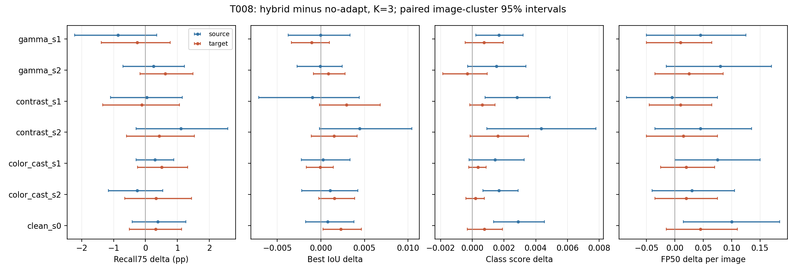

# T008 final offline loss-to-AP diagnosis

Status: **NEEDS_REVIEW**. Completed 2026-09-12, following R010 (`0677233`, pointer `2a8be77`). T007 is accepted/closed. No active experiment. T008 used only the completed T007 receipts; deployment code, models, prompts, lr, ISP, support, scale rule and dataset stayed unchanged. No T009 or meta-training started.

## Conclusion and research decision

**The clearest scale-associated improvement is fewer retained FCOS false positives relative to raw pseudo, not a demonstrated class-aware localization improvement. This does not identify the cause of the two FCOS AP-negative conditions.** The proper overall diagnosis is mixed/unclear, with a qualified confidence/FP lead on the source detector and a clean-input preservation concern.

At K=1, corrupted FCOS hybrid-minus-raw FP05 changes by **-0.1833 [-0.3592, -0.0233] detections/image** and FP50 by **-0.0267 [-0.0508, -0.0025]**. At K=3 FP05 decreases **-0.3183 [-0.5533, -0.1150]**, while FP50 is **-0.0275 [-0.0567, +0.0017]**, uncertain. The K3 recall75 contrast is +0.2958 pp [-0.1938, +0.7697] and class-aware best IoU -0.000013 [-0.002527, +0.002237]. Thus the hybrid's advantage over raw has an FP component; it is not simply an established improvement in correct-class box geometry. Class-agnostic best IoU improves slightly at K3, +0.001386 [+0.000014, +0.002901], which does not establish correct-class recall recovery.

Against **no adaptation**, source K3 class-presence score increases +0.002245 [+0.001206, +0.003410], alongside FP05 +0.0983 [+0.0091, +0.1875] and FP50 +0.0450 [+0.0066, +0.0817]. Mean source recall/IoU intervals cross zero. This is consistent with confidence/FP inflation, but an interval crossing zero does not prove geometry is stable. FCOS K3 has small positive mean best-IoU and class-score changes, while recall and FP intervals cross zero. Neither result establishes a universally improved proxy package or explains all AP differences.

Decision-rule assessment:

- **Geometry-loss branch:** not established as a dominant aggregate failure in the four AP-negative conditions. Per-image geometry disagreements occur, but their frequency often reflects tiny continuous best-IoU changes; it must not be read as a large recall loss.
- **Ranking/objectness branch:** partially supported as a candidate by source confidence/FP inflation and FCOS FP reduction versus raw. Full ranking/calibration is not measured, and the two negative FCOS conditions remain unresolved. Do not claim this branch is causally established for target AP.
- **Larger-validation branch:** a reasonable research-review option before added complexity, but its strict premise that the proxies broadly improve is only partially met. This task does not authorize a new run.
- **Clean identity branch:** a concrete concern remains: smaller phi does not preserve recall/geometry, and source clean FP50 increases. Aggregate clean geometry degradation is not established. A gate is neither implemented nor justified as a remedy for the unresolved target AP failure.

Recommendation: review this mixed diagnosis before selecting the next task. Do not add a localization term, ranking term, gate, cap or meta-training automatically. No single dominant cross-detector failure was identified with these retained-output proxies.

## Known AP-negative conditions

AP deltas below are official T007 aggregate points, without invented CIs. All other brackets are exploratory paired image-cluster 95% intervals. Recall is in percentage points; FP counts are per image. Complete positive and negative conditions are in [computed tables](T008/tables.md).

| Detector / condition | AP3 vs no-adapt | Key observed proxy changes at K3 | Diagnosis |
| --- | ---: | --- | --- |
| Source gamma-s1 | -0.231 | Recall75 -0.859 [-2.219, +0.356] pp; class score +0.001672 [+0.000228, +0.003205]; FP50 +0.045 [-0.050, +0.125] | Mixed: strict-recall point decline and increased class score, but uncertain geometry/FP effects. |
| Source gamma-s2 | -0.216 | Recall75 +0.251 [-0.704, +1.226] pp; best IoU -0.000075 [-0.002740, +0.002463]; FP05 +0.210 [-0.050, +0.460] | Mixed/unclear. FP inflation is a point pattern, not a resolved mechanism. |
| FCOS gamma-s2 | -0.302 | Recall75 +0.621 [-0.175, +1.492] pp; class score -0.000311 [-0.001863, +0.000937]; FP05 +0.180 [-0.015, +0.365] | Mixed/unclear; no supported mean localization decline, score loss or FP inflation at K3. K1 FP05 does increase +0.170 [+0.040, +0.315], which cannot substitute for a K3 explanation. |
| FCOS contrast-s1 | -0.108 | Oracle loss -0.002203 [-0.0037, -0.0008]; recall75 -0.119 [-1.339, +1.069] pp; best IoU +0.002957 [-0.000170, +0.006802]; FP05 -0.020 [-0.280, +0.235] | Direct loss/AP disagreement, unresolved by the mean proxies; duplicate change -0.065 [-0.160, +0.030] also fails to implicate duplication. |

There are no other negative source AP3 corruption conditions. Source color-cast-s2 has duplicate inflation +0.090 [+0.015, +0.165] despite positive AP3 (+0.110), demonstrating why one adverse proxy cannot be equated to AP causation. All six conditions and clean remain reported.

## Loss signs, ties and cross-detector coupling

For FCOS hybrid versus no-adapt at K3, 690/1,200 corrupted episodes improve oracle loss. Within these, 39.86% worsen at least one class-aware geometry proxy, 38.55% lower class-presence score, 29.86% increase FP05 or FP50, and 17.97% increase duplicates. Source has 625 loss-improving episodes; corresponding rates are 45.92%, 32.96%, 38.88% and 13.28%. Categories overlap and have different opportunities to change; their sizes are not directly comparable measures of causal importance. Full CIs, denominators, all methods and both K are saved.

The FCOS geometry union is largely continuous IoU disagreement: among loss-improving episodes, best-IoU mean worsens on 37.39%, whereas recall75 worsens on 5.80%. The unconditioned quadrants illustrate this distinction:

| FCOS K3 proxy | Loss good / proxy good % | Loss good / proxy bad % | Loss bad / proxy good % | Both bad % | Either tie % |
| --- | ---: | ---: | ---: | ---: | ---: |
| Recall75 | 4.52 | 3.35 | 1.68 | 2.26 | 88.19 |
| Best class-aware IoU | 36.18 | 21.61 | 16.00 | 25.96 | 0.25 |
| Class-presence score | 35.51 | 22.28 | 19.93 | 22.03 | 0.25 |
| FP05 (decrease is good) | 13.50 | 14.08 | 9.75 | 10.67 | 52.00 |

These are fractions of valid image-condition observations, not per-image AP. Geometry/score have 1,194 valid corrupted observations; FP has 1,200. The [full statistics](T008/proxy_statistics.csv) retain every quadrant CI, paired mean delta, tie fraction and undefined count.

On the same enhanced image at K3, requiring each detector to improve its own loss, both have at least one adverse proxy on **18.42% [16.17, 20.83]** of corrupted episodes. Source-only and target-only events are 21.33% and 27.00%. Same-category coincidences are geometry **5.61% [4.33, 7.00]**, class score **4.36% [3.20, 5.61]**, FP **4.17% [3.00, 5.50]**, duplicates **1.08% [0.58, 1.67]**. GT-based categories use the valid denominator; observable any-failure unions use all episodes. These rates establish detector-dependent disagreement, not a dominant common failure or an independence test.

For hybrid-minus-raw, the loss sign is the *paired hybrid loss minus raw loss*, not hybrid loss minus original loss. Conditional failure fractions for this contrast therefore answer a different question and must not be interpreted as absolute improvement rates. All CLIP/raw/hybrid-versus-no-adapt contrasts and hybrid-minus-raw are retained at K1/K3.

## Clean inputs and initial scale strata

Among 199 clean images with noncrowd GT, hybrid K3 changes recall50 or recall75 on **20.60% [15.23, 26.13] source** and **15.58% [10.55, 20.60] FCOS**. Mean best IoU changes numerically on all 199; at least one geometry proxy worsens on 50.25% source and 51.76% FCOS, with improvements on other images/proxies. These strict-sign rates do not establish a practical magnitude of geometric harm. They do establish that this is not score-only adaptation with exact geometry preservation.

Source clean class score increases +0.002881 [+0.001339, +0.004549] and FP50 **+0.100 [+0.015, +0.185]** per image, while its mean recall/IoU changes remain uncertain. FCOS clean best IoU increases **+0.002285 [+0.000244, +0.004653]**, with uncertain recall/FP deltas. Clean AP3 stays +0.228 source / +0.011 target as in T007. The clean concern is specific proxy perturbation/FP inflation, not demonstrated aggregate AP damage at K3.

Predeclared initial detector/CLIP norm-ratio bins contain 283/173/261/483 corrupted episodes and 59/31/43/67 clean images in [0,1), [1,2), [2,4), [4,inf). There are no clip-zero cases. For FCOS hybrid-minus-raw:

- Ratio >=4: FP05 falls at K1 by -0.3768 [-0.7804, -0.0104] and K3 by -0.5238 [-0.9854, -0.0886]; K1 FP50 also falls -0.0600 [-0.1087, -0.0105]. Class-aware recall/IoU effects remain uncertain.
- Ratio <1: K3 recall75 improves +1.0479 [+0.3354, +1.9128] pp and best IoU +0.002017 [+0.000046, +0.004433], even though this stratum includes amplification of the raw step. This contradicts a simple claim that benefits occur only when shrinking.
- Ratio [2,4): K3 FP05 falls -0.3870 [-0.8502, -0.0076] while class-aware best IoU also falls -0.002060 [-0.004090, -0.000148]. The scale change trades proxies in this stratum.

These are exploratory associations with many intervals and no multiplicity adjustment, not a learned or prevalidated decision threshold. Both clean and corrupted strata, source/target, K1/K3, all paired deltas and loss-good/proxy-bad fractions are saved; no bin was turned into a deployment gate.

## Definitions and limits of reconstruction

Rules were committed before full offline processing in [T008_plan.md](T008_plan.md), commit `a85e3b3`. Use score-descending greedy one-to-one matching to highest-IoU unmatched same-class GT, independently at inclusive IoU .50 and .75. Score ties retain saved JSON order; GT ties use ascending annotation ID. Duplicates are unmatched same-class predictions overlapping an already matched GT at IoU >=.50 in the .50 pass. FP thresholds .05/.50 are inclusive.

All predictions are retained post-NMS, native-threshold, max-100 outputs. FCOS's native score floor is .2: its FP05 is effectively the count on retained >=.2 outputs, and cannot recover discarded .05-.2 candidates. Source and target absolute FP levels are not comparable under their different output policies. All best-IoU and class-score proxies share this retained-output limitation. No model was rerun to fill missing candidates.

Positive-area, noncrowd GT follows the T007 oracle convention. There are 12 images with crowd annotations and one image (`58636`) without valid noncrowd GT. GT-based scalars on that image are null; TP-score means are null when no TP exists. GT-based grouped failures and coincidence also exclude undefined GT cases. FP counts retain all images and do not apply official COCO crowd-ignore matching, so they are mechanism proxies, not official COCOeval FP flags.

Highest correct-class score is taken anywhere in the image for each GT, including geometrically unrelated detections. It measures class presence, not localized confidence or calibration. TP score arrays and pooled p10/p25/median/p75/p90 distributions are saved separately for each detector/condition/method/K/IoU. Paired image-weighted TP-score means are also reported, but changing matched membership prevents a calibration interpretation. Per-GT best-IoU arrays, medians, class-agnostic IoU, scores and matching identities remain available.

Every bootstrap resamples image clusters, keeping selected conditions together. Multinomial weights, 2,000 draws, seed20260912, 95% percentile intervals; ratio strata retain unequal case counts using sums/counts, and conditional fractions use valid loss-improving denominators. T007 used a different equivalent resampling implementation, so Monte Carlo endpoints differ slightly; no data/estimand change is implied. No per-image AP or AP CI is produced. Mean proxies weight images, whereas official AP ranks detections by class across the dataset and multiple IoU thresholds; these summaries need not move together and cannot prove ranking causality.

## Reproduction, tests and artifacts

Code: `cff2193` initial matching/analysis and `38627d4` final denominator correction, report and plot scripts. Input: T007 run `20260912-105119-taisp-t007-coco200`, source `0df7e13`, final report `066197d`. All analysis ran locally using Python3.12.7, NumPy1.26.4 and Matplotlib3.9.2; no GPU job was launched. Original A6000 run remains unchanged.

From the repository root, with `PYTHONUTF8=1`, `OPENBLAS_NUM_THREADS=1`, `MKL_NUM_THREADS=1`:

```powershell
D:\anaconda3\python.exe -m pytest tests/test_detection_proxies.py tests/test_t008_analysis.py -q
D:\anaconda3\python.exe -m scripts.analyze_t008 --study research_log/remote_runs/20260912-105119-taisp-t007-coco200/artifacts/study --annotations .autodl/instances_val2017.json --output research_log/T008
D:\anaconda3\python.exe -m scripts.report_t008 --study research_log/remote_runs/20260912-105119-taisp-t007-coco200/artifacts/study
D:\anaconda3\python.exe -m scripts.plot_t008
```

The annotations argument is the original official `instances_val2017.json`, SHA256 `e8c7f7908f1d7278341fae127d0da654f102f11bd7b21d8aeefa635b8c810b6f`; it is retained locally and in the existing A6000 data directory. A tracked 200-image annotation subset is provided for inspection. The original file hash is checked by the analysis command. T007 sample SHA256 remains `fd41b75af58e6b8eaffdc79405ee2cd604acf85505df9d402f4c9ea2c1d2f20a`.

Final tests: **7 passed in 4.23s**. Full offline analysis, report and plot all exited0. Audit confirms **19,600 unique proxy rows**, **22,400 unique paired rows**, and **2,816 valid quadrant partitions summing to one**. Synthetic tests cover deterministic matching, class/IoU/score thresholds, duplicates, independent .50/.75 passes, absent predictions/GT, unequal cluster weighting, conditional denominators and failure orientation. Figure visually inspected.

Observed operational failures and minimal repairs are in [test_receipt.txt](T008/test_receipt.txt): native NumPy matrix-multiplication abort replaced with equivalent non-BLAS einsum; an observed no-GT denominator error corrected with a focused regression; plotting's duplicate OpenMP runtime error avoided by a separate NumPy/Matplotlib-only plotting process. No unsafe OpenMP override or scientific-protocol change was used.

Artifacts:

- [analysis.json](T008/analysis.json): complete source/target summaries, all cases, contrasts, K, ratio strata and joint failures.
- [proxies.jsonl](T008/proxies.jsonl), [paired.jsonl](T008/paired.jsonl): per-GT/TP arrays and per-image paired loss/proxy outcomes.
- [tables.md](T008/tables.md), [proxy_statistics.csv](T008/proxy_statistics.csv), [failure_statistics.csv](T008/failure_statistics.csv), [cross_detector.csv](T008/cross_detector.csv): readable tables and full numeric intervals/denominators.
- [TP distributions](T008/tp_score_distributions.csv), [clean changes](T008/clean_changes.json), [subset annotations](T008/annotations_t007.json).
- [receipt.json](T008/receipt.json): all 98 prediction-file hashes and input provenance; [audit.json](T008/audit.json): output hashes and checks.
- [PDF figure](T008/proxy_deltas.pdf) and PNG below.


