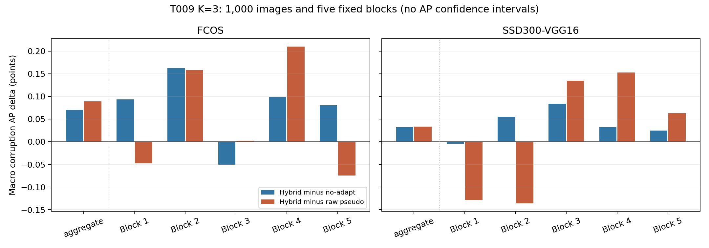

# T009 frozen-method external validation

Status: **NEEDS_REVIEW**. Formal run completed successfully at **2026-09-12 16:41:56+08:00**. All 1,000 images, 21,000 adaptive-method observations, 84 prediction files and 504 official aggregate/block AP evaluations are complete. The predeclared external AP criterion passes, with **very small effects**. This establishes only the specified sign-based replication result, not a practically strong or complete restoration method.

## Scientific result

All values below are AP points on the 0–100 scale. Macro corruption AP averages the six fixed conditions equally.

| Detector | Hybrid minus no-adapt | Hybrid minus CLIP | Hybrid minus raw | Positive conditions vs no-adapt / raw | Clean delta vs no-adapt |
| --- | ---: | ---: | ---: | ---: | ---: |
| Faster R-CNN (source) | +0.067182 | +0.145018 | +0.160034 | 4/6 / 5/6 | -0.017911 |
| FCOS (independent target) | +0.070272 | +0.130526 | +0.089203 | 5/6 / 5/6 | +0.060947 |
| SSD300-VGG16 (independent target) | +0.032161 | +0.029015 | +0.033084 | 5/6 / 4/6 | -0.004121 |

| Independent target | Reference | Aggregate | Block 1 | Block 2 | Block 3 | Block 4 | Block 5 | Positive blocks |
| --- | --- | ---: | ---: | ---: | ---: | ---: | ---: | ---: |
| FCOS | no_adapt | +0.070272 | +0.093537 | +0.162052 | -0.050845 | +0.098238 | +0.080693 | 4/5 |
| FCOS | det_pseudo | +0.089203 | -0.047800 | +0.157914 | +0.002257 | +0.210491 | -0.074568 | 3/5 |
| SSD300-VGG16 | no_adapt | +0.032161 | -0.004577 | +0.055372 | +0.083867 | +0.031625 | +0.024436 | 4/5 |
| SSD300-VGG16 | det_pseudo | +0.033084 | -0.129026 | -0.135981 | +0.134457 | +0.153020 | +0.063285 | 3/5 |

Both independent targets have positive aggregate hybrid-minus-no-adapt and hybrid-minus-raw macro AP, and **4/5** positive hybrid-minus-no-adapt blocks. These exactly meet R011's rule. Hybrid-minus-raw block signs are only **3/5** positive for each target; the rule did not require 4/5 against raw. Preserve that limitation rather than implying consistent raw-baseline superiority in every block. The aggregate absolute gains (+0.070 FCOS, +0.032 SSD) remain small; no formal AP interval or practical-significance threshold was predeclared.

Negative aggregate conditions versus no-adapt remain: source gamma-s2 **−0.018303**, source contrast-s1 **−0.032253**, FCOS gamma-s2 **−0.105360**, and SSD color-cast-s2 **−0.047085** AP. FCOS block 3 is negative against no-adapt; SSD block 1 is negative. Raw-reference negative blocks and every other condition/metric are retained in the complete tables.

Clean mean ||phi3|| is **0.036655** for hybrid versus **0.080144** for raw (**54.263% lower**); its median is 0.030507 and p05/p95 are 0.011479/0.084985. Yet **993/1000 clean images still update**. Corrupted hybrid mean ||phi3|| is 0.030878, below the clean mean, so smaller motion does not identify a need to adapt. Aggregate clean AP changes are small and mixed: source −0.017911, FCOS +0.060947, SSD −0.004121. This is not a formal equivalence/safety finding.

Mean saturation falls from 2.518% to 1.864% on clean and 3.600% to 2.382% over corruptions. Native empty-support identity fallback is 0.70% clean /1.05% corrupted. Initial hybrid scale median/p95 is 0.4393/78.0671 clean and 0.3577/55.8375 corrupted; scale exceeds one on **30.90%/25.95%**, respectively. CLIP norm transfer is not uniformly shrink-only. All step 0–3 norm/ratio/scale distributions and per-condition safety values are retained.

Mean synchronized hybrid adaptation plus original source-support setup is **0.3138 s clean /0.3142 s corrupted**; raw is 0.1722/0.1724 s and CLIP is 0.1151/0.1157 s. These timings exclude target evaluation but include retained terminal diagnostics. Mean hybrid peak allocated GPU memory is 2895.2/2893.0 MiB with source, CLIP, FCOS and SSD resident; it is not a deployment-only memory requirement. No new timing benchmark was run.

**Recommended research disposition:** accept T009 as a completed frozen external validation with a tiny positive sign-replication signal and unresolved identity preservation. Under the predeclared branch, the research lead may next define a label-free need-to-adapt/identity study. This report does not establish a complete method or authorize meta-training. No T010 has been started.



Complete [504-row AP/AP50/AP75 and all reference deltas](remote_runs/20260912-144439-taisp-t009-coco1000/artifacts/study/AP_tables.csv), [all method/block macro and safety tables](remote_runs/20260912-144439-taisp-t009-coco1000/artifacts/study/results.md), [full distributions and statistics](remote_runs/20260912-144439-taisp-t009-coco1000/artifacts/study/analysis.json), [completion](remote_runs/20260912-144439-taisp-t009-coco1000/artifacts/study/completion.json), [raw audit](remote_runs/20260912-144439-taisp-t009-coco1000/artifacts/study/receipt_audit.json), [independent report arithmetic audit](remote_runs/20260912-144439-taisp-t009-coco1000/artifacts/study/report_audit.json), and [run log](remote_runs/20260912-144439-taisp-t009-coco1000/train.log). All 4,536 paired AP/AP50/AP75 CSV deltas and all macro/sign counts were reconstructed from metrics.


## Frozen protocol and implementation

Research instruction: [R011/T009](../coordination/CHATGPT_TO_CODEX_R011_T009.md), commit `184a3a0`, latest-pointer `5885716`. T008 is closed. This study tests external AP validity of the accepted T007 hybrid without modifying its adaptation path.

The four methods are no-adapt, historical global-generic CLIP, raw detector pseudo loss, and detector pseudo direction scaled by the CLIP gradient norm. Global 8D ISP, identity initialization, hard clamp, lr 0.1, K=3, epsilon 1e-12, original-image detached source support at score >=0.5/top-20, and historical generic prompts are unchanged. Three models evaluate the same enhanced image. Neither independent target nor evaluation annotations enter adaptation. No K selection, proxy search, method tuning, new gate/loss/cap, or meta-training was performed.

Plan/selection code `92aa4df`; cohort manifest **`e98a7fd` was committed before any T009 model execution**. Seed 20260914 selects 1,000 unique COCO val2017 IDs from the remaining 4,600 after excluding both historical 200-image sets. Overlaps are 0/0. The saved random selection order defines five consecutive, fixed 200-image blocks; sorted IDs only determine execution order. [Full cohort, JPEG hashes and block membership](T009_subset.json).

| Pin | SHA256 |
| --- | --- |
| Cohort manifest | `155bb6f047d374342623f48488bcb2b33601a4ecbd372976a433c1b289546e49` |
| COCO annotations | `e8c7f7908f1d7278341fae127d0da654f102f11bd7b21d8aeefa635b8c810b6f` |
| Source Faster R-CNN ResNet50-FPN | `258fb6c638b15964ddcdd1ae0748c5eef1be9e732750120cc857feed3faac384` |
| Target FCOS | `99b0c9b7cfb1527d782db86b91d207f00547c792fb4103fc612b651d0a07b9e7` |
| CLIP ViT-B/32 | `a63082132ba4f97a80bea76823f544493bffa8082296d62d71581a4feff1576f` |
| SSD300 VGG16 COCO_V1 | `b556d3b43ab6c3f63d81bfb8835fe8756ac22da664357da100dccf96b6a6b42d` |

CLIP revision `3d74acf9a28c67741b2f4f2ea7635f0aaf6f0268`. Exact SSD metadata was pinned in `be5c797` before study results; [SSD pin](T009_ssd_pin.json) records transforms, COCO categories and native inference settings. Exact historical source/FCOS/CLIP pins, prompts and adaptation config were compared against T007 in the raw receipt audit.

## Runs, tests and observed failures

| Stage | Run / source | Result |
| --- | --- | --- |
| First SSD compatibility | `20260912-142824-taisp-t009-ssd-compat` / `b492c9d` | Failed before SSD inference: Python certificate-chain error downloading official weights. Same bytes downloaded with normal system curl TLS verification; no substitute or package change. |
| SSD compatibility retry | `20260912-143109-taisp-t009-ssd-compat-retry` / same release | 1 passed in 66.32 s, 4 known warnings. Verified class mapping, serialization, COCOeval, frozen parameters/buffers, repeated GPU inference, and exact CPU adaptation/support/enhanced-image equality with SSD absent/present. |
| Full regression and smoke | `20260912-143436-taisp-t009-study-smoke` / `be5c797` | 70 real-model/regression tests passed in 183.95 s, 9 known warnings. Two-image smoke: 42 rows, 84 prediction files, 252 aggregate/partial-block evaluations, 16.4533 s; exit 0. Smoke outcomes not used for tuning or acceptance. |
| Formal study | `20260912-144439-taisp-t009-coco1000` / **`69bfb66`** | Started 2026-09-12 14:44:47+08; inference completed 1,000 images in 5,913.0 s. Completed 504 official evaluations; driver elapsed 7,011.39484 s (including inference/evaluation); report exit 0 at 16:41:56+08. |

Release `20260912-144331-taisp-t009-full`. Pinned server: Python 3.12.12, torch 2.4.0, torchvision 0.19.0+cu121, transformers 4.44.2, pycocotools 2.0.10, A6000 CUDA:0. Known NVML warning did not prevent CUDA execution. Local pycocotools is absent; the four cohort/block tests ran successfully in the pinned remote environment (1.52 s). Remote matplotlib is absent; final plots use the existing local matplotlib 3.9.2 without changing the experiment environment.

Actual command, after exporting `TAISP_SOURCE_REVISION=69bfb66`, from the frozen release:

```bash
/home/liujianhua/wjq/TAISP/.venv/bin/python -m taisp.analysis.run_t009 --data-root /home/liujianhua/wjq/TAISP/shared/coco1000_t009 --output "$AUTODL_ARTIFACTS_DIR/study" &&
/home/liujianhua/wjq/TAISP/.venv/bin/python -m scripts.report_t009 --study "$AUTODL_ARTIFACTS_DIR/study"
```

Only report/plot smoke-labeling changed after the 70-test suite; the adaptation and driver remained unchanged. No second formal run was started.

## Raw evidence and integrity

All 21,000 unique image/condition/adaptive-method rows and 84 prediction files are saved. The audit verifies all 7,000 shared support records, zero phi initialization, all three update equations, hybrid gradient rescaling, and terminal diagnostics with no fourth update. Maximum float32 reconstruction differences: phi update `9.387731547683131e-08`, hybrid transfer `5.598484897895162e-08`. Empty-support fallbacks stay at identity. [Audit and all prediction hashes](T009/receipt_audit.json).

Uncompressed samples: 125,507,835 bytes; SHA256 `cdbe9cf51feb17dc5ec2e60f0ea396227f4b4af301b2f6dc135f7382f0e8910c`.

Remote authoritative raw location: `/home/liujianhua/wjq/TAISP/runs/20260912-144439-taisp-t009-coco1000/artifacts/study/`. Immutable raw archive: `/home/liujianhua/wjq/TAISP/shared/t009_raw_receipts.tar.gz`, 371,572,557 bytes, SHA256 `346679ead129558154ddf40bfec25c5b6e370927076875cd718b44b84376b76d`. Archive contains environment, cohort, samples and predictions; derived AP files are collected separately after completion. The complete raw data and prediction hashes are available on A6000. The local archive download is still in progress; this report does not claim that the 371 MB raw archive is already on GitHub. Final derived tables/logs/environment, audits and plots are delivered now; lossless raw archival delivery follows without rerunning models.

## Interpretation boundaries

The predeclared external criterion requires positive aggregate hybrid-minus-no-adapt and hybrid-minus-raw macro corruption AP on **both** independent targets, and positive hybrid-minus-no-adapt signs in at least **4/5** blocks for each target. Macro averages weight the six corruption conditions equally. The five block values are replication outcomes, not a formal AP confidence interval. Clean AP and phi must be reported even if the external AP criterion passes. Source-only improvements cannot establish external validity. No T010 or method elaboration starts before research review.

Final derived archive SHA256 `b980fb20bc6af2c034889eaef14e18d979a202618086afba21030482704102c8` was verified after local transfer. Environment/metrics/analysis/table/receipt/completion hashes are in `report_audit.json`. PNG/PDF generated locally and visually inspected; no scientific pipeline changed.
