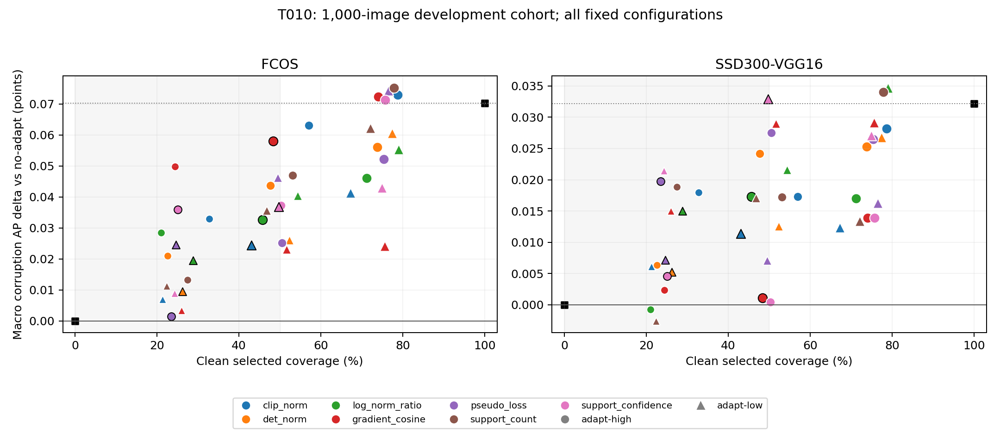

# T010 label-free need-to-adapt feasibility report

Status: **NEEDS_REVIEW**. Formal offline run completed at **2026-09-12 18:36:59+08:00**, exit 0. All **42 predeclared scalar/orientation/coverage configurations plus two anchors** are retained. There are **5,544 official AP rows**: 5,292 newly composed gated evaluations and 252 exact reused T009 anchor evaluations. No model, ISP or adaptation inference was rerun.

**Result: 9/42 configurations satisfy the predeclared developmental promising-signal rule.** This is a weak development-set feasibility result. It does not establish an independently validated gate, strong image-quality discrimination, or a practically large AP gain. All nine passing configurations lose some FCOS macro AP relative to the full hybrid; passing the rule only requires positive AP versus no-adapt.

## Complete interpretation and candidate for review

For a single candidate to review, prefer **mean original source-support confidence, adapt-low, pooled 50% coverage** (`support_confidence_low_50`). It uses support already computed by the source detector and requires no gradient merely to decide whether to adapt. It retains 4/5 positive FCOS blocks and 5/5 SSD blocks; its SSD aggregate gain is close to the full-hybrid gain. This preference is an explicit developmental recommendation among all reported alternatives, not a deployed rule or an independent result.

On this cohort the scalar cutoff is **0.8499477751114789**, with one observation exactly at the boundary (image 463199, original hybrid-row ordinal 5538). The saved rank matrix is authoritative. It selects 3,500/7,000 observations, including **497/1,000 clean** and **3,003/6,000 corrupted** observations. Effective nonzero clean updates are **490/1,000**, because seven selected empty-support cases already remain identity. Mean effective clean ||phi3|| is **0.017600**, versus **0.036655** for the full hybrid (**51.985% lower**).

FCOS macro corruption AP versus no-adapt is **+0.036793** (versus full hybrid **−0.033478**); SSD is **+0.032926** (versus full hybrid **+0.000766**). Source is +0.078574 versus no-adapt. Clean AP deltas are source **−0.014279**, FCOS **+0.074100**, SSD **+0.015711**, all within R012’s no-more-than-0.10-AP-loss condition.

**The limitation is concrete:** clean and corrupted selection rates are nearly identical (49.7% and 50.05%), and family rates range only from 48.7% to 51.9%. The rule suppresses updates generally; this does not show selective recognition of clean images. No matched-coverage random selector was part of the authorized grid, so these results cannot attribute the retained benefit specifically to identifying a need to adapt rather than to thinning updates. Opposite orientations of some scores also pass at different coverages. No additional control, threshold refinement, feature combination or inference was added after seeing results.

All 42 gates satisfy the aggregate clean AP loss tolerance. Of 21 gates with clean selected coverage <=50%, nine pass the complete rule and twelve fail target aggregate/sign replication. The other 21 fail the coverage requirement. Examples retained below include detector coupling for `log_norm_ratio_high_25` and `support_count_low_25` (negative SSD aggregate AP), and insufficient SSD block replication for `pseudo_loss_low_50` (2/5). Thus clean suppression alone is insufficient.

## Every passing configuration

AP values are points on the 0–100 scale; corruption macro is the unweighted mean over six conditions. This table lists all nine matches, not an outcome-filtered replacement for the full grid.

| Configuration | Clean / corrupt coverage % | FCOS delta no-adapt / full | SSD delta no-adapt / full | Positive blocks FCOS / SSD | Clean delta source / FCOS / SSD | Mean clean effective phi3 |
| --- | ---: | ---: | ---: | ---: | ---: | ---: |
| clip_norm_low_50 | 43.00 / 51.17 | +0.024446 / -0.045826 | +0.011389 / -0.020772 | 4/5 / 4/5 | +0.045980 / -0.010249 / +0.032815 | 0.009046 |
| det_norm_low_25 | 26.20 / 24.80 | +0.009479 / -0.060793 | +0.005218 / -0.026943 | 5/5 / 4/5 | +0.035322 / +0.025296 / -0.035040 | 0.009740 |
| log_norm_ratio_high_50 | 45.70 / 50.72 | +0.032609 / -0.037663 | +0.017295 / -0.014865 | 4/5 / 4/5 | -0.004077 / +0.051738 / +0.042210 | 0.013424 |
| log_norm_ratio_low_25 | 28.80 / 24.37 | +0.019447 / -0.050825 | +0.015027 / -0.017134 | 4/5 / 4/5 | -0.023858 / +0.005540 / -0.049124 | 0.012747 |
| gradient_cosine_high_50 | 48.40 / 50.27 | +0.057958 / -0.012314 | +0.001082 / -0.031079 | 4/5 / 4/5 | -0.069556 / +0.037428 / +0.011527 | 0.016858 |
| pseudo_loss_high_25 | 23.50 / 25.25 | +0.001365 / -0.068907 | +0.019732 / -0.012429 | 4/5 / 4/5 | +0.001295 / +0.024408 / +0.005855 | 0.008465 |
| pseudo_loss_low_25 | 24.60 / 25.07 | +0.024507 / -0.045765 | +0.007169 / -0.024992 | 5/5 / 4/5 | +0.042678 / +0.028916 / -0.031468 | 0.009518 |
| support_confidence_high_25 | 25.10 / 24.98 | +0.035933 / -0.034339 | +0.004567 / -0.027594 | 5/5 / 4/5 | +0.042417 / +0.011391 / -0.040023 | 0.009803 |
| support_confidence_low_50 | 49.70 / 50.05 | +0.036793 / -0.033478 | +0.032926 / +0.000766 | 4/5 / 5/5 | -0.014279 / +0.074100 / +0.015711 | 0.017600 |

Full **44-configuration** table: [results.md](remote_runs/20260912-181436-taisp-t010-coco1000-offline/artifacts/study/results.md). All configuration and latency summaries: [config_summary.csv](remote_runs/20260912-181436-taisp-t010-coco1000-offline/artifacts/study/config_summary.csv).

## Candidate: all fixed blocks and conditions

| Group | Source macro delta | FCOS macro delta | SSD macro delta | Clean selected coverage % |
| --- | ---: | ---: | ---: | ---: |
| aggregate | +0.078574 | +0.036793 | +0.032926 | 49.7 |
| block_1 | -0.009064 | +0.046015 | +0.011162 | 49.0 |
| block_2 | +0.025441 | +0.071191 | +0.068580 | 44.5 |
| block_3 | +0.031647 | -0.032180 | +0.086320 | 50.5 |
| block_4 | +0.071513 | +0.068303 | +0.005109 | 53.5 |
| block_5 | +0.085997 | +0.072118 | +0.104044 | 51.0 |

One global rank rule is reused across blocks; block clean coverage can exceed 50% even though the aggregate criterion is satisfied. Source block 1 and FCOS block 3 remain negative.

| Condition | Selected coverage % | Source AP delta | FCOS AP delta | SSD AP delta |
| --- | ---: | ---: | ---: | ---: |
| gamma_s1 | 50.1 | +0.215472 | +0.051955 | -0.010162 |
| gamma_s2 | 49.5 | +0.043594 | -0.076671 | +0.103128 |
| contrast_s1 | 49.2 | +0.006763 | +0.062203 | +0.050444 |
| contrast_s2 | 51.9 | +0.086520 | +0.100696 | +0.062442 |
| color_cast_s1 | 48.7 | +0.042023 | +0.026482 | +0.018976 |
| color_cast_s2 | 50.9 | +0.077071 | +0.056094 | -0.027269 |
| clean_s0 | 49.7 | -0.014279 | +0.074100 | +0.015711 |

FCOS gamma-s2 remains negative (−0.076671); SSD color-cast-s2 remains negative (−0.027269), and SSD gamma-s1 is also negative (−0.010162). The candidate is not uniformly beneficial. Complete AP50/AP75, full-hybrid contrasts, every other gate and every block are retained in the AP tables.

## Pre-update signal distributions and exact rules

All seven signals were exactly reconstructable from saved hybrid step-zero gradients/loss and original detached source support. Zero-vector cosine was predeclared as 0 for 70/7,000 observations; empty support mean confidence is 0. Ratios use epsilon 1e-12. Post-update phi is used only for safety reporting, never gate scores.

| Signal | Clean mean / median | Corrupted mean / median |
| --- | ---: | ---: |
| clip_norm | 0.148758 / 0.107210 | 0.119068 / 0.092731 |
| det_norm | 0.430863 / 0.249204 | 0.471627 / 0.264466 |
| log_norm_ratio | 0.172723 / 0.800743 | 0.336109 / 0.992653 |
| gradient_cosine | 0.031249 / 0.016352 | 0.042217 / 0.049227 |
| pseudo_loss | 0.186424 / 0.153570 | 0.189968 / 0.151856 |
| support_count | 7.937000 / 6.000000 | 7.346167 / 5.000000 |
| support_confidence | 0.849595 / 0.850464 | 0.843406 / 0.849911 |

Full p05/median/p95 and clean/corrupted/condition distributions in all five fixed blocks are saved in [score_distributions.json](T010/preparation/score_distributions.json). No threshold was chosen from these distributions or target AP before the full grid was frozen.

Ranks use the entire fixed 7,000-observation pool once; clean/corruption/family and block labels never choose separate cutoffs. Both high/low orientations at 25/50/75% are retained. Ties use ascending image ID then immutable saved hybrid-row ordinal. Selected counts are exactly 1,750/3,500/5,250, shared by source/FCOS/SSD. The matrix is developmental and depends on this cohort; the cutoff has not been calibrated or validated independently. [Grid/cutoffs](T010/preparation/grid.json), [scores](T010/preparation/scores.jsonl), [decisions](T010/preparation/decisions.npz).

## Timing and identity accounting

The recommended support-confidence rule has receipt-derived mean timing estimates **0.169827 s clean /0.170606 s corrupted**, compared with full hybrid **0.313793/0.314206 s**. These are not new benchmarks or end-to-end target-detector latency measurements. Support-only scores use S + selected*A, where S is saved original source/support setup and A is saved hybrid adaptation time. Other signals use S + G + selected*(A−G), with G the saved joint source+CLIP identity step because individual score computation costs were not recorded. Thus even skipped images retain that joint score-computation estimate. Final target inference, IO and ranking are excluded; original terminal diagnostics remain included.

All 44 gates have clean/corruption/family/block selected and nonzero-phi coverage, effective-phi distributions and timing estimates in [safety.json](T010/preparation/safety.json). No benchmark rerun or unknown timing value was invented.

## Provenance, tests, failures and evidence

R012 research `6012f1d`, pointer `1a4df0c`; plan **fd88938** precedes AP; score code **32a89e3**; all full-cohort preparation artifacts and decisions were committed **901560f before any gated AP**. Formal evaluator/report code **9efe032**, release **20260912-181357-taisp-t010-full**, run **20260912-181436-taisp-t010-coco1000-offline**. Input T009 run `20260912-144439-taisp-t009-coco1000`, source `69bfb66`, report `f3cb238`, final raw archival delivery `a23b618`.

| Check | Result |
| --- | --- |
| Existing macro/block baseline | Local 1 passed in 8.54 s; remote official block tests 2 passed in 1.29 s. |
| Score/rank/composition/preparation | 7 tests passed locally in 11.83 s. Includes vector/empty-support conventions, forbidden-field independence, ties, exact coverage, anchors, input mutation, shared detector decisions and global block reuse. |
| Offline regression + all-grid smoke | Run `20260912-180743-taisp-t010-offline-smoke`, source901560f: 13 tests passed in 2.35 s; two images/14 rows/44 configurations/2,772 AP rows completed in 16.57865 s, exit0. No smoke-based tuning. |
| Report criterion boundaries | 1 local test passed in 15.98 s; smoke criterion explicitly unassessed. |
| Fresh affected suite before formal full grid | **14 tests passed in 2.45 s**, CPU only. Model/ISP inference suites were not rerun under the analysis-only instruction. |
| Full offline run | Started18:14:44+08, completed18:36:59+08, exit0. 12 CPU workers, 1,330.08296 s evaluator elapsed. 21 panels, 44 configurations, six groups, 5,544 AP rows and 792 macro rows. |
| Final artifact/decision/arithmetic checks | Archive SHA and 21 panel SHA values verified; 252 anchors equal T009 exactly; 924 shared detector-condition-config decisions audited. All 5,544 AP/AP50/AP75 rows match official panels; 33,264 paired metric deltas and all macro/sign/44-rule outcomes independently reconstructed. |
| Figure | Standalone local plot exit0; PNG visually inspected. No new model execution. |

Observed failures were operational: initial remote baseline invoked from project root lacked the tests (exit4), then passed in the exact T009 release; score deployment SSH disconnected after extraction (255), files were verified and only the missing current-link step completed; local plotting initially hit duplicate OpenMP runtime via an unused package import, fixed by taking labels directly from saved report data and keeping the plot standalone. No package upgrade, method change, cohort change or outcome-driven repair occurred.

Formal command uses the existing `.venv/bin/python`, CPU visibility and one BLAS/OpenMP/MKL thread per worker:

```bash
export TAISP_SOURCE_REVISION=9efe032 OPENBLAS_NUM_THREADS=1 OMP_NUM_THREADS=1 MKL_NUM_THREADS=1 CUDA_VISIBLE_DEVICES=""
/home/liujianhua/wjq/TAISP/.venv/bin/python -m pytest tests/test_t010_gating.py tests/test_t009_replication.py tests/test_t008_analysis.py -q
/home/liujianhua/wjq/TAISP/.venv/bin/python -m scripts.analyze_t010 --study /home/liujianhua/wjq/TAISP/runs/20260912-144439-taisp-t009-coco1000/artifacts/study --prepared /home/liujianhua/wjq/TAISP/research_log/T010/preparation --annotations /home/liujianhua/wjq/TAISP/shared/coco1000_t009/instances_val2017.json --output "$AUTODL_ARTIFACTS_DIR/study" --workers 12
/home/liujianhua/wjq/TAISP/.venv/bin/python -m scripts.report_t010 --study "$AUTODL_ARTIFACTS_DIR/study" --prepared /home/liujianhua/wjq/TAISP/research_log/T010/preparation
```

| Input / receipt | SHA256 |
| --- | --- |
| Frozen T009 samples | `cdbe9cf51feb17dc5ec2e60f0ea396227f4b4af301b2f6dc135f7382f0e8910c` |
| Cohort / five blocks | `155bb6f047d374342623f48488bcb2b33601a4ecbd372976a433c1b289546e49` |
| COCO annotations (evaluation only) | `e8c7f7908f1d7278341fae127d0da654f102f11bd7b21d8aeefa635b8c810b6f` |
| Frozen T009 anchor metrics | `8c2942790ce012cfa350124d2acbe7ac299c11b4c76ae14247ad458416d0c377` |
| Full pre-AP preparation manifest | `539cc154b9ded4495875a7a6c343c413cd72322a0aeeed044dfdbac4b83cee1a` |
| Downloaded full T010 run archive | `485bd11b924ac81ec63a6c6f29baae16ac430c673fccc8c0052eb24f91d8227f` |

The existing pinned remote Python/pycocotools environment was reused; no model weights were loaded. Native per-image prediction order is preserved. Fresh record dictionaries prevent COCOeval from mutating the anchor records reused by other gates. Frozen raw predictions plus decision matrices reconstruct each composition; every composition hash and selected-ID list is retained instead of duplicating tens of GB of predictions.

Artifacts: [all official AP and deltas](remote_runs/20260912-181436-taisp-t010-coco1000-offline/artifacts/study/AP_tables.csv), [all block macros](remote_runs/20260912-181436-taisp-t010-coco1000-offline/artifacts/study/macro_tables.csv), [full summaries](remote_runs/20260912-181436-taisp-t010-coco1000-offline/artifacts/study/analysis.json), [composition panels](remote_runs/20260912-181436-taisp-t010-coco1000-offline/artifacts/study/panels), [completion](remote_runs/20260912-181436-taisp-t010-coco1000-offline/artifacts/study/completion.json), [report hashes](remote_runs/20260912-181436-taisp-t010-coco1000-offline/artifacts/study/report_receipt.json), [arithmetic audit](remote_runs/20260912-181436-taisp-t010-coco1000-offline/artifacts/study/arithmetic_audit.json), [run log](remote_runs/20260912-181436-taisp-t010-coco1000-offline/train.log). Remote run root: `/home/liujianhua/wjq/TAISP/runs/20260912-181436-taisp-t010-coco1000-offline/`. Preparation remains under the remote project `research_log/T010/preparation/`.



Figure: every fixed configuration is shown; black outlines mark the nine developmental rule matches, squares mark anchors, and dotted horizontal lines mark the full hybrid. Gray shading indicates <=50% clean selected coverage. Marker size reflects nominal coverage; circle/triangle indicate adapt-high/low. There are no AP confidence intervals.

**Recommended next research decision:** review the support-confidence low-50 candidate and its explicit tradeoffs. If the research lead authorizes continuation, freeze exactly one scalar threshold/tie policy for a new disjoint cohort. T010 itself does not validate that future deployment rule. No T011, learned gate, feature combination, objective change or meta-training has started.
