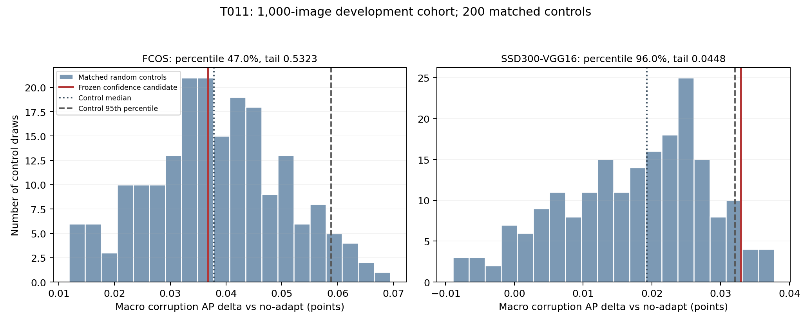

# T011 matched-coverage random-thinning falsification report

**Status: NEEDS_REVIEW. Completed at 2026-09-12 20:39:00+08, exit 0.** All 200 precommitted matched random selectors, the frozen candidate and both endpoints are retained: 1,000 images, 7,000 observations, 203 configurations, 189 batched panels, 25,578 official AP rows and 3,654 macro rows. No model, ISP or adaptation inference was rerun.

**Predeclared R013 result: FAIL.** Support confidence does not establish a useful cross-detector need-to-adapt signal beyond matched update thinning on this development cohort. FCOS is at the 47th percentile of random controls and beats their block medians in only 2/5 blocks. SSD passes its individual percentile and block tests, but the protocol requires both independent targets. Preserve that SSD-specific signal without promoting it to a detector-independent result.

## Primary randomization results

All deltas are AP points on the 0–100 scale, unweighted over the six corruptions, versus no-adapt. The distributions below contain all 200 draws. They are control distributions, not bootstrap confidence intervals.

| Detector | Candidate | Random mean | Median | p05 | p95 | Strict percentile | Upper tail | Blocks above median |
| --- | ---: | ---: | ---: | ---: | ---: | ---: | ---: | ---: |
| Source Faster R-CNN | +0.078574 | +0.009333 | +0.014261 | -0.055059 | +0.066718 | 99.0% | 0.014925 | 5/5 |
| FCOS | +0.036793 | +0.038260 | +0.037841 | +0.017211 | +0.058859 | 47.0% | 0.532338 | 2/5 |
| SSD300-VGG16 | +0.032926 | +0.017373 | +0.019289 | -0.000565 | +0.032105 | 96.0% | 0.044776 | 4/5 |

FCOS has 106/200 random results >= candidate, hence the corrected tail is 107/201 = 0.532338. SSD has 8/200, giving 9/201 = 0.044776. Source has 2/200, giving 3/201 = 0.014925. There are no exact candidate ties on these three aggregate AP metrics. Percentiles use 100 × #(random < candidate)/200; p05/p95 use linear interpolation. The frozen p95 decision is not replaced by a post-hoc probability threshold.

Candidate-minus-random FCOS macro AP has mean −0.001467, median −0.001047 and p05/p95 −0.022066/+0.019582. SSD has mean +0.015554, median +0.013638 and p05/p95 +0.000821/+0.033491. The SSD p95 margin is only +0.000821 AP. Source performance is supportive context, not a substitute for FCOS.

**96/200 matched random selectors (48%) satisfy the original R012 developmental rule.** Thus passing that earlier rule is common under exact coverage matching and is insufficient evidence of need recognition. The 200 controls are draws on the same fixed cohort, not 200 independent data cohorts.

## Exact R013 decision

| Requirement | Observed outcome | Verdict |
| --- | --- | --- |
| Positive corruption macro AP versus no-adapt on both targets | FCOS +0.036793; SSD +0.032926 | Pass |
| Candidate strictly exceeds random p95 on both targets | FCOS +0.036793 < +0.058859; SSD +0.032926 > +0.032105 | **Fail: FCOS** |
| Candidate beats random median in at least 4/5 blocks on each target | FCOS 2/5; SSD 4/5 | **Fail: FCOS** |
| Clean AP delta >= −0.10 on all three detectors | Source −0.014279; FCOS +0.074100; SSD +0.015711 | Pass |

The original candidate still has 4/5 FCOS and 5/5 SSD blocks positive versus no-adapt. That is a different test from beating the matched-random block median; the latter is the T011 discriminator. Candidate versus full hybrid is FCOS −0.033478 and SSD +0.000766 macro AP.

## All fixed block comparisons

| Detector | Block | Candidate | Random median | Random p05 | Random p95 | Candidate − median |
| --- | --- | ---: | ---: | ---: | ---: | ---: |
| Source | block_1 | -0.009064 | -0.041739 | -0.106545 | +0.024827 | +0.032675 |
| Source | block_2 | +0.025441 | +0.023703 | -0.064681 | +0.111462 | +0.001739 |
| Source | block_3 | +0.031647 | +0.016061 | -0.095038 | +0.161281 | +0.015586 |
| Source | block_4 | +0.071513 | -0.013804 | -0.088258 | +0.079734 | +0.085317 |
| Source | block_5 | +0.085997 | +0.008984 | -0.079733 | +0.115624 | +0.077013 |
| FCOS | block_1 | +0.046015 | +0.060170 | +0.007513 | +0.121738 | -0.014155 |
| FCOS | block_2 | +0.071191 | +0.079141 | -0.012817 | +0.159454 | -0.007949 |
| FCOS | block_3 | -0.032180 | -0.027437 | -0.082778 | +0.024627 | -0.004744 |
| FCOS | block_4 | +0.068303 | +0.056616 | -0.003941 | +0.125028 | +0.011688 |
| FCOS | block_5 | +0.072118 | +0.057068 | -0.000011 | +0.107924 | +0.015049 |
| SSD | block_1 | +0.011162 | +0.005753 | -0.032028 | +0.041059 | +0.005409 |
| SSD | block_2 | +0.068580 | +0.038050 | -0.023513 | +0.141986 | +0.030530 |
| SSD | block_3 | +0.086320 | +0.036298 | -0.016471 | +0.092529 | +0.050022 |
| SSD | block_4 | +0.005109 | +0.009776 | -0.037396 | +0.054093 | -0.004667 |
| SSD | block_5 | +0.104044 | +0.025709 | -0.046658 | +0.093913 | +0.078335 |

FCOS blocks 1, 2 and 3 lose to their random medians; SSD block 4 loses. Source block 1 and FCOS block 3 remain negative versus no-adapt. No block was excluded.

## All candidate conditions

| Condition | Source AP delta | FCOS AP delta | SSD AP delta |
| --- | ---: | ---: | ---: |
| clean_s0 | -0.014279 | +0.074100 | +0.015711 |
| gamma_s1 | +0.215472 | +0.051955 | -0.010162 |
| gamma_s2 | +0.043594 | -0.076671 | +0.103128 |
| contrast_s1 | +0.006763 | +0.062203 | +0.050444 |
| contrast_s2 | +0.086520 | +0.100696 | +0.062442 |
| color_cast_s1 | +0.042023 | +0.026482 | +0.018976 |
| color_cast_s2 | +0.077071 | +0.056094 | -0.027269 |

FCOS gamma-s2, SSD gamma-s1 and SSD color-cast-s2 remain negative. Full AP/AP50/AP75, both references, all five blocks, clean, all six corruptions and every random draw are retained in the linked CSVs and raw panels.

## Descriptive identity and cost

Every control exactly matches the candidate in all 35 condition × block strata: 497/1,000 clean and 3,003/6,000 corrupted selections overall (49.7% and 50.05%). These are condition-stratified offline controls, not deployment rules.

| Receipt summary | Candidate | Random mean | Random median | Random p05 | Random p95 |
| --- | ---: | ---: | ---: | ---: | ---: |
| Mean effective clean phi3 norm | 0.017600069 | 0.018218187 | 0.018206104 | 0.017632290 | 0.018798591 |
| Clean nonzero update fraction | 0.490000000 | 0.493550000 | 0.494000000 | 0.491000000 | 0.496000000 |
| Clean source-path seconds | 0.169826891 | 0.169925881 | 0.169903357 | 0.169342827 | 0.170549812 |
| Corrupted source-path seconds | 0.170606103 | 0.171236987 | 0.171231939 | 0.170904915 | 0.171522625 |

Full-hybrid mean clean phi3 is 0.036655454. The candidate lowers it to 0.017600069, but matched random thinning already lowers it to mean 0.018218187. Candidate effective clean updates are 49.0%, versus random mean 49.355%; seven selected candidate empty-support cases have zero update. The small residual phi/cost differences are descriptive and cannot rescue the failed AP criterion. Latency is S + mask × A from saved support setup and adaptation receipts; it excludes target inference, IO and random-rank construction and is not a new timing benchmark.

## Reproduction, tests and artifact integrity

- Research decision R013: 26ff476; latest pointer ad06718. Plan committed **d0179ad** before controls or AP.
- Preparation code **b49405d**; all 200 seeds and full masks committed **8dd776d before any T011 AP**. Seeds 2026091600..2026091799; SHA256 ranks of `TAISP-T011|{seed}|{image_id}|{case}`, ascending digest then image ID, exact candidate count per stratum. All 200 masks are unique.
- Frozen candidate `support_confidence_low_50`, literal cutoff 0.8499477751114789, authoritative saved mask SHA `7a02e6d66336ef39fbd4b55c3a5aba564aacee56bd2d7405b62ce9d811a511f6`. No reranking, replacement candidate or threshold adjustment.
- Evaluator/report source **8b2143f**, release `20260912-195321-taisp-t011-full`, run `20260912-195353-taisp-t011-coco1000-offline`. Started 19:54:03+08; finished 20:39:00+08; evaluator elapsed **2,688.745720s**, CPU 24 workers, configuration batches of 25, one BLAS/OpenMP/MKL thread each.
- Formal affected regression suite: **20 passed in 2.90s**. Earlier full-control two-image smoke: 20 passed in 3.14s, all 12,789 AP rows completed in 85.972176s, exit 0; smoke criteria were explicitly unassessed. Six local selector/preparation/batch/statistics tests passed in 11.17s.
- 25,200 random AP evaluations +126 candidate re-evaluations +252 exact reused T009 endpoint evaluations =25,578 rows. Report checks all **378 candidate/endpoint group evaluations** and composition hashes equal T010, plus **4,263 shared detector-condition decisions**.
- Final local audit verifies archive, report and all 189 panel hashes, all AP/AP50/AP75 values, **153,468 paired metric deltas**, all macro/sign summaries, control distributions, corrected tails, block medians, all 203 R012 outcomes and the R013 result. Figure generated locally and visually inspected.
- Existing remote Python 3.12.12 / NumPy 1.26.4 / pycocotools 2.0.10 retained. No model weights were loaded or changed. Local plotting uses Python 3.12.7 / matplotlib 3.9.2.

T011 had no failed formal or smoke evaluation. An initial guessed R013 continuation filename was absent; the latest pointer correctly located the appended queue before implementation. No model, environment, cohort or scientific parameter change was needed. The existing remote NVML mismatch is irrelevant to this CPU-only job and was left unchanged.

Exact remote command: [full_run_meta.json](T011/full_run_meta.json). Preparation: [manifest](T011/preparation/manifest.json), [all seeds](T011/preparation/seeds.json), [all stratum counts](T011/preparation/matching.json), [decision matrix](T011/preparation/decisions.npz), [safety receipts](T011/preparation/safety.json). To reproduce the final local arithmetic check, run `python research_log/T011/audit_report.py` from the project; plotting is `python -m scripts.plot_t011 --study research_log/remote_runs/20260912-195353-taisp-t011-coco1000-offline/artifacts/study`.

| Receipt | SHA256 |
| --- | --- |
| Full T011 run archive (12,021,457 bytes) | `ba1b20f2c022eda264da19d057b267b7ace60a17ae6c1e82dd3c4e39bcc01ebe` |
| Pre-AP full decision matrix | `8e9458588ca3a614a32b86fd5c39a58a8618c53ccd7fe17ac190b9940f42deb9` |
| Pre-AP full preparation manifest | `98c3c3cf0cfda3c1e7e98f702fb53d4bf81509dede800c8172947b5aeb785b82` |
| T009 frozen anchor metrics | `8c2942790ce012cfa350124d2acbe7ac299c11b4c76ae14247ad458416d0c377` |
| Evaluation-only annotations | `e8c7f7908f1d7278341fae127d0da654f102f11bd7b21d8aeefa635b8c810b6f` |

Complete artifacts: [AP tables](remote_runs/20260912-195353-taisp-t011-coco1000-offline/artifacts/study/AP_tables.csv), [block macros](remote_runs/20260912-195353-taisp-t011-coco1000-offline/artifacts/study/macro_tables.csv), [all 203 configurations](remote_runs/20260912-195353-taisp-t011-coco1000-offline/artifacts/study/config_summary.csv), [all distributions](remote_runs/20260912-195353-taisp-t011-coco1000-offline/artifacts/study/analysis.json), [raw official panels](remote_runs/20260912-195353-taisp-t011-coco1000-offline/artifacts/study/panels), [completion](remote_runs/20260912-195353-taisp-t011-coco1000-offline/artifacts/study/completion.json), [report receipt](remote_runs/20260912-195353-taisp-t011-coco1000-offline/artifacts/study/report_receipt.json), [independent arithmetic audit](remote_runs/20260912-195353-taisp-t011-coco1000-offline/artifacts/study/arithmetic_audit.json), [run log](remote_runs/20260912-195353-taisp-t011-coco1000-offline/train.log).

**Disposition required by R013:** stop threshold refinement, feature combinations, learned gating and meta-training on these scalars; do not spend a new cohort validating this gate. This negative joint result does not prove support confidence has no information for any detector; it shows that the required cross-detector claim is unsupported. The SSD/source positives remain developmental after T010’s 42-way candidate search. Await research review; no T012, new GPU experiment, new objective, spatial ISP or predictor has started.
