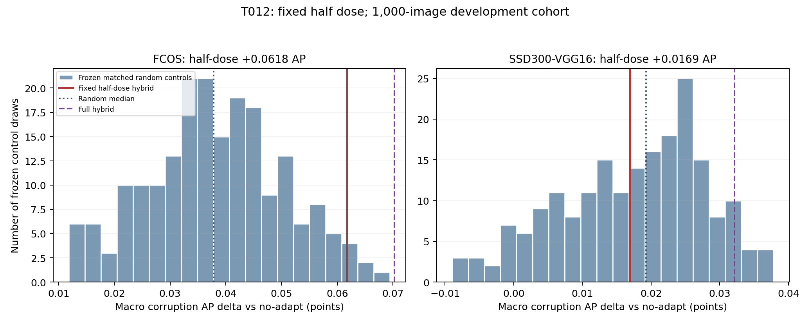

# T012 fixed half-dose developmental study

**Status: NEEDS_REVIEW. Experiment and report completed at 2026-09-12 22:22:35+08, exit 0.** All 1,000 fixed T009 images, 7,000 half-dose episodes, seven conditions, three detectors and five replication blocks completed. There are 126 new half-dose official COCOeval results plus 252 exactly reused T009 endpoints (378 AP rows total).

**R014 joint decision: FAIL.** Half-dose materially reduces the clean ISP state, and FCOS retains a small positive AP gain, but SSD does not satisfy block replication or exceed the matched-random aggregate median. Both targets also fall short of four blocks above random medians. Therefore the tested global half dose does not solve the required detector-independent identity/performance tradeoff.

## Primary results and exact criterion

All AP deltas are points on the 0–100 scale; corruption macro is the unweighted average of six conditions. This is the reused development cohort, not independent validation.

| Detector | Half − no-adapt macro AP | Half − full macro AP | Random median | Positive blocks vs no-adapt | Blocks above random median | Clean AP delta |
| --- | ---: | ---: | ---: | ---: | ---: | ---: |
| Source Faster R-CNN | +0.059581 | -0.007602 | +0.014261 | 3/5 | 3/5 | -0.056870 |
| FCOS | +0.061752 | -0.008520 | +0.037841 | 5/5 | 3/5 | +0.022727 |
| SSD300-VGG16 | +0.016939 | -0.015221 | +0.019289 | 3/5 | 2/5 | -0.022981 |

| R014 requirement | Evidence | Decision |
| --- | --- | --- |
| Both target macros positive vs no-adapt | FCOS +0.061752; SSD +0.016939 | Pass |
| At least 4/5 positive blocks on both targets | FCOS 5/5; SSD 3/5 | **Fail: SSD** |
| Above random aggregate median and >=4/5 block medians on both targets | FCOS aggregate passes but only 3/5 blocks; SSD aggregate fails and only 2/5 blocks | **Fail: both targets on blocks, SSD on aggregate** |
| Clean AP delta >= −0.10 on all three | −0.056870 / +0.022727 / −0.022981 | Pass |
| Mean clean phi3 <=0.65 × full-hybrid mean | 0.019448760 /0.036655454 =0.530583 | Pass |

FCOS is stronger than the frozen random control distribution in aggregate: strict percentile 97.5%, corrected upper tail 6/201=0.029851. SSD is at 43%, tail 115/201=0.572139. Source is at 92.5%, tail 16/201=0.079602. These are descriptive randomization comparisons; the R014 rule uses medians and blocks, not a substituted p-value threshold. No AP confidence intervals are manufactured.

Half-minus-random aggregate mean/median AP is FCOS +0.023492/+0.023911 and SSD −0.000433/−0.002349. Their p05/p95 difference distributions are FCOS +0.002893/+0.044541 and SSD −0.015165/+0.017505. All 200 original T011 controls were reused without regeneration or outcome-based tuning.

## Every fixed block and full-hybrid loss

| Detector | Block | Half − no-adapt AP | Half − full AP | Random median | Half − random median |
| --- | --- | ---: | ---: | ---: | ---: |
| Source | block_1 | -0.043960 | +0.010360 | -0.041739 | -0.002221 |
| Source | block_2 | +0.064145 | -0.014104 | +0.023703 | +0.040442 |
| Source | block_3 | +0.125461 | +0.109035 | +0.016061 | +0.109399 |
| Source | block_4 | -0.061692 | -0.082130 | -0.013804 | -0.047888 |
| Source | block_5 | +0.033968 | +0.002448 | +0.008984 | +0.024985 |
| FCOS | block_1 | +0.019421 | -0.074116 | +0.060170 | -0.040749 |
| FCOS | block_2 | +0.114629 | -0.047423 | +0.079141 | +0.035488 |
| FCOS | block_3 | +0.061610 | +0.112456 | -0.027437 | +0.089047 |
| FCOS | block_4 | +0.035405 | -0.062833 | +0.056616 | -0.021211 |
| FCOS | block_5 | +0.171971 | +0.091279 | +0.057068 | +0.114903 |
| SSD | block_1 | -0.009081 | -0.004504 | +0.005753 | -0.014834 |
| SSD | block_2 | +0.086405 | +0.031033 | +0.038050 | +0.048355 |
| SSD | block_3 | -0.015645 | -0.099512 | +0.036298 | -0.051943 |
| SSD | block_4 | +0.031143 | -0.000482 | +0.009776 | +0.021367 |
| SSD | block_5 | +0.024970 | +0.000534 | +0.025709 | -0.000739 |

SSD blocks 1 and 3 are negative versus no-adapt, while blocks 1, 3 and 5 lose to their random medians. FCOS blocks 1 and 4 lose to random medians despite all five blocks being positive versus no-adapt. Source blocks 1 and 4 are negative. Aggregate AP is computed over all 1,000 images; it is not the mean of the five independently computed 200-image APs.

## Every condition

| Condition | Source half − no-adapt / full | FCOS half − no-adapt / full | SSD half − no-adapt / full |
| --- | ---: | ---: | ---: |
| gamma_s1 | +0.256099 / +0.031342 | +0.088190 / -0.001753 | +0.033557 / +0.032441 |
| gamma_s2 | +0.114840 / +0.133142 | -0.053418 / +0.051942 | +0.010876 / -0.107385 |
| contrast_s1 | -0.057438 / -0.025185 | +0.102425 / -0.015865 | +0.014922 / -0.033610 |
| contrast_s2 | -0.025756 / -0.138720 | +0.135555 / -0.059672 | +0.033999 / +0.009982 |
| color_cast_s1 | +0.055186 / +0.027810 | +0.040838 / +0.007439 | +0.028715 / -0.019408 |
| color_cast_s2 | +0.014552 / -0.073999 | +0.056923 / -0.033208 | -0.020433 / +0.026652 |
| clean_s0 | -0.056870 / -0.038959 | +0.022727 / -0.038221 | -0.022981 / -0.018860 |

Negative conditions versus no-adapt are source contrast-s1/contrast-s2, FCOS gamma-s2 and SSD color-cast-s2. Half dose loses aggregate macro AP versus full hybrid on all three detectors; the precise losses and every negative full-reference condition/block are retained. AP50/AP75 and all raw AP values are in the complete tables.

## Identity, saturation and computation

| Group | Half mean phi3 | Full mean phi3 | Ratio of means | Nonzero updates | Saturation before / after | Adapt seconds | Support + adapt seconds |
| --- | ---: | ---: | ---: | ---: | ---: | ---: | ---: |
| Clean | 0.019448760 | 0.036655454 | 0.530583 | 99.30% | 2.5184% / 1.5962% | 0.302619 | 0.331099 |
| Corrupted | 0.015952580 | 0.030878064 | 0.516631 | 98.95% | 3.6000% / 2.0893% | 0.302101 | 0.331006 |

Clean mean phi3 falls **46.9417%**, satisfying the 35%-reduction requirement, but **993/1,000 clean images still update**; corrupted nonzero updates are 5,937/6,000. The seven clean and 63 corrupted empty-support cases remain exactly identity. Mean clean phi remains larger than mean corrupted phi. Passing the clean AP tolerance is not a formal claim of clean neutrality or equivalence.

The mean per-image half/full phi3 ratio (positive full denominator only) is 0.527971 clean and 0.518514 corrupted; clean p05/median/p95 are 0.368444/0.509284/0.713038, corrupted 0.375262/0.505051/0.681974. Counts are 993 and 5,937; both-zero counts 7 and 63, and nonzero-half/zero-full counts are zero. This mean of paired ratios differs from the ratio of means used in the decision.

| Group | Applied step | Mean half/full update-norm ratio | p05 | Median | p95 |
| --- | ---: | ---: | ---: | ---: | ---: |
| Clean | 0 | 0.500000 | 0.500000 | 0.500000 | 0.500000 |
| Clean | 1 | 0.551166 | 0.274607 | 0.500829 | 0.958173 |
| Clean | 2 | 0.570102 | 0.258608 | 0.503960 | 1.086624 |
| Corrupted | 0 | 0.500000 | 0.500000 | 0.500000 | 0.500000 |
| Corrupted | 1 | 0.536967 | 0.319058 | 0.500578 | 0.828739 |
| Corrupted | 2 | 0.565246 | 0.257215 | 0.501536 | 1.010734 |

Step0 reproduces one-half within numerical precision. Later ratios compare different phi trajectories, so they need not equal one-half and can exceed one for individual cases. At each current half-dose phi, all recorded updates satisfy exactly 0.5 × the contemporaneous hybrid within numerical tolerance. Step3 is a terminal diagnostic, not a fourth applied update. Raw detector norm, CLIP norm, pre-attenuation hybrid norm, applied half norm, physical phi, saturation and timings at steps0..3 are retained.

Continuous half dose is **not half compute**: every supported image still computes both gradients for K=3. Measured source/support-plus-adaptation time is about 0.331 s per episode, versus historical full-hybrid about 0.314 s and receipt-estimated random thinning about 0.170–0.171 s. These are cross-run/descriptive timings, not a controlled speed benchmark; target inference and IO are excluded, all four frozen models remain resident, and terminal diagnostics follow the same convention. T011 matched 49.7% clean/50.05% corrupted selections; “half budget” means nominal update attenuation, not equal wall time or equal final phi norm.

## Implementation, execution and evidence

- R014 acceptance/task 4afc07a, pointer cbbc8d8. Pre-model plan **d753456** fixes alpha=.5 and all five criteria. No new cohort or alpha search.
- Core implementation **aeef36b**: `adapt_half_dose` shares the accepted loop with the unchanged full-hybrid public signature. The only method change is multiplying the norm-transferred gradient by .5. The T009 driver reuses loaders/corruptions/serialization/official evaluator and writes only new half predictions.
- Code/report **dddc238**, validated smoke delivery **3c82267** (formal source), release `20260912-212421-taisp-t012-full`, run `20260912-212537-taisp-t012-coco1000-half-dose`. Exact command in [T012_full_run_meta.json](T012_full_run_meta.json).
- Same seed20260912, global8D identity ISP, hard clamp, lr=.1, K=3, eps1e-12, original detached Faster R-CNN pseudo support at score>=.5/top20, fixed CLIP prompts/preprocessing, Faster R-CNN/FCOS/SSD/CLIP pins and same T0091000 IDs/five blocks. FCOS/SSD/annotations remain outside the deployable update signature and its call graph.
- Formal run started21:25:48+08; **93 real-model/regression tests passed in222.69s**; inference plus official AP elapsed **3,162.497668s**; automatic report finished22:22:35+08, exit0. Existing remote Python3.12.12, torch2.4.0, torchvision0.19.0+cu121, NumPy1.26.4, pycocotools2.0.10 retained.
- Local half/full tests5passed2real-skipped in5.44s; remote10real/reference tests passed63.51s. Earlier full90tests passed222.54s; repaired focused9passed1real-opt-in-skipped in2.30s. New report/ratio/contrast tests4passed10.51s. Repaired two-image smoke completed14episodes/21predictions/189AProws in7.205856s; criteria remained unassessed.
- Full report confirms **7,000 original support sets exactly equal T009**, all recorded half-step algebra/reset/empty-support checks, reference hashes, 252 exact reused endpoint metrics, and 21 new prediction hashes. Independent local arithmetic audit verifies378AP rows, **2,268 paired metric deltas**, all macro signs/random medians/percentiles/tails, all7,000 paired dose rows and all five rule outcomes. Figure generated and visually inspected.

Observed failures and minimal repairs: initial deployment SSH mkdir timed out (255), normal retry succeeded; the first smoke passed90tests then stopped before adaptation because prompt tuples compared unequal to identical JSON lists. Converting only the two prompt fields to lists for comparison repaired it, with a matching regression fixture. Full-release GitHub push timed out (443) then succeeded on retry; deployment extracted successfully but current-link SSH timed out, so four file hashes were verified before completing only the link/state step. No model, prompt, cohort or algorithm adjustment followed these failures. Existing NVML initialization warnings did not prevent CUDA tests or execution and were left unchanged.

## Artifacts and archival status

| Receipt | SHA256 |
| --- | --- |
| T009 cohort/five-block manifest | `155bb6f047d374342623f48488bcb2b33601a4ecbd372976a433c1b289546e49` |
| T009 full-hybrid raw samples | `cdbe9cf51feb17dc5ec2e60f0ea396227f4b4af301b2f6dc135f7382f0e8910c` |
| T011 frozen analysis | `d33229214c916f1b9467d31b683a3eb3d1bb490c020834dbefa259d01de8e4a2` |
| T012 raw samples | `edd356414275c1ee828a9fe53bf4ef47f33ef57328ef5993ada44f0532407884` |
| Downloaded report archive | `046e543450523a7faa78d19f0ee38ee87d413c353cbcebd66299809e3e3a7522` |
| Immutable raw archive (102,728,966 bytes) | `6ce8db0e5957ee805ce9bd0057a122a410c1f6805ddefe8adfc8fde3e97e20c2` |

All scientific tables, derived diagnostics and logs are included here: [AP/AP50/AP75 and deltas](remote_runs/20260912-212537-taisp-t012-coco1000-half-dose/artifacts/study/AP_tables.csv), [every block macro](remote_runs/20260912-212537-taisp-t012-coco1000-half-dose/artifacts/study/macro_tables.csv), [7,000 paired dose rows](remote_runs/20260912-212537-taisp-t012-coco1000-half-dose/artifacts/study/paired_dose.csv), [all distributions](remote_runs/20260912-212537-taisp-t012-coco1000-half-dose/artifacts/study/analysis.json), [reference/model environment](remote_runs/20260912-212537-taisp-t012-coco1000-half-dose/artifacts/study/environment.json), [completion](remote_runs/20260912-212537-taisp-t012-coco1000-half-dose/artifacts/study/completion.json), [raw hashes and report checks](remote_runs/20260912-212537-taisp-t012-coco1000-half-dose/artifacts/study/report_receipt.json), [independent arithmetic audit](remote_runs/20260912-212537-taisp-t012-coco1000-half-dose/artifacts/study/arithmetic_audit.json), [run log](remote_runs/20260912-212537-taisp-t012-coco1000-half-dose/train.log). Reproduce the independent check with `python research_log/T012/audit_report.py`.

Raw samples and all21predictionJSONs are already retained and checked on A6000 under `/home/liujianhua/wjq/TAISP/runs/20260912-212537-taisp-t012-coco1000-half-dose/artifacts/study/`; immutable archive `shared/t012_raw_receipts.tar.gz`. **The full raw archive download is still running** at this scientific-report commit; its local hash verification and GitHub archival delivery follow without any inference rerun. Recovery: [raw_archive_delivery.json](T012/raw_archive_delivery.json).

**Disposition under R014:** neither the tested scalar gate nor the fixed global half dose satisfies the specified joint identity/performance tradeoff. Stop scalar gating and alpha/dose sweeps; do not try .25/.75, add a cap or meta-learn this rule on the cohort. FCOS’s positive developmental signal and clean-state reduction remain documented, alongside SSD and block failures. Await research review before any new supervisory-signal/action mechanism task. No T013, new cohort, learned gate, spatial ISP, predictor or meta-training has started.
