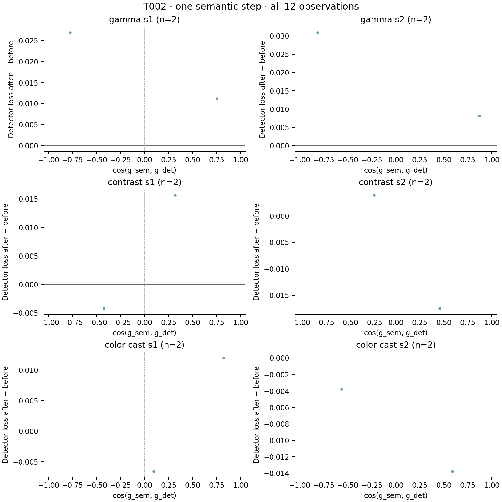

# T002 fixed-subset results

Source `e1f32cb-plus-study-working-tree`; 2 COCO-val2017 images, 12 image/corruption observations. Seed 20260912.

Clean subset bbox AP: **41.040**. All AP values below are points on a 0–100 scale, evaluated on the same fixed subset.

| Condition | No adaptation | CLIP 1 step | CLIP 3 steps | Oracle 1 step |
|---|---:|---:|---:|---:|
| gamma_s1 | 39.059 | 39.059 | 39.059 | 39.559 |
| gamma_s2 | 33.478 | 32.716 | 36.383 | 31.550 |
| contrast_s1 | 50.850 | 48.850 | 48.850 | 48.850 |
| contrast_s2 | 50.362 | 42.739 | 42.362 | 50.739 |
| color_cast_s1 | 44.554 | 44.554 | 44.554 | 44.554 |
| color_cast_s2 | 54.545 | 54.545 | 54.545 | 54.545 |

| Condition | Mean cosine | Median cosine | Positive alignment | Semantic step lowers detector loss |
|---|---:|---:|---:|---:|
| gamma_s1 | -0.0138 | -0.0138 | 50.0% | 0.0% |
| gamma_s2 | 0.0272 | 0.0272 | 50.0% | 0.0% |
| contrast_s1 | -0.0557 | -0.0557 | 50.0% | 50.0% |
| contrast_s2 | 0.1138 | 0.1138 | 50.0% | 50.0% |
| color_cast_s1 | 0.4586 | 0.4586 | 100.0% | 50.0% |
| color_cast_s2 | 0.0105 | 0.0105 | 50.0% | 100.0% |

| Condition | Detector loss Δ, 1 step | Detector loss Δ, 3 steps | Oracle loss Δ | CLIP loss after 3 steps |
|---|---:|---:|---:|---:|
| gamma_s1 | 0.019077 | 0.013186 | -0.004883 | -0.000909 |
| gamma_s2 | 0.019543 | 0.004666 | 0.013650 | -0.001007 |
| contrast_s1 | 0.005709 | 0.011528 | -0.000561 | -0.001032 |
| contrast_s2 | -0.006777 | 0.004942 | -0.012317 | -0.000146 |
| color_cast_s1 | 0.002697 | 0.018267 | 0.005840 | -0.001571 |
| color_cast_s2 | -0.008777 | -0.004043 | -0.008287 | -0.001955 |

| Condition | Saturation before | Saturation after 3 steps | Adaptation, 3 steps (s/image) | Peak allocated (MiB) |
|---|---:|---:|---:|---:|
| gamma_s1 | 0.895% | 1.274% | 0.1075 | 830.3 |
| gamma_s2 | 1.086% | 4.658% | 0.0913 | 834.1 |
| contrast_s1 | 0.000% | 0.000% | 0.1082 | 834.1 |
| contrast_s2 | 0.000% | 0.000% | 0.1182 | 834.1 |
| color_cast_s1 | 4.543% | 0.160% | 0.1200 | 834.1 |
| color_cast_s2 | 6.864% | 0.047% | 0.1199 | 834.1 |

## Physical parameter absolute change, 1 step

| Condition | gamma | R | G | B | contrast | brightness | tone | sharpening |
|---|---:|---:|---:|---:|---:|---:|---:|---:|
| gamma_s1 | 0.000152916 | 0.00419235 | 0.00190291 | 0.00113377 | 0.000901699 | 0.000147029 | 0.000274364 | 0.000216552 |
| gamma_s2 | 0.000757128 | 0.00297233 | 0.00126243 | 0.000815123 | 0.00129414 | 0.000158036 | 0.000332268 | 0.000245998 |
| contrast_s1 | 0.00054419 | 0.00206211 | 0.00315702 | 0.00239715 | 0.00194848 | 0.000145625 | 1.46207e-05 | 0.000324413 |
| contrast_s2 | 0.000335693 | 0.00795728 | 0.00656551 | 0.00394776 | 0.00135463 | 2.45668e-05 | 3.19135e-05 | 0.000232107 |
| color_cast_s1 | 0.000742197 | 0.00511885 | 0.000641346 | 0.000182271 | 0.000544608 | 0.00104818 | 0.000211027 | 0.000178575 |
| color_cast_s2 | 0.00111046 | 0.00645059 | 0.00131896 | 0.000576079 | 0.00206906 | 0.000896804 | 0.000283319 | 0.000120967 |

## Physical parameter absolute change, 3 steps

| Condition | gamma | R | G | B | contrast | brightness | tone | sharpening |
|---|---:|---:|---:|---:|---:|---:|---:|---:|
| gamma_s1 | 0.000439137 | 0.00919598 | 0.00252649 | 0.00368428 | 0.00358588 | 0.000973278 | 0.00080488 | 0.000634327 |
| gamma_s2 | 0.00224072 | 0.00743133 | 0.00207841 | 0.00254112 | 0.00628066 | 0.00112774 | 0.000994312 | 0.000708144 |
| contrast_s1 | 0.00163275 | 0.00357461 | 0.00743812 | 0.00430188 | 0.006024 | 0.000426582 | 5.29501e-05 | 0.00098746 |
| contrast_s2 | 0.00086683 | 0.0146094 | 0.00970352 | 0.00887147 | 0.00406849 | 7.84355e-05 | 8.42598e-05 | 0.000718113 |
| color_cast_s1 | 0.00221658 | 0.0117221 | 0.00116846 | 0.000881672 | 0.00112253 | 0.00283624 | 0.000609515 | 0.000566668 |
| color_cast_s2 | 0.00320217 | 0.0129488 | 0.00367674 | 0.00186133 | 0.00302204 | 0.00192579 | 0.00078814 | 0.000408459 |

## Mean absolute semantic gradient per raw coordinate

| Condition | gamma | R | G | B | contrast | brightness | tone | sharpening |
|---|---:|---:|---:|---:|---:|---:|---:|---:|
| gamma_s1 | 0.00220688 | 0.0604949 | 0.0274568 | 0.0163453 | 0.0129998 | 0.00588118 | 0.00548728 | 0.00433105 |
| gamma_s2 | 0.0109317 | 0.0428806 | 0.0182038 | 0.0117581 | 0.0186572 | 0.00632144 | 0.00664536 | 0.00491996 |
| contrast_s1 | 0.00784787 | 0.0297166 | 0.0454741 | 0.0346603 | 0.0280826 | 0.005825 | 0.000292414 | 0.00648826 |
| contrast_s2 | 0.00484212 | 0.115529 | 0.0944008 | 0.0567902 | 0.0195263 | 0.000982674 | 0.000638271 | 0.00464213 |
| color_cast_s1 | 0.0106995 | 0.0740776 | 0.00924765 | 0.00262865 | 0.00785949 | 0.0419273 | 0.00422053 | 0.0035715 |
| color_cast_s2 | 0.0160181 | 0.0934949 | 0.0190217 | 0.00830796 | 0.0298907 | 0.0358725 | 0.00566638 | 0.00241935 |

## Mean absolute oracle gradient per raw coordinate

| Condition | gamma | R | G | B | contrast | brightness | tone | sharpening |
|---|---:|---:|---:|---:|---:|---:|---:|---:|
| gamma_s1 | 0.0668185 | 0.165122 | 0.166271 | 0.0378324 | 0.163774 | 0.120007 | 0.0171266 | 0.0188424 |
| gamma_s2 | 0.0722156 | 0.158768 | 0.0911486 | 0.0219065 | 0.17791 | 0.089988 | 0.0190258 | 0.0175831 |
| contrast_s1 | 0.0699282 | 0.0814394 | 0.0499197 | 0.10968 | 0.0985137 | 0.0599961 | 0.0195068 | 0.0152012 |
| contrast_s2 | 0.0981304 | 0.225819 | 0.205415 | 0.277599 | 0.124156 | 0.0782801 | 0.0303914 | 0.0284326 |
| color_cast_s1 | 0.058128 | 0.13384 | 0.146326 | 0.0161627 | 0.0648035 | 0.0959615 | 0.00997885 | 0.0142247 |
| color_cast_s2 | 0.0412089 | 0.128881 | 0.0677565 | 0.01829 | 0.0476258 | 0.0815119 | 0.006117 | 0.024603 |

The oracle is analysis-only. Negative loss delta indicates improvement. No samples or negative families are omitted. Latency includes the three-step adaptation call and diagnostics, excludes data loading/oracle/detection evaluation. Peak allocated memory includes loaded models. Native proposal matching makes detector loss piecewise smooth; it is distinct from AP. See docs/T002.md.

