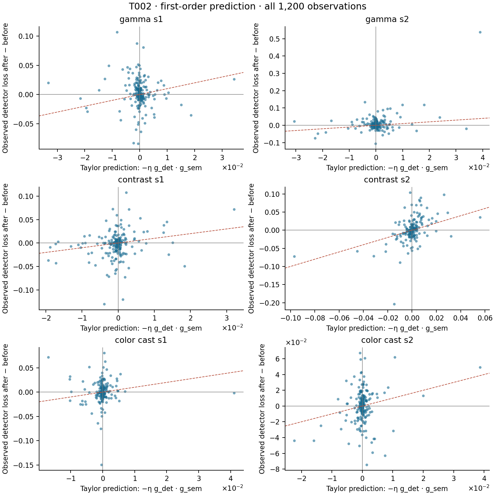

# R003 first-order mechanism diagnostic

Prediction: `-0.1 * dot(g_det, g_sem)` from saved initial gradients; observed change is annotated detector loss after minus before one semantic step.

95% percentile intervals use 2,000 image-cluster bootstrap draws, seed 20260912. Overall draws retain all six observations for each selected image; these are exploratory intervals without multiplicity adjustment. No protocol rerun/tuning is used.

| Group | Sign agreement [95% CI] | Spearman linear vs observed [95% CI] | Pearson linear vs observed | Spearman cosine vs observed [95% CI] |
|---|---:|---:|---:|---:|
| overall | 53.583% [50.748, 56.333] | 0.135 [0.071, 0.196] | 0.2856 | -0.117 [-0.174, -0.062] |
| gamma_s1 | 43.000% [36.000, 49.500] | -0.159 [-0.307, -0.019] | -0.0717 | 0.100 [-0.037, 0.238] |
| gamma_s2 | 46.000% [38.988, 52.500] | 0.001 [-0.157, 0.165] | 0.4480 | 0.039 [-0.103, 0.181] |
| contrast_s1 | 54.500% [47.500, 61.500] | 0.194 [0.043, 0.338] | 0.2239 | -0.161 [-0.291, -0.021] |
| contrast_s2 | 65.500% [59.000, 72.000] | 0.455 [0.314, 0.580] | 0.4583 | -0.399 [-0.507, -0.280] |
| color_cast_s1 | 55.500% [48.000, 62.012] | 0.143 [-0.010, 0.290] | -0.0262 | -0.136 [-0.272, 0.009] |
| color_cast_s2 | 57.000% [50.000, 64.000] | 0.099 [-0.058, 0.256] | 0.2278 | -0.068 [-0.214, 0.079] |

## Distribution summaries

| Group | Linear Δ p05 / median / p95 | Observed Δ p05 / median / p95 | Cosine p05 / median / p95 |
|---|---:|---:|---:|
| overall | -0.00736004 / -5.49832e-05 / 0.00662171 | -0.0404871 / 0.000769973 / 0.0441567 | -0.811796 / 0.0624886 / 0.862541 |
| gamma_s1 | -0.00632271 / -0.000103059 / 0.00554982 | -0.0381833 / 0.000571668 / 0.043138 | -0.816201 / 0.0801745 / 0.818654 |
| gamma_s2 | -0.00628674 / -7.44724e-06 / 0.00646081 | -0.0299892 / 0.00270293 / 0.056589 | -0.816545 / 0.0116003 / 0.844072 |
| contrast_s1 | -0.00914705 / -0.000214843 / 0.0064692 | -0.0474076 / -8.10027e-05 / 0.037991 | -0.814647 / 0.223469 / 0.882112 |
| contrast_s2 | -0.0125426 / 2.02796e-06 / 0.0126593 | -0.0468735 / 0.00113787 / 0.0506053 | -0.832374 / -0.000789978 / 0.908566 |
| color_cast_s1 | -0.00548656 / -6.44529e-05 / 0.00383635 | -0.02486 / 0.000479452 / 0.032225 | -0.75238 / 0.0661228 / 0.828713 |
| color_cast_s2 | -0.0049076 / -3.53393e-05 / 0.00373781 | -0.0401455 / 0.000542682 / 0.0320513 | -0.770949 / 0.0575087 / 0.85566 |

Expected local relationship: positive linear/observed correlation, negative cosine/observed correlation. Native detector proposal matching and sampling can change across a finite step even with paired RNG seeds. Correlation/sign disagreement therefore concerns this measured native loss, and should not be interpreted as a universal failure of first-order calculus.

Full Pearson/Spearman intervals, p25/p75, mean intervals and absolute Taylor-error quantiles are retained in linear_analysis.json. No samples are trimmed or winsorized.

