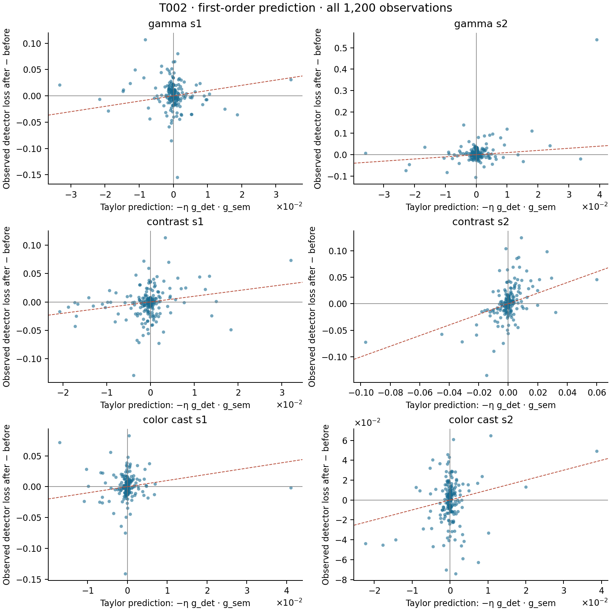

# R003 first-order mechanism diagnostic

Prediction: `-0.1 * dot(g_det, g_sem)` from saved initial gradients; observed change is annotated detector loss after minus before one semantic step.

95% percentile intervals use 2,000 image-cluster bootstrap draws, seed 20260912. Overall draws retain all six observations for each selected image; these are exploratory intervals without multiplicity adjustment. No protocol rerun/tuning is used.

| Group | Sign agreement [95% CI] | Spearman linear vs observed [95% CI] | Pearson linear vs observed | Spearman cosine vs observed [95% CI] |
|---|---:|---:|---:|---:|
| overall | 54.750% [52.000, 57.250] | 0.153 [0.094, 0.213] | 0.2920 | -0.129 [-0.182, -0.078] |
| gamma_s1 | 43.500% [36.500, 50.000] | -0.139 [-0.279, 0.006] | -0.0948 | 0.097 [-0.036, 0.236] |
| gamma_s2 | 48.000% [41.000, 54.500] | 0.059 [-0.095, 0.214] | 0.4594 | -0.005 [-0.144, 0.135] |
| contrast_s1 | 58.500% [51.500, 65.500] | 0.219 [0.069, 0.361] | 0.2368 | -0.200 [-0.328, -0.060] |
| contrast_s2 | 66.500% [60.000, 73.000] | 0.473 [0.348, 0.596] | 0.4849 | -0.410 [-0.518, -0.296] |
| color_cast_s1 | 55.000% [48.000, 62.000] | 0.127 [-0.026, 0.278] | -0.0374 | -0.118 [-0.260, 0.025] |
| color_cast_s2 | 57.000% [50.000, 64.000] | 0.087 [-0.071, 0.243] | 0.2364 | -0.048 [-0.189, 0.100] |

## Distribution summaries

| Group | Linear Δ p05 / median / p95 | Observed Δ p05 / median / p95 | Cosine p05 / median / p95 |
|---|---:|---:|---:|
| overall | -0.00744103 / -4.85999e-05 / 0.0069372 | -0.0397492 / 0.000624359 / 0.0427236 | -0.813667 / 0.0559222 / 0.861388 |
| gamma_s1 | -0.00690989 / -4.7069e-05 / 0.0063467 | -0.0368134 / 0.000580028 / 0.0441112 | -0.816231 / 0.0513617 / 0.798191 |
| gamma_s2 | -0.00628817 / -7.88007e-06 / 0.00646145 | -0.0269066 / 0.00111781 / 0.0515307 | -0.785939 / 0.0146843 / 0.818799 |
| contrast_s1 | -0.0098433 / -0.000181437 / 0.0062543 | -0.0426458 / -0.000689 / 0.040255 | -0.814628 / 0.205456 / 0.88198 |
| contrast_s2 | -0.012352 / 1.00803e-05 / 0.0126584 | -0.04275 / 0.00165947 / 0.0490447 | -0.8565 / -0.00802828 / 0.908545 |
| color_cast_s1 | -0.00463179 / -7.77258e-05 / 0.00383558 | -0.024204 / 0.000827834 / 0.0332556 | -0.799632 / 0.0731457 / 0.828445 |
| color_cast_s2 | -0.00495294 / -2.87092e-05 / 0.00339449 | -0.0408001 / 0.000515163 / 0.0293741 | -0.770962 / 0.0563689 / 0.854182 |

Expected local relationship: positive linear/observed correlation, negative cosine/observed correlation. Native detector proposal matching and sampling can change across a finite step even with paired RNG seeds. Correlation/sign disagreement therefore concerns this measured native loss, and should not be interpreted as a universal failure of first-order calculus.

Full Pearson/Spearman intervals, p25/p75, mean intervals and absolute Taylor-error quantiles are retained in linear_analysis.json. No samples are trimmed or winsorized.

