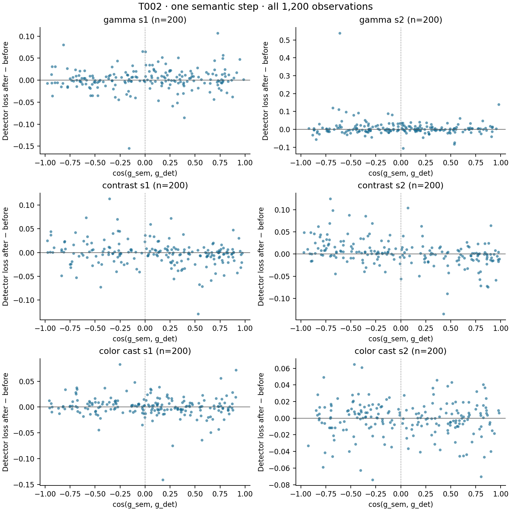

# T002 fixed-subset results

Source `0b8a888`; 200 COCO-val2017 images, 1200 image/corruption observations. Seed 20260912.

Clean subset bbox AP: **38.012**. All AP values below are points on a 0–100 scale, evaluated on the same fixed subset.

| Condition | No adaptation | CLIP 1 step | CLIP 3 steps | Oracle 1 step |
|---|---:|---:|---:|---:|
| gamma_s1 | 38.145 | 38.350 | 38.669 | 38.180 |
| gamma_s2 | 36.446 | 36.598 | 36.407 | 36.569 |
| contrast_s1 | 36.175 | 36.368 | 36.497 | 36.441 |
| contrast_s2 | 31.175 | 31.115 | 31.310 | 31.589 |
| color_cast_s1 | 37.642 | 37.664 | 37.723 | 37.287 |
| color_cast_s2 | 35.908 | 35.846 | 35.528 | 36.048 |

| Condition | Mean cosine | Median cosine | Positive alignment | Semantic step lowers detector loss |
|---|---:|---:|---:|---:|
| gamma_s1 | 0.0227 | 0.0514 | 53.5% | 48.0% |
| gamma_s2 | 0.0017 | 0.0147 | 51.0% | 47.0% |
| contrast_s1 | 0.1173 | 0.2055 | 60.5% | 53.0% |
| contrast_s2 | 0.0274 | -0.0080 | 49.5% | 44.0% |
| color_cast_s1 | 0.0446 | 0.0731 | 56.0% | 46.0% |
| color_cast_s2 | 0.0580 | 0.0564 | 52.5% | 47.5% |

| Condition | Detector loss Δ, 1 step | Detector loss Δ, 3 steps | Oracle loss Δ | CLIP loss after 3 steps |
|---|---:|---:|---:|---:|
| gamma_s1 | 0.002072 | 0.002782 | -0.000825 | -0.001610 |
| gamma_s2 | 0.007826 | 0.016495 | -0.002313 | -0.002204 |
| contrast_s1 | -0.001612 | 0.000420 | -0.006466 | -0.001779 |
| contrast_s2 | 0.003218 | 0.001593 | -0.011908 | -0.001806 |
| color_cast_s1 | 0.000828 | 0.000671 | -0.003023 | -0.001752 |
| color_cast_s2 | -0.001011 | -0.000115 | -0.001996 | -0.001803 |

| Condition | Saturation before | Saturation after 3 steps | Adaptation, 3 steps (s/image) | Peak allocated (MiB) |
|---|---:|---:|---:|---:|
| gamma_s1 | 2.662% | 5.229% | 0.1196 | 842.0 |
| gamma_s2 | 3.911% | 8.329% | 0.1213 | 842.2 |
| contrast_s1 | 0.000% | 0.000% | 0.1219 | 842.1 |
| contrast_s2 | 0.000% | 0.000% | 0.1219 | 842.1 |
| color_cast_s1 | 6.261% | 3.431% | 0.1230 | 842.1 |
| color_cast_s2 | 9.911% | 3.835% | 0.1239 | 842.1 |

## Physical parameter absolute change, 1 step

| Condition | gamma | R | G | B | contrast | brightness | tone | sharpening |
|---|---:|---:|---:|---:|---:|---:|---:|---:|
| gamma_s1 | 0.000980739 | 0.00468746 | 0.00538469 | 0.00280499 | 0.00351586 | 0.000696988 | 0.000337226 | 0.000267873 |
| gamma_s2 | 0.00124242 | 0.00435111 | 0.00512583 | 0.00278865 | 0.00394448 | 0.000885055 | 0.000375664 | 0.000252263 |
| contrast_s1 | 0.000668805 | 0.00524625 | 0.00569456 | 0.00303734 | 0.00220464 | 0.000192905 | 0.000195178 | 0.000267212 |
| contrast_s2 | 0.000563426 | 0.00536307 | 0.00554642 | 0.00320017 | 0.00108799 | 0.000212151 | 0.000214858 | 0.000213153 |
| color_cast_s1 | 0.000745415 | 0.00325927 | 0.00229911 | 0.0014681 | 0.00237839 | 0.000665813 | 0.000294397 | 0.000227559 |
| color_cast_s2 | 0.000842109 | 0.00377362 | 0.00176744 | 0.00103286 | 0.00245618 | 0.000843404 | 0.000340049 | 0.000205776 |

## Physical parameter absolute change, 3 steps

| Condition | gamma | R | G | B | contrast | brightness | tone | sharpening |
|---|---:|---:|---:|---:|---:|---:|---:|---:|
| gamma_s1 | 0.00299492 | 0.00826968 | 0.00924644 | 0.00597002 | 0.00818838 | 0.00159467 | 0.00102829 | 0.000777218 |
| gamma_s2 | 0.00366424 | 0.00793662 | 0.00840556 | 0.00590149 | 0.00866484 | 0.00204172 | 0.00111063 | 0.00072662 |
| contrast_s1 | 0.00201799 | 0.00983815 | 0.00955296 | 0.00734573 | 0.00663993 | 0.000582554 | 0.000582754 | 0.000797276 |
| contrast_s2 | 0.00167096 | 0.00807495 | 0.00815145 | 0.00691361 | 0.00320604 | 0.000622591 | 0.000628469 | 0.000636051 |
| color_cast_s1 | 0.00223528 | 0.00703866 | 0.00611941 | 0.00430463 | 0.00576067 | 0.00168514 | 0.000878097 | 0.00065718 |
| color_cast_s2 | 0.00254432 | 0.00738558 | 0.00516849 | 0.0031079 | 0.00519329 | 0.00200638 | 0.00102919 | 0.000601031 |

## Mean absolute semantic gradient per raw coordinate

| Condition | gamma | R | G | B | contrast | brightness | tone | sharpening |
|---|---:|---:|---:|---:|---:|---:|---:|---:|
| gamma_s1 | 0.0141588 | 0.0679532 | 0.0774159 | 0.0404416 | 0.0506103 | 0.0278799 | 0.00674453 | 0.00535746 |
| gamma_s2 | 0.0179407 | 0.062954 | 0.0738528 | 0.0401841 | 0.0567726 | 0.0354029 | 0.00751329 | 0.00504526 |
| contrast_s1 | 0.00964644 | 0.075805 | 0.0820005 | 0.043761 | 0.0317629 | 0.00771622 | 0.00390356 | 0.00534424 |
| contrast_s2 | 0.00812971 | 0.0774608 | 0.0797989 | 0.0461642 | 0.0156851 | 0.00848605 | 0.00429717 | 0.00426305 |
| color_cast_s1 | 0.0107558 | 0.0470867 | 0.0331915 | 0.0211558 | 0.034274 | 0.0266329 | 0.00588794 | 0.00455117 |
| color_cast_s2 | 0.0121525 | 0.054572 | 0.0255279 | 0.0148872 | 0.0354326 | 0.0337367 | 0.00680099 | 0.00411551 |

## Mean absolute oracle gradient per raw coordinate

| Condition | gamma | R | G | B | contrast | brightness | tone | sharpening |
|---|---:|---:|---:|---:|---:|---:|---:|---:|
| gamma_s1 | 0.0919553 | 0.12684 | 0.159348 | 0.121211 | 0.139291 | 0.102792 | 0.0278168 | 0.0306233 |
| gamma_s2 | 0.165314 | 0.116119 | 0.136257 | 0.100307 | 0.183429 | 0.137942 | 0.0422162 | 0.0373637 |
| contrast_s1 | 0.0735844 | 0.190364 | 0.262861 | 0.198944 | 0.132359 | 0.0680021 | 0.0248469 | 0.0335547 |
| contrast_s2 | 0.14049 | 0.270709 | 0.406778 | 0.28926 | 0.250462 | 0.0994664 | 0.0409623 | 0.0528516 |
| color_cast_s1 | 0.0608814 | 0.181701 | 0.19774 | 0.0946765 | 0.148655 | 0.111245 | 0.0242579 | 0.0311346 |
| color_cast_s2 | 0.0705768 | 0.201918 | 0.17151 | 0.0545692 | 0.136167 | 0.118883 | 0.0292983 | 0.0349895 |

The oracle is analysis-only. Negative loss delta indicates improvement. No samples or negative families are omitted. Latency includes the three-step adaptation call and diagnostics, excludes data loading/oracle/detection evaluation. Peak allocated memory includes loaded models. Native proposal matching makes detector loss piecewise smooth; it is distinct from AP. See docs/T002.md.

