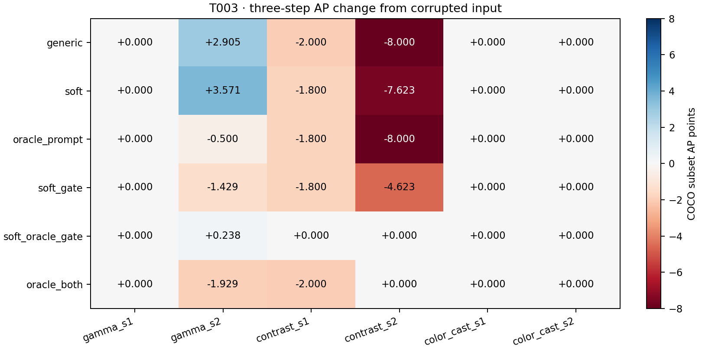

# T003 condition-aware direction and coordinate gating

Source 9a456f7; 2 images, 72 variant observations. Smoke limit: 2. Fixed temperature 0.05, lr 0.1, K=3.

Generic is rerun in T003. All six variants share a fresh g_det per image/condition. Clean/corrupted AP uses the matching T002 subset. Oracle variants know the synthetic family only inside analysis; none uses annotations to choose a direction or a mask. No learned prompts or training.

## Downstream AP (0–100 subset points)

| Case | Corrupted | Generic 1 / 3 | Soft 1 / 3 | Oracle prompt 1 / 3 | Soft gate 1 / 3 | Soft + oracle gate 1 / 3 | Oracle both 1 / 3 |
|---|---:|---:|---:|---:|---:|---:|---:|
| gamma_s1 | 39.059 | 39.059 / 39.059 | 39.059 / 39.059 | 39.059 / 39.059 | 39.059 / 39.059 | 39.059 / 39.059 | 39.059 / 39.059 |
| gamma_s2 | 33.478 | 33.216 / 36.383 | 32.716 / 37.050 | 33.216 / 32.978 | 33.216 / 32.050 | 32.978 / 33.716 | 33.478 / 31.550 |
| contrast_s1 | 50.850 | 48.850 / 48.850 | 49.050 / 49.050 | 49.050 / 49.050 | 50.850 / 49.050 | 50.850 / 50.850 | 48.850 / 48.850 |
| contrast_s2 | 50.362 | 42.739 / 42.362 | 42.739 / 42.739 | 42.362 / 42.362 | 42.362 / 45.739 | 50.362 / 50.362 | 50.362 / 50.362 |
| color_cast_s1 | 44.554 | 44.554 / 44.554 | 44.554 / 44.554 | 44.554 / 44.554 | 44.554 / 44.554 | 44.554 / 44.554 | 44.554 / 44.554 |
| color_cast_s2 | 54.545 | 54.545 / 54.545 | 54.545 / 54.545 | 54.545 / 54.545 | 54.545 / 54.545 | 54.545 / 54.545 | 54.545 / 54.545 |

### AP differences versus the within-run generic (same fixed image subset)

Subset AP differences in points, without bootstrap intervals; do not treat AP as an average of per-image AP.

| Case | Soft Δ1 / Δ3 | Oracle prompt Δ1 / Δ3 | Soft gate Δ1 / Δ3 | Soft + oracle gate Δ1 / Δ3 | Oracle both Δ1 / Δ3 |
|---|---:|---:|---:|---:|---:|
| gamma_s1 | +0.000 / +0.000 | +0.000 / +0.000 | +0.000 / +0.000 | +0.000 / +0.000 | +0.000 / +0.000 |
| gamma_s2 | -0.500 / +0.667 | +0.000 / -3.405 | +0.000 / -4.333 | -0.238 / -2.667 | +0.262 / -4.833 |
| contrast_s1 | +0.200 / +0.200 | +0.200 / +0.200 | +2.000 / +0.200 | +2.000 / +2.000 | +0.000 / +0.000 |
| contrast_s2 | +0.000 / +0.377 | -0.377 / +0.000 | -0.377 / +3.377 | +7.623 / +8.000 | +7.623 / +8.000 |
| color_cast_s1 | +0.000 / +0.000 | +0.000 / +0.000 | +0.000 / +0.000 | +0.000 / +0.000 | +0.000 / +0.000 |
| color_cast_s2 | +0.000 / +0.000 | +0.000 / +0.000 | +0.000 / +0.000 | +0.000 / +0.000 | +0.000 / +0.000 |

Clean subset AP: 41.040. Full AP50/AP75/size metrics are in metrics.json.

## Gradient and measured one-step behavior

Cosines and Taylor predictions use the effective gated gradient. A smaller gate also shortens the step; no rescaling was used. Cosine improvement alone does not establish useful restoration.

| Group | Variant | Mean / median cosine | Positive | Detector loss benefit | Taylor sign match | Taylor Spearman [95% CI] |
|---|---|---:|---:|---:|---:|---:|
| overall | generic | 0.0805 / 0.2645 | 58.3% | 41.7% | 50.0% | 0.196 [0.086, 0.829] |
| overall | soft | 0.1242 / 0.2950 | 58.3% | 41.7% | 50.0% | 0.259 [-0.086, 0.486] |
| overall | oracle_prompt | 0.1518 / 0.3113 | 58.3% | 33.3% | 41.7% | -0.301 [-0.600, -0.257] |
| overall | soft_gate | 0.1474 / 0.3707 | 58.3% | 41.7% | 50.0% | 0.350 [-0.200, 0.829] |
| overall | soft_oracle_gate | 0.2697 / 0.3961 | 83.3% | 33.3% | 33.3% | -0.182 [-0.600, -0.182] |
| overall | oracle_both | 0.1364 / 0.1430 | 75.0% | 41.7% | 50.0% | -0.077 [-0.314, 0.200] |
| gamma_s1 | generic | -0.0826 / -0.0826 | 50.0% | 0.0% | 50.0% | 1.000 [1.000, 1.000] |
| gamma_s1 | soft | -0.0082 / -0.0082 | 50.0% | 0.0% | 50.0% | 1.000 [1.000, 1.000] |
| gamma_s1 | oracle_prompt | -0.0881 / -0.0881 | 50.0% | 50.0% | 0.0% | -1.000 [-1.000, -1.000] |
| gamma_s1 | soft_gate | -0.0170 / -0.0170 | 50.0% | 50.0% | 0.0% | -1.000 [-1.000, -1.000] |
| gamma_s1 | soft_oracle_gate | 0.4055 / 0.4055 | 100.0% | 0.0% | 0.0% | -1.000 [-1.000, -1.000] |
| gamma_s1 | oracle_both | 0.0024 / 0.0024 | 50.0% | 0.0% | 50.0% | -1.000 [-1.000, -1.000] |
| gamma_s2 | generic | 0.0044 / 0.0044 | 50.0% | 0.0% | 50.0% | 1.000 [1.000, 1.000] |
| gamma_s2 | soft | 0.0540 / 0.0540 | 50.0% | 50.0% | 100.0% | 1.000 [1.000, 1.000] |
| gamma_s2 | oracle_prompt | 0.0554 / 0.0554 | 50.0% | 50.0% | 100.0% | 1.000 [1.000, 1.000] |
| gamma_s2 | soft_gate | 0.0717 / 0.0717 | 50.0% | 0.0% | 50.0% | 1.000 [1.000, 1.000] |
| gamma_s2 | soft_oracle_gate | 0.4186 / 0.4186 | 100.0% | 0.0% | 0.0% | 1.000 [1.000, 1.000] |
| gamma_s2 | oracle_both | 0.2343 / 0.2343 | 100.0% | 0.0% | 0.0% | -1.000 [-1.000, -1.000] |
| contrast_s1 | generic | 0.0034 / 0.0034 | 50.0% | 100.0% | 50.0% | -1.000 [-1.000, -1.000] |
| contrast_s1 | soft | 0.0661 / 0.0661 | 50.0% | 50.0% | 100.0% | 1.000 [1.000, 1.000] |
| contrast_s1 | oracle_prompt | 0.3027 / 0.3027 | 50.0% | 0.0% | 50.0% | 1.000 [1.000, 1.000] |
| contrast_s1 | soft_gate | 0.0658 / 0.0658 | 50.0% | 50.0% | 100.0% | 1.000 [1.000, 1.000] |
| contrast_s1 | soft_oracle_gate | -0.0907 / -0.0907 | 50.0% | 50.0% | 100.0% | 1.000 [1.000, 1.000] |
| contrast_s1 | oracle_both | -0.0920 / -0.0920 | 50.0% | 50.0% | 100.0% | 1.000 [1.000, 1.000] |
| contrast_s2 | generic | 0.1223 / 0.1223 | 50.0% | 0.0% | 50.0% | -1.000 [-1.000, -1.000] |
| contrast_s2 | soft | 0.1711 / 0.1711 | 50.0% | 50.0% | 0.0% | -1.000 [-1.000, -1.000] |
| contrast_s2 | oracle_prompt | 0.3226 / 0.3226 | 50.0% | 0.0% | 50.0% | -1.000 [-1.000, -1.000] |
| contrast_s2 | soft_gate | 0.1687 / 0.1687 | 50.0% | 50.0% | 100.0% | 1.000 [1.000, 1.000] |
| contrast_s2 | soft_oracle_gate | 0.2049 / 0.2049 | 100.0% | 50.0% | 50.0% | -1.000 [-1.000, -1.000] |
| contrast_s2 | oracle_both | 0.2082 / 0.2082 | 100.0% | 100.0% | 100.0% | 1.000 [1.000, 1.000] |
| color_cast_s1 | generic | 0.4265 / 0.4265 | 100.0% | 50.0% | 50.0% | -1.000 [-1.000, -1.000] |
| color_cast_s1 | soft | 0.4484 / 0.4484 | 100.0% | 0.0% | 0.0% | -1.000 [-1.000, -1.000] |
| color_cast_s1 | oracle_prompt | 0.4444 / 0.4444 | 100.0% | 0.0% | 0.0% | 1.000 [1.000, 1.000] |
| color_cast_s1 | soft_gate | 0.5425 / 0.5425 | 100.0% | 0.0% | 0.0% | -1.000 [-1.000, -1.000] |
| color_cast_s1 | soft_oracle_gate | 0.6254 / 0.6254 | 100.0% | 0.0% | 0.0% | -1.000 [-1.000, -1.000] |
| color_cast_s1 | oracle_both | 0.5846 / 0.5846 | 100.0% | 0.0% | 0.0% | 1.000 [1.000, 1.000] |
| color_cast_s2 | generic | 0.0087 / 0.0087 | 50.0% | 100.0% | 50.0% | 1.000 [1.000, 1.000] |
| color_cast_s2 | soft | 0.0137 / 0.0137 | 50.0% | 100.0% | 50.0% | -1.000 [-1.000, -1.000] |
| color_cast_s2 | oracle_prompt | -0.1261 / -0.1261 | 50.0% | 100.0% | 50.0% | -1.000 [-1.000, -1.000] |
| color_cast_s2 | soft_gate | 0.0523 / 0.0523 | 50.0% | 100.0% | 50.0% | 1.000 [1.000, 1.000] |
| color_cast_s2 | soft_oracle_gate | 0.0547 / 0.0547 | 50.0% | 100.0% | 50.0% | -1.000 [-1.000, -1.000] |
| color_cast_s2 | oracle_both | -0.1195 / -0.1195 | 50.0% | 100.0% | 50.0% | -1.000 [-1.000, -1.000] |

## Paired differences against generic

Intervals use 2,000 image-cluster bootstrap draws, keeping the six conditions of an image together overall. Exploratory 95% percentile intervals, no multiplicity adjustment. These are not AP intervals.

| Group | Variant | Δ mean cosine [95% CI] | Δ benefit rate, percentage points [95% CI] | Δ observed detector-loss change [95% CI] |
|---|---|---:|---:|---:|
| overall | soft | 0.044 [0.025, 0.063] | 0.000 [-16.667, 16.667] | -0.001 [-0.001, -0.000] |
| overall | oracle_prompt | 0.071 [-0.057, 0.199] | -8.333 [-16.667, 0.000] | -0.003 [-0.006, -0.001] |
| overall | soft_gate | 0.067 [0.017, 0.117] | 0.000 [-16.667, 16.667] | -0.005 [-0.006, -0.004] |
| overall | soft_oracle_gate | 0.189 [-0.062, 0.441] | -8.333 [-16.667, 0.000] | -0.007 [-0.008, -0.005] |
| overall | oracle_both | 0.056 [-0.288, 0.400] | 0.000 [-16.667, 16.667] | -0.005 [-0.006, -0.003] |
| gamma_s1 | soft | 0.074 [0.033, 0.116] | 0.000 [0.000, 0.000] | -0.003 [-0.007, 0.000] |
| gamma_s1 | oracle_prompt | -0.006 [-0.040, 0.029] | 50.000 [0.000, 100.000] | -0.020 [-0.037, -0.002] |
| gamma_s1 | soft_gate | 0.066 [0.019, 0.113] | 50.000 [0.000, 100.000] | -0.017 [-0.035, 0.001] |
| gamma_s1 | soft_oracle_gate | 0.488 [-0.143, 1.119] | 0.000 [0.000, 0.000] | -0.023 [-0.028, -0.017] |
| gamma_s1 | oracle_both | 0.085 [-0.461, 0.631] | 0.000 [0.000, 0.000] | -0.021 [-0.028, -0.013] |
| gamma_s2 | soft | 0.050 [0.021, 0.078] | 50.000 [0.000, 100.000] | -0.006 [-0.008, -0.004] |
| gamma_s2 | oracle_prompt | 0.051 [-0.274, 0.376] | 50.000 [0.000, 100.000] | -0.010 [-0.016, -0.005] |
| gamma_s2 | soft_gate | 0.067 [-0.020, 0.155] | 0.000 [0.000, 0.000] | -0.008 [-0.018, 0.001] |
| gamma_s2 | soft_oracle_gate | 0.414 [-0.064, 0.892] | 0.000 [0.000, 0.000] | -0.012 [-0.025, 0.001] |
| gamma_s2 | oracle_both | 0.230 [-0.483, 0.943] | 0.000 [0.000, 0.000] | -0.009 [-0.022, 0.003] |
| contrast_s1 | soft | 0.063 [0.020, 0.105] | -50.000 [-100.000, 0.000] | 0.003 [-0.009, 0.015] |
| contrast_s1 | oracle_prompt | 0.299 [0.239, 0.360] | -100.000 [-100.000, -100.000] | 0.010 [0.004, 0.017] |
| contrast_s1 | soft_gate | 0.062 [0.012, 0.113] | -50.000 [-100.000, 0.000] | 0.003 [-0.007, 0.013] |
| contrast_s1 | soft_oracle_gate | -0.094 [-0.145, -0.043] | -50.000 [-100.000, 0.000] | 0.003 [-0.004, 0.010] |
| contrast_s1 | oracle_both | -0.095 [-0.154, -0.036] | -50.000 [-100.000, 0.000] | 0.009 [0.001, 0.017] |
| contrast_s2 | soft | 0.049 [0.031, 0.067] | 50.000 [0.000, 100.000] | -0.007 [-0.009, -0.005] |
| contrast_s2 | oracle_prompt | 0.200 [0.111, 0.290] | 0.000 [0.000, 0.000] | -0.000 [-0.003, 0.002] |
| contrast_s2 | soft_gate | 0.046 [0.029, 0.063] | 50.000 [0.000, 100.000] | -0.013 [-0.025, -0.001] |
| contrast_s2 | soft_oracle_gate | 0.083 [-0.071, 0.237] | 50.000 [0.000, 100.000] | -0.002 [-0.004, -0.001] |
| contrast_s2 | oracle_both | 0.086 [-0.064, 0.236] | 100.000 [100.000, 100.000] | -0.009 [-0.011, -0.006] |
| color_cast_s1 | soft | 0.022 [0.003, 0.041] | -50.000 [-100.000, 0.000] | 0.016 [0.012, 0.020] |
| color_cast_s1 | oracle_prompt | 0.018 [-0.291, 0.327] | -50.000 [-100.000, 0.000] | 0.005 [-0.001, 0.012] |
| color_cast_s1 | soft_gate | 0.116 [0.032, 0.201] | -50.000 [-100.000, 0.000] | 0.006 [-0.006, 0.017] |
| color_cast_s1 | soft_oracle_gate | 0.199 [0.020, 0.377] | -50.000 [-100.000, 0.000] | 0.003 [-0.005, 0.012] |
| color_cast_s1 | oracle_both | 0.158 [-0.234, 0.550] | -50.000 [-100.000, 0.000] | 0.008 [0.005, 0.011] |
| color_cast_s2 | soft | 0.005 [0.004, 0.005] | 0.000 [0.000, 0.000] | -0.007 [-0.010, -0.004] |
| color_cast_s2 | oracle_prompt | -0.135 [-0.384, 0.114] | 0.000 [0.000, 0.000] | -0.005 [-0.008, -0.001] |
| color_cast_s2 | soft_gate | 0.044 [-0.003, 0.090] | 0.000 [0.000, 0.000] | -0.002 [-0.002, -0.001] |
| color_cast_s2 | soft_oracle_gate | 0.046 [-0.072, 0.164] | 0.000 [0.000, 0.000] | -0.009 [-0.012, -0.006] |
| color_cast_s2 | oracle_both | -0.128 [-0.451, 0.195] | 0.000 [0.000, 0.000] | -0.005 [-0.008, -0.003] |

### Paired alignment-rate, saturation and runtime differences

Rates and saturation are percentage points; latency is seconds. Same paired image-cluster intervals.

| Group | Variant | Δ positive alignment [95% CI] | Δ saturation1 [95% CI] | Δ saturation3 [95% CI] | Δ seconds3 [95% CI] |
|---|---|---:|---:|---:|---:|
| overall | soft | 0.000 [0.000, 0.000] | 0.102 [0.048, 0.157] | 0.121 [-0.019, 0.262] | 0.006 [0.005, 0.007] |
| overall | oracle_prompt | 0.000 [0.000, 0.000] | 0.196 [-0.378, 0.770] | -0.664 [-1.061, -0.268] | 0.012 [0.012, 0.012] |
| overall | soft_gate | 0.000 [0.000, 0.000] | -0.029 [-0.069, 0.011] | -0.325 [-0.394, -0.256] | 0.012 [0.011, 0.012] |
| overall | soft_oracle_gate | 25.000 [0.000, 50.000] | -0.014 [-0.072, 0.044] | -0.333 [-0.485, -0.182] | 0.012 [0.010, 0.014] |
| overall | oracle_both | 16.667 [0.000, 33.333] | -0.109 [-0.192, -0.025] | -0.588 [-0.916, -0.260] | 0.014 [0.012, 0.015] |
| gamma_s1 | soft | 0.000 [0.000, 0.000] | 0.053 [-0.025, 0.130] | 0.143 [-0.256, 0.542] | 0.009 [0.008, 0.010] |
| gamma_s1 | oracle_prompt | 0.000 [0.000, 0.000] | -0.116 [-0.194, -0.039] | -0.027 [-0.184, 0.130] | 0.026 [0.024, 0.028] |
| gamma_s1 | soft_gate | 0.000 [0.000, 0.000] | -0.023 [-0.047, 0.000] | -0.121 [-0.457, 0.215] | 0.031 [0.027, 0.035] |
| gamma_s1 | soft_oracle_gate | 50.000 [0.000, 100.000] | 0.220 [0.083, 0.356] | -0.163 [-0.165, -0.160] | 0.034 [0.024, 0.044] |
| gamma_s1 | oracle_both | 0.000 [0.000, 0.000] | -0.205 [-0.559, 0.150] | -0.259 [-0.753, 0.234] | 0.038 [0.027, 0.048] |
| gamma_s2 | soft | 0.000 [0.000, 0.000] | 0.404 [0.000, 0.809] | 0.362 [-0.306, 1.030] | 0.007 [0.006, 0.008] |
| gamma_s2 | oracle_prompt | 0.000 [0.000, 0.000] | -1.210 [-1.660, -0.759] | -4.036 [-6.086, -1.986] | 0.011 [0.010, 0.011] |
| gamma_s2 | soft_gate | 0.000 [0.000, 0.000] | -0.371 [-0.414, -0.329] | -1.892 [-2.374, -1.411] | 0.008 [0.006, 0.009] |
| gamma_s2 | soft_oracle_gate | 50.000 [0.000, 100.000] | -0.570 [-0.789, -0.352] | -2.164 [-2.749, -1.579] | 0.009 [0.009, 0.009] |
| gamma_s2 | oracle_both | 50.000 [0.000, 100.000] | -0.770 [-1.304, -0.236] | -3.654 [-5.730, -1.579] | 0.010 [0.010, 0.010] |
| contrast_s1 | soft | 0.000 [0.000, 0.000] | 0.000 [0.000, 0.000] | 0.000 [0.000, 0.000] | 0.000 [-0.007, 0.007] |
| contrast_s1 | oracle_prompt | 0.000 [0.000, 0.000] | 0.000 [0.000, 0.000] | 0.000 [0.000, 0.000] | 0.005 [0.002, 0.008] |
| contrast_s1 | soft_gate | 0.000 [0.000, 0.000] | 0.000 [0.000, 0.000] | 0.000 [0.000, 0.000] | 0.004 [0.001, 0.006] |
| contrast_s1 | soft_oracle_gate | 0.000 [0.000, 0.000] | 0.000 [0.000, 0.000] | 0.000 [0.000, 0.000] | 0.004 [0.002, 0.006] |
| contrast_s1 | oracle_both | 0.000 [0.000, 0.000] | 0.000 [0.000, 0.000] | 0.000 [0.000, 0.000] | 0.005 [0.003, 0.008] |
| contrast_s2 | soft | 0.000 [0.000, 0.000] | 0.000 [0.000, 0.000] | 0.000 [0.000, 0.000] | 0.007 [0.006, 0.008] |
| contrast_s2 | oracle_prompt | 0.000 [0.000, 0.000] | 0.000 [0.000, 0.000] | 0.000 [0.000, 0.000] | 0.011 [0.011, 0.011] |
| contrast_s2 | soft_gate | 0.000 [0.000, 0.000] | 0.000 [0.000, 0.000] | 0.000 [0.000, 0.000] | 0.008 [0.007, 0.010] |
| contrast_s2 | soft_oracle_gate | 50.000 [0.000, 100.000] | 0.000 [0.000, 0.000] | 0.000 [0.000, 0.000] | 0.009 [0.006, 0.012] |
| contrast_s2 | oracle_both | 50.000 [0.000, 100.000] | 0.000 [0.000, 0.000] | 0.000 [0.000, 0.000] | 0.008 [0.008, 0.009] |
| color_cast_s1 | soft | 0.000 [0.000, 0.000] | 0.112 [0.000, 0.224] | 0.112 [0.000, 0.224] | 0.005 [0.002, 0.009] |
| color_cast_s1 | oracle_prompt | 0.000 [0.000, 0.000] | 2.497 [-0.206, 5.200] | 0.115 [-0.206, 0.436] | 0.011 [0.009, 0.013] |
| color_cast_s1 | soft_gate | 0.000 [0.000, 0.000] | 0.112 [0.000, 0.224] | 0.102 [0.000, 0.205] | 0.010 [0.010, 0.011] |
| color_cast_s1 | soft_oracle_gate | 0.000 [0.000, 0.000] | 0.112 [0.000, 0.224] | 0.159 [0.000, 0.317] | 0.008 [0.008, 0.009] |
| color_cast_s1 | oracle_both | 0.000 [0.000, 0.000] | 0.168 [0.000, 0.337] | 0.218 [0.000, 0.436] | 0.009 [0.009, 0.010] |
| color_cast_s2 | soft | 0.000 [0.000, 0.000] | 0.043 [0.000, 0.086] | 0.111 [0.000, 0.223] | 0.007 [0.005, 0.009] |
| color_cast_s2 | oracle_prompt | 0.000 [0.000, 0.000] | 0.005 [-0.206, 0.217] | -0.039 [-0.206, 0.129] | 0.011 [0.009, 0.012] |
| color_cast_s2 | soft_gate | 0.000 [0.000, 0.000] | 0.108 [0.000, 0.217] | -0.039 [-0.206, 0.129] | 0.008 [0.008, 0.008] |
| color_cast_s2 | soft_oracle_gate | 0.000 [0.000, 0.000] | 0.155 [0.000, 0.310] | 0.168 [0.000, 0.336] | 0.008 [0.007, 0.009] |
| color_cast_s2 | oracle_both | 0.000 [0.000, 0.000] | 0.155 [0.000, 0.310] | 0.168 [0.000, 0.336] | 0.012 [0.012, 0.012] |

## Raw objective gradient versus effective gated update

Raw gradient energy/cross-talk describes the semantic objective before gating. Effective energy/cosine describes the actual update. Both are reported separately; norm ratios show gate-induced step shrinkage.

| Group | Variant | Raw / effective mean cosine | Raw / effective norm | Mean effective/raw norm ratio | Raw / effective outside-subspace energy |
|---|---|---:|---:|---:|---:|
| overall | generic | 0.0805 / 0.0805 | 0.09408 / 0.09408 | 1.000 | 68.39% / 68.39% |
| overall | soft | 0.1242 / 0.1242 | 0.08771 / 0.08771 | 1.000 | 68.13% / 68.13% |
| overall | oracle_prompt | 0.1518 / 0.1518 | 0.07803 / 0.07803 | 1.000 | 65.32% / 65.32% |
| overall | soft_gate | 0.1242 / 0.1474 | 0.08771 / 0.03505 | 0.399 | 68.13% / 64.26% |
| overall | soft_oracle_gate | 0.1242 / 0.2697 | 0.08771 / 0.03783 | 0.469 | 68.13% / 0.00% |
| overall | oracle_both | 0.1518 / 0.1364 | 0.07803 / 0.03245 | 0.512 | 65.32% / 0.00% |
| gamma_s1 | generic | -0.0826 / -0.0826 | 0.07855 / 0.07855 | 1.000 | 97.61% / 97.61% |
| gamma_s1 | soft | -0.0082 / -0.0082 | 0.07197 / 0.07197 | 1.000 | 96.45% / 96.45% |
| gamma_s1 | oracle_prompt | -0.0881 / -0.0881 | 0.10411 / 0.10411 | 1.000 | 95.63% / 95.63% |
| gamma_s1 | soft_gate | -0.0082 / -0.0170 | 0.07197 / 0.03128 | 0.440 | 96.45% / 97.63% |
| gamma_s1 | soft_oracle_gate | -0.0082 / 0.4055 | 0.07197 / 0.01278 | 0.183 | 96.45% / 0.00% |
| gamma_s1 | oracle_both | -0.0881 / 0.0024 | 0.10411 / 0.02163 | 0.209 | 95.63% / 0.00% |
| gamma_s2 | generic | 0.0044 / 0.0044 | 0.04772 / 0.04772 | 1.000 | 84.17% / 84.17% |
| gamma_s2 | soft | 0.0540 / 0.0540 | 0.04975 / 0.04975 | 1.000 | 86.72% / 86.72% |
| gamma_s2 | oracle_prompt | 0.0554 / 0.0554 | 0.05855 / 0.05855 | 1.000 | 78.39% / 78.39% |
| gamma_s2 | soft_gate | 0.0540 / 0.0717 | 0.04975 / 0.02079 | 0.412 | 86.72% / 88.69% |
| gamma_s2 | soft_oracle_gate | 0.0540 / 0.4186 | 0.04975 / 0.01504 | 0.322 | 86.72% / 0.00% |
| gamma_s2 | oracle_both | 0.0554 / 0.2343 | 0.05855 / 0.02546 | 0.455 | 78.39% / 0.00% |
| contrast_s1 | generic | 0.0034 / 0.0034 | 0.08054 / 0.08054 | 1.000 | 85.78% / 85.78% |
| contrast_s1 | soft | 0.0661 / 0.0661 | 0.08044 / 0.08044 | 1.000 | 88.28% / 88.28% |
| contrast_s1 | oracle_prompt | 0.3027 / 0.3027 | 0.06718 / 0.06718 | 1.000 | 68.99% / 68.99% |
| contrast_s1 | soft_gate | 0.0661 / 0.0658 | 0.08044 / 0.03194 | 0.390 | 88.28% / 88.56% |
| contrast_s1 | soft_oracle_gate | 0.0661 / -0.0907 | 0.08044 / 0.02347 | 0.317 | 88.28% / 0.00% |
| contrast_s1 | oracle_both | 0.3027 / -0.0920 | 0.06718 / 0.02841 | 0.503 | 68.99% / 0.00% |
| contrast_s2 | generic | 0.1223 / 0.1223 | 0.15981 / 0.15981 | 1.000 | 89.87% / 89.87% |
| contrast_s2 | soft | 0.1711 / 0.1711 | 0.14481 / 0.14481 | 1.000 | 87.69% / 87.69% |
| contrast_s2 | oracle_prompt | 0.3226 / 0.3226 | 0.11251 / 0.11251 | 1.000 | 75.02% / 75.02% |
| contrast_s2 | soft_gate | 0.1711 / 0.1687 | 0.14481 / 0.05400 | 0.367 | 87.69% / 85.53% |
| contrast_s2 | soft_oracle_gate | 0.1711 / 0.2049 | 0.14481 / 0.01795 | 0.262 | 87.69% / 0.00% |
| contrast_s2 | oracle_both | 0.3226 / 0.2082 | 0.11251 / 0.01452 | 0.362 | 75.02% / 0.00% |
| color_cast_s1 | generic | 0.4265 / 0.4265 | 0.08610 / 0.08610 | 1.000 | 29.93% / 29.93% |
| color_cast_s1 | soft | 0.4484 / 0.4484 | 0.07441 / 0.07441 | 1.000 | 27.65% / 27.65% |
| color_cast_s1 | oracle_prompt | 0.4444 / 0.4444 | 0.05026 / 0.05026 | 1.000 | 28.33% / 28.33% |
| color_cast_s1 | soft_gate | 0.4484 / 0.5425 | 0.07441 / 0.02928 | 0.384 | 27.65% / 13.29% |
| color_cast_s1 | soft_oracle_gate | 0.4484 / 0.6254 | 0.07441 / 0.06388 | 0.850 | 27.65% / 0.00% |
| color_cast_s1 | oracle_both | 0.4444 / 0.5846 | 0.05026 / 0.04337 | 0.845 | 28.33% / 0.00% |
| color_cast_s2 | generic | 0.0087 / 0.0087 | 0.11179 / 0.11179 | 1.000 | 22.95% / 22.95% |
| color_cast_s2 | soft | 0.0137 / 0.0137 | 0.10489 / 0.10489 | 1.000 | 21.97% / 21.97% |
| color_cast_s2 | oracle_prompt | -0.1261 / -0.1261 | 0.07556 / 0.07556 | 1.000 | 45.53% / 45.53% |
| color_cast_s2 | soft_gate | 0.0137 / 0.0523 | 0.10489 / 0.04305 | 0.400 | 21.97% / 11.89% |
| color_cast_s2 | soft_oracle_gate | 0.0137 / 0.0547 | 0.10489 / 0.09384 | 0.883 | 21.97% / 0.00% |
| color_cast_s2 | oracle_both | -0.1261 / -0.1195 | 0.07556 / 0.06130 | 0.699 | 45.53% / 0.00% |

## Original-image condition inference (analysis labels only for this table)

| Case | Darkness / contrast / color weight | Correct top-1 | Max weight | Normalized entropy |
|---|---:|---:|---:|---:|
| gamma_s1 | 0.250 / 0.299 / 0.451 | 0.0% | 0.451 | 0.964 |
| gamma_s2 | 0.263 / 0.299 / 0.438 | 0.0% | 0.438 | 0.970 |
| contrast_s1 | 0.262 / 0.344 / 0.393 | 50.0% | 0.397 | 0.985 |
| contrast_s2 | 0.269 / 0.368 / 0.363 | 50.0% | 0.382 | 0.991 |
| color_cast_s1 | 0.249 / 0.331 / 0.420 | 100.0% | 0.420 | 0.977 |
| color_cast_s2 | 0.230 / 0.345 / 0.425 | 100.0% | 0.425 | 0.972 |

## Loss, step size, saturation and runtime

Own CLIP losses use each variant's own direction; the common/generic CLIP loss is also measured for all variants. Latency includes condition inference/setup, K=3 adaptation, diagnostics and GPU synchronization; excludes annotated loss/AP evaluation and common-loss diagnostics.

| Group | Variant | Own CLIP Δ1 / Δ3 | Common CLIP Δ3 | Own loss decreases at 3 | Effective gradient norm | Saturation before / 1 / 3 | Sat3 p95 | Seconds3 | Peak MiB |
|---|---|---:|---:|---:|---:|---:|---:|---:|---:|
| overall | generic | -0.00049 / -0.00106 | -0.00106 | 91.7% | 0.09408 | 2.23% / 0.41% / 0.90% | 4.19% | 0.1165 | 831.3 |
| overall | soft | -0.00038 / -0.00102 | -0.00107 | 100.0% | 0.08771 | 2.23% / 0.51% / 1.02% | 4.49% | 0.1224 | 831.7 |
| overall | oracle_prompt | -0.00020 / -0.00054 | -0.00049 | 83.3% | 0.07803 | 2.23% / 0.61% / 0.24% | 0.68% | 0.1288 | 831.7 |
| overall | soft_gate | -0.00026 / -0.00063 | -0.00068 | 100.0% | 0.03505 | 2.23% / 0.38% / 0.58% | 2.35% | 0.1280 | 831.7 |
| overall | soft_oracle_gate | -0.00025 / -0.00050 | -0.00056 | 91.7% | 0.03783 | 2.23% / 0.40% / 0.57% | 2.09% | 0.1285 | 831.7 |
| overall | oracle_both | -0.00016 / -0.00039 | -0.00040 | 91.7% | 0.03245 | 2.23% / 0.30% / 0.32% | 0.74% | 0.1303 | 831.7 |
| gamma_s1 | generic | -0.00047 / -0.00077 | -0.00077 | 100.0% | 0.07855 | 0.89% / 0.63% / 0.71% | 0.90% | 0.0932 | 829.2 |
| gamma_s1 | soft | -0.00040 / -0.00077 | -0.00076 | 100.0% | 0.07197 | 0.89% / 0.68% / 0.85% | 1.02% | 0.1024 | 831.7 |
| gamma_s1 | oracle_prompt | -0.00075 / -0.00133 | -0.00083 | 100.0% | 0.10411 | 0.89% / 0.51% / 0.68% | 0.73% | 0.1188 | 831.7 |
| gamma_s1 | soft_gate | -0.00020 / -0.00043 | -0.00044 | 100.0% | 0.03128 | 0.89% / 0.61% / 0.59% | 0.70% | 0.1244 | 831.7 |
| gamma_s1 | soft_oracle_gate | -0.00001 / -0.00006 | -0.00004 | 100.0% | 0.01278 | 0.89% / 0.85% / 0.55% | 0.74% | 0.1273 | 831.7 |
| gamma_s1 | oracle_both | -0.00003 / -0.00015 | -0.00010 | 100.0% | 0.02163 | 0.89% / 0.42% / 0.45% | 0.70% | 0.1308 | 831.7 |
| gamma_s2 | generic | -0.00027 / -0.00086 | -0.00086 | 100.0% | 0.04772 | 1.09% / 1.57% / 4.40% | 6.25% | 0.1217 | 831.7 |
| gamma_s2 | soft | -0.00030 / -0.00104 | -0.00092 | 100.0% | 0.04975 | 1.09% / 1.98% / 4.76% | 7.22% | 0.1285 | 831.7 |
| gamma_s2 | oracle_prompt | -0.00024 / -0.00067 | -0.00047 | 100.0% | 0.05855 | 1.09% / 0.36% / 0.36% | 0.37% | 0.1325 | 831.7 |
| gamma_s2 | soft_gate | -0.00013 / -0.00036 | -0.00031 | 100.0% | 0.02079 | 1.09% / 1.20% / 2.51% | 3.93% | 0.1292 | 831.7 |
| gamma_s2 | soft_oracle_gate | -0.00002 / -0.00017 | -0.00017 | 100.0% | 0.01504 | 1.09% / 1.00% / 2.24% | 3.56% | 0.1304 | 831.7 |
| gamma_s2 | oracle_both | -0.00010 / -0.00020 | -0.00008 | 100.0% | 0.02546 | 1.09% / 0.80% / 0.74% | 0.76% | 0.1319 | 831.7 |
| contrast_s1 | generic | -0.00058 / -0.00101 | -0.00101 | 100.0% | 0.08054 | 0.00% / 0.00% / 0.00% | 0.00% | 0.1236 | 831.7 |
| contrast_s1 | soft | -0.00058 / -0.00093 | -0.00094 | 100.0% | 0.08044 | 0.00% / 0.00% / 0.00% | 0.00% | 0.1236 | 831.7 |
| contrast_s1 | oracle_prompt | -0.00025 / 0.00027 | 0.00036 | 50.0% | 0.06718 | 0.00% / 0.00% / 0.00% | 0.00% | 0.1286 | 831.7 |
| contrast_s1 | soft_gate | -0.00025 / -0.00059 | -0.00059 | 100.0% | 0.03194 | 0.00% / 0.00% / 0.00% | 0.00% | 0.1273 | 831.7 |
| contrast_s1 | soft_oracle_gate | -0.00006 / -0.00017 | -0.00019 | 100.0% | 0.02347 | 0.00% / 0.00% / 0.00% | 0.00% | 0.1276 | 831.7 |
| contrast_s1 | oracle_both | -0.00006 / -0.00028 | -0.00026 | 100.0% | 0.02841 | 0.00% / 0.00% / 0.00% | 0.00% | 0.1290 | 831.7 |
| contrast_s2 | generic | 0.00048 / -0.00016 | -0.00016 | 50.0% | 0.15981 | 0.00% / 0.00% / 0.00% | 0.00% | 0.1206 | 831.7 |
| contrast_s2 | soft | 0.00063 / -0.00043 | -0.00041 | 100.0% | 0.14481 | 0.00% / 0.00% / 0.00% | 0.00% | 0.1276 | 831.7 |
| contrast_s2 | oracle_prompt | 0.00088 / 0.00042 | 0.00011 | 50.0% | 0.11251 | 0.00% / 0.00% / 0.00% | 0.00% | 0.1314 | 831.7 |
| contrast_s2 | soft_gate | -0.00029 / -0.00067 | -0.00078 | 100.0% | 0.05400 | 0.00% / 0.00% / 0.00% | 0.00% | 0.1290 | 831.7 |
| contrast_s2 | soft_oracle_gate | -0.00004 / -0.00013 | -0.00014 | 50.0% | 0.01795 | 0.00% / 0.00% / 0.00% | 0.00% | 0.1295 | 831.7 |
| contrast_s2 | oracle_both | -0.00004 / -0.00009 | -0.00011 | 50.0% | 0.01452 | 0.00% / 0.00% / 0.00% | 0.00% | 0.1290 | 831.7 |
| color_cast_s1 | generic | -0.00076 / -0.00155 | -0.00155 | 100.0% | 0.08610 | 4.54% / 0.15% / 0.16% | 0.20% | 0.1201 | 831.7 |
| color_cast_s1 | soft | -0.00054 / -0.00118 | -0.00139 | 100.0% | 0.07441 | 4.54% / 0.26% / 0.27% | 0.33% | 0.1255 | 831.7 |
| color_cast_s1 | oracle_prompt | -0.00024 / -0.00066 | -0.00043 | 100.0% | 0.05026 | 4.54% / 2.65% / 0.27% | 0.52% | 0.1307 | 831.7 |
| color_cast_s1 | soft_gate | -0.00019 / -0.00058 | -0.00069 | 100.0% | 0.02928 | 4.54% / 0.26% / 0.26% | 0.31% | 0.1305 | 831.7 |
| color_cast_s1 | soft_oracle_gate | -0.00039 / -0.00079 | -0.00096 | 100.0% | 0.06388 | 4.54% / 0.26% / 0.32% | 0.42% | 0.1282 | 831.7 |
| color_cast_s1 | oracle_both | -0.00021 / -0.00056 | -0.00028 | 100.0% | 0.04337 | 4.54% / 0.32% / 0.38% | 0.53% | 0.1293 | 831.7 |
| color_cast_s2 | generic | -0.00131 / -0.00201 | -0.00201 | 100.0% | 0.11179 | 6.86% / 0.11% / 0.15% | 0.20% | 0.1198 | 831.7 |
| color_cast_s2 | soft | -0.00110 / -0.00179 | -0.00198 | 100.0% | 0.10489 | 6.86% / 0.15% / 0.26% | 0.31% | 0.1265 | 831.7 |
| color_cast_s2 | oracle_prompt | -0.00059 / -0.00128 | -0.00166 | 100.0% | 0.07556 | 6.86% / 0.11% / 0.11% | 0.21% | 0.1306 | 831.7 |
| color_cast_s2 | soft_gate | -0.00051 / -0.00113 | -0.00125 | 100.0% | 0.04305 | 6.86% / 0.22% / 0.11% | 0.21% | 0.1277 | 831.7 |
| color_cast_s2 | soft_oracle_gate | -0.00096 / -0.00169 | -0.00186 | 100.0% | 0.09384 | 6.86% / 0.26% / 0.32% | 0.42% | 0.1277 | 831.7 |
| color_cast_s2 | oracle_both | -0.00048 / -0.00107 | -0.00154 | 100.0% | 0.06130 | 6.86% / 0.26% / 0.32% | 0.42% | 0.1319 | 831.7 |

## Saturation and coordinate details

analysis.json retains per-case/variant and per-saturation-bucket signed coordinate contributions, sign agreement, gradient energy, harmful/beneficial/zero outcomes and outside-subspace norm; joint initial-to-one-step saturation strata are included. Small strata and post-treatment selection preclude causal claims. Every sample retains raw/physical parameter trajectories, raw and effective gradients, condition similarities/weights, direction and gate in samples.jsonl.

## Cross-run numerical audit

```json
{
  "max_forward_loss_error_vs_T002": 0.0,
  "max_detector_gradient_error_vs_T002": 0.00012493878602981567,
  "generic_AP_differences_vs_T002": {
    "gamma_s1_step1": 0.0,
    "gamma_s1_step3": 0.0,
    "gamma_s2_step1": 0.0,
    "gamma_s2_step3": 0.0,
    "contrast_s1_step1": 0.0,
    "contrast_s1_step3": 0.0,
    "contrast_s2_step1": 0.0,
    "contrast_s2_step3": 0.0,
    "color_cast_s1_step1": 0.0,
    "color_cast_s1_step3": 0.0,
    "color_cast_s2_step1": 0.0,
    "color_cast_s2_step3": 0.0
  }
}
```

Native detector backward and CUDA antialiased bicubic backward are not bitwise reproducible. The failed cache-equality smokes and repeated-gradient diagnostic are preserved. All primary T003 comparisons use contemporaneous generic/variant rows with a common fresh detector gradient.


