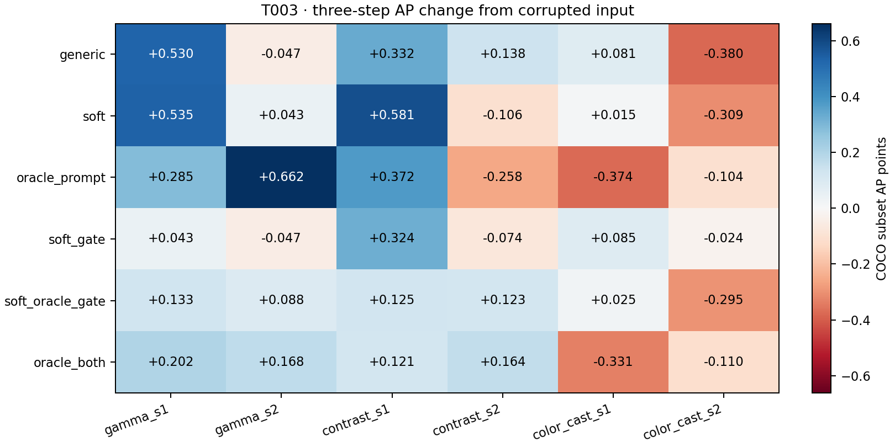

# T003 condition-aware direction and coordinate gating

Source 8d8913e; 200 images, 7200 variant observations. Smoke limit: None. Fixed temperature 0.05, lr 0.1, K=3.

Generic is rerun in T003. All six variants share a fresh g_det per image/condition. Clean/corrupted AP uses the matching T002 subset. Oracle variants know the synthetic family only inside analysis; none uses annotations to choose a direction or a mask. No learned prompts or training.

## Downstream AP (0–100 subset points)

| Case | Corrupted | Generic 1 / 3 | Soft 1 / 3 | Oracle prompt 1 / 3 | Soft gate 1 / 3 | Soft + oracle gate 1 / 3 | Oracle both 1 / 3 |
|---|---:|---:|---:|---:|---:|---:|---:|
| gamma_s1 | 38.145 | 38.356 / 38.676 | 38.321 / 38.681 | 38.573 / 38.431 | 38.275 / 38.189 | 38.065 / 38.279 | 38.176 / 38.347 |
| gamma_s2 | 36.446 | 36.594 / 36.399 | 36.439 / 36.489 | 36.621 / 37.108 | 36.511 / 36.399 | 36.421 / 36.534 | 36.449 / 36.614 |
| contrast_s1 | 36.175 | 36.376 / 36.507 | 36.421 / 36.756 | 36.302 / 36.547 | 36.239 / 36.499 | 36.245 / 36.300 | 36.233 / 36.296 |
| contrast_s2 | 31.175 | 31.115 / 31.313 | 31.108 / 31.069 | 30.888 / 30.917 | 31.241 / 31.101 | 31.173 / 31.298 | 31.265 / 31.339 |
| color_cast_s1 | 37.642 | 37.667 / 37.723 | 37.632 / 37.657 | 37.274 / 37.267 | 37.566 / 37.727 | 37.707 / 37.667 | 37.314 / 37.311 |
| color_cast_s2 | 35.908 | 35.842 / 35.528 | 35.859 / 35.599 | 35.801 / 35.804 | 35.918 / 35.884 | 35.775 / 35.613 | 35.848 / 35.798 |

### AP differences versus the within-run generic (same fixed image subset)

Subset AP differences in points, without bootstrap intervals; do not treat AP as an average of per-image AP.

| Case | Soft Δ1 / Δ3 | Oracle prompt Δ1 / Δ3 | Soft gate Δ1 / Δ3 | Soft + oracle gate Δ1 / Δ3 | Oracle both Δ1 / Δ3 |
|---|---:|---:|---:|---:|---:|
| gamma_s1 | -0.034 / +0.005 | +0.217 / -0.245 | -0.080 / -0.487 | -0.290 / -0.397 | -0.179 / -0.329 |
| gamma_s2 | -0.155 / +0.090 | +0.027 / +0.709 | -0.084 / +0.000 | -0.173 / +0.135 | -0.145 / +0.215 |
| contrast_s1 | +0.045 / +0.249 | -0.074 / +0.040 | -0.136 / -0.008 | -0.130 / -0.207 | -0.143 / -0.211 |
| contrast_s2 | -0.007 / -0.244 | -0.227 / -0.395 | +0.126 / -0.212 | +0.058 / -0.015 | +0.150 / +0.026 |
| color_cast_s1 | -0.035 / -0.066 | -0.394 / -0.455 | -0.101 / +0.004 | +0.039 / -0.056 | -0.354 / -0.412 |
| color_cast_s2 | +0.017 / +0.071 | -0.041 / +0.276 | +0.076 / +0.356 | -0.067 / +0.085 | +0.006 / +0.270 |

Clean subset AP: 38.012. Full AP50/AP75/size metrics are in metrics.json.

## Gradient and measured one-step behavior

Cosines and Taylor predictions use the effective gated gradient. A smaller gate also shortens the step; no rescaling was used. Cosine improvement alone does not establish useful restoration.

| Group | Variant | Mean / median cosine | Positive | Detector loss benefit | Taylor sign match | Taylor Spearman [95% CI] |
|---|---|---:|---:|---:|---:|---:|
| overall | generic | 0.0453 / 0.0563 | 53.8% | 46.7% | 54.5% | 0.147 [0.086, 0.206] |
| overall | soft | 0.0453 / 0.0684 | 53.2% | 49.0% | 56.4% | 0.170 [0.104, 0.234] |
| overall | oracle_prompt | 0.0707 / 0.1031 | 55.6% | 50.7% | 54.1% | 0.138 [0.069, 0.205] |
| overall | soft_gate | 0.0513 / 0.0742 | 54.0% | 47.2% | 51.8% | 0.084 [0.024, 0.145] |
| overall | soft_oracle_gate | 0.0951 / 0.1142 | 61.8% | 48.0% | 51.6% | 0.056 [-0.009, 0.121] |
| overall | oracle_both | 0.0937 / 0.1190 | 62.3% | 50.6% | 51.9% | 0.038 [-0.021, 0.095] |
| gamma_s1 | generic | 0.0227 / 0.0512 | 53.5% | 45.5% | 44.0% | -0.164 [-0.304, -0.020] |
| gamma_s1 | soft | 0.0252 / 0.0395 | 51.5% | 46.5% | 54.0% | -0.032 [-0.191, 0.123] |
| gamma_s1 | oracle_prompt | 0.0197 / 0.0353 | 51.0% | 45.5% | 46.5% | -0.120 [-0.276, 0.029] |
| gamma_s1 | soft_gate | 0.0310 / 0.0133 | 51.0% | 45.0% | 48.0% | -0.077 [-0.229, 0.077] |
| gamma_s1 | soft_oracle_gate | 0.0352 / 0.0191 | 50.5% | 49.5% | 48.0% | 0.002 [-0.155, 0.158] |
| gamma_s1 | oracle_both | 0.0446 / 0.0365 | 53.5% | 51.5% | 46.0% | -0.030 [-0.193, 0.122] |
| gamma_s2 | generic | 0.0017 / 0.0145 | 51.0% | 45.5% | 48.5% | 0.073 [-0.087, 0.227] |
| gamma_s2 | soft | -0.0028 / -0.0074 | 49.0% | 42.5% | 53.5% | 0.109 [-0.049, 0.265] |
| gamma_s2 | oracle_prompt | 0.0625 / 0.1017 | 56.0% | 49.5% | 55.5% | 0.235 [0.080, 0.380] |
| gamma_s2 | soft_gate | 0.0060 / 0.0149 | 51.5% | 45.5% | 44.0% | -0.076 [-0.221, 0.070] |
| gamma_s2 | soft_oracle_gate | 0.0496 / 0.0509 | 55.0% | 43.0% | 49.0% | 0.006 [-0.152, 0.164] |
| gamma_s2 | oracle_both | 0.1204 / 0.1454 | 62.0% | 52.5% | 51.5% | -0.004 [-0.155, 0.135] |
| contrast_s1 | generic | 0.1174 / 0.2051 | 60.5% | 52.5% | 57.0% | 0.208 [0.058, 0.352] |
| contrast_s1 | soft | 0.1087 / 0.1598 | 58.5% | 56.0% | 58.5% | 0.233 [0.084, 0.371] |
| contrast_s1 | oracle_prompt | 0.1841 / 0.2501 | 66.0% | 60.0% | 61.0% | 0.269 [0.124, 0.406] |
| contrast_s1 | soft_gate | 0.1165 / 0.1730 | 58.5% | 50.0% | 54.5% | 0.083 [-0.063, 0.239] |
| contrast_s1 | soft_oracle_gate | 0.1611 / 0.1652 | 76.0% | 50.0% | 49.0% | 0.058 [-0.087, 0.202] |
| contrast_s1 | oracle_both | 0.1732 / 0.1734 | 77.5% | 53.5% | 53.0% | 0.109 [-0.039, 0.256] |
| contrast_s2 | generic | 0.0275 / -0.0083 | 49.5% | 43.0% | 66.5% | 0.465 [0.340, 0.590] |
| contrast_s2 | soft | 0.0320 / -0.0113 | 49.5% | 48.0% | 63.5% | 0.381 [0.235, 0.514] |
| contrast_s2 | oracle_prompt | 0.0974 / 0.1589 | 56.0% | 45.0% | 59.0% | 0.273 [0.116, 0.426] |
| contrast_s2 | soft_gate | 0.0374 / -0.0045 | 50.0% | 40.5% | 59.5% | 0.212 [0.063, 0.359] |
| contrast_s2 | soft_oracle_gate | 0.1774 / 0.2169 | 79.0% | 49.5% | 55.5% | 0.127 [-0.017, 0.279] |
| contrast_s2 | oracle_both | 0.1602 / 0.2010 | 73.5% | 43.5% | 52.0% | 0.021 [-0.126, 0.173] |
| color_cast_s1 | generic | 0.0446 / 0.0732 | 56.0% | 46.0% | 54.0% | 0.102 [-0.048, 0.251] |
| color_cast_s1 | soft | 0.0493 / 0.0787 | 58.0% | 49.5% | 52.5% | 0.123 [-0.029, 0.281] |
| color_cast_s1 | oracle_prompt | 0.0480 / 0.0982 | 56.0% | 52.5% | 52.5% | 0.065 [-0.087, 0.217] |
| color_cast_s1 | soft_gate | 0.0522 / 0.1068 | 59.5% | 47.5% | 54.0% | 0.180 [0.027, 0.328] |
| color_cast_s1 | soft_oracle_gate | 0.0659 / 0.0526 | 52.5% | 47.0% | 54.5% | 0.115 [-0.032, 0.268] |
| color_cast_s1 | oracle_both | 0.0576 / 0.0964 | 56.5% | 49.0% | 57.5% | 0.123 [-0.035, 0.269] |
| color_cast_s2 | generic | 0.0580 / 0.0567 | 52.5% | 47.5% | 57.0% | 0.099 [-0.059, 0.256] |
| color_cast_s2 | soft | 0.0595 / 0.0717 | 53.0% | 51.5% | 56.5% | 0.142 [-0.001, 0.296] |
| color_cast_s2 | oracle_prompt | 0.0127 / -0.0254 | 48.5% | 51.5% | 50.0% | 0.025 [-0.129, 0.182] |
| color_cast_s2 | soft_gate | 0.0645 / 0.0908 | 53.5% | 54.5% | 51.0% | 0.176 [0.029, 0.316] |
| color_cast_s2 | soft_oracle_gate | 0.0812 / 0.1508 | 57.5% | 49.0% | 53.5% | 0.031 [-0.122, 0.188] |
| color_cast_s2 | oracle_both | 0.0061 / 0.0258 | 51.0% | 53.5% | 51.5% | 0.006 [-0.155, 0.160] |

## Paired differences against generic

Intervals use 2,000 image-cluster bootstrap draws, keeping the six conditions of an image together overall. Exploratory 95% percentile intervals, no multiplicity adjustment. These are not AP intervals.

| Group | Variant | Δ mean cosine [95% CI] | Δ benefit rate, percentage points [95% CI] | Δ observed detector-loss change [95% CI] |
|---|---|---:|---:|---:|
| overall | soft | -0.000 [-0.008, 0.007] | 2.333 [-0.500, 5.083] | -0.001 [-0.002, 0.000] |
| overall | oracle_prompt | 0.025 [-0.004, 0.055] | 4.000 [0.917, 7.169] | -0.001 [-0.003, 0.000] |
| overall | soft_gate | 0.006 [-0.003, 0.014] | 0.500 [-2.667, 3.583] | -0.001 [-0.002, 0.001] |
| overall | soft_oracle_gate | 0.050 [0.015, 0.083] | 1.333 [-1.750, 4.417] | -0.001 [-0.003, 0.001] |
| overall | oracle_both | 0.048 [0.005, 0.090] | 3.917 [0.583, 7.083] | -0.003 [-0.004, -0.001] |
| gamma_s1 | soft | 0.002 [-0.013, 0.016] | 1.000 [-6.000, 8.000] | 0.000 [-0.002, 0.003] |
| gamma_s1 | oracle_prompt | -0.003 [-0.072, 0.063] | 0.000 [-7.000, 7.500] | 0.001 [-0.002, 0.005] |
| gamma_s1 | soft_gate | 0.008 [-0.009, 0.024] | -0.500 [-10.000, 8.500] | -0.001 [-0.004, 0.003] |
| gamma_s1 | soft_oracle_gate | 0.013 [-0.063, 0.084] | 4.000 [-5.000, 12.500] | -0.003 [-0.006, 0.001] |
| gamma_s1 | oracle_both | 0.022 [-0.063, 0.104] | 6.000 [-3.000, 14.500] | -0.004 [-0.007, 0.000] |
| gamma_s2 | soft | -0.005 [-0.018, 0.009] | -3.000 [-10.012, 4.000] | -0.001 [-0.005, 0.002] |
| gamma_s2 | oracle_prompt | 0.061 [-0.000, 0.123] | 4.000 [-4.000, 11.500] | -0.006 [-0.013, 0.000] |
| gamma_s2 | soft_gate | 0.004 [-0.012, 0.020] | 0.000 [-8.000, 8.000] | -0.005 [-0.012, -0.000] |
| gamma_s2 | soft_oracle_gate | 0.048 [-0.014, 0.112] | -2.500 [-11.000, 5.500] | -0.007 [-0.013, -0.001] |
| gamma_s2 | oracle_both | 0.119 [0.040, 0.198] | 7.000 [-1.000, 15.500] | -0.009 [-0.017, -0.004] |
| contrast_s1 | soft | -0.009 [-0.028, 0.008] | 3.500 [-3.000, 10.000] | -0.001 [-0.003, 0.002] |
| contrast_s1 | oracle_prompt | 0.067 [0.013, 0.121] | 7.500 [0.500, 15.000] | -0.001 [-0.004, 0.002] |
| contrast_s1 | soft_gate | -0.001 [-0.022, 0.018] | -2.500 [-10.500, 6.000] | 0.000 [-0.003, 0.004] |
| contrast_s1 | soft_oracle_gate | 0.044 [-0.031, 0.113] | -2.500 [-10.500, 6.500] | 0.001 [-0.003, 0.005] |
| contrast_s1 | oracle_both | 0.056 [-0.021, 0.126] | 1.000 [-6.500, 8.500] | -0.000 [-0.004, 0.003] |
| contrast_s2 | soft | 0.005 [-0.010, 0.019] | 5.000 [-1.000, 11.500] | -0.001 [-0.003, 0.002] |
| contrast_s2 | oracle_prompt | 0.070 [0.010, 0.133] | 2.000 [-5.500, 10.012] | -0.002 [-0.006, 0.001] |
| contrast_s2 | soft_gate | 0.010 [-0.006, 0.026] | -2.500 [-11.000, 5.500] | -0.000 [-0.004, 0.004] |
| contrast_s2 | soft_oracle_gate | 0.150 [0.062, 0.237] | 6.500 [-2.000, 15.000] | -0.002 [-0.007, 0.002] |
| contrast_s2 | oracle_both | 0.133 [0.044, 0.220] | 0.500 [-8.012, 9.500] | -0.002 [-0.006, 0.003] |
| color_cast_s1 | soft | 0.005 [-0.008, 0.019] | 3.500 [-4.000, 10.500] | -0.001 [-0.003, 0.001] |
| color_cast_s1 | oracle_prompt | 0.003 [-0.050, 0.057] | 6.500 [-1.500, 14.500] | -0.002 [-0.005, 0.001] |
| color_cast_s1 | soft_gate | 0.008 [-0.007, 0.024] | 1.500 [-7.000, 10.000] | 0.000 [-0.003, 0.003] |
| color_cast_s1 | soft_oracle_gate | 0.021 [-0.016, 0.061] | 1.000 [-5.500, 7.500] | 0.002 [-0.000, 0.005] |
| color_cast_s1 | oracle_both | 0.013 [-0.054, 0.078] | 3.000 [-5.500, 11.000] | -0.000 [-0.003, 0.003] |
| color_cast_s2 | soft | 0.002 [-0.008, 0.010] | 4.000 [-2.012, 10.500] | -0.000 [-0.002, 0.002] |
| color_cast_s2 | oracle_prompt | -0.045 [-0.099, 0.010] | 4.000 [-3.500, 11.500] | 0.001 [-0.002, 0.004] |
| color_cast_s2 | soft_gate | 0.006 [-0.006, 0.020] | 7.000 [-1.000, 15.500] | 0.001 [-0.002, 0.004] |
| color_cast_s2 | soft_oracle_gate | 0.023 [-0.015, 0.060] | 1.500 [-5.500, 9.000] | 0.001 [-0.002, 0.004] |
| color_cast_s2 | oracle_both | -0.052 [-0.116, 0.014] | 6.000 [-1.500, 13.512] | -0.000 [-0.003, 0.003] |

### Paired alignment-rate, saturation and runtime differences

Rates and saturation are percentage points; latency is seconds. Same paired image-cluster intervals.

| Group | Variant | Δ positive alignment [95% CI] | Δ saturation1 [95% CI] | Δ saturation3 [95% CI] | Δ seconds3 [95% CI] |
|---|---|---:|---:|---:|---:|
| overall | soft | -0.583 [-1.833, 0.583] | -0.018 [-0.172, 0.110] | -0.007 [-0.116, 0.117] | 0.005 [0.005, 0.006] |
| overall | oracle_prompt | 1.750 [-1.083, 4.583] | -0.038 [-0.366, 0.270] | -0.220 [-0.581, 0.109] | 0.008 [0.008, 0.009] |
| overall | soft_gate | 0.167 [-1.333, 1.750] | -0.633 [-0.900, -0.420] | -0.820 [-1.043, -0.572] | 0.007 [0.006, 0.007] |
| overall | soft_oracle_gate | 7.917 [4.250, 11.583] | -0.861 [-1.216, -0.578] | -1.032 [-1.354, -0.719] | 0.007 [0.007, 0.008] |
| overall | oracle_both | 8.500 [4.331, 12.669] | -0.662 [-1.072, -0.288] | -1.057 [-1.495, -0.658] | 0.009 [0.008, 0.009] |
| gamma_s1 | soft | -2.000 [-4.500, 0.000] | -0.025 [-0.197, 0.128] | -0.034 [-0.361, 0.239] | 0.006 [0.005, 0.007] |
| gamma_s1 | oracle_prompt | -2.500 [-9.500, 4.012] | -1.146 [-1.833, -0.554] | -1.146 [-1.841, -0.463] | 0.014 [0.010, 0.019] |
| gamma_s1 | soft_gate | -2.500 [-6.000, 1.000] | -1.345 [-1.803, -0.922] | -1.506 [-2.009, -1.036] | 0.009 [0.008, 0.011] |
| gamma_s1 | soft_oracle_gate | -3.000 [-11.500, 6.000] | -2.081 [-2.759, -1.469] | -2.471 [-3.087, -1.880] | 0.010 [0.008, 0.011] |
| gamma_s1 | oracle_both | 0.000 [-9.000, 9.000] | -2.657 [-3.436, -1.923] | -3.387 [-4.131, -2.668] | 0.011 [0.009, 0.013] |
| gamma_s2 | soft | -2.000 [-5.000, 1.000] | -0.197 [-0.855, 0.274] | -0.023 [-0.396, 0.437] | 0.004 [0.004, 0.005] |
| gamma_s2 | oracle_prompt | 5.000 [-2.000, 12.000] | -1.967 [-3.218, -0.865] | -2.567 [-4.084, -1.156] | 0.007 [0.006, 0.007] |
| gamma_s2 | soft_gate | 0.500 [-2.500, 3.500] | -2.366 [-3.167, -1.594] | -2.778 [-3.635, -1.835] | 0.007 [0.006, 0.007] |
| gamma_s2 | soft_oracle_gate | 4.000 [-4.500, 12.000] | -3.162 [-4.139, -2.370] | -3.867 [-4.987, -2.856] | 0.007 [0.006, 0.008] |
| gamma_s2 | oracle_both | 11.000 [2.000, 20.000] | -4.186 [-5.445, -3.085] | -5.132 [-6.653, -3.654] | 0.008 [0.007, 0.010] |
| contrast_s1 | soft | -2.000 [-5.000, 1.000] | 0.000 [0.000, 0.000] | 0.000 [0.000, 0.000] | 0.005 [0.004, 0.005] |
| contrast_s1 | oracle_prompt | 5.500 [0.000, 11.000] | 0.000 [0.000, 0.000] | 0.000 [0.000, 0.000] | 0.007 [0.006, 0.008] |
| contrast_s1 | soft_gate | -2.000 [-5.500, 1.500] | 0.000 [0.000, 0.000] | 0.000 [0.000, 0.000] | 0.007 [0.006, 0.008] |
| contrast_s1 | soft_oracle_gate | 15.500 [7.000, 23.500] | 0.000 [0.000, 0.000] | 0.000 [0.000, 0.000] | 0.007 [0.006, 0.009] |
| contrast_s1 | oracle_both | 17.000 [9.000, 24.500] | 0.000 [0.000, 0.000] | 0.000 [0.000, 0.000] | 0.009 [0.008, 0.010] |
| contrast_s2 | soft | 0.000 [-3.000, 3.012] | 0.000 [0.000, 0.000] | 0.000 [0.000, 0.000] | 0.007 [0.004, 0.011] |
| contrast_s2 | oracle_prompt | 6.500 [1.000, 12.000] | 0.000 [0.000, 0.000] | 0.000 [0.000, 0.000] | 0.007 [0.006, 0.009] |
| contrast_s2 | soft_gate | 0.500 [-3.000, 4.000] | 0.000 [0.000, 0.000] | 0.000 [0.000, 0.000] | 0.006 [0.004, 0.007] |
| contrast_s2 | soft_oracle_gate | 29.500 [20.500, 38.000] | 0.000 [0.000, 0.000] | 0.000 [0.000, 0.000] | 0.005 [0.004, 0.006] |
| contrast_s2 | oracle_both | 24.000 [15.000, 33.000] | 0.000 [0.000, 0.000] | 0.000 [0.000, 0.000] | 0.006 [0.005, 0.008] |
| color_cast_s1 | soft | 2.000 [-0.500, 5.000] | -0.025 [-0.213, 0.162] | -0.016 [-0.237, 0.211] | 0.005 [0.005, 0.006] |
| color_cast_s1 | oracle_prompt | 0.000 [-6.500, 7.000] | 0.731 [0.250, 1.203] | 0.541 [-0.032, 1.102] | 0.008 [0.007, 0.009] |
| color_cast_s1 | soft_gate | 3.500 [1.000, 6.500] | -0.231 [-0.532, 0.020] | -0.080 [-0.510, 0.423] | 0.007 [0.006, 0.008] |
| color_cast_s1 | soft_oracle_gate | -3.500 [-9.500, 2.012] | -0.076 [-0.493, 0.319] | 0.054 [-0.415, 0.531] | 0.007 [0.006, 0.008] |
| color_cast_s1 | oracle_both | 0.500 [-6.500, 8.000] | 0.657 [0.169, 1.167] | 0.699 [0.014, 1.394] | 0.009 [0.008, 0.010] |
| color_cast_s2 | soft | 0.500 [-2.000, 3.000] | 0.136 [-0.124, 0.430] | 0.030 [-0.321, 0.375] | 0.005 [0.004, 0.006] |
| color_cast_s2 | oracle_prompt | -4.000 [-10.500, 2.500] | 2.152 [1.362, 2.927] | 1.852 [0.995, 2.698] | 0.007 [0.006, 0.008] |
| color_cast_s2 | soft_gate | 1.000 [-1.500, 4.000] | 0.144 [-0.171, 0.483] | -0.555 [-1.010, -0.158] | 0.006 [0.005, 0.007] |
| color_cast_s2 | soft_oracle_gate | 5.000 [0.000, 9.512] | 0.152 [-0.348, 0.624] | 0.091 [-0.563, 0.783] | 0.007 [0.005, 0.010] |
| color_cast_s2 | oracle_both | -1.500 [-9.000, 5.500] | 2.212 [1.348, 3.089] | 1.479 [0.553, 2.395] | 0.008 [0.007, 0.010] |

## Raw objective gradient versus effective gated update

Raw gradient energy/cross-talk describes the semantic objective before gating. Effective energy/cosine describes the actual update. Both are reported separately; norm ratios show gate-induced step shrinkage.

| Group | Variant | Raw / effective mean cosine | Raw / effective norm | Mean effective/raw norm ratio | Raw / effective outside-subspace energy |
|---|---|---:|---:|---:|---:|
| overall | generic | 0.0453 / 0.0453 | 0.12575 / 0.12575 | 1.000 | 72.05% / 72.05% |
| overall | soft | 0.0453 / 0.0453 | 0.12487 / 0.12487 | 1.000 | 72.41% / 72.41% |
| overall | oracle_prompt | 0.0707 / 0.0707 | 0.12457 / 0.12457 | 1.000 | 69.10% / 69.10% |
| overall | soft_gate | 0.0453 / 0.0513 | 0.12487 / 0.04076 | 0.330 | 72.41% / 70.14% |
| overall | soft_oracle_gate | 0.0453 / 0.0951 | 0.12487 / 0.04393 | 0.441 | 72.41% / 0.00% |
| overall | oracle_both | 0.0707 / 0.0937 | 0.12457 / 0.04418 | 0.467 | 69.10% / 0.00% |
| gamma_s1 | generic | 0.0227 / 0.0227 | 0.14766 / 0.14766 | 1.000 | 87.56% / 87.56% |
| gamma_s1 | soft | 0.0252 / 0.0252 | 0.14888 / 0.14888 | 1.000 | 87.47% / 87.47% |
| gamma_s1 | oracle_prompt | 0.0197 / 0.0197 | 0.16505 / 0.16505 | 1.000 | 82.89% / 82.89% |
| gamma_s1 | soft_gate | 0.0252 / 0.0310 | 0.14888 / 0.04919 | 0.335 | 87.47% / 84.55% |
| gamma_s1 | soft_oracle_gate | 0.0252 / 0.0352 | 0.14888 / 0.03503 | 0.304 | 87.47% / 0.00% |
| gamma_s1 | oracle_both | 0.0197 / 0.0446 | 0.16505 / 0.03981 | 0.348 | 82.89% / 0.00% |
| gamma_s2 | generic | 0.0017 / 0.0017 | 0.14993 / 0.14993 | 1.000 | 82.52% / 82.52% |
| gamma_s2 | soft | -0.0028 / -0.0028 | 0.14996 / 0.14996 | 1.000 | 82.52% / 82.52% |
| gamma_s2 | oracle_prompt | 0.0625 / 0.0625 | 0.15806 / 0.15806 | 1.000 | 77.39% / 77.39% |
| gamma_s2 | soft_gate | -0.0028 / 0.0060 | 0.14996 / 0.05028 | 0.335 | 82.52% / 78.24% |
| gamma_s2 | soft_oracle_gate | -0.0028 / 0.0496 | 0.14996 / 0.04351 | 0.372 | 82.52% / 0.00% |
| gamma_s2 | oracle_both | 0.0625 / 0.1204 | 0.15806 / 0.05047 | 0.420 | 77.39% / 0.00% |
| contrast_s1 | generic | 0.1174 / 0.1174 | 0.13914 / 0.13914 | 1.000 | 84.89% / 84.89% |
| contrast_s1 | soft | 0.1087 / 0.1087 | 0.13823 / 0.13823 | 1.000 | 85.10% / 85.10% |
| contrast_s1 | oracle_prompt | 0.1841 / 0.1841 | 0.13593 / 0.13593 | 1.000 | 82.92% / 82.92% |
| contrast_s1 | soft_gate | 0.1087 / 0.1165 | 0.13823 / 0.04344 | 0.319 | 85.10% / 79.55% |
| contrast_s1 | soft_oracle_gate | 0.1087 / 0.1611 | 0.13823 / 0.03232 | 0.323 | 85.10% / 0.00% |
| contrast_s1 | oracle_both | 0.1841 / 0.1732 | 0.13593 / 0.03522 | 0.354 | 82.92% / 0.00% |
| contrast_s2 | generic | 0.0275 / 0.0275 | 0.13534 / 0.13534 | 1.000 | 93.73% / 93.73% |
| contrast_s2 | soft | 0.0320 / 0.0320 | 0.13027 / 0.13027 | 1.000 | 94.25% / 94.25% |
| contrast_s2 | oracle_prompt | 0.0974 / 0.0974 | 0.12390 / 0.12390 | 1.000 | 95.12% / 95.12% |
| contrast_s2 | soft_gate | 0.0320 / 0.0374 | 0.13027 / 0.03953 | 0.305 | 94.25% / 89.59% |
| contrast_s2 | soft_oracle_gate | 0.0320 / 0.1774 | 0.13027 / 0.01613 | 0.185 | 94.25% / 0.00% |
| contrast_s2 | oracle_both | 0.0974 / 0.1602 | 0.12390 / 0.01397 | 0.164 | 95.12% / 0.00% |
| color_cast_s1 | generic | 0.0446 / 0.0446 | 0.09015 / 0.09015 | 1.000 | 40.31% / 40.31% |
| color_cast_s1 | soft | 0.0493 / 0.0493 | 0.09057 / 0.09057 | 1.000 | 41.07% / 41.07% |
| color_cast_s1 | oracle_prompt | 0.0480 / 0.0480 | 0.08335 / 0.08335 | 1.000 | 34.65% / 34.65% |
| color_cast_s1 | soft_gate | 0.0493 / 0.0522 | 0.09057 / 0.03108 | 0.343 | 41.07% / 43.21% |
| color_cast_s1 | soft_oracle_gate | 0.0493 / 0.0659 | 0.09057 / 0.06904 | 0.737 | 41.07% / 0.00% |
| color_cast_s1 | oracle_both | 0.0480 / 0.0576 | 0.08335 / 0.06562 | 0.781 | 34.65% / 0.00% |
| color_cast_s2 | generic | 0.0580 / 0.0580 | 0.09227 / 0.09227 | 1.000 | 43.32% / 43.32% |
| color_cast_s2 | soft | 0.0595 / 0.0595 | 0.09129 / 0.09129 | 1.000 | 44.05% / 44.05% |
| color_cast_s2 | oracle_prompt | 0.0127 / 0.0127 | 0.08111 / 0.08111 | 1.000 | 41.64% / 41.64% |
| color_cast_s2 | soft_gate | 0.0595 / 0.0645 | 0.09129 / 0.03106 | 0.342 | 44.05% / 45.71% |
| color_cast_s2 | soft_oracle_gate | 0.0595 / 0.0812 | 0.09129 / 0.06755 | 0.728 | 44.05% / 0.00% |
| color_cast_s2 | oracle_both | 0.0127 / 0.0061 | 0.08111 / 0.06000 | 0.737 | 41.64% / 0.00% |

## Original-image condition inference (analysis labels only for this table)

| Case | Darkness / contrast / color weight | Correct top-1 | Max weight | Normalized entropy |
|---|---:|---:|---:|---:|
| gamma_s1 | 0.335 / 0.330 / 0.335 | 38.5% | 0.402 | 0.984 |
| gamma_s2 | 0.348 / 0.321 / 0.331 | 43.0% | 0.404 | 0.983 |
| contrast_s1 | 0.316 / 0.378 / 0.306 | 61.0% | 0.405 | 0.983 |
| contrast_s2 | 0.311 / 0.394 / 0.295 | 71.5% | 0.408 | 0.981 |
| color_cast_s1 | 0.310 / 0.356 / 0.333 | 30.5% | 0.403 | 0.983 |
| color_cast_s2 | 0.301 / 0.366 / 0.333 | 28.5% | 0.403 | 0.982 |

## Loss, step size, saturation and runtime

Own CLIP losses use each variant's own direction; the common/generic CLIP loss is also measured for all variants. Latency includes condition inference/setup, K=3 adaptation, diagnostics and GPU synchronization; excludes annotated loss/AP evaluation and common-loss diagnostics.

| Group | Variant | Own CLIP Δ1 / Δ3 | Common CLIP Δ3 | Own loss decreases at 3 | Effective gradient norm | Saturation before / 1 / 3 | Sat3 p95 | Seconds3 | Peak MiB |
|---|---|---:|---:|---:|---:|---:|---:|---:|---:|
| overall | generic | -0.00071 / -0.00183 | -0.00183 | 93.3% | 0.12575 | 3.79% / 3.23% / 3.47% | 17.83% | 0.1179 | 839.3 |
| overall | soft | -0.00070 / -0.00179 | -0.00174 | 93.5% | 0.12487 | 3.79% / 3.21% / 3.46% | 17.91% | 0.1232 | 839.3 |
| overall | oracle_prompt | -0.00094 / -0.00213 | -0.00114 | 94.8% | 0.12457 | 3.79% / 3.19% / 3.25% | 16.89% | 0.1261 | 839.3 |
| overall | soft_gate | -0.00041 / -0.00107 | -0.00106 | 97.6% | 0.04076 | 3.79% / 2.60% / 2.65% | 14.65% | 0.1248 | 839.3 |
| overall | soft_oracle_gate | -0.00025 / -0.00064 | -0.00065 | 94.7% | 0.04393 | 3.79% / 2.37% / 2.44% | 12.77% | 0.1252 | 839.3 |
| overall | oracle_both | -0.00023 / -0.00064 | -0.00047 | 93.9% | 0.04418 | 3.79% / 2.57% / 2.41% | 12.61% | 0.1264 | 839.3 |
| gamma_s1 | generic | -0.00035 / -0.00161 | -0.00161 | 91.5% | 0.14766 | 2.66% / 4.43% / 5.23% | 19.00% | 0.1151 | 839.3 |
| gamma_s1 | soft | -0.00038 / -0.00175 | -0.00158 | 91.5% | 0.14888 | 2.66% / 4.41% / 5.19% | 18.14% | 0.1213 | 839.4 |
| gamma_s1 | oracle_prompt | -0.00140 / -0.00309 | -0.00074 | 96.5% | 0.16505 | 2.66% / 3.29% / 4.08% | 16.90% | 0.1286 | 839.4 |
| gamma_s1 | soft_gate | -0.00034 / -0.00113 | -0.00109 | 96.0% | 0.04919 | 2.66% / 3.09% / 3.72% | 17.65% | 0.1245 | 839.4 |
| gamma_s1 | soft_oracle_gate | -0.00016 / -0.00046 | -0.00046 | 89.5% | 0.03503 | 2.66% / 2.35% / 2.76% | 14.08% | 0.1247 | 839.4 |
| gamma_s1 | oracle_both | -0.00022 / -0.00066 | -0.00036 | 95.0% | 0.03981 | 2.66% / 1.78% / 1.84% | 8.11% | 0.1261 | 839.4 |
| gamma_s2 | generic | -0.00067 / -0.00220 | -0.00220 | 92.0% | 0.14993 | 3.91% / 7.18% / 8.33% | 31.16% | 0.1184 | 839.3 |
| gamma_s2 | soft | -0.00068 / -0.00203 | -0.00189 | 94.0% | 0.14996 | 3.91% / 6.98% / 8.31% | 32.62% | 0.1228 | 839.3 |
| gamma_s2 | oracle_prompt | -0.00152 / -0.00348 | -0.00076 | 97.0% | 0.15806 | 3.91% / 5.21% / 5.76% | 24.96% | 0.1249 | 839.3 |
| gamma_s2 | soft_gate | -0.00045 / -0.00123 | -0.00119 | 95.5% | 0.05028 | 3.91% / 4.81% / 5.55% | 20.35% | 0.1250 | 839.3 |
| gamma_s2 | soft_oracle_gate | -0.00023 / -0.00067 | -0.00066 | 96.5% | 0.04351 | 3.91% / 4.02% / 4.46% | 19.68% | 0.1253 | 839.3 |
| gamma_s2 | oracle_both | -0.00034 / -0.00104 | -0.00045 | 97.0% | 0.05047 | 3.91% / 2.99% / 3.20% | 15.91% | 0.1266 | 839.3 |
| contrast_s1 | generic | -0.00086 / -0.00178 | -0.00178 | 89.0% | 0.13914 | 0.00% / 0.00% / 0.00% | 0.00% | 0.1185 | 839.3 |
| contrast_s1 | soft | -0.00080 / -0.00175 | -0.00172 | 88.0% | 0.13823 | 0.00% / 0.00% / 0.00% | 0.00% | 0.1230 | 839.3 |
| contrast_s1 | oracle_prompt | -0.00083 / -0.00219 | -0.00179 | 91.5% | 0.13593 | 0.00% / 0.00% / 0.00% | 0.00% | 0.1258 | 839.3 |
| contrast_s1 | soft_gate | -0.00051 / -0.00131 | -0.00130 | 98.0% | 0.04344 | 0.00% / 0.00% / 0.00% | 0.00% | 0.1253 | 839.3 |
| contrast_s1 | soft_oracle_gate | -0.00013 / -0.00039 | -0.00039 | 95.5% | 0.03232 | 0.00% / 0.00% / 0.00% | 0.00% | 0.1259 | 839.3 |
| contrast_s1 | oracle_both | -0.00015 / -0.00045 | -0.00041 | 97.5% | 0.03522 | 0.00% / 0.00% / 0.00% | 0.00% | 0.1272 | 839.3 |
| contrast_s2 | generic | -0.00090 / -0.00181 | -0.00181 | 88.0% | 0.13534 | 0.00% / 0.00% / 0.00% | 0.00% | 0.1190 | 839.3 |
| contrast_s2 | soft | -0.00087 / -0.00171 | -0.00172 | 89.0% | 0.13027 | 0.00% / 0.00% / 0.00% | 0.00% | 0.1256 | 839.3 |
| contrast_s2 | oracle_prompt | -0.00092 / -0.00166 | -0.00131 | 90.0% | 0.12390 | 0.00% / 0.00% / 0.00% | 0.00% | 0.1264 | 839.3 |
| contrast_s2 | soft_gate | -0.00059 / -0.00125 | -0.00129 | 99.5% | 0.03953 | 0.00% / 0.00% / 0.00% | 0.00% | 0.1245 | 839.3 |
| contrast_s2 | soft_oracle_gate | -0.00004 / -0.00010 | -0.00011 | 94.0% | 0.01613 | 0.00% / 0.00% / 0.00% | 0.00% | 0.1244 | 839.3 |
| contrast_s2 | oracle_both | -0.00003 / -0.00008 | -0.00009 | 90.0% | 0.01397 | 0.00% / 0.00% / 0.00% | 0.00% | 0.1252 | 839.3 |
| color_cast_s1 | generic | -0.00071 / -0.00175 | -0.00175 | 100.0% | 0.09015 | 6.26% / 3.64% / 3.43% | 15.36% | 0.1178 | 839.3 |
| color_cast_s1 | soft | -0.00071 / -0.00175 | -0.00174 | 99.0% | 0.09057 | 6.26% / 3.62% / 3.42% | 15.40% | 0.1232 | 839.3 |
| color_cast_s1 | oracle_prompt | -0.00051 / -0.00124 | -0.00109 | 98.0% | 0.08335 | 6.26% / 4.37% / 3.97% | 14.59% | 0.1256 | 839.3 |
| color_cast_s1 | soft_gate | -0.00025 / -0.00072 | -0.00072 | 98.0% | 0.03108 | 6.26% / 3.41% / 3.35% | 15.32% | 0.1249 | 839.3 |
| color_cast_s1 | soft_oracle_gate | -0.00045 / -0.00110 | -0.00111 | 96.5% | 0.06904 | 6.26% / 3.56% / 3.49% | 14.38% | 0.1249 | 839.3 |
| color_cast_s1 | oracle_both | -0.00035 / -0.00089 | -0.00075 | 92.5% | 0.06562 | 6.26% / 4.30% / 4.13% | 16.39% | 0.1267 | 839.3 |
| color_cast_s2 | generic | -0.00079 / -0.00180 | -0.00180 | 99.5% | 0.09227 | 9.91% / 4.13% / 3.83% | 17.62% | 0.1186 | 839.3 |
| color_cast_s2 | soft | -0.00077 / -0.00178 | -0.00178 | 99.5% | 0.09129 | 9.91% / 4.27% / 3.86% | 17.35% | 0.1235 | 839.3 |
| color_cast_s2 | oracle_prompt | -0.00045 / -0.00112 | -0.00116 | 95.5% | 0.08111 | 9.91% / 6.28% / 5.69% | 20.53% | 0.1255 | 839.3 |
| color_cast_s2 | soft_gate | -0.00031 / -0.00079 | -0.00080 | 98.5% | 0.03106 | 9.91% / 4.28% / 3.28% | 16.61% | 0.1246 | 839.3 |
| color_cast_s2 | soft_oracle_gate | -0.00050 / -0.00112 | -0.00114 | 96.0% | 0.06755 | 9.91% / 4.28% / 3.92% | 16.61% | 0.1258 | 839.3 |
| color_cast_s2 | oracle_both | -0.00028 / -0.00070 | -0.00078 | 91.5% | 0.06000 | 9.91% / 6.34% / 5.31% | 17.25% | 0.1267 | 839.3 |

## Saturation and coordinate details

analysis.json retains per-case/variant and per-saturation-bucket signed coordinate contributions, sign agreement, gradient energy, harmful/beneficial/zero outcomes and outside-subspace norm; joint initial-to-one-step saturation strata are included. Small strata and post-treatment selection preclude causal claims. Every sample retains raw/physical parameter trajectories, raw and effective gradients, condition similarities/weights, direction and gate in samples.jsonl.

## Cross-run numerical audit

```json
{
  "max_forward_loss_error_vs_T002": 0.0,
  "max_detector_gradient_error_vs_T002": 0.0015283077955245972,
  "generic_AP_differences_vs_T002": {
    "gamma_s1_step1": 0.005252000935784817,
    "gamma_s1_step3": 0.007082587587947664,
    "gamma_s2_step1": -0.0036738589441975833,
    "gamma_s2_step3": -0.00840210034214195,
    "contrast_s1_step1": 0.007290753886124435,
    "contrast_s1_step3": 0.009880491721453444,
    "contrast_s2_step1": -0.00018986942217913416,
    "contrast_s2_step3": 0.002711185094678159,
    "color_cast_s1_step1": 0.0027637332675356507,
    "color_cast_s1_step3": -0.0007334979601092417,
    "color_cast_s2_step1": -0.00442334493246932,
    "color_cast_s2_step3": -5.7680629678147355e-05
  }
}
```

Native detector backward and CUDA antialiased bicubic backward are not bitwise reproducible. The failed cache-equality smokes and repeated-gradient diagnostic are preserved. All primary T003 comparisons use contemporaneous generic/variant rows with a common fresh detector gradient.


