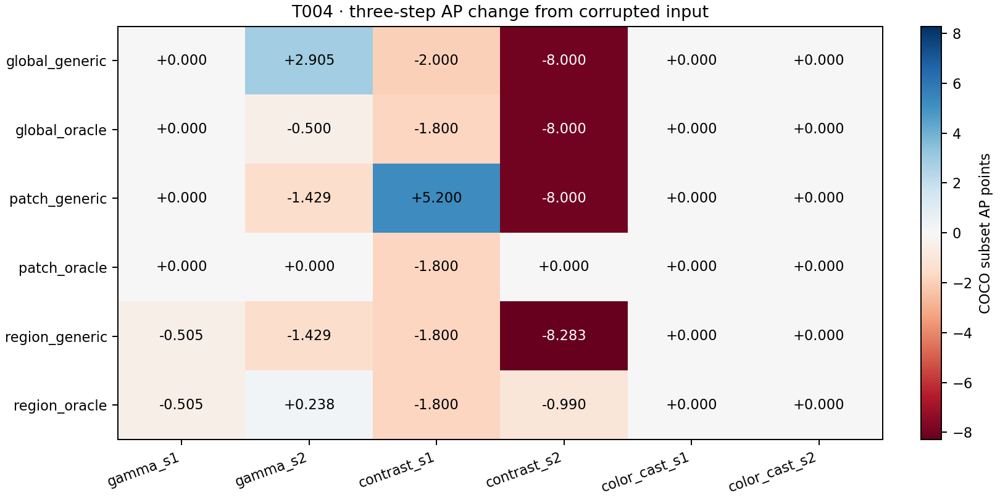

# T004 spatial CLIP fixed-subset results

Source 681ea1b;2 images/72 observations;smoke=2.

Same text banks, last-layer post-LN/projected normalized7x7 tokens, global8D ISP,lr0.1,K3. Detector regions come only from original inference:score>=0.5,top20,overlap weights,uniform fallback. Oracle family directions and annotated losses exist only in analysis. Patch tokens remain contextualized by global self-attention; this tests token readout, not independent local receptive fields.

## AP1 / AP3 (0–100 subset points)

| Case | Corrupted | Global generic | Global oracle | Uniform generic | Uniform oracle | Region generic | Region oracle |
|---|---:|---:|---:|---:|---:|---:|---:|
| gamma_s1 | 39.059 | 39.059 / 39.059 | 39.059 / 39.059 | 39.059 / 39.059 | 39.059 / 39.059 | 39.059 / 38.554 | 39.059 / 38.554 |
| gamma_s2 | 33.478 | 33.216 / 36.383 | 33.216 / 32.978 | 33.478 / 32.050 | 32.978 / 33.478 | 32.050 / 32.050 | 32.978 / 33.716 |
| contrast_s1 | 50.850 | 48.850 / 48.850 | 49.050 / 49.050 | 49.050 / 56.050 | 49.050 / 49.050 | 49.050 / 49.050 | 49.050 / 49.050 |
| contrast_s2 | 50.362 | 42.739 / 42.362 | 42.362 / 42.362 | 50.362 / 42.362 | 50.362 / 50.362 | 42.079 / 42.079 | 50.362 / 49.372 |
| color_cast_s1 | 44.554 | 44.554 / 44.554 | 44.554 / 44.554 | 44.554 / 44.554 | 44.554 / 44.554 | 44.554 / 44.554 | 44.554 / 44.554 |
| color_cast_s2 | 54.545 | 54.545 / 54.545 | 54.545 / 54.545 | 54.545 / 54.545 | 54.545 / 54.545 | 54.545 / 54.545 | 54.545 / 54.545 |

## Paired AP differences versus global-generic

Same fixed image IDs; subset AP differences, no AP bootstrap. AP is not a mean of per-image AP.

| Case | Variant | ΔAP1 | ΔAP3 |
|---|---|---:|---:|
| gamma_s1 | global_generic | +0.000 | +0.000 |
| gamma_s1 | global_oracle | +0.000 | +0.000 |
| gamma_s1 | patch_generic | +0.000 | +0.000 |
| gamma_s1 | patch_oracle | +0.000 | +0.000 |
| gamma_s1 | region_generic | +0.000 | -0.505 |
| gamma_s1 | region_oracle | +0.000 | -0.505 |
| gamma_s2 | global_generic | +0.000 | +0.000 |
| gamma_s2 | global_oracle | +0.000 | -3.405 |
| gamma_s2 | patch_generic | +0.262 | -4.333 |
| gamma_s2 | patch_oracle | -0.238 | -2.905 |
| gamma_s2 | region_generic | -1.167 | -4.333 |
| gamma_s2 | region_oracle | -0.238 | -2.667 |
| contrast_s1 | global_generic | +0.000 | +0.000 |
| contrast_s1 | global_oracle | +0.200 | +0.200 |
| contrast_s1 | patch_generic | +0.200 | +7.200 |
| contrast_s1 | patch_oracle | +0.200 | +0.200 |
| contrast_s1 | region_generic | +0.200 | +0.200 |
| contrast_s1 | region_oracle | +0.200 | +0.200 |
| contrast_s2 | global_generic | +0.000 | +0.000 |
| contrast_s2 | global_oracle | -0.377 | +0.000 |
| contrast_s2 | patch_generic | +7.623 | +0.000 |
| contrast_s2 | patch_oracle | +7.623 | +8.000 |
| contrast_s2 | region_generic | -0.660 | -0.283 |
| contrast_s2 | region_oracle | +7.623 | +7.010 |
| color_cast_s1 | global_generic | +0.000 | +0.000 |
| color_cast_s1 | global_oracle | +0.000 | +0.000 |
| color_cast_s1 | patch_generic | +0.000 | +0.000 |
| color_cast_s1 | patch_oracle | +0.000 | +0.000 |
| color_cast_s1 | region_generic | +0.000 | +0.000 |
| color_cast_s1 | region_oracle | +0.000 | +0.000 |
| color_cast_s2 | global_generic | +0.000 | +0.000 |
| color_cast_s2 | global_oracle | +0.000 | +0.000 |
| color_cast_s2 | patch_generic | +0.000 | +0.000 |
| color_cast_s2 | patch_oracle | +0.000 | +0.000 |
| color_cast_s2 | region_generic | +0.000 | +0.000 |
| color_cast_s2 | region_oracle | +0.000 | +0.000 |

## Primary raw-gradient and paired task behavior

95% image-cluster percentile intervals:2000 paired draws,seed20260912. All six conditions remain together for each image overall. Exploratory intervals, no multiplicity adjustment.

| Group | Variant | Gradient norm | Mean / median cosine | Positive | Loss benefit | Δcosine [95% CI] | Δbenefit pp [95% CI] | Δloss [95% CI] |
|---|---|---:|---:|---:|---:|---:|---:|---:|
| overall | global_generic | 0.09408 | 0.0804 / 0.2644 | 58.3% | 50.0% | 0.000 [0.000, 0.000] | 0.000 [0.000, 0.000] | 0.000 [0.000, 0.000] |
| overall | global_oracle | 0.07803 | 0.1517 / 0.3110 | 58.3% | 41.7% | 0.071 [-0.057, 0.199] | -8.333 [-33.333, 16.667] | -0.003 [-0.005, -0.001] |
| overall | patch_generic | 0.02036 | 0.0215 / 0.0521 | 50.0% | 50.0% | -0.059 [-0.550, 0.432] | 0.000 [-33.333, 33.333] | -0.003 [-0.004, -0.002] |
| overall | patch_oracle | 0.02342 | 0.2172 / 0.4107 | 58.3% | 41.7% | 0.137 [-0.374, 0.648] | -8.333 [-16.667, 0.000] | -0.004 [-0.004, -0.004] |
| overall | region_generic | 0.02726 | 0.1215 / 0.3346 | 58.3% | 50.0% | 0.041 [-0.398, 0.480] | 0.000 [0.000, 0.000] | -0.004 [-0.005, -0.003] |
| overall | region_oracle | 0.02966 | 0.2282 / 0.4818 | 66.7% | 58.3% | 0.148 [-0.417, 0.712] | 8.333 [0.000, 16.667] | -0.004 [-0.004, -0.004] |
| gamma_s1 | global_generic | 0.07855 | -0.0829 / -0.0829 | 50.0% | 0.0% | 0.000 [0.000, 0.000] | 0.000 [0.000, 0.000] | 0.000 [0.000, 0.000] |
| gamma_s1 | global_oracle | 0.10411 | -0.0884 / -0.0884 | 50.0% | 0.0% | -0.006 [-0.040, 0.029] | 0.000 [0.000, 0.000] | -0.015 [-0.029, -0.002] |
| gamma_s1 | patch_generic | 0.02123 | -0.6491 / -0.6491 | 0.0% | 100.0% | -0.566 [-1.246, 0.113] | 100.000 [100.000, 100.000] | -0.028 [-0.038, -0.018] |
| gamma_s1 | patch_oracle | 0.01797 | -0.3890 / -0.3890 | 0.0% | 50.0% | -0.306 [-0.796, 0.184] | 50.000 [0.000, 100.000] | -0.028 [-0.045, -0.011] |
| gamma_s1 | region_generic | 0.02633 | -0.5420 / -0.5420 | 0.0% | 100.0% | -0.459 [-1.081, 0.163] | 100.000 [100.000, 100.000] | -0.026 [-0.031, -0.021] |
| gamma_s1 | region_oracle | 0.02243 | -0.5056 / -0.5056 | 0.0% | 100.0% | -0.423 [-1.188, 0.342] | 100.000 [100.000, 100.000] | -0.030 [-0.039, -0.021] |
| gamma_s2 | global_generic | 0.04772 | 0.0044 / 0.0044 | 50.0% | 0.0% | 0.000 [0.000, 0.000] | 0.000 [0.000, 0.000] | 0.000 [0.000, 0.000] |
| gamma_s2 | global_oracle | 0.05855 | 0.0554 / 0.0554 | 50.0% | 50.0% | 0.051 [-0.275, 0.376] | 50.000 [0.000, 100.000] | -0.012 [-0.019, -0.004] |
| gamma_s2 | patch_generic | 0.01536 | 0.5134 / 0.5134 | 100.0% | 50.0% | 0.509 [-0.407, 1.425] | 50.000 [0.000, 100.000] | -0.006 [-0.008, -0.005] |
| gamma_s2 | patch_oracle | 0.03598 | 0.4450 / 0.4450 | 100.0% | 50.0% | 0.441 [-0.325, 1.206] | 50.000 [0.000, 100.000] | -0.011 [-0.018, -0.005] |
| gamma_s2 | region_generic | 0.01578 | 0.8134 / 0.8134 | 100.0% | 0.0% | 0.809 [-0.067, 1.685] | 0.000 [0.000, 0.000] | -0.005 [-0.013, 0.004] |
| gamma_s2 | region_oracle | 0.04080 | 0.6168 / 0.6168 | 100.0% | 50.0% | 0.612 [-0.319, 1.543] | 50.000 [0.000, 100.000] | -0.012 [-0.015, -0.008] |
| contrast_s1 | global_generic | 0.08054 | 0.0036 / 0.0036 | 50.0% | 100.0% | 0.000 [0.000, 0.000] | 0.000 [0.000, 0.000] | 0.000 [0.000, 0.000] |
| contrast_s1 | global_oracle | 0.06718 | 0.3027 / 0.3027 | 50.0% | 50.0% | 0.299 [0.238, 0.360] | -50.000 [-100.000, 0.000] | 0.008 [0.001, 0.016] |
| contrast_s1 | patch_generic | 0.03052 | -0.0115 / -0.0115 | 50.0% | 50.0% | -0.015 [-0.962, 0.932] | -50.000 [-100.000, 0.000] | 0.002 [-0.012, 0.017] |
| contrast_s1 | patch_oracle | 0.03512 | 0.2027 / 0.2027 | 50.0% | 50.0% | 0.199 [-0.592, 0.990] | -50.000 [-100.000, 0.000] | 0.004 [-0.016, 0.024] |
| contrast_s1 | region_generic | 0.03402 | 0.3713 / 0.3713 | 100.0% | 0.0% | 0.368 [-0.205, 0.940] | -100.000 [-100.000, -100.000] | 0.013 [0.003, 0.024] |
| contrast_s1 | region_oracle | 0.04426 | 0.4913 / 0.4913 | 100.0% | 0.0% | 0.488 [-0.024, 1.000] | -100.000 [-100.000, -100.000] | 0.019 [0.013, 0.025] |
| contrast_s2 | global_generic | 0.15981 | 0.1224 / 0.1224 | 50.0% | 50.0% | 0.000 [0.000, 0.000] | 0.000 [0.000, 0.000] | 0.000 [0.000, 0.000] |
| contrast_s2 | global_oracle | 0.11251 | 0.3226 / 0.3226 | 50.0% | 50.0% | 0.200 [0.111, 0.290] | 0.000 [0.000, 0.000] | -0.004 [-0.005, -0.003] |
| contrast_s2 | patch_generic | 0.02395 | -0.7064 / -0.7064 | 0.0% | 0.0% | -0.829 [-1.076, -0.582] | -50.000 [-100.000, 0.000] | 0.008 [0.000, 0.016] |
| contrast_s2 | patch_oracle | 0.01629 | 0.1452 / 0.1452 | 50.0% | 50.0% | 0.023 [-0.614, 0.660] | 0.000 [-100.000, 100.000] | -0.000 [-0.006, 0.006] |
| contrast_s2 | region_generic | 0.05006 | -0.6923 / -0.6923 | 0.0% | 100.0% | -0.815 [-1.142, -0.487] | 50.000 [0.000, 100.000] | -0.013 [-0.020, -0.006] |
| contrast_s2 | region_oracle | 0.04133 | -0.0804 / -0.0804 | 50.0% | 100.0% | -0.203 [-1.155, 0.749] | 50.000 [0.000, 100.000] | -0.009 [-0.014, -0.004] |
| color_cast_s1 | global_generic | 0.08610 | 0.4263 / 0.4263 | 100.0% | 50.0% | 0.000 [0.000, 0.000] | 0.000 [0.000, 0.000] | 0.000 [0.000, 0.000] |
| color_cast_s1 | global_oracle | 0.05026 | 0.4443 / 0.4443 | 100.0% | 0.0% | 0.018 [-0.291, 0.327] | -50.000 [-100.000, 0.000] | 0.008 [0.004, 0.012] |
| color_cast_s1 | patch_generic | 0.00926 | 0.6532 / 0.6532 | 100.0% | 50.0% | 0.227 [0.002, 0.452] | 0.000 [-100.000, 100.000] | 0.003 [-0.002, 0.008] |
| color_cast_s1 | patch_oracle | 0.00914 | 0.5899 / 0.5899 | 100.0% | 0.0% | 0.164 [-0.300, 0.627] | -50.000 [-100.000, 0.000] | 0.010 [0.002, 0.018] |
| color_cast_s1 | region_generic | 0.01134 | 0.5094 / 0.5094 | 100.0% | 0.0% | 0.083 [-0.179, 0.345] | -50.000 [-100.000, 0.000] | 0.008 [0.008, 0.008] |
| color_cast_s1 | region_oracle | 0.00963 | 0.5605 / 0.5605 | 100.0% | 0.0% | 0.134 [-0.094, 0.363] | -50.000 [-100.000, 0.000] | 0.006 [0.004, 0.009] |
| color_cast_s2 | global_generic | 0.11179 | 0.0088 / 0.0088 | 50.0% | 100.0% | 0.000 [0.000, 0.000] | 0.000 [0.000, 0.000] | 0.000 [0.000, 0.000] |
| color_cast_s2 | global_oracle | 0.07556 | -0.1262 / -0.1262 | 50.0% | 100.0% | -0.135 [-0.384, 0.114] | 0.000 [0.000, 0.000] | -0.003 [-0.004, -0.001] |
| color_cast_s2 | patch_generic | 0.02187 | 0.3294 / 0.3294 | 50.0% | 50.0% | 0.321 [0.253, 0.388] | -50.000 [-100.000, 0.000] | 0.001 [-0.003, 0.006] |
| color_cast_s2 | patch_oracle | 0.02601 | 0.3094 / 0.3094 | 50.0% | 50.0% | 0.301 [0.220, 0.381] | -50.000 [-100.000, 0.000] | 0.003 [0.003, 0.003] |
| color_cast_s2 | region_generic | 0.02602 | 0.2694 / 0.2694 | 50.0% | 100.0% | 0.261 [0.235, 0.286] | 0.000 [0.000, 0.000] | -0.001 [-0.001, -0.001] |
| color_cast_s2 | region_oracle | 0.01951 | 0.2865 / 0.2865 | 50.0% | 100.0% | 0.278 [0.277, 0.279] | 0.000 [0.000, 0.000] | 0.000 [-0.000, 0.000] |

## Direction-only norm-matched one-step diagnostic

Each gradient is rescaled to that image/case global-generic gradient norm. Primary fixed-lr results above are unchanged. Scaling uses no annotated gradient or label.

| Group | Variant | Benefit | Mean detector Δloss | Δbenefit pp [95% CI] | Δloss [95% CI] | Taylor sign match | Taylor Spearman |
|---|---|---:|---:|---:|---:|---:|---:|
| overall | global_generic | 50.0% | 0.004615 | 0.000 [0.000, 0.000] | 0.000 [0.000, 0.000] | 58.3% | 0.5385 |
| overall | global_oracle | 50.0% | 0.001366 | 0.000 [-16.667, 16.667] | -0.003 [-0.005, -0.002] | 75.0% | 0.4336 |
| overall | patch_generic | 50.0% | 0.002200 | 0.000 [-33.333, 33.333] | -0.002 [-0.005, 0.000] | 33.3% | 0.0070 |
| overall | patch_oracle | 33.3% | 0.003752 | -16.667 [-16.667, -16.667] | -0.001 [-0.003, 0.002] | 41.7% | -0.2308 |
| overall | region_generic | 50.0% | 0.001150 | 0.000 [-16.667, 16.667] | -0.003 [-0.007, 0.001] | 41.7% | -0.0350 |
| overall | region_oracle | 66.7% | -0.005913 | 16.667 [0.000, 33.333] | -0.011 [-0.014, -0.007] | 33.3% | -0.6503 |
| gamma_s1 | global_generic | 0.0% | 0.023685 | 0.000 [0.000, 0.000] | 0.000 [0.000, 0.000] | 50.0% | 1.0000 |
| gamma_s1 | global_oracle | 0.0% | 0.021941 | 0.000 [0.000, 0.000] | -0.002 [-0.002, -0.001] | 50.0% | 1.0000 |
| gamma_s1 | patch_generic | 50.0% | 0.001826 | 50.000 [0.000, 100.000] | -0.022 [-0.022, -0.021] | 50.0% | 1.0000 |
| gamma_s1 | patch_oracle | 0.0% | 0.011769 | 0.000 [0.000, 0.000] | -0.012 [-0.029, 0.005] | 100.0% | -1.0000 |
| gamma_s1 | region_generic | 50.0% | 0.003814 | 50.000 [0.000, 100.000] | -0.020 [-0.022, -0.018] | 50.0% | 1.0000 |
| gamma_s1 | region_oracle | 100.0% | -0.013245 | 100.000 [100.000, 100.000] | -0.037 [-0.054, -0.020] | 0.0% | -1.0000 |
| gamma_s2 | global_generic | 0.0% | 0.016002 | 0.000 [0.000, 0.000] | 0.000 [0.000, 0.000] | 50.0% | 1.0000 |
| gamma_s2 | global_oracle | 50.0% | -0.002467 | 50.000 [0.000, 100.000] | -0.018 [-0.027, -0.010] | 100.0% | 1.0000 |
| gamma_s2 | patch_generic | 50.0% | 0.012408 | 50.000 [0.000, 100.000] | -0.004 [-0.005, -0.002] | 50.0% | -1.0000 |
| gamma_s2 | patch_oracle | 0.0% | 0.016927 | 0.000 [0.000, 0.000] | 0.001 [-0.004, 0.006] | 0.0% | -1.0000 |
| gamma_s2 | region_generic | 0.0% | 0.006203 | 0.000 [0.000, 0.000] | -0.010 [-0.019, -0.000] | 0.0% | -1.0000 |
| gamma_s2 | region_oracle | 50.0% | 0.002158 | 50.000 [0.000, 100.000] | -0.014 [-0.022, -0.005] | 50.0% | -1.0000 |
| contrast_s1 | global_generic | 100.0% | -0.003242 | 0.000 [0.000, 0.000] | 0.000 [0.000, 0.000] | 50.0% | -1.0000 |
| contrast_s1 | global_oracle | 50.0% | -0.001303 | -50.000 [-100.000, 0.000] | 0.002 [-0.013, 0.017] | 100.0% | 1.0000 |
| contrast_s1 | patch_generic | 50.0% | 0.005245 | -50.000 [-100.000, 0.000] | 0.008 [0.002, 0.015] | 0.0% | -1.0000 |
| contrast_s1 | patch_oracle | 50.0% | -0.008002 | -50.000 [-100.000, 0.000] | -0.005 [-0.012, 0.003] | 100.0% | 1.0000 |
| contrast_s1 | region_generic | 50.0% | 0.005288 | -50.000 [-100.000, 0.000] | 0.009 [0.000, 0.017] | 50.0% | -1.0000 |
| contrast_s1 | region_oracle | 100.0% | -0.006911 | 0.000 [0.000, 0.000] | -0.004 [-0.008, 0.001] | 100.0% | 1.0000 |
| contrast_s2 | global_generic | 50.0% | -0.000874 | 0.000 [0.000, 0.000] | 0.000 [0.000, 0.000] | 100.0% | 1.0000 |
| contrast_s2 | global_oracle | 50.0% | -0.008736 | 0.000 [0.000, 0.000] | -0.008 [-0.021, 0.005] | 100.0% | 1.0000 |
| contrast_s2 | patch_generic | 50.0% | 0.006124 | 0.000 [0.000, 0.000] | 0.007 [0.002, 0.012] | 50.0% | 1.0000 |
| contrast_s2 | patch_oracle | 50.0% | 0.001744 | 0.000 [0.000, 0.000] | 0.003 [-0.005, 0.010] | 0.0% | -1.0000 |
| contrast_s2 | region_generic | 50.0% | 0.003927 | 0.000 [0.000, 0.000] | 0.005 [-0.013, 0.023] | 50.0% | 1.0000 |
| contrast_s2 | region_oracle | 50.0% | -0.010635 | 0.000 [0.000, 0.000] | -0.010 [-0.019, -0.001] | 0.0% | -1.0000 |
| color_cast_s1 | global_generic | 50.0% | -0.002440 | 0.000 [0.000, 0.000] | 0.000 [0.000, 0.000] | 50.0% | -1.0000 |
| color_cast_s1 | global_oracle | 50.0% | 0.005675 | 0.000 [0.000, 0.000] | 0.008 [0.001, 0.015] | 50.0% | 1.0000 |
| color_cast_s1 | patch_generic | 0.0% | 0.001718 | -50.000 [-100.000, 0.000] | 0.004 [0.001, 0.007] | 0.0% | 1.0000 |
| color_cast_s1 | patch_oracle | 0.0% | 0.012704 | -50.000 [-100.000, 0.000] | 0.015 [0.014, 0.016] | 0.0% | 1.0000 |
| color_cast_s1 | region_generic | 50.0% | 0.001612 | 0.000 [0.000, 0.000] | 0.004 [0.002, 0.006] | 50.0% | 1.0000 |
| color_cast_s1 | region_oracle | 0.0% | 0.005590 | -50.000 [-100.000, 0.000] | 0.008 [0.005, 0.011] | 0.0% | 1.0000 |
| color_cast_s2 | global_generic | 100.0% | -0.005441 | 0.000 [0.000, 0.000] | 0.000 [0.000, 0.000] | 50.0% | 1.0000 |
| color_cast_s2 | global_oracle | 100.0% | -0.006910 | 0.000 [0.000, 0.000] | -0.001 [-0.005, 0.002] | 50.0% | -1.0000 |
| color_cast_s2 | patch_generic | 100.0% | -0.014121 | 0.000 [0.000, 0.000] | -0.009 [-0.010, -0.008] | 50.0% | 1.0000 |
| color_cast_s2 | patch_oracle | 100.0% | -0.012627 | 0.000 [0.000, 0.000] | -0.007 [-0.012, -0.002] | 50.0% | 1.0000 |
| color_cast_s2 | region_generic | 100.0% | -0.013944 | 0.000 [0.000, 0.000] | -0.009 [-0.015, -0.002] | 50.0% | 1.0000 |
| color_cast_s2 | region_oracle | 100.0% | -0.012437 | 0.000 [0.000, 0.000] | -0.007 [-0.008, -0.006] | 50.0% | 1.0000 |

## Region weighting versus uniform with the same text direction

| Group | Variant | Δcosine [95% CI] | Δbenefit pp [95% CI] | Δloss [95% CI] |
|---|---|---:|---:|---:|
| overall | region_generic | 0.100 [0.048, 0.152] | 0.000 [-33.333, 33.333] | -0.001 [-0.001, -0.001] |
| overall | region_oracle | 0.011 [-0.042, 0.064] | 16.667 [16.667, 16.667] | -0.000 [-0.001, -0.000] |
| gamma_s1 | region_generic | 0.107 [0.050, 0.164] | 0.000 [0.000, 0.000] | 0.002 [-0.003, 0.007] |
| gamma_s1 | region_oracle | -0.117 [-0.391, 0.158] | 50.000 [0.000, 100.000] | -0.002 [-0.010, 0.006] |
| gamma_s2 | region_generic | 0.300 [0.260, 0.340] | -50.000 [-100.000, 0.000] | 0.002 [-0.006, 0.009] |
| gamma_s2 | region_oracle | 0.172 [0.006, 0.338] | 0.000 [0.000, 0.000] | -0.000 [-0.003, 0.003] |
| contrast_s1 | region_generic | 0.383 [0.008, 0.757] | -50.000 [-100.000, 0.000] | 0.011 [0.007, 0.014] |
| contrast_s1 | region_oracle | 0.289 [0.010, 0.567] | -50.000 [-100.000, 0.000] | 0.015 [0.001, 0.028] |
| contrast_s2 | region_generic | 0.014 [-0.066, 0.094] | 100.000 [100.000, 100.000] | -0.022 [-0.037, -0.007] |
| contrast_s2 | region_oracle | -0.226 [-0.540, 0.089] | 50.000 [0.000, 100.000] | -0.009 [-0.019, 0.002] |
| color_cast_s1 | region_generic | -0.144 [-0.181, -0.107] | -50.000 [-100.000, 0.000] | 0.006 [0.001, 0.011] |
| color_cast_s1 | region_oracle | -0.029 [-0.265, 0.206] | 0.000 [0.000, 0.000] | -0.004 [-0.010, 0.003] |
| color_cast_s2 | region_generic | -0.060 [-0.102, -0.018] | 50.000 [0.000, 100.000] | -0.002 [-0.007, 0.002] |
| color_cast_s2 | region_oracle | -0.023 [-0.102, 0.057] | 50.000 [0.000, 100.000] | -0.003 [-0.003, -0.002] |

## Patch support and contribution

Object support is any positive predicted-box overlap in the CLIP crop, not GT objects. Region background loss is zero by construction except empty-region uniform fallback. Gradient partitions are recomputed for analysis, so numerical residuals are retained instead of assuming bitwise equality.

| Group | Variant | Object support | Fallback | Effective patches | Weighted fraction | Object / background grad norm | Object / background loss3 |
|---|---|---:|---:|---:|---:|---:|---:|
| overall | patch_generic | 75.3% | 0.0% | 49.00 | 100.0% | 0.01962 / 0.00540 | -0.00008 / -0.00001 |
| overall | patch_oracle | 75.3% | 0.0% | 49.00 | 100.0% | 0.02157 / 0.00781 | -0.00013 / -0.00003 |
| overall | region_generic | 75.3% | 0.0% | 31.35 | 75.3% | 0.02726 / 0.00000 | -0.00015 / 0.00000 |
| overall | region_oracle | 75.3% | 0.0% | 31.35 | 75.3% | 0.02966 / 0.00000 | -0.00022 / 0.00000 |
| gamma_s1 | patch_generic | 79.6% | 0.0% | 49.00 | 100.0% | 0.02015 / 0.00360 | -0.00010 / -0.00001 |
| gamma_s1 | patch_oracle | 79.6% | 0.0% | 49.00 | 100.0% | 0.01647 / 0.00381 | -0.00008 / -0.00001 |
| gamma_s1 | region_generic | 79.6% | 0.0% | 32.63 | 79.6% | 0.02633 / 0.00000 | -0.00018 / 0.00000 |
| gamma_s1 | region_oracle | 79.6% | 0.0% | 32.63 | 79.6% | 0.02243 / 0.00000 | -0.00016 / 0.00000 |
| gamma_s2 | patch_generic | 79.6% | 0.0% | 49.00 | 100.0% | 0.01737 / 0.00663 | -0.00007 / -0.00000 |
| gamma_s2 | patch_oracle | 79.6% | 0.0% | 49.00 | 100.0% | 0.03242 / 0.00406 | -0.00038 / -0.00005 |
| gamma_s2 | region_generic | 79.6% | 0.0% | 32.26 | 79.6% | 0.01578 / 0.00000 | -0.00007 / 0.00000 |
| gamma_s2 | region_oracle | 79.6% | 0.0% | 32.26 | 79.6% | 0.04080 / 0.00000 | -0.00050 / 0.00000 |
| contrast_s1 | patch_generic | 75.5% | 0.0% | 49.00 | 100.0% | 0.02600 / 0.00621 | -0.00008 / -0.00002 |
| contrast_s1 | patch_oracle | 75.5% | 0.0% | 49.00 | 100.0% | 0.03671 / 0.00775 | -0.00014 / -0.00001 |
| contrast_s1 | region_generic | 75.5% | 0.0% | 30.76 | 75.5% | 0.03402 / 0.00000 | -0.00010 / 0.00000 |
| contrast_s1 | region_oracle | 75.5% | 0.0% | 30.76 | 75.5% | 0.04426 / 0.00000 | -0.00019 / 0.00000 |
| contrast_s2 | patch_generic | 75.5% | 0.0% | 49.00 | 100.0% | 0.02987 / 0.00594 | -0.00009 / 0.00002 |
| contrast_s2 | patch_oracle | 75.5% | 0.0% | 49.00 | 100.0% | 0.02469 / 0.01255 | -0.00010 / 0.00001 |
| contrast_s2 | region_generic | 75.5% | 0.0% | 33.01 | 75.5% | 0.05006 / 0.00000 | -0.00026 / 0.00000 |
| contrast_s2 | region_oracle | 75.5% | 0.0% | 33.01 | 75.5% | 0.04133 / 0.00000 | -0.00027 / 0.00000 |
| color_cast_s1 | patch_generic | 74.5% | 0.0% | 49.00 | 100.0% | 0.00902 / 0.00175 | -0.00002 / -0.00000 |
| color_cast_s1 | patch_oracle | 74.5% | 0.0% | 49.00 | 100.0% | 0.00699 / 0.00351 | -0.00001 / -0.00001 |
| color_cast_s1 | region_generic | 74.5% | 0.0% | 31.70 | 74.5% | 0.01134 / 0.00000 | -0.00003 / 0.00000 |
| color_cast_s1 | region_oracle | 74.5% | 0.0% | 31.70 | 74.5% | 0.00963 / 0.00000 | -0.00007 / 0.00000 |
| color_cast_s2 | patch_generic | 67.3% | 0.0% | 49.00 | 100.0% | 0.01533 / 0.00826 | -0.00010 / -0.00007 |
| color_cast_s2 | patch_oracle | 67.3% | 0.0% | 49.00 | 100.0% | 0.01210 / 0.01517 | -0.00009 / -0.00012 |
| color_cast_s2 | region_generic | 67.3% | 0.0% | 27.73 | 67.3% | 0.02602 / 0.00000 | -0.00023 / 0.00000 |
| color_cast_s2 | region_oracle | 67.3% | 0.0% | 27.73 | 67.3% | 0.01951 / 0.00000 | -0.00013 / 0.00000 |

## Loss, saturation and measured runtime

Deploy latency adds one original detector inference/map for region variants; the same inference is used only as an excluded analysis diagnostic for global/uniform variants. All adaptation timing includes diagnostics/synchronization and excludes annotated loss/AP/norm-matched/partition work.

| Group | Variant | Own loss1 / loss3 | Own loss3 decreases | Sat0 / Sat1 / Sat3 | Adapt / deploy seconds3 | Peak MiB |
|---|---|---:|---:|---:|---:|---:|
| overall | global_generic | -0.00049 / -0.00106 | 91.7% | 2.23% / 0.41% / 0.90% | 0.1013 / 0.1013 | 833.3 |
| overall | global_oracle | -0.00020 / -0.00054 | 83.3% | 2.23% / 0.61% / 0.24% | 0.0852 / 0.0852 | 833.9 |
| overall | patch_generic | -0.00004 / -0.00009 | 100.0% | 2.23% / 0.19% / 0.13% | 0.1054 / 0.1054 | 834.0 |
| overall | patch_oracle | -0.00007 / -0.00017 | 100.0% | 2.23% / 0.15% / 0.15% | 0.1103 / 0.1103 | 834.0 |
| overall | region_generic | -0.00008 / -0.00015 | 100.0% | 2.23% / 0.21% / 0.12% | 0.0823 / 0.1901 | 834.0 |
| overall | region_oracle | -0.00011 / -0.00022 | 100.0% | 2.23% / 0.57% / 0.55% | 0.0755 / 0.1833 | 834.0 |
| gamma_s1 | global_generic | -0.00047 / -0.00077 | 100.0% | 0.89% / 0.63% / 0.71% | 0.1038 / 0.1038 | 830.3 |
| gamma_s1 | global_oracle | -0.00075 / -0.00133 | 100.0% | 0.89% / 0.51% / 0.68% | 0.0720 / 0.0720 | 834.1 |
| gamma_s1 | patch_generic | -0.00005 / -0.00011 | 100.0% | 0.89% / 0.46% / 0.35% | 0.0958 / 0.0958 | 834.2 |
| gamma_s1 | patch_oracle | -0.00004 / -0.00010 | 100.0% | 0.89% / 0.32% / 0.32% | 0.1090 / 0.1090 | 834.2 |
| gamma_s1 | region_generic | -0.00006 / -0.00018 | 100.0% | 0.89% / 0.40% / 0.18% | 0.0925 / 0.5931 | 834.2 |
| gamma_s1 | region_oracle | -0.00005 / -0.00016 | 100.0% | 0.89% / 0.40% / 0.35% | 0.0725 / 0.5731 | 834.0 |
| gamma_s2 | global_generic | -0.00027 / -0.00086 | 100.0% | 1.09% / 1.57% / 4.40% | 0.1045 / 0.1045 | 833.9 |
| gamma_s2 | global_oracle | -0.00024 / -0.00067 | 100.0% | 1.09% / 0.36% / 0.36% | 0.0931 / 0.0931 | 833.9 |
| gamma_s2 | patch_generic | -0.00002 / -0.00008 | 100.0% | 1.09% / 0.27% / 0.00% | 0.1127 / 0.1127 | 834.0 |
| gamma_s2 | patch_oracle | -0.00018 / -0.00043 | 100.0% | 1.09% / 0.27% / 0.27% | 0.1142 / 0.1142 | 834.0 |
| gamma_s2 | region_generic | -0.00002 / -0.00007 | 100.0% | 1.09% / 0.53% / 0.27% | 0.0725 / 0.1016 | 834.0 |
| gamma_s2 | region_oracle | -0.00022 / -0.00050 | 100.0% | 1.09% / 0.10% / 0.10% | 0.0722 / 0.1013 | 834.0 |
| contrast_s1 | global_generic | -0.00058 / -0.00101 | 100.0% | 0.00% / 0.00% / 0.00% | 0.1029 / 0.1029 | 833.9 |
| contrast_s1 | global_oracle | -0.00025 / 0.00027 | 50.0% | 0.00% / 0.00% / 0.00% | 0.0716 / 0.0716 | 833.9 |
| contrast_s1 | patch_generic | -0.00008 / -0.00010 | 100.0% | 0.00% / 0.00% / 0.00% | 0.1065 / 0.1065 | 834.0 |
| contrast_s1 | patch_oracle | -0.00012 / -0.00015 | 100.0% | 0.00% / 0.00% / 0.00% | 0.1097 / 0.1097 | 834.0 |
| contrast_s1 | region_generic | -0.00009 / -0.00010 | 100.0% | 0.00% / 0.00% / 0.00% | 0.0925 / 0.1217 | 834.0 |
| contrast_s1 | region_oracle | -0.00015 / -0.00019 | 100.0% | 0.00% / 0.00% / 0.00% | 0.0924 / 0.1217 | 834.0 |
| contrast_s2 | global_generic | 0.00048 / -0.00016 | 50.0% | 0.00% / 0.00% / 0.00% | 0.1090 / 0.1090 | 833.9 |
| contrast_s2 | global_oracle | 0.00088 / 0.00042 | 50.0% | 0.00% / 0.00% / 0.00% | 0.0974 / 0.0974 | 833.9 |
| contrast_s2 | patch_generic | -0.00004 / -0.00006 | 100.0% | 0.00% / 0.00% / 0.00% | 0.1142 / 0.1142 | 834.0 |
| contrast_s2 | patch_oracle | -0.00002 / -0.00008 | 100.0% | 0.00% / 0.00% / 0.00% | 0.1133 / 0.1133 | 834.0 |
| contrast_s2 | region_generic | -0.00022 / -0.00026 | 100.0% | 0.00% / 0.00% / 0.00% | 0.0721 / 0.1013 | 834.0 |
| contrast_s2 | region_oracle | -0.00021 / -0.00027 | 100.0% | 0.00% / 0.00% / 0.00% | 0.0719 / 0.1011 | 834.0 |
| color_cast_s1 | global_generic | -0.00076 / -0.00155 | 100.0% | 4.54% / 0.15% / 0.16% | 0.1013 / 0.1013 | 833.9 |
| color_cast_s1 | global_oracle | -0.00024 / -0.00066 | 100.0% | 4.54% / 2.65% / 0.27% | 0.0920 / 0.0920 | 833.9 |
| color_cast_s1 | patch_generic | -0.00001 / -0.00002 | 100.0% | 4.54% / 0.21% / 0.21% | 0.1136 / 0.1136 | 834.0 |
| color_cast_s1 | patch_oracle | -0.00001 / -0.00002 | 100.0% | 4.54% / 0.21% / 0.21% | 0.1118 / 0.1118 | 834.0 |
| color_cast_s1 | region_generic | -0.00002 / -0.00003 | 100.0% | 4.54% / 0.16% / 0.11% | 0.0732 / 0.1025 | 834.0 |
| color_cast_s1 | region_oracle | -0.00001 / -0.00007 | 100.0% | 4.54% / 2.79% / 2.74% | 0.0719 / 0.1012 | 834.0 |
| color_cast_s2 | global_generic | -0.00131 / -0.00201 | 100.0% | 6.86% / 0.11% / 0.15% | 0.0864 / 0.0864 | 833.9 |
| color_cast_s2 | global_oracle | -0.00059 / -0.00127 | 100.0% | 6.86% / 0.11% / 0.11% | 0.0851 / 0.0851 | 833.9 |
| color_cast_s2 | patch_generic | -0.00006 / -0.00017 | 100.0% | 6.86% / 0.21% / 0.21% | 0.0896 / 0.0896 | 834.0 |
| color_cast_s2 | patch_oracle | -0.00007 / -0.00022 | 100.0% | 6.86% / 0.10% / 0.10% | 0.1036 / 0.1036 | 834.0 |
| color_cast_s2 | region_generic | -0.00008 / -0.00023 | 100.0% | 6.86% / 0.16% / 0.16% | 0.0914 / 0.1207 | 834.0 |
| color_cast_s2 | region_oracle | -0.00004 / -0.00013 | 100.0% | 6.86% / 0.11% / 0.11% | 0.0721 / 0.1015 | 834.0 |

Full per-coordinate energy/signed contributions, trajectories, paired positive/saturation/runtime intervals, Taylor distributions, object/background projections and partition errors are in analysis.json and raw samples.jsonl. No negative family or sample is excluded.

