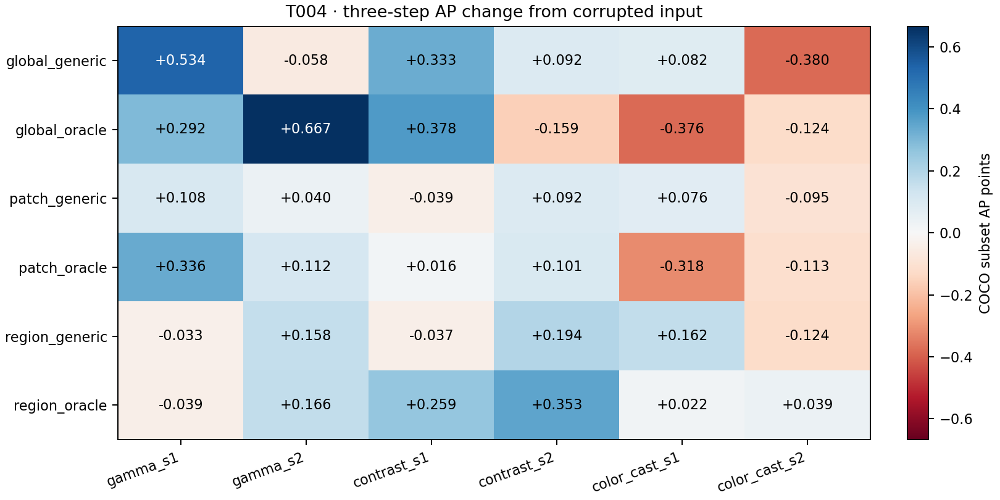

# T004 spatial CLIP fixed-subset results

Source 4817825;200 images/7200 observations;smoke=None.

Same text banks, last-layer post-LN/projected normalized7x7 tokens, global8D ISP,lr0.1,K3. Detector regions come only from original inference:score>=0.5,top20,overlap weights,uniform fallback. Oracle family directions and annotated losses exist only in analysis. Patch tokens remain contextualized by global self-attention; this tests token readout, not independent local receptive fields.

## AP1 / AP3 (0–100 subset points)

| Case | Corrupted | Global generic | Global oracle | Uniform generic | Uniform oracle | Region generic | Region oracle |
|---|---:|---:|---:|---:|---:|---:|---:|
| gamma_s1 | 38.145 | 38.351 / 38.680 | 38.568 / 38.437 | 38.177 / 38.253 | 38.152 / 38.481 | 38.211 / 38.112 | 38.184 / 38.106 |
| gamma_s2 | 36.446 | 36.573 / 36.388 | 36.619 / 37.113 | 36.488 / 36.486 | 36.490 / 36.558 | 36.492 / 36.604 | 36.492 / 36.612 |
| contrast_s1 | 36.175 | 36.369 / 36.508 | 36.301 / 36.553 | 36.154 / 36.136 | 36.212 / 36.191 | 36.172 / 36.138 | 36.315 / 36.434 |
| contrast_s2 | 31.175 | 31.115 / 31.267 | 30.888 / 31.016 | 31.389 / 31.267 | 31.320 / 31.277 | 31.388 / 31.369 | 31.363 / 31.528 |
| color_cast_s1 | 37.642 | 37.668 / 37.724 | 37.274 / 37.266 | 37.399 / 37.718 | 37.349 / 37.324 | 37.738 / 37.804 | 37.688 / 37.664 |
| color_cast_s2 | 35.908 | 35.841 / 35.528 | 35.801 / 35.784 | 35.828 / 35.813 | 35.839 / 35.795 | 35.891 / 35.784 | 35.963 / 35.947 |

## Paired AP differences versus global-generic

Same fixed image IDs; subset AP differences, no AP bootstrap. AP is not a mean of per-image AP.

| Case | Variant | ΔAP1 | ΔAP3 |
|---|---|---:|---:|
| gamma_s1 | global_generic | +0.000 | +0.000 |
| gamma_s1 | global_oracle | +0.217 | -0.243 |
| gamma_s1 | patch_generic | -0.174 | -0.427 |
| gamma_s1 | patch_oracle | -0.199 | -0.199 |
| gamma_s1 | region_generic | -0.140 | -0.568 |
| gamma_s1 | region_oracle | -0.167 | -0.574 |
| gamma_s2 | global_generic | +0.000 | +0.000 |
| gamma_s2 | global_oracle | +0.046 | +0.725 |
| gamma_s2 | patch_generic | -0.085 | +0.098 |
| gamma_s2 | patch_oracle | -0.083 | +0.170 |
| gamma_s2 | region_generic | -0.081 | +0.216 |
| gamma_s2 | region_oracle | -0.081 | +0.224 |
| contrast_s1 | global_generic | +0.000 | +0.000 |
| contrast_s1 | global_oracle | -0.068 | +0.044 |
| contrast_s1 | patch_generic | -0.215 | -0.372 |
| contrast_s1 | patch_oracle | -0.157 | -0.317 |
| contrast_s1 | region_generic | -0.197 | -0.370 |
| contrast_s1 | region_oracle | -0.054 | -0.075 |
| contrast_s2 | global_generic | +0.000 | +0.000 |
| contrast_s2 | global_oracle | -0.227 | -0.251 |
| contrast_s2 | patch_generic | +0.274 | -0.000 |
| contrast_s2 | patch_oracle | +0.204 | +0.010 |
| contrast_s2 | region_generic | +0.273 | +0.102 |
| contrast_s2 | region_oracle | +0.248 | +0.261 |
| color_cast_s1 | global_generic | +0.000 | +0.000 |
| color_cast_s1 | global_oracle | -0.394 | -0.458 |
| color_cast_s1 | patch_generic | -0.268 | -0.006 |
| color_cast_s1 | patch_oracle | -0.318 | -0.399 |
| color_cast_s1 | region_generic | +0.070 | +0.080 |
| color_cast_s1 | region_oracle | +0.020 | -0.060 |
| color_cast_s2 | global_generic | +0.000 | +0.000 |
| color_cast_s2 | global_oracle | -0.041 | +0.256 |
| color_cast_s2 | patch_generic | -0.014 | +0.285 |
| color_cast_s2 | patch_oracle | -0.002 | +0.267 |
| color_cast_s2 | region_generic | +0.050 | +0.256 |
| color_cast_s2 | region_oracle | +0.122 | +0.418 |

## Primary raw-gradient and paired task behavior

95% image-cluster percentile intervals:2000 paired draws,seed20260912. All six conditions remain together for each image overall. Exploratory intervals, no multiplicity adjustment.

| Group | Variant | Gradient norm | Mean / median cosine | Positive | Loss benefit | Δcosine [95% CI] | Δbenefit pp [95% CI] | Δloss [95% CI] |
|---|---|---:|---:|---:|---:|---:|---:|---:|
| overall | global_generic | 0.12575 | 0.0453 / 0.0563 | 53.8% | 47.2% | 0.000 [0.000, 0.000] | 0.000 [0.000, 0.000] | 0.000 [0.000, 0.000] |
| overall | global_oracle | 0.12457 | 0.0707 / 0.1030 | 55.6% | 50.8% | 0.025 [-0.004, 0.055] | 3.667 [0.667, 6.750] | -0.001 [-0.003, 0.000] |
| overall | patch_generic | 0.03470 | 0.0153 / 0.0416 | 51.9% | 48.6% | -0.030 [-0.085, 0.024] | 1.417 [-2.167, 4.919] | -0.002 [-0.004, 0.000] |
| overall | patch_oracle | 0.03510 | 0.0161 / 0.0280 | 51.7% | 48.6% | -0.029 [-0.082, 0.021] | 1.417 [-2.085, 4.750] | -0.001 [-0.003, 0.000] |
| overall | region_generic | 0.04038 | 0.0200 / 0.0451 | 52.8% | 48.8% | -0.025 [-0.079, 0.030] | 1.583 [-1.917, 5.083] | -0.001 [-0.003, 0.001] |
| overall | region_oracle | 0.04179 | 0.0072 / 0.0350 | 51.6% | 49.4% | -0.038 [-0.091, 0.013] | 2.250 [-1.085, 5.669] | -0.002 [-0.003, 0.000] |
| gamma_s1 | global_generic | 0.14766 | 0.0227 / 0.0510 | 53.5% | 44.5% | 0.000 [0.000, 0.000] | 0.000 [0.000, 0.000] | 0.000 [0.000, 0.000] |
| gamma_s1 | global_oracle | 0.16505 | 0.0197 / 0.0354 | 51.0% | 48.0% | -0.003 [-0.072, 0.063] | 3.500 [-4.000, 11.500] | 0.000 [-0.003, 0.004] |
| gamma_s1 | patch_generic | 0.03608 | 0.0448 / 0.0546 | 55.0% | 47.5% | 0.022 [-0.084, 0.126] | 3.000 [-6.000, 12.000] | -0.002 [-0.005, 0.002] |
| gamma_s1 | patch_oracle | 0.03558 | 0.0056 / -0.0147 | 49.0% | 55.0% | -0.017 [-0.120, 0.082] | 10.500 [2.000, 19.000] | -0.003 [-0.007, 0.001] |
| gamma_s1 | region_generic | 0.04171 | -0.0034 / -0.0047 | 49.5% | 50.0% | -0.026 [-0.127, 0.081] | 5.500 [-2.500, 14.000] | -0.002 [-0.006, 0.001] |
| gamma_s1 | region_oracle | 0.04544 | -0.0481 / -0.0691 | 45.5% | 48.5% | -0.071 [-0.168, 0.027] | 4.000 [-4.500, 12.500] | -0.002 [-0.006, 0.002] |
| gamma_s2 | global_generic | 0.14993 | 0.0017 / 0.0144 | 51.0% | 47.5% | 0.000 [0.000, 0.000] | 0.000 [0.000, 0.000] | 0.000 [0.000, 0.000] |
| gamma_s2 | global_oracle | 0.15806 | 0.0625 / 0.1016 | 56.0% | 49.0% | 0.061 [-0.000, 0.123] | 1.500 [-6.500, 9.000] | -0.005 [-0.012, 0.001] |
| gamma_s2 | patch_generic | 0.03409 | 0.0355 / 0.0204 | 50.5% | 48.0% | 0.034 [-0.061, 0.133] | 0.500 [-8.000, 9.000] | -0.006 [-0.014, -0.000] |
| gamma_s2 | patch_oracle | 0.03489 | 0.0327 / 0.0487 | 53.5% | 43.5% | 0.031 [-0.065, 0.130] | -4.000 [-12.000, 4.000] | -0.006 [-0.013, 0.000] |
| gamma_s2 | region_generic | 0.04077 | 0.0471 / 0.0595 | 55.5% | 45.0% | 0.045 [-0.054, 0.145] | -2.500 [-11.000, 5.500] | -0.006 [-0.014, 0.000] |
| gamma_s2 | region_oracle | 0.04544 | 0.0116 / 0.0177 | 52.0% | 43.5% | 0.010 [-0.085, 0.103] | -4.000 [-12.000, 4.000] | -0.005 [-0.012, 0.000] |
| contrast_s1 | global_generic | 0.13914 | 0.1173 / 0.2055 | 60.5% | 54.0% | 0.000 [0.000, 0.000] | 0.000 [0.000, 0.000] | 0.000 [0.000, 0.000] |
| contrast_s1 | global_oracle | 0.13593 | 0.1841 / 0.2504 | 66.0% | 59.5% | 0.067 [0.013, 0.121] | 5.500 [-1.000, 12.500] | -0.000 [-0.004, 0.003] |
| contrast_s1 | patch_generic | 0.03816 | 0.0296 / 0.0771 | 55.0% | 48.5% | -0.088 [-0.205, 0.035] | -5.500 [-14.500, 3.000] | -0.001 [-0.005, 0.003] |
| contrast_s1 | patch_oracle | 0.04060 | 0.0148 / 0.0474 | 51.5% | 51.5% | -0.103 [-0.225, 0.021] | -2.500 [-10.500, 6.000] | -0.000 [-0.004, 0.003] |
| contrast_s1 | region_generic | 0.04591 | 0.0480 / 0.1081 | 55.5% | 52.0% | -0.069 [-0.187, 0.050] | -2.000 [-10.500, 6.500] | 0.002 [-0.003, 0.006] |
| contrast_s1 | region_oracle | 0.04748 | 0.0130 / 0.0729 | 53.5% | 53.5% | -0.104 [-0.230, 0.018] | -0.500 [-9.500, 9.000] | -0.000 [-0.004, 0.003] |
| contrast_s2 | global_generic | 0.13534 | 0.0274 / -0.0076 | 49.5% | 43.5% | 0.000 [0.000, 0.000] | 0.000 [0.000, 0.000] | 0.000 [0.000, 0.000] |
| contrast_s2 | global_oracle | 0.12390 | 0.0974 / 0.1591 | 56.0% | 42.5% | 0.070 [0.010, 0.133] | -1.000 [-8.500, 6.500] | -0.002 [-0.005, 0.002] |
| contrast_s2 | patch_generic | 0.04965 | 0.0467 / 0.1277 | 54.5% | 51.5% | 0.019 [-0.092, 0.135] | 8.000 [-1.000, 17.500] | -0.003 [-0.007, 0.001] |
| contrast_s2 | patch_oracle | 0.05112 | 0.0486 / 0.1234 | 55.0% | 45.5% | 0.021 [-0.088, 0.129] | 2.000 [-7.000, 10.512] | -0.002 [-0.007, 0.003] |
| contrast_s2 | region_generic | 0.05770 | 0.0775 / 0.1937 | 58.0% | 52.0% | 0.050 [-0.062, 0.160] | 8.500 [0.000, 16.500] | -0.003 [-0.007, 0.001] |
| contrast_s2 | region_oracle | 0.05691 | 0.0840 / 0.1936 | 57.5% | 49.0% | 0.057 [-0.049, 0.162] | 5.500 [-3.000, 14.000] | -0.003 [-0.007, 0.002] |
| color_cast_s1 | global_generic | 0.09015 | 0.0446 / 0.0728 | 56.0% | 45.0% | 0.000 [0.000, 0.000] | 0.000 [0.000, 0.000] | 0.000 [0.000, 0.000] |
| color_cast_s1 | global_oracle | 0.08335 | 0.0480 / 0.0983 | 56.0% | 52.5% | 0.003 [-0.050, 0.057] | 7.500 [-0.500, 15.500] | -0.001 [-0.005, 0.002] |
| color_cast_s1 | patch_generic | 0.02621 | -0.0172 / -0.0282 | 48.5% | 49.0% | -0.062 [-0.164, 0.045] | 4.000 [-4.000, 12.500] | 0.001 [-0.002, 0.004] |
| color_cast_s1 | patch_oracle | 0.02480 | 0.0148 / 0.0178 | 51.5% | 44.5% | -0.030 [-0.131, 0.074] | -0.500 [-9.500, 8.500] | 0.002 [-0.001, 0.006] |
| color_cast_s1 | region_generic | 0.02835 | 0.0231 / 0.0822 | 55.5% | 43.0% | -0.022 [-0.124, 0.083] | -2.000 [-10.000, 6.000] | 0.002 [-0.001, 0.006] |
| color_cast_s1 | region_oracle | 0.02752 | 0.0220 / 0.1171 | 54.0% | 46.5% | -0.023 [-0.125, 0.078] | 1.500 [-6.500, 9.500] | 0.001 [-0.002, 0.004] |
| color_cast_s2 | global_generic | 0.09227 | 0.0580 / 0.0565 | 52.5% | 48.5% | 0.000 [0.000, 0.000] | 0.000 [0.000, 0.000] | 0.000 [0.000, 0.000] |
| color_cast_s2 | global_oracle | 0.08111 | 0.0127 / -0.0255 | 48.5% | 53.5% | -0.045 [-0.099, 0.010] | 5.000 [-2.500, 12.500] | 0.000 [-0.002, 0.004] |
| color_cast_s2 | patch_generic | 0.02403 | -0.0476 / -0.0625 | 48.0% | 47.0% | -0.106 [-0.212, 0.006] | -1.500 [-11.000, 7.500] | 0.001 [-0.002, 0.005] |
| color_cast_s2 | patch_oracle | 0.02360 | -0.0200 / -0.0040 | 49.5% | 51.5% | -0.078 [-0.179, 0.020] | 3.000 [-6.000, 11.500] | 0.000 [-0.003, 0.004] |
| color_cast_s2 | region_generic | 0.02781 | -0.0722 / -0.1088 | 43.0% | 50.5% | -0.130 [-0.232, -0.026] | 2.000 [-7.000, 11.500] | 0.000 [-0.003, 0.004] |
| color_cast_s2 | region_oracle | 0.02795 | -0.0392 / -0.0293 | 47.0% | 55.5% | -0.097 [-0.199, 0.007] | 7.000 [-1.500, 16.000] | -0.001 [-0.004, 0.003] |

## Direction-only norm-matched one-step diagnostic

Each gradient is rescaled to that image/case global-generic gradient norm. Primary fixed-lr results above are unchanged. Scaling uses no annotated gradient or label.

| Group | Variant | Benefit | Mean detector Δloss | Δbenefit pp [95% CI] | Δloss [95% CI] | Taylor sign match | Taylor Spearman |
|---|---|---:|---:|---:|---:|---:|---:|
| overall | global_generic | 47.2% | 0.001760 | 0.000 [0.000, 0.000] | 0.000 [0.000, 0.000] | 55.0% | 0.1490 |
| overall | global_oracle | 49.9% | 0.000700 | 2.750 [-0.250, 5.833] | -0.001 [-0.003, 0.001] | 53.7% | 0.1619 |
| overall | patch_generic | 48.3% | 0.000350 | 1.167 [-2.333, 4.252] | -0.001 [-0.004, 0.001] | 54.6% | 0.1368 |
| overall | patch_oracle | 48.0% | 0.001293 | 0.833 [-2.417, 4.085] | -0.000 [-0.002, 0.001] | 53.5% | 0.1259 |
| overall | region_generic | 48.0% | 0.000344 | 0.833 [-2.417, 4.000] | -0.001 [-0.003, 0.000] | 56.5% | 0.1575 |
| overall | region_oracle | 51.5% | 0.000276 | 4.333 [1.167, 7.583] | -0.001 [-0.003, 0.001] | 53.6% | 0.1502 |
| gamma_s1 | global_generic | 44.5% | 0.002246 | 0.000 [0.000, 0.000] | 0.000 [0.000, 0.000] | 46.0% | -0.1473 |
| gamma_s1 | global_oracle | 48.5% | 0.002937 | 4.000 [-2.500, 10.500] | 0.001 [-0.002, 0.003] | 48.5% | -0.0568 |
| gamma_s1 | patch_generic | 48.5% | 0.000430 | 4.000 [-3.500, 11.500] | -0.002 [-0.005, 0.002] | 53.5% | 0.0489 |
| gamma_s1 | patch_oracle | 48.0% | 0.002252 | 3.500 [-4.500, 11.500] | 0.000 [-0.003, 0.004] | 58.0% | 0.0887 |
| gamma_s1 | region_generic | 47.0% | 0.001077 | 2.500 [-6.000, 11.000] | -0.001 [-0.005, 0.002] | 58.5% | 0.1425 |
| gamma_s1 | region_oracle | 51.5% | 0.000301 | 7.000 [-1.000, 15.000] | -0.002 [-0.005, 0.001] | 57.0% | 0.1962 |
| gamma_s2 | global_generic | 47.5% | 0.007233 | 0.000 [0.000, 0.000] | 0.000 [0.000, 0.000] | 47.5% | 0.0560 |
| gamma_s2 | global_oracle | 46.0% | 0.002784 | -1.500 [-9.500, 6.500] | -0.004 [-0.011, 0.002] | 54.0% | 0.2173 |
| gamma_s2 | patch_generic | 47.5% | 0.001464 | 0.000 [-8.500, 8.500] | -0.006 [-0.013, 0.001] | 55.0% | 0.2439 |
| gamma_s2 | patch_oracle | 47.5% | 0.002193 | 0.000 [-8.500, 8.000] | -0.005 [-0.010, -0.001] | 53.0% | 0.2284 |
| gamma_s2 | region_generic | 49.0% | 0.001978 | 1.500 [-7.000, 10.000] | -0.005 [-0.013, 0.001] | 52.5% | 0.1432 |
| gamma_s2 | region_oracle | 47.0% | 0.003263 | -0.500 [-8.500, 7.500] | -0.004 [-0.009, 0.001] | 55.0% | 0.2090 |
| contrast_s1 | global_generic | 54.0% | -0.001988 | 0.000 [0.000, 0.000] | 0.000 [0.000, 0.000] | 57.5% | 0.2116 |
| contrast_s1 | global_oracle | 54.0% | -0.002706 | 0.000 [-6.500, 7.500] | -0.001 [-0.004, 0.002] | 55.0% | 0.2577 |
| contrast_s1 | patch_generic | 50.5% | -0.002173 | -3.500 [-11.500, 4.000] | -0.000 [-0.004, 0.004] | 56.5% | 0.1442 |
| contrast_s1 | patch_oracle | 50.5% | -0.003186 | -3.500 [-11.500, 4.500] | -0.001 [-0.005, 0.003] | 55.0% | 0.1976 |
| contrast_s1 | region_generic | 50.0% | -0.001787 | -4.000 [-12.000, 3.500] | 0.000 [-0.004, 0.004] | 58.5% | 0.2172 |
| contrast_s1 | region_oracle | 55.0% | -0.002359 | 1.000 [-7.000, 9.000] | -0.000 [-0.005, 0.004] | 49.5% | 0.1449 |
| contrast_s2 | global_generic | 43.5% | 0.003027 | 0.000 [0.000, 0.000] | 0.000 [0.000, 0.000] | 66.0% | 0.4525 |
| contrast_s2 | global_oracle | 46.5% | 0.001423 | 3.000 [-4.500, 10.500] | -0.002 [-0.005, 0.002] | 61.5% | 0.3702 |
| contrast_s2 | patch_generic | 50.0% | 0.000825 | 6.500 [-1.500, 15.000] | -0.002 [-0.007, 0.003] | 57.5% | 0.2059 |
| contrast_s2 | patch_oracle | 45.0% | 0.002977 | 1.500 [-7.000, 9.500] | -0.000 [-0.005, 0.005] | 55.0% | 0.1725 |
| contrast_s2 | region_generic | 44.5% | 0.001221 | 1.000 [-6.500, 8.512] | -0.002 [-0.006, 0.002] | 56.5% | 0.1997 |
| contrast_s2 | region_oracle | 54.5% | 0.000731 | 11.000 [2.000, 19.500] | -0.002 [-0.007, 0.002] | 61.0% | 0.2371 |
| color_cast_s1 | global_generic | 45.0% | 0.000553 | 0.000 [0.000, 0.000] | 0.000 [0.000, 0.000] | 55.0% | 0.0929 |
| color_cast_s1 | global_oracle | 56.0% | -0.001202 | 11.000 [3.500, 18.500] | -0.002 [-0.004, 0.001] | 52.0% | 0.0421 |
| color_cast_s1 | patch_generic | 42.5% | 0.001725 | -2.500 [-10.500, 5.500] | 0.001 [-0.002, 0.004] | 56.0% | 0.1612 |
| color_cast_s1 | patch_oracle | 45.5% | 0.003859 | 0.500 [-8.000, 8.500] | 0.003 [-0.000, 0.007] | 51.0% | 0.0214 |
| color_cast_s1 | region_generic | 42.5% | 0.001735 | -2.500 [-10.500, 5.500] | 0.001 [-0.002, 0.004] | 58.0% | 0.2252 |
| color_cast_s1 | region_oracle | 50.5% | 0.000731 | 5.500 [-2.500, 13.000] | 0.000 [-0.003, 0.003] | 47.5% | 0.0696 |
| color_cast_s2 | global_generic | 48.5% | -0.000510 | 0.000 [0.000, 0.000] | 0.000 [0.000, 0.000] | 58.0% | 0.1337 |
| color_cast_s2 | global_oracle | 48.5% | 0.000964 | 0.000 [-7.500, 7.500] | 0.001 [-0.001, 0.004] | 51.0% | 0.0409 |
| color_cast_s2 | patch_generic | 51.0% | -0.000171 | 2.500 [-6.000, 11.500] | 0.000 [-0.003, 0.004] | 49.0% | -0.0176 |
| color_cast_s2 | patch_oracle | 51.5% | -0.000335 | 3.000 [-5.000, 11.000] | 0.000 [-0.003, 0.003] | 49.0% | 0.0084 |
| color_cast_s2 | region_generic | 55.0% | -0.002160 | 6.500 [-2.500, 15.000] | -0.002 [-0.005, 0.002] | 55.0% | 0.0261 |
| color_cast_s2 | region_oracle | 50.5% | -0.001011 | 2.000 [-6.500, 10.000] | -0.001 [-0.003, 0.003] | 51.5% | -0.0082 |

## Region weighting versus uniform with the same text direction

| Group | Variant | Δcosine [95% CI] | Δbenefit pp [95% CI] | Δloss [95% CI] |
|---|---|---:|---:|---:|
| overall | region_generic | 0.005 [-0.025, 0.034] | 0.167 [-3.000, 3.502] | 0.000 [-0.000, 0.001] |
| overall | region_oracle | -0.009 [-0.039, 0.021] | 0.833 [-2.167, 3.583] | -0.000 [-0.001, 0.001] |
| gamma_s1 | region_generic | -0.048 [-0.118, 0.018] | 2.500 [-5.000, 10.000] | -0.001 [-0.003, 0.002] |
| gamma_s1 | region_oracle | -0.054 [-0.114, 0.010] | -6.500 [-13.500, 0.500] | 0.001 [-0.001, 0.003] |
| gamma_s2 | region_generic | 0.012 [-0.052, 0.069] | -3.000 [-11.000, 4.512] | -0.000 [-0.002, 0.002] |
| gamma_s2 | region_oracle | -0.021 [-0.084, 0.036] | 0.000 [-8.000, 8.000] | 0.000 [-0.002, 0.003] |
| contrast_s1 | region_generic | 0.018 [-0.063, 0.093] | 3.500 [-4.000, 11.512] | 0.002 [-0.000, 0.005] |
| contrast_s1 | region_oracle | -0.002 [-0.086, 0.075] | 2.000 [-5.500, 10.000] | 0.000 [-0.003, 0.003] |
| contrast_s2 | region_generic | 0.031 [-0.040, 0.105] | 0.500 [-7.000, 8.000] | 0.000 [-0.003, 0.003] |
| contrast_s2 | region_oracle | 0.035 [-0.040, 0.114] | 3.500 [-4.000, 11.500] | -0.001 [-0.003, 0.003] |
| color_cast_s1 | region_generic | 0.040 [-0.023, 0.102] | -6.000 [-14.000, 2.000] | 0.001 [-0.001, 0.004] |
| color_cast_s1 | region_oracle | 0.007 [-0.051, 0.064] | 2.000 [-5.012, 9.000] | -0.001 [-0.003, 0.001] |
| color_cast_s2 | region_generic | -0.025 [-0.086, 0.036] | 3.500 [-3.500, 10.500] | -0.001 [-0.003, 0.001] |
| color_cast_s2 | region_oracle | -0.019 [-0.073, 0.035] | 4.000 [-3.500, 11.500] | -0.001 [-0.003, 0.001] |

## Visual representation with text choice held fixed

Local generic compares with global generic; local oracle compares with global oracle. Both sides of the last two columns use the same global-generic target norm. These controls distinguish a visual-representation effect from privileged text selection.

| Group | Variant | Reference | Δcosine [95% CI] | Δprimary benefit pp [95% CI] | Δnorm-matched benefit pp [95% CI] | Δnorm-matched loss [95% CI] |
|---|---|---|---:|---:|---:|---:|
| overall | patch_generic | global_generic | -0.030 [-0.085, 0.024] | 1.417 [-2.167, 4.919] | 1.167 [-2.333, 4.252] | -0.001 [-0.004, 0.001] |
| overall | patch_oracle | global_oracle | -0.055 [-0.102, -0.007] | -2.250 [-5.419, 1.000] | -1.917 [-5.250, 1.500] | 0.001 [-0.001, 0.002] |
| overall | region_generic | global_generic | -0.025 [-0.079, 0.030] | 1.583 [-1.917, 5.083] | 0.833 [-2.417, 4.000] | -0.001 [-0.003, 0.000] |
| overall | region_oracle | global_oracle | -0.064 [-0.112, -0.015] | -1.417 [-4.585, 1.917] | 1.583 [-1.917, 5.083] | -0.000 [-0.002, 0.001] |
| gamma_s1 | patch_generic | global_generic | 0.022 [-0.084, 0.126] | 3.000 [-6.000, 12.000] | 4.000 [-3.500, 11.500] | -0.002 [-0.005, 0.002] |
| gamma_s1 | patch_oracle | global_oracle | -0.014 [-0.113, 0.087] | 7.000 [-1.000, 15.000] | -0.500 [-8.500, 7.000] | -0.001 [-0.004, 0.003] |
| gamma_s1 | region_generic | global_generic | -0.026 [-0.127, 0.081] | 5.500 [-2.500, 14.000] | 2.500 [-6.000, 11.000] | -0.001 [-0.005, 0.002] |
| gamma_s1 | region_oracle | global_oracle | -0.068 [-0.168, 0.033] | 0.500 [-8.000, 8.012] | 3.000 [-5.000, 11.000] | -0.003 [-0.006, 0.001] |
| gamma_s2 | patch_generic | global_generic | 0.034 [-0.061, 0.133] | 0.500 [-8.000, 9.000] | 0.000 [-8.500, 8.500] | -0.006 [-0.013, 0.001] |
| gamma_s2 | patch_oracle | global_oracle | -0.030 [-0.132, 0.066] | -5.500 [-14.000, 3.000] | 1.500 [-6.500, 9.500] | -0.001 [-0.006, 0.005] |
| gamma_s2 | region_generic | global_generic | 0.045 [-0.054, 0.145] | -2.500 [-11.000, 5.500] | 1.500 [-7.000, 10.000] | -0.005 [-0.013, 0.001] |
| gamma_s2 | region_oracle | global_oracle | -0.051 [-0.153, 0.043] | -5.500 [-14.000, 2.500] | 1.000 [-6.500, 8.500] | 0.000 [-0.006, 0.007] |
| contrast_s1 | patch_generic | global_generic | -0.088 [-0.205, 0.035] | -5.500 [-14.500, 3.000] | -3.500 [-11.500, 4.000] | -0.000 [-0.004, 0.004] |
| contrast_s1 | patch_oracle | global_oracle | -0.169 [-0.285, -0.046] | -8.000 [-16.500, 0.500] | -3.500 [-12.000, 5.000] | -0.000 [-0.005, 0.004] |
| contrast_s1 | region_generic | global_generic | -0.069 [-0.187, 0.050] | -2.000 [-10.500, 6.500] | -4.000 [-12.000, 3.500] | 0.000 [-0.004, 0.004] |
| contrast_s1 | region_oracle | global_oracle | -0.171 [-0.293, -0.056] | -6.000 [-14.500, 2.500] | 1.000 [-7.500, 9.000] | 0.000 [-0.004, 0.005] |
| contrast_s2 | patch_generic | global_generic | 0.019 [-0.092, 0.135] | 8.000 [-1.000, 17.500] | 6.500 [-1.500, 15.000] | -0.002 [-0.007, 0.003] |
| contrast_s2 | patch_oracle | global_oracle | -0.049 [-0.166, 0.067] | 3.000 [-5.512, 11.512] | -1.500 [-10.000, 7.500] | 0.002 [-0.003, 0.006] |
| contrast_s2 | region_generic | global_generic | 0.050 [-0.062, 0.160] | 8.500 [0.000, 16.500] | 1.000 [-6.500, 8.512] | -0.002 [-0.006, 0.002] |
| contrast_s2 | region_oracle | global_oracle | -0.013 [-0.127, 0.102] | 6.500 [-2.000, 14.500] | 8.000 [-0.500, 16.500] | -0.001 [-0.005, 0.003] |
| color_cast_s1 | patch_generic | global_generic | -0.062 [-0.164, 0.045] | 4.000 [-4.000, 12.500] | -2.500 [-10.500, 5.500] | 0.001 [-0.002, 0.004] |
| color_cast_s1 | patch_oracle | global_oracle | -0.033 [-0.134, 0.073] | -8.000 [-16.000, 1.000] | -10.500 [-18.500, -2.500] | 0.005 [0.002, 0.009] |
| color_cast_s1 | region_generic | global_generic | -0.022 [-0.124, 0.083] | -2.000 [-10.000, 6.000] | -2.500 [-10.500, 5.500] | 0.001 [-0.002, 0.004] |
| color_cast_s1 | region_oracle | global_oracle | -0.026 [-0.128, 0.074] | -6.000 [-14.512, 2.500] | -5.500 [-13.000, 2.500] | 0.002 [-0.001, 0.005] |
| color_cast_s2 | patch_generic | global_generic | -0.106 [-0.212, 0.006] | -1.500 [-11.000, 7.500] | 2.500 [-6.000, 11.500] | 0.000 [-0.003, 0.004] |
| color_cast_s2 | patch_oracle | global_oracle | -0.033 [-0.127, 0.061] | -2.000 [-10.500, 6.500] | 3.000 [-5.500, 11.500] | -0.001 [-0.004, 0.002] |
| color_cast_s2 | region_generic | global_generic | -0.130 [-0.232, -0.026] | 2.000 [-7.000, 11.500] | 6.500 [-2.500, 15.000] | -0.002 [-0.005, 0.002] |
| color_cast_s2 | region_oracle | global_oracle | -0.052 [-0.148, 0.047] | 2.000 [-6.500, 10.500] | 2.000 [-6.500, 10.000] | -0.002 [-0.005, 0.001] |

## Patch support and contribution

Object support is any positive predicted-box overlap in the CLIP crop, not GT objects. Region background loss is zero by construction except empty-region uniform fallback. Gradient partitions are recomputed for analysis, so numerical residuals are retained instead of assuming bitwise equality.

| Group | Variant | Object support | Fallback | Effective patches | Weighted fraction | Object / background grad norm | Object / background loss3 |
|---|---|---:|---:|---:|---:|---:|---:|
| overall | patch_generic | 62.1% | 0.9% | 49.00 | 100.0% | 0.02134 / 0.01943 | -0.00016 / -0.00015 |
| overall | patch_oracle | 62.1% | 0.9% | 49.00 | 100.0% | 0.02183 / 0.01942 | -0.00016 / -0.00016 |
| overall | region_generic | 62.1% | 0.9% | 24.09 | 63.0% | 0.03958 / 0.00080 | -0.00041 / -0.00001 |
| overall | region_oracle | 62.1% | 0.9% | 24.09 | 63.0% | 0.04097 / 0.00083 | -0.00043 / -0.00001 |
| gamma_s1 | patch_generic | 63.4% | 0.5% | 49.00 | 100.0% | 0.02176 / 0.01982 | -0.00018 / -0.00015 |
| gamma_s1 | patch_oracle | 63.4% | 0.5% | 49.00 | 100.0% | 0.02396 / 0.01810 | -0.00017 / -0.00013 |
| gamma_s1 | region_generic | 63.4% | 0.5% | 24.36 | 63.9% | 0.04083 / 0.00087 | -0.00044 / -0.00001 |
| gamma_s1 | region_oracle | 63.4% | 0.5% | 24.36 | 63.9% | 0.04453 / 0.00092 | -0.00048 / -0.00002 |
| gamma_s2 | patch_generic | 63.4% | 0.5% | 49.00 | 100.0% | 0.02112 / 0.01922 | -0.00017 / -0.00014 |
| gamma_s2 | patch_oracle | 63.4% | 0.5% | 49.00 | 100.0% | 0.02330 / 0.01826 | -0.00019 / -0.00014 |
| gamma_s2 | region_generic | 63.4% | 0.5% | 24.26 | 63.9% | 0.04061 / 0.00016 | -0.00043 / -0.00000 |
| gamma_s2 | region_oracle | 63.4% | 0.5% | 24.26 | 63.9% | 0.04512 / 0.00032 | -0.00052 / -0.00000 |
| contrast_s1 | patch_generic | 62.3% | 0.5% | 49.00 | 100.0% | 0.02394 / 0.02045 | -0.00016 / -0.00018 |
| contrast_s1 | patch_oracle | 62.3% | 0.5% | 49.00 | 100.0% | 0.02515 / 0.02235 | -0.00017 / -0.00019 |
| contrast_s1 | region_generic | 62.3% | 0.5% | 23.77 | 62.8% | 0.04524 / 0.00067 | -0.00047 / -0.00004 |
| contrast_s1 | region_oracle | 62.3% | 0.5% | 23.77 | 62.8% | 0.04660 / 0.00088 | -0.00043 / -0.00003 |
| contrast_s2 | patch_generic | 58.7% | 2.0% | 49.00 | 100.0% | 0.03012 / 0.03015 | -0.00029 / -0.00026 |
| contrast_s2 | patch_oracle | 58.7% | 2.0% | 49.00 | 100.0% | 0.02924 / 0.03200 | -0.00026 / -0.00034 |
| contrast_s2 | region_generic | 58.7% | 2.0% | 23.45 | 60.7% | 0.05532 / 0.00238 | -0.00067 / -0.00001 |
| contrast_s2 | region_oracle | 58.7% | 2.0% | 23.45 | 60.7% | 0.05475 / 0.00216 | -0.00067 / -0.00002 |
| color_cast_s1 | patch_generic | 62.7% | 1.0% | 49.00 | 100.0% | 0.01581 / 0.01415 | -0.00009 / -0.00010 |
| color_cast_s1 | patch_oracle | 62.7% | 1.0% | 49.00 | 100.0% | 0.01500 / 0.01302 | -0.00009 / -0.00009 |
| color_cast_s1 | region_generic | 62.7% | 1.0% | 24.45 | 63.7% | 0.02783 / 0.00052 | -0.00024 / -0.00001 |
| color_cast_s1 | region_oracle | 62.7% | 1.0% | 24.45 | 63.7% | 0.02715 / 0.00037 | -0.00023 / -0.00001 |
| color_cast_s2 | patch_generic | 62.1% | 1.0% | 49.00 | 100.0% | 0.01527 / 0.01279 | -0.00007 / -0.00007 |
| color_cast_s2 | patch_oracle | 62.1% | 1.0% | 49.00 | 100.0% | 0.01435 / 0.01280 | -0.00008 / -0.00007 |
| color_cast_s2 | region_generic | 62.1% | 1.0% | 24.25 | 63.1% | 0.02762 / 0.00019 | -0.00019 / -0.00000 |
| color_cast_s2 | region_oracle | 62.1% | 1.0% | 24.25 | 63.1% | 0.02764 / 0.00031 | -0.00021 / -0.00000 |

## Loss, saturation and measured runtime

Deploy latency adds one original detector inference/map for region variants; the same inference is used only as an excluded analysis diagnostic for global/uniform variants. All adaptation timing includes diagnostics/synchronization and excludes annotated loss/AP/norm-matched/partition work. Peak memory is adaptation-phase allocated memory; the original detector inference peak was not separately recorded.

| Group | Variant | Own loss1 / loss3 | Own loss3 decreases | Sat0 / Sat1 / Sat3 | Adapt / deploy seconds3 | Peak MiB |
|---|---|---:|---:|---:|---:|---:|
| overall | global_generic | -0.00071 / -0.00183 | 93.3% | 3.79% / 3.23% / 3.47% | 0.1106 / 0.1106 | 841.8 |
| overall | global_oracle | -0.00094 / -0.00213 | 94.8% | 3.79% / 3.19% / 3.25% | 0.1122 / 0.1122 | 841.9 |
| overall | patch_generic | -0.00012 / -0.00031 | 96.7% | 3.79% / 2.95% / 2.75% | 0.1143 / 0.1143 | 842.0 |
| overall | patch_oracle | -0.00013 / -0.00032 | 98.1% | 3.79% / 2.48% / 2.39% | 0.1096 / 0.1096 | 842.0 |
| overall | region_generic | -0.00017 / -0.00042 | 97.1% | 3.79% / 2.58% / 2.37% | 0.1088 / 0.1386 | 841.9 |
| overall | region_oracle | -0.00018 / -0.00044 | 97.6% | 3.79% / 2.47% / 2.34% | 0.1091 / 0.1390 | 842.0 |
| gamma_s1 | global_generic | -0.00035 / -0.00161 | 91.5% | 2.66% / 4.43% / 5.23% | 0.1079 / 0.1079 | 841.8 |
| gamma_s1 | global_oracle | -0.00140 / -0.00309 | 96.5% | 2.66% / 3.29% / 4.08% | 0.1099 / 0.1099 | 842.1 |
| gamma_s1 | patch_generic | -0.00012 / -0.00033 | 99.5% | 2.66% / 2.19% / 2.55% | 0.1133 / 0.1133 | 842.1 |
| gamma_s1 | patch_oracle | -0.00013 / -0.00031 | 98.0% | 2.66% / 2.05% / 2.35% | 0.1095 / 0.1095 | 842.1 |
| gamma_s1 | region_generic | -0.00017 / -0.00045 | 96.5% | 2.66% / 2.00% / 2.12% | 0.1089 / 0.1434 | 842.1 |
| gamma_s1 | region_oracle | -0.00020 / -0.00051 | 98.0% | 2.66% / 2.14% / 2.47% | 0.1085 / 0.1429 | 842.1 |
| gamma_s2 | global_generic | -0.00067 / -0.00220 | 92.0% | 3.91% / 7.18% / 8.33% | 0.1112 / 0.1112 | 841.9 |
| gamma_s2 | global_oracle | -0.00152 / -0.00348 | 97.0% | 3.91% / 5.21% / 5.76% | 0.1132 / 0.1132 | 841.9 |
| gamma_s2 | patch_generic | -0.00013 / -0.00031 | 97.5% | 3.91% / 3.30% / 3.10% | 0.1150 / 0.1150 | 841.9 |
| gamma_s2 | patch_oracle | -0.00013 / -0.00033 | 99.5% | 3.91% / 3.44% / 3.68% | 0.1103 / 0.1103 | 842.0 |
| gamma_s2 | region_generic | -0.00018 / -0.00043 | 97.5% | 3.91% / 3.18% / 3.28% | 0.1094 / 0.1383 | 841.9 |
| gamma_s2 | region_oracle | -0.00022 / -0.00053 | 98.0% | 3.91% / 3.56% / 3.67% | 0.1092 / 0.1382 | 841.9 |
| contrast_s1 | global_generic | -0.00086 / -0.00178 | 89.0% | 0.00% / 0.00% / 0.00% | 0.1119 / 0.1119 | 841.8 |
| contrast_s1 | global_oracle | -0.00083 / -0.00219 | 91.5% | 0.00% / 0.00% / 0.00% | 0.1129 / 0.1129 | 841.9 |
| contrast_s1 | patch_generic | -0.00013 / -0.00035 | 95.5% | 0.00% / 0.00% / 0.00% | 0.1154 / 0.1154 | 841.9 |
| contrast_s1 | patch_oracle | -0.00015 / -0.00036 | 98.0% | 0.00% / 0.00% / 0.00% | 0.1104 / 0.1104 | 841.9 |
| contrast_s1 | region_generic | -0.00023 / -0.00051 | 97.5% | 0.00% / 0.00% / 0.00% | 0.1088 / 0.1378 | 841.9 |
| contrast_s1 | region_oracle | -0.00023 / -0.00046 | 97.0% | 0.00% / 0.00% / 0.00% | 0.1085 / 0.1374 | 841.9 |
| contrast_s2 | global_generic | -0.00090 / -0.00181 | 88.0% | 0.00% / 0.00% / 0.00% | 0.1104 / 0.1104 | 841.8 |
| contrast_s2 | global_oracle | -0.00092 / -0.00166 | 90.0% | 0.00% / 0.00% / 0.00% | 0.1114 / 0.1114 | 841.8 |
| contrast_s2 | patch_generic | -0.00024 / -0.00055 | 97.5% | 0.00% / 0.00% / 0.00% | 0.1133 / 0.1133 | 841.9 |
| contrast_s2 | patch_oracle | -0.00027 / -0.00061 | 99.0% | 0.00% / 0.00% / 0.00% | 0.1078 / 0.1078 | 841.9 |
| contrast_s2 | region_generic | -0.00029 / -0.00068 | 97.5% | 0.00% / 0.00% / 0.00% | 0.1073 / 0.1363 | 841.9 |
| contrast_s2 | region_oracle | -0.00031 / -0.00069 | 98.0% | 0.00% / 0.00% / 0.00% | 0.1071 / 0.1360 | 841.9 |
| color_cast_s1 | global_generic | -0.00071 / -0.00175 | 100.0% | 6.26% / 3.64% / 3.43% | 0.1100 / 0.1100 | 841.8 |
| color_cast_s1 | global_oracle | -0.00051 / -0.00124 | 98.0% | 6.26% / 4.37% / 3.97% | 0.1118 / 0.1118 | 841.8 |
| color_cast_s1 | patch_generic | -0.00005 / -0.00019 | 95.0% | 6.26% / 4.64% / 3.98% | 0.1138 / 0.1138 | 841.9 |
| color_cast_s1 | patch_oracle | -0.00005 / -0.00018 | 97.5% | 6.26% / 3.86% / 3.65% | 0.1098 / 0.1098 | 841.9 |
| color_cast_s1 | region_generic | -0.00007 / -0.00025 | 97.0% | 6.26% / 3.99% / 3.42% | 0.1094 / 0.1383 | 841.9 |
| color_cast_s1 | region_oracle | -0.00007 / -0.00024 | 97.0% | 6.26% / 3.67% / 2.97% | 0.1091 / 0.1381 | 841.9 |
| color_cast_s2 | global_generic | -0.00079 / -0.00180 | 99.5% | 9.91% / 4.13% / 3.83% | 0.1120 / 0.1120 | 841.8 |
| color_cast_s2 | global_oracle | -0.00045 / -0.00112 | 95.5% | 9.91% / 6.28% / 5.69% | 0.1139 / 0.1139 | 841.8 |
| color_cast_s2 | patch_generic | -0.00004 / -0.00013 | 95.0% | 9.91% / 7.55% / 6.89% | 0.1152 / 0.1152 | 841.9 |
| color_cast_s2 | patch_oracle | -0.00005 / -0.00015 | 96.5% | 9.91% / 5.55% / 4.64% | 0.1100 / 0.1100 | 841.9 |
| color_cast_s2 | region_generic | -0.00007 / -0.00019 | 96.5% | 9.91% / 6.30% / 5.41% | 0.1087 / 0.1377 | 841.9 |
| color_cast_s2 | region_oracle | -0.00008 / -0.00022 | 97.5% | 9.91% / 5.43% / 4.91% | 0.1123 / 0.1413 | 841.9 |

Full per-coordinate energy/signed contributions, trajectories, paired positive/saturation/runtime intervals, Taylor distributions, object/background projections and partition errors are in analysis.json and raw samples.jsonl. No negative family or sample is excluded.

