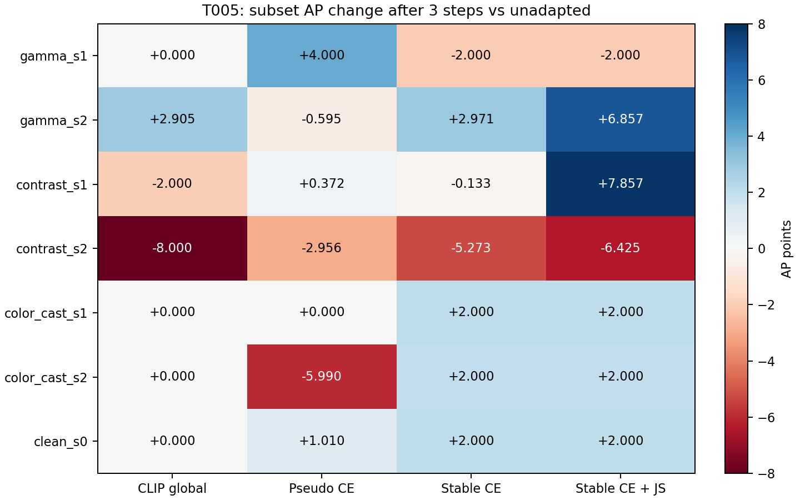

# T005 detector-native signal screen

Source f64151a; 2 images, 56 observations, smoke=2.

Frozen detector, fixed original base/flip ROI support; global8D ISP, lr0.1,K3, JS coefficient1.0. Fresh within-run annotated oracle only for analysis. Clean reported separately. Empty-support episodes retained with exact no update from ISP(phi0); undefined cosine zero-coded only for all-observation summaries and paired contrasts. Valid-only cosine in analysis.json.

## AP1 / AP3 (0–100 subset points)

| Case | Before | CLIP global | Pseudo confidence | Stable confidence | Stable + JS |
|---|---:|---:|---:|---:|---:|
| gamma_s1 | 39.059 | 39.059 / 39.059 | 37.059 / 43.059 | 39.059 / 37.059 | 39.059 / 37.059 |
| gamma_s2 | 33.478 | 33.216 / 36.383 | 35.050 / 32.883 | 36.050 / 36.450 | 36.050 / 40.335 |
| contrast_s1 | 50.850 | 48.850 / 48.850 | 50.716 / 51.221 | 49.716 / 50.716 | 62.040 / 58.706 |
| contrast_s2 | 50.362 | 42.739 / 42.362 | 46.362 / 47.406 | 41.089 / 45.089 | 49.089 / 43.937 |
| color_cast_s1 | 44.554 | 44.554 / 44.554 | 44.554 / 44.554 | 44.554 / 46.554 | 46.554 / 46.554 |
| color_cast_s2 | 54.545 | 54.545 / 54.545 | 49.545 / 48.554 | 54.545 / 56.545 | 54.545 / 56.545 |
| clean_s0 | 41.040 | 41.040 / 41.040 | 42.050 / 42.050 | 43.040 / 43.040 | 43.040 / 43.040 |

## Mechanism and paired95% intervals

Intervals use2000 paired image-cluster draws; no multiplicity adjustment. Frequencies include fallbacks.

| Group | Variant | Mean cosine* | Positive% | Benefit% | Matched benefit% | Δcos vs CLIP [CI] | Δbenefit pp [CI] | Matched Δbenefit pp [CI] |
|---|---|---:|---:|---:|---:|---:|---:|---:|
| corrupted_overall | global_generic | 0.08042 | 58.33 | 50.00 | 50.00 | 0.000 [0.000, 0.000] | 0.000 [0.000, 0.000] | 0.000 [0.000, 0.000] |
| corrupted_overall | det_pseudo | -0.04946 | 41.67 | 41.67 | 33.33 | -0.130 [-0.350, 0.090] | -8.333 [-33.333, 16.667] | -16.667 [-16.667, -16.667] |
| corrupted_overall | det_stable | -0.16438 | 41.67 | 33.33 | 25.00 | -0.245 [-0.750, 0.261] | -16.667 [-16.667, -16.667] | -25.000 [-33.333, -16.667] |
| corrupted_overall | det_stable_js | -0.19467 | 41.67 | 33.33 | 25.00 | -0.275 [-0.770, 0.220] | -16.667 [-16.667, -16.667] | -25.000 [-33.333, -16.667] |
| gamma_s1 | global_generic | -0.08262 | 50.00 | 0.00 | 0.00 | 0.000 [0.000, 0.000] | 0.000 [0.000, 0.000] | 0.000 [0.000, 0.000] |
| gamma_s1 | det_pseudo | -0.16447 | 50.00 | 0.00 | 0.00 | -0.082 [-0.146, -0.017] | 0.000 [0.000, 0.000] | 0.000 [0.000, 0.000] |
| gamma_s1 | det_stable | -0.30022 | 0.00 | 0.00 | 0.00 | -0.218 [-0.760, 0.325] | 0.000 [0.000, 0.000] | 0.000 [0.000, 0.000] |
| gamma_s1 | det_stable_js | -0.44164 | 0.00 | 0.00 | 0.00 | -0.359 [-0.857, 0.139] | 0.000 [0.000, 0.000] | 0.000 [0.000, 0.000] |
| gamma_s2 | global_generic | 0.00439 | 50.00 | 0.00 | 0.00 | 0.000 [0.000, 0.000] | 0.000 [0.000, 0.000] | 0.000 [0.000, 0.000] |
| gamma_s2 | det_pseudo | -0.65596 | 0.00 | 50.00 | 0.00 | -0.660 [-1.434, 0.113] | 50.000 [0.000, 100.000] | 0.000 [0.000, 0.000] |
| gamma_s2 | det_stable | -0.33266 | 50.00 | 0.00 | 0.00 | -0.337 [-1.567, 0.893] | 0.000 [0.000, 0.000] | 0.000 [0.000, 0.000] |
| gamma_s2 | det_stable_js | -0.29484 | 50.00 | 0.00 | 100.00 | -0.299 [-1.418, 0.820] | 0.000 [0.000, 0.000] | 100.000 [100.000, 100.000] |
| contrast_s1 | global_generic | 0.00323 | 50.00 | 100.00 | 100.00 | 0.000 [0.000, 0.000] | 0.000 [0.000, 0.000] | 0.000 [0.000, 0.000] |
| contrast_s1 | det_pseudo | 0.12051 | 50.00 | 100.00 | 100.00 | 0.117 [0.096, 0.138] | 0.000 [0.000, 0.000] | 0.000 [0.000, 0.000] |
| contrast_s1 | det_stable | -0.00798 | 50.00 | 100.00 | 50.00 | -0.011 [-0.122, 0.099] | 0.000 [0.000, 0.000] | -50.000 [-100.000, 0.000] |
| contrast_s1 | det_stable_js | -0.05976 | 50.00 | 100.00 | 0.00 | -0.063 [-0.233, 0.107] | 0.000 [0.000, 0.000] | -100.000 [-100.000, -100.000] |
| contrast_s2 | global_generic | 0.12224 | 50.00 | 50.00 | 50.00 | 0.000 [0.000, 0.000] | 0.000 [0.000, 0.000] | 0.000 [0.000, 0.000] |
| contrast_s2 | det_pseudo | 0.17179 | 50.00 | 50.00 | 50.00 | 0.050 [-0.231, 0.330] | 0.000 [0.000, 0.000] | 0.000 [0.000, 0.000] |
| contrast_s2 | det_stable | -0.73774 | 0.00 | 0.00 | 50.00 | -0.860 [-1.364, -0.356] | -50.000 [-100.000, 0.000] | 0.000 [0.000, 0.000] |
| contrast_s2 | det_stable_js | -0.79307 | 0.00 | 0.00 | 50.00 | -0.915 [-1.383, -0.448] | -50.000 [-100.000, 0.000] | 0.000 [0.000, 0.000] |
| color_cast_s1 | global_generic | 0.42641 | 100.00 | 50.00 | 50.00 | 0.000 [0.000, 0.000] | 0.000 [0.000, 0.000] | 0.000 [0.000, 0.000] |
| color_cast_s1 | det_pseudo | 0.21960 | 50.00 | 0.00 | 0.00 | -0.207 [-0.511, 0.097] | -50.000 [-100.000, 0.000] | -50.000 [-100.000, 0.000] |
| color_cast_s1 | det_stable | 0.10757 | 50.00 | 0.00 | 0.00 | -0.319 [-0.335, -0.302] | -50.000 [-100.000, 0.000] | -50.000 [-100.000, 0.000] |
| color_cast_s1 | det_stable_js | 0.14612 | 50.00 | 0.00 | 0.00 | -0.280 [-0.302, -0.258] | -50.000 [-100.000, 0.000] | -50.000 [-100.000, 0.000] |
| color_cast_s2 | global_generic | 0.00889 | 50.00 | 100.00 | 100.00 | 0.000 [0.000, 0.000] | 0.000 [0.000, 0.000] | 0.000 [0.000, 0.000] |
| color_cast_s2 | det_pseudo | 0.01174 | 50.00 | 50.00 | 50.00 | 0.003 [-1.086, 1.092] | -50.000 [-100.000, 0.000] | -50.000 [-100.000, 0.000] |
| color_cast_s2 | det_stable | 0.28475 | 100.00 | 100.00 | 50.00 | 0.276 [-0.353, 0.905] | 0.000 [0.000, 0.000] | -50.000 [-100.000, 0.000] |
| color_cast_s2 | det_stable_js | 0.27517 | 100.00 | 100.00 | 0.00 | 0.266 [-0.426, 0.958] | 0.000 [0.000, 0.000] | -100.000 [-100.000, -100.000] |
| clean_s0 | global_generic | 0.04377 | 50.00 | 50.00 | 50.00 | 0.000 [0.000, 0.000] | 0.000 [0.000, 0.000] | 0.000 [0.000, 0.000] |
| clean_s0 | det_pseudo | 0.29983 | 50.00 | 100.00 | 100.00 | 0.256 [-1.018, 1.530] | 50.000 [0.000, 100.000] | 50.000 [0.000, 100.000] |
| clean_s0 | det_stable | 0.69445 | 100.00 | 50.00 | 50.00 | 0.651 [-0.226, 1.528] | 0.000 [0.000, 0.000] | 0.000 [-100.000, 100.000] |
| clean_s0 | det_stable_js | 0.70201 | 100.00 | 50.00 | 100.00 | 0.658 [-0.209, 1.526] | 0.000 [-100.000, 100.000] | 50.000 [0.000, 100.000] |

*Undefined zero-gradient cosine contributes0 here; valid-only distributions and exact counts retained.

## Clean control and deployment costs

| Variant | Clean ΔAP1 / ΔAP3 | Clean mean phi norm1 /3 | Corrupted adapt / deploy seconds3 | Adapt peak MiB |
|---|---:|---:|---:|---:|
| global_generic | +0.000 / +0.000 | 0.00989 / 0.01773 | 0.1170 / 0.1170 | 833.5 |
| det_pseudo | +1.010 / +1.010 | 0.04480 / 0.04298 | 0.1447 / 0.1943 | 1857.8 |
| det_stable | +2.000 / +2.000 | 0.04042 / 0.03916 | 0.2810 / 0.3609 | 2667.7 |
| det_stable_js | +2.000 / +2.000 | 0.04333 / 0.04057 | 0.2801 / 0.3600 | 2667.6 |

Setup peaks are separately retained in analysis.json; timings include unchanged diagnostics, fixed variant order.

## Support and fallback

| Group | Variant | Base / stable count | Stable/base | Symmetric match | Fallback% |
|---|---|---:|---:|---:|---:|
| corrupted_overall | det_pseudo | 4.75 / 3.92 | 0.848 | 0.820 | 0.00 |
| corrupted_overall | det_stable | 4.75 / 3.92 | 0.848 | 0.820 | 0.00 |
| corrupted_overall | det_stable_js | 4.75 / 3.92 | 0.848 | 0.820 | 0.00 |
| gamma_s1 | det_pseudo | 5.00 / 5.00 | 1.000 | 0.955 | 0.00 |
| gamma_s1 | det_stable | 5.00 / 5.00 | 1.000 | 0.955 | 0.00 |
| gamma_s1 | det_stable_js | 5.00 / 5.00 | 1.000 | 0.955 | 0.00 |
| gamma_s2 | det_pseudo | 5.00 / 4.50 | 0.900 | 0.944 | 0.00 |
| gamma_s2 | det_stable | 5.00 / 4.50 | 0.900 | 0.944 | 0.00 |
| gamma_s2 | det_stable_js | 5.00 / 4.50 | 0.900 | 0.944 | 0.00 |
| contrast_s1 | det_pseudo | 5.50 / 4.50 | 0.857 | 0.829 | 0.00 |
| contrast_s1 | det_stable | 5.50 / 4.50 | 0.857 | 0.829 | 0.00 |
| contrast_s1 | det_stable_js | 5.50 / 4.50 | 0.857 | 0.829 | 0.00 |
| contrast_s2 | det_pseudo | 4.50 / 3.00 | 0.667 | 0.686 | 0.00 |
| contrast_s2 | det_stable | 4.50 / 3.00 | 0.667 | 0.686 | 0.00 |
| contrast_s2 | det_stable_js | 4.50 / 3.00 | 0.667 | 0.686 | 0.00 |
| color_cast_s1 | det_pseudo | 4.50 / 3.50 | 0.833 | 0.775 | 0.00 |
| color_cast_s1 | det_stable | 4.50 / 3.50 | 0.833 | 0.775 | 0.00 |
| color_cast_s1 | det_stable_js | 4.50 / 3.50 | 0.833 | 0.775 | 0.00 |
| color_cast_s2 | det_pseudo | 4.00 / 3.00 | 0.833 | 0.733 | 0.00 |
| color_cast_s2 | det_stable | 4.00 / 3.00 | 0.833 | 0.733 | 0.00 |
| color_cast_s2 | det_stable_js | 4.00 / 3.00 | 0.833 | 0.733 | 0.00 |
| clean_s0 | det_pseudo | 4.50 / 4.00 | 0.917 | 0.830 | 0.00 |
| clean_s0 | det_stable | 4.50 / 4.00 | 0.917 | 0.830 | 0.00 |
| clean_s0 | det_stable_js | 4.50 / 4.00 | 0.917 | 0.830 | 0.00 |

## Support-size outcomes

| Group | Variant | Support | N | Mean cosine* | Benefit% | Matched benefit% | Mean loss delta1 |
|---|---|---|---:|---:|---:|---:|---:|
| corrupted_overall | det_pseudo | 1-2 | 1 | 0.52500 | 0.00 | 100.00 | 0.00956175 |
| corrupted_overall | det_pseudo | 3-5 | 7 | -0.40667 | 28.57 | 14.29 | 0.0277128 |
| corrupted_overall | det_pseudo | 6+ | 4 | 0.43203 | 75.00 | 50.00 | -0.00753444 |
| corrupted_overall | det_stable | 1-2 | 2 | -0.12300 | 50.00 | 0.00 | 0.0014893 |
| corrupted_overall | det_stable | 3-5 | 10 | -0.17265 | 30.00 | 30.00 | 0.0178548 |
| corrupted_overall | det_stable_js | 1-2 | 2 | -0.14215 | 50.00 | 0.00 | 0.00383776 |
| corrupted_overall | det_stable_js | 3-5 | 10 | -0.20517 | 30.00 | 30.00 | 0.0199844 |
| gamma_s1 | det_pseudo | 3-5 | 2 | -0.16447 | 0.00 | 0.00 | 0.0303206 |
| gamma_s1 | det_stable | 3-5 | 2 | -0.30022 | 0.00 | 0.00 | 0.02972 |
| gamma_s1 | det_stable_js | 3-5 | 2 | -0.44164 | 0.00 | 0.00 | 0.0291919 |
| gamma_s2 | det_pseudo | 3-5 | 2 | -0.65596 | 50.00 | 0.00 | 0.0267886 |
| gamma_s2 | det_stable | 3-5 | 2 | -0.33266 | 0.00 | 0.00 | 0.0320535 |
| gamma_s2 | det_stable_js | 3-5 | 2 | -0.29484 | 0.00 | 100.00 | 0.0216785 |
| contrast_s1 | det_pseudo | 3-5 | 1 | -0.33054 | 100.00 | 100.00 | -0.00633171 |
| contrast_s1 | det_pseudo | 6+ | 1 | 0.57157 | 100.00 | 100.00 | -0.00968477 |
| contrast_s1 | det_stable | 3-5 | 2 | -0.00798 | 100.00 | 50.00 | -0.0218414 |
| contrast_s1 | det_stable_js | 3-5 | 2 | -0.05976 | 100.00 | 0.00 | -0.0187858 |
| contrast_s2 | det_pseudo | 3-5 | 1 | -0.45947 | 0.00 | 0.00 | 0.0446443 |
| contrast_s2 | det_pseudo | 6+ | 1 | 0.80305 | 100.00 | 100.00 | -0.0219886 |
| contrast_s2 | det_stable | 1-2 | 1 | -0.58421 | 0.00 | 0.00 | 0.019213 |
| contrast_s2 | det_stable | 3-5 | 1 | -0.89127 | 0.00 | 100.00 | 0.0144469 |
| contrast_s2 | det_stable_js | 1-2 | 1 | -0.67604 | 0.00 | 0.00 | 0.0248706 |
| contrast_s2 | det_stable_js | 3-5 | 1 | -0.91010 | 0.00 | 100.00 | 0.0396555 |
| color_cast_s1 | det_pseudo | 3-5 | 1 | -0.41582 | 0.00 | 0.00 | 0.041459 |
| color_cast_s1 | det_pseudo | 6+ | 1 | 0.85503 | 0.00 | 0.00 | 0.0302632 |
| color_cast_s1 | det_stable | 3-5 | 2 | 0.10757 | 0.00 | 0.00 | 0.0471704 |
| color_cast_s1 | det_stable_js | 3-5 | 2 | 0.14612 | 0.00 | 0.00 | 0.0517403 |
| color_cast_s2 | det_pseudo | 1-2 | 1 | 0.52500 | 0.00 | 100.00 | 0.00956175 |
| color_cast_s2 | det_pseudo | 6+ | 1 | -0.50151 | 100.00 | 0.00 | -0.0287276 |
| color_cast_s2 | det_stable | 1-2 | 1 | 0.33820 | 100.00 | 0.00 | -0.0162344 |
| color_cast_s2 | det_stable | 3-5 | 1 | 0.23131 | 100.00 | 100.00 | -0.0101043 |
| color_cast_s2 | det_stable_js | 1-2 | 1 | 0.39174 | 100.00 | 0.00 | -0.017195 |
| color_cast_s2 | det_stable_js | 3-5 | 1 | 0.15860 | 100.00 | 0.00 | -0.00746179 |
| clean_s0 | det_pseudo | 3-5 | 1 | 0.68783 | 100.00 | 100.00 | -0.00407985 |
| clean_s0 | det_pseudo | 6+ | 1 | -0.08817 | 100.00 | 100.00 | -0.000703812 |
| clean_s0 | det_stable | 3-5 | 2 | 0.69445 | 50.00 | 50.00 | 0.00429004 |
| clean_s0 | det_stable_js | 3-5 | 2 | 0.70201 | 50.00 | 100.00 | -0.00779885 |

Full per-case gradient norms/energy, confidence distributions, CE/JS components, Taylor predictions/correlations, mean-loss paired CIs, stable-minus-pseudo and JS-minus-stable paired effects, saturation and phi trajectories are in analysis.json. Negative families are retained.

