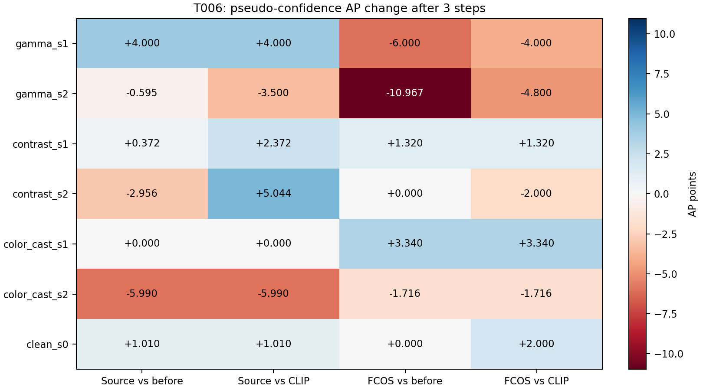

# T006 cross-detector transfer results

Source 8c0f480; 2 images, 28 variant observations, smoke=2.

Source-only frozen Faster R-CNN fixed ROI pseudo-confidence. Target FCOS is analysis/evaluation only. Both detectors evaluate identical enhanced images. Global8D ISP,lr0.1,K3,identity initialization, hard clamp. No target in support/update and no oracle information in norm matching.

## Source / target official AP1 / AP3 (0–100 points)

| Detector | Case | Before AP / AP50 / AP75 | CLIP AP1 /3 | Pseudo AP1 /3 | Pseudo AP50 1 /3 | Pseudo AP75 1 /3 |
|---|---|---:|---:|---:|---:|---:|
| source | gamma_s1 | 39.059 / 90.000 / 30.099 | 39.059 / 39.059 | 37.059 / 43.059 | 70.000 / 90.000 | 30.099 / 30.099 |
| source | gamma_s2 | 33.478 / 62.857 / 30.099 | 33.216 / 36.383 | 35.050 / 32.883 | 82.500 / 55.000 | 30.099 / 36.766 |
| source | contrast_s1 | 50.850 / 90.000 / 55.050 | 48.850 / 48.850 | 50.716 / 51.221 | 90.000 / 90.000 | 55.050 / 55.050 |
| source | contrast_s2 | 50.362 / 100.000 / 37.977 | 42.739 / 42.362 | 46.362 / 47.406 | 100.000 / 100.000 | 37.977 / 38.449 |
| source | color_cast_s1 | 44.554 / 90.000 / 35.050 | 44.554 / 44.554 | 44.554 / 44.554 | 90.000 / 90.000 | 35.050 / 35.050 |
| source | color_cast_s2 | 54.545 / 90.000 / 55.050 | 54.545 / 54.545 | 49.545 / 48.554 | 90.000 / 90.000 | 45.050 / 45.050 |
| source | clean_s0 | 41.040 / 90.000 / 35.050 | 41.040 / 41.040 | 42.050 / 42.050 | 90.000 / 90.000 | 35.050 / 35.050 |
| target | gamma_s1 | 81.069 / 100.000 / 95.050 | 81.069 / 79.069 | 75.355 / 75.069 | 100.000 / 100.000 | 75.050 / 81.716 |
| target | gamma_s2 | 71.399 / 100.000 / 76.700 | 71.899 / 65.233 | 70.733 / 60.432 | 100.000 / 86.667 | 83.366 / 55.099 |
| target | contrast_s1 | 84.079 / 100.000 / 96.700 | 84.079 / 84.079 | 84.079 / 85.399 | 100.000 / 100.000 | 96.700 / 96.700 |
| target | contrast_s2 | 67.129 / 100.000 / 60.198 | 69.129 / 69.129 | 69.129 / 67.129 | 100.000 / 100.000 | 60.198 / 60.198 |
| target | color_cast_s1 | 78.389 / 100.000 / 76.700 | 78.389 / 78.389 | 80.389 / 81.729 | 100.000 / 100.000 | 96.700 / 96.700 |
| target | color_cast_s2 | 79.380 / 100.000 / 96.700 | 79.380 / 79.380 | 81.380 / 77.663 | 100.000 / 100.000 | 96.700 / 94.059 |
| target | clean_s0 | 85.399 / 100.000 / 96.700 | 83.399 / 83.399 | 83.399 / 85.399 | 100.000 / 100.000 | 96.700 / 96.700 |

CLIP AP50/AP75 and all before/CLIP deltas are retained in analysis.json; official aggregate AP has no invented per-image intervals.

## Paired mechanism vs CLIP

All episodes included. *Undefined cosine zero-coded here; valid-only distributions retained separately.95% intervals use2000 paired image-cluster draws.

| Group | Detector | Variant | Cosine* | Positive% | Raw benefit% | Matched benefit% | Delta cosine [CI] | Delta raw benefit pp [CI] | Delta matched benefit pp [CI] |
|---|---|---|---:|---:|---:|---:|---:|---:|---:|
| corrupted_overall | source | global_generic | 0.08050 | 58.33 | 41.67 | 41.67 | 0.000 [0.000, 0.000] | 0.000 [0.000, 0.000] | 0.000 [0.000, 0.000] |
| corrupted_overall | source | det_pseudo | -0.04949 | 41.67 | 41.67 | 25.00 | -0.130 [-0.350, 0.091] | 0.000 [-33.333, 33.333] | -16.667 [-33.333, 0.000] |
| corrupted_overall | target | global_generic | 0.00570 | 50.00 | 50.00 | 50.00 | 0.000 [0.000, 0.000] | 0.000 [0.000, 0.000] | 0.000 [0.000, 0.000] |
| corrupted_overall | target | det_pseudo | 0.18002 | 58.33 | 41.67 | 50.00 | 0.174 [-0.191, 0.540] | -8.333 [-33.333, 16.667] | 0.000 [-33.333, 33.333] |
| severity_s1 | source | global_generic | 0.11585 | 66.67 | 50.00 | 50.00 | 0.000 [0.000, 0.000] | 0.000 [0.000, 0.000] | 0.000 [0.000, 0.000] |
| severity_s1 | source | det_pseudo | 0.05855 | 50.00 | 33.33 | 16.67 | -0.057 [-0.144, 0.029] | -16.667 [-33.333, 0.000] | -33.333 [-66.667, 0.000] |
| severity_s1 | target | global_generic | -0.15093 | 33.33 | 33.33 | 33.33 | 0.000 [0.000, 0.000] | 0.000 [0.000, 0.000] | 0.000 [0.000, 0.000] |
| severity_s1 | target | det_pseudo | 0.29502 | 66.67 | 50.00 | 50.00 | 0.446 [0.443, 0.449] | 16.667 [0.000, 33.333] | 16.667 [0.000, 33.333] |
| severity_s2 | source | global_generic | 0.04516 | 50.00 | 33.33 | 33.33 | 0.000 [0.000, 0.000] | 0.000 [0.000, 0.000] | 0.000 [0.000, 0.000] |
| severity_s2 | source | det_pseudo | -0.15753 | 33.33 | 50.00 | 33.33 | -0.203 [-0.730, 0.325] | 16.667 [-33.333, 66.667] | 0.000 [0.000, 0.000] |
| severity_s2 | target | global_generic | 0.16234 | 66.67 | 66.67 | 66.67 | 0.000 [0.000, 0.000] | 0.000 [0.000, 0.000] | 0.000 [0.000, 0.000] |
| severity_s2 | target | det_pseudo | 0.06501 | 50.00 | 33.33 | 50.00 | -0.097 [-0.825, 0.630] | -33.333 [-66.667, 0.000] | -16.667 [-66.667, 33.333] |
| gamma_s1 | source | global_generic | -0.08251 | 50.00 | 0.00 | 0.00 | 0.000 [0.000, 0.000] | 0.000 [0.000, 0.000] | 0.000 [0.000, 0.000] |
| gamma_s1 | source | det_pseudo | -0.16450 | 50.00 | 0.00 | 0.00 | -0.082 [-0.147, -0.017] | 0.000 [0.000, 0.000] | 0.000 [0.000, 0.000] |
| gamma_s1 | target | global_generic | 0.04792 | 50.00 | 50.00 | 50.00 | 0.000 [0.000, 0.000] | 0.000 [0.000, 0.000] | 0.000 [0.000, 0.000] |
| gamma_s1 | target | det_pseudo | 0.10352 | 50.00 | 0.00 | 0.00 | 0.056 [-0.291, 0.403] | -50.000 [-100.000, 0.000] | -50.000 [-100.000, 0.000] |
| gamma_s2 | source | global_generic | 0.00453 | 50.00 | 0.00 | 0.00 | 0.000 [0.000, 0.000] | 0.000 [0.000, 0.000] | 0.000 [0.000, 0.000] |
| gamma_s2 | source | det_pseudo | -0.65627 | 0.00 | 50.00 | 0.00 | -0.661 [-1.435, 0.113] | 50.000 [0.000, 100.000] | 0.000 [0.000, 0.000] |
| gamma_s2 | target | global_generic | -0.14661 | 50.00 | 50.00 | 50.00 | 0.000 [0.000, 0.000] | 0.000 [0.000, 0.000] | 0.000 [0.000, 0.000] |
| gamma_s2 | target | det_pseudo | -0.38868 | 0.00 | 0.00 | 0.00 | -0.242 [-1.313, 0.829] | -50.000 [-100.000, 0.000] | -50.000 [-100.000, 0.000] |
| contrast_s1 | source | global_generic | 0.00353 | 50.00 | 100.00 | 100.00 | 0.000 [0.000, 0.000] | 0.000 [0.000, 0.000] | 0.000 [0.000, 0.000] |
| contrast_s1 | source | det_pseudo | 0.12064 | 50.00 | 100.00 | 50.00 | 0.117 [0.097, 0.137] | 0.000 [0.000, 0.000] | -50.000 [-100.000, 0.000] |
| contrast_s1 | target | global_generic | -0.40626 | 0.00 | 0.00 | 0.00 | 0.000 [0.000, 0.000] | 0.000 [0.000, 0.000] | 0.000 [0.000, 0.000] |
| contrast_s1 | target | det_pseudo | 0.06752 | 50.00 | 50.00 | 50.00 | 0.474 [-0.237, 1.185] | 50.000 [0.000, 100.000] | 50.000 [0.000, 100.000] |
| contrast_s2 | source | global_generic | 0.12218 | 50.00 | 0.00 | 0.00 | 0.000 [0.000, 0.000] | 0.000 [0.000, 0.000] | 0.000 [0.000, 0.000] |
| contrast_s2 | source | det_pseudo | 0.17183 | 50.00 | 50.00 | 50.00 | 0.050 [-0.231, 0.330] | 50.000 [0.000, 100.000] | 50.000 [0.000, 100.000] |
| contrast_s2 | target | global_generic | 0.53510 | 100.00 | 100.00 | 100.00 | 0.000 [0.000, 0.000] | 0.000 [0.000, 0.000] | 0.000 [0.000, 0.000] |
| contrast_s2 | target | det_pseudo | 0.31068 | 100.00 | 50.00 | 100.00 | -0.224 [-0.263, -0.186] | -50.000 [-100.000, 0.000] | 0.000 [0.000, 0.000] |
| color_cast_s1 | source | global_generic | 0.42653 | 100.00 | 50.00 | 50.00 | 0.000 [0.000, 0.000] | 0.000 [0.000, 0.000] | 0.000 [0.000, 0.000] |
| color_cast_s1 | source | det_pseudo | 0.21951 | 50.00 | 0.00 | 0.00 | -0.207 [-0.511, 0.097] | -50.000 [-100.000, 0.000] | -50.000 [-100.000, 0.000] |
| color_cast_s1 | target | global_generic | -0.09446 | 50.00 | 50.00 | 50.00 | 0.000 [0.000, 0.000] | 0.000 [0.000, 0.000] | 0.000 [0.000, 0.000] |
| color_cast_s1 | target | det_pseudo | 0.71403 | 100.00 | 100.00 | 100.00 | 0.808 [0.435, 1.182] | 50.000 [0.000, 100.000] | 50.000 [0.000, 100.000] |
| color_cast_s2 | source | global_generic | 0.00876 | 50.00 | 100.00 | 100.00 | 0.000 [0.000, 0.000] | 0.000 [0.000, 0.000] | 0.000 [0.000, 0.000] |
| color_cast_s2 | source | det_pseudo | 0.01185 | 50.00 | 50.00 | 50.00 | 0.003 [-1.086, 1.092] | -50.000 [-100.000, 0.000] | -50.000 [-100.000, 0.000] |
| color_cast_s2 | target | global_generic | 0.09854 | 50.00 | 50.00 | 50.00 | 0.000 [0.000, 0.000] | 0.000 [0.000, 0.000] | 0.000 [0.000, 0.000] |
| color_cast_s2 | target | det_pseudo | 0.27305 | 50.00 | 50.00 | 50.00 | 0.175 [-0.898, 1.247] | 0.000 [-100.000, 100.000] | 0.000 [-100.000, 100.000] |
| clean_s0 | source | global_generic | 0.04373 | 50.00 | 50.00 | 50.00 | 0.000 [0.000, 0.000] | 0.000 [0.000, 0.000] | 0.000 [0.000, 0.000] |
| clean_s0 | source | det_pseudo | 0.29979 | 50.00 | 0.00 | 100.00 | 0.256 [-1.018, 1.530] | -50.000 [-100.000, 0.000] | 50.000 [0.000, 100.000] |
| clean_s0 | target | global_generic | 0.35056 | 100.00 | 100.00 | 100.00 | 0.000 [0.000, 0.000] | 0.000 [0.000, 0.000] | 0.000 [0.000, 0.000] |
| clean_s0 | target | det_pseudo | -0.44519 | 0.00 | 0.00 | 0.00 | -0.796 [-0.875, -0.717] | -100.000 [-100.000, -100.000] | -100.000 [-100.000, -100.000] |

## Detector agreement and joint pseudo-step outcomes

| Group | Source-target cosine [CI] | Agreement positive% | Raw both / source-only / target-only / neither% | Matched both / source-only / target-only / neither% |
|---|---:|---:|---:|---:|
| corrupted_overall | 0.617 [0.592, 0.642] | 100.00 | 16.67 / 25.00 / 25.00 / 33.33 | 25.00 / 0.00 / 25.00 / 50.00 |
| severity_s1 | 0.494 [0.461, 0.527] | 100.00 | 16.67 / 16.67 / 33.33 / 33.33 | 16.67 / 0.00 / 33.33 / 50.00 |
| severity_s2 | 0.740 [0.723, 0.757] | 100.00 | 16.67 / 33.33 / 16.67 / 33.33 | 33.33 / 0.00 / 16.67 / 50.00 |
| gamma_s1 | 0.488 [0.369, 0.607] | 100.00 | 0.00 / 0.00 / 0.00 / 100.00 | 0.00 / 0.00 / 0.00 / 100.00 |
| gamma_s2 | 0.786 [0.713, 0.860] | 100.00 | 0.00 / 50.00 / 0.00 / 50.00 | 0.00 / 0.00 / 0.00 / 100.00 |
| contrast_s1 | 0.415 [0.133, 0.697] | 100.00 | 50.00 / 50.00 / 0.00 / 0.00 | 50.00 / 0.00 / 0.00 / 50.00 |
| contrast_s2 | 0.762 [0.688, 0.836] | 100.00 | 50.00 / 0.00 / 0.00 / 50.00 | 50.00 / 0.00 / 50.00 / 0.00 |
| color_cast_s1 | 0.578 [0.316, 0.840] | 100.00 | 0.00 / 0.00 / 100.00 / 0.00 | 0.00 / 0.00 / 100.00 / 0.00 |
| color_cast_s2 | 0.672 [0.575, 0.769] | 100.00 | 0.00 / 50.00 / 50.00 / 0.00 | 50.00 / 0.00 / 0.00 / 50.00 |
| clean_s0 | 0.190 [-0.142, 0.521] | 50.00 | 0.00 / 0.00 / 0.00 / 100.00 | 0.00 / 100.00 / 0.00 / 0.00 |

## Severity: macro-average of3 condition AP deltas for pseudo

Descriptive arithmetic means of official condition AP; not pooled detections or new COCO AP.

| Severity | Detector | DeltaAP1 /3 vs before | DeltaAP1 /3 vs CLIP |
|---|---|---:|---:|
| s1 | source | -0.711 / +1.457 | -0.044 / +2.124 |
| s1 | target | -1.238 / -0.447 | -1.238 / +0.220 |
| s2 | source | -2.476 / -3.180 | +0.152 / -1.482 |
| s2 | target | +1.111 / -4.228 | +0.278 / -2.839 |

## Clean control and resource costs

| Variant | Clean phi norm1 /3 | Clean source deltaAP3 | Clean target deltaAP3 | Corrupted adapt / deploy sec3 | Adapt peak MiB | Fallback% |
|---|---:|---:|---:|---:|---:|---:|
| global_generic | 0.00989 / 0.01773 | +0.000 | -2.000 | 0.1006 / 0.1006 | 958.8 | 0.00 |
| det_pseudo | 0.04480 / 0.04281 | +1.010 | +0.000 | 0.1447 / 0.1940 | 1984.3 | 0.00 |

Full signed-coordinate dot products, source-target agreement, Taylor correlations/predictions, raw/matched paired mean-loss intervals, joint-outcome paired intervals, support/confidence, phi trajectories and saturation are in analysis.json. Both models and CLIP are resident during memory measurements; target evaluation is excluded from deployment timing. No family is dropped.

