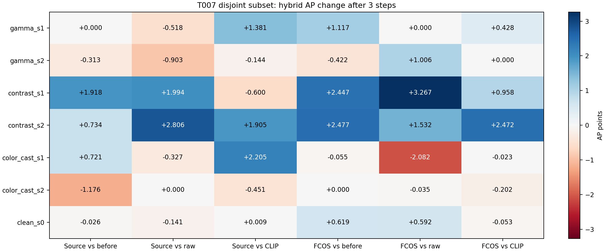

# T007 disjoint-set trust-radius results

Source 4e87904; images=2, rows=42, smoke=2.

Frozen source pseudo direction, current-phi CLIP norm, eps1e-12, lr0.1,K1/3. Target FCOS/annotations analysis-only. Hybrid cosine is not a new direction. Both detectors evaluate the same enhanced images.

## Official subset AP / AP50 / AP75

| Detector | Case | Variant | Before AP /50 /75 | After1 AP /50 /75 | After3 AP /50 /75 | DeltaAP3 vs before / CLIP / raw |
|---|---|---|---:|---:|---:|---:|
| source | gamma_s1 | global_generic | 53.618 / 69.762 / 64.025 | 53.618 / 69.762 / 64.025 | 52.237 / 69.832 / 64.084 | -1.381 / +0.000 / -1.899 |
| source | gamma_s1 | det_pseudo | 53.618 / 69.762 / 64.025 | 53.618 / 69.762 / 64.025 | 54.136 / 72.350 / 64.025 | +0.518 / +1.899 / +0.000 |
| source | gamma_s1 | det_pseudo_clip_radius | 53.618 / 69.762 / 64.025 | 53.618 / 69.762 / 64.025 | 53.618 / 69.762 / 64.025 | +0.000 / +1.381 / -0.518 |
| target | gamma_s1 | global_generic | 60.322 / 79.344 / 69.568 | 61.538 / 78.986 / 68.684 | 61.011 / 79.022 / 67.539 | +0.689 / +0.000 / -0.428 |
| target | gamma_s1 | det_pseudo | 60.322 / 79.344 / 69.568 | 60.010 / 78.953 / 68.395 | 61.438 / 78.953 / 68.395 | +1.117 / +0.428 / +0.000 |
| target | gamma_s1 | det_pseudo_clip_radius | 60.322 / 79.344 / 69.568 | 61.455 / 78.953 / 68.684 | 61.438 / 78.953 / 68.395 | +1.117 / +0.428 / +0.000 |
| source | gamma_s2 | global_generic | 50.918 / 69.373 / 62.784 | 50.846 / 69.373 / 62.784 | 50.749 / 69.373 / 62.784 | -0.169 / +0.000 / -0.759 |
| source | gamma_s2 | det_pseudo | 50.918 / 69.373 / 62.784 | 49.201 / 69.373 / 62.784 | 51.508 / 69.373 / 64.226 | +0.590 / +0.759 / +0.000 |
| source | gamma_s2 | det_pseudo_clip_radius | 50.918 / 69.373 / 62.784 | 50.846 / 69.373 / 62.784 | 50.605 / 69.373 / 62.784 | -0.313 / -0.144 / -0.903 |
| target | gamma_s2 | global_generic | 60.518 / 81.023 / 69.493 | 60.079 / 80.503 / 68.468 | 60.095 / 80.503 / 68.468 | -0.422 / +0.000 / +1.006 |
| target | gamma_s2 | det_pseudo | 60.518 / 81.023 / 69.493 | 60.079 / 80.503 / 68.468 | 59.089 / 81.023 / 69.493 | -1.429 / -1.006 / +0.000 |
| target | gamma_s2 | det_pseudo_clip_radius | 60.518 / 81.023 / 69.493 | 60.079 / 80.503 / 68.468 | 60.095 / 80.503 / 68.468 | -0.422 / +0.000 / +1.006 |
| source | contrast_s1 | global_generic | 55.873 / 75.290 / 69.776 | 57.637 / 75.499 / 68.824 | 58.391 / 76.016 / 69.776 | +2.518 / +0.000 / +2.594 |
| source | contrast_s1 | det_pseudo | 55.873 / 75.290 / 69.776 | 54.278 / 76.758 / 65.859 | 55.797 / 77.795 / 68.187 | -0.076 / -2.594 / +0.000 |
| source | contrast_s1 | det_pseudo_clip_radius | 55.873 / 75.290 / 69.776 | 56.645 / 75.290 / 69.776 | 57.791 / 75.937 / 68.270 | +1.918 / -0.600 / +1.994 |
| target | contrast_s1 | global_generic | 57.473 / 77.348 / 57.609 | 57.627 / 76.142 / 58.562 | 58.962 / 75.934 / 72.847 | +1.489 / +0.000 / +2.309 |
| target | contrast_s1 | det_pseudo | 57.473 / 77.348 / 57.609 | 57.174 / 75.138 / 57.443 | 56.653 / 74.286 / 56.736 | -0.820 / -2.309 / +0.000 |
| target | contrast_s1 | det_pseudo_clip_radius | 57.473 / 77.348 / 57.609 | 58.672 / 77.103 / 71.296 | 59.920 / 76.025 / 71.255 | +2.447 / +0.958 / +3.267 |
| source | contrast_s2 | global_generic | 56.520 / 78.358 / 53.423 | 55.729 / 77.114 / 53.374 | 55.349 / 76.604 / 50.807 | -1.171 / +0.000 / +0.901 |
| source | contrast_s2 | det_pseudo | 56.520 / 78.358 / 53.423 | 54.834 / 74.015 / 49.906 | 54.448 / 73.963 / 53.433 | -2.072 / -0.901 / +0.000 |
| source | contrast_s2 | det_pseudo_clip_radius | 56.520 / 78.358 / 53.423 | 56.925 / 77.883 / 53.397 | 57.254 / 76.702 / 65.153 | +0.734 / +1.905 / +2.806 |
| target | contrast_s2 | global_generic | 57.299 / 77.759 / 57.417 | 57.407 / 77.911 / 57.526 | 57.305 / 78.041 / 57.526 | +0.005 / +0.000 / -0.940 |
| target | contrast_s2 | det_pseudo | 57.299 / 77.759 / 57.417 | 58.300 / 78.041 / 71.812 | 58.245 / 78.300 / 72.097 | +0.945 / +0.940 / +0.000 |
| target | contrast_s2 | det_pseudo_clip_radius | 57.299 / 77.759 / 57.417 | 58.704 / 77.911 / 57.526 | 59.777 / 78.041 / 71.812 | +2.477 / +2.472 / +1.532 |
| source | color_cast_s1 | global_generic | 55.368 / 81.010 / 63.720 | 53.940 / 81.010 / 63.720 | 53.885 / 81.010 / 63.720 | -1.483 / +0.000 / -2.531 |
| source | color_cast_s1 | det_pseudo | 55.368 / 81.010 / 63.720 | 53.227 / 80.950 / 63.720 | 56.416 / 78.848 / 64.121 | +1.048 / +2.531 / +0.000 |
| source | color_cast_s1 | det_pseudo_clip_radius | 55.368 / 81.010 / 63.720 | 55.368 / 81.010 / 63.720 | 56.090 / 81.010 / 63.720 | +0.721 / +2.205 / -0.327 |
| target | color_cast_s1 | global_generic | 59.937 / 75.420 / 65.948 | 59.914 / 75.183 / 65.948 | 59.905 / 75.183 / 65.948 | -0.032 / +0.000 / -2.060 |
| target | color_cast_s1 | det_pseudo | 59.937 / 75.420 / 65.948 | 61.418 / 75.420 / 66.360 | 61.965 / 76.739 / 67.120 | +2.027 / +2.060 / +0.000 |
| target | color_cast_s1 | det_pseudo_clip_radius | 59.937 / 75.420 / 65.948 | 59.966 / 75.420 / 66.236 | 59.882 / 75.420 / 66.247 | -0.055 / -0.023 / -2.082 |
| source | color_cast_s2 | global_generic | 57.434 / 72.920 / 66.475 | 56.248 / 72.920 / 63.646 | 56.710 / 77.675 / 63.609 | -0.725 / +0.000 / +0.451 |
| source | color_cast_s2 | det_pseudo | 57.434 / 72.920 / 66.475 | 56.593 / 74.017 / 63.636 | 56.259 / 72.974 / 63.646 | -1.176 / -0.451 / +0.000 |
| source | color_cast_s2 | det_pseudo_clip_radius | 57.434 / 72.920 / 66.475 | 56.248 / 72.920 / 63.646 | 56.259 / 72.974 / 63.646 | -1.176 / -0.451 / +0.000 |
| target | color_cast_s2 | global_generic | 60.414 / 73.494 / 69.068 | 60.414 / 73.494 / 69.068 | 60.616 / 73.747 / 69.320 | +0.202 / +0.000 / +0.167 |
| target | color_cast_s2 | det_pseudo | 60.414 / 73.494 / 69.068 | 61.877 / 73.715 / 69.068 | 60.449 / 73.715 / 69.068 | +0.035 / -0.167 / +0.000 |
| target | color_cast_s2 | det_pseudo_clip_radius | 60.414 / 73.494 / 69.068 | 60.414 / 73.494 / 69.068 | 60.414 / 73.494 / 69.068 | +0.000 / -0.202 / -0.035 |
| source | clean_s0 | global_generic | 54.036 / 72.249 / 64.979 | 54.036 / 72.249 / 64.979 | 54.000 / 72.249 / 64.979 | -0.035 / +0.000 / -0.150 |
| source | clean_s0 | det_pseudo | 54.036 / 72.249 / 64.979 | 54.035 / 72.544 / 64.979 | 54.150 / 72.585 / 64.979 | +0.114 / +0.150 / +0.000 |
| source | clean_s0 | det_pseudo_clip_radius | 54.036 / 72.249 / 64.979 | 54.000 / 72.249 / 64.979 | 54.009 / 72.285 / 64.979 | -0.026 / +0.009 / -0.141 |
| target | clean_s0 | global_generic | 59.403 / 72.691 / 68.721 | 59.696 / 72.944 / 69.231 | 60.075 / 75.141 / 69.051 | +0.672 / +0.000 / +0.645 |
| target | clean_s0 | det_pseudo | 59.403 / 72.691 / 68.721 | 60.011 / 75.112 / 68.702 | 59.430 / 73.502 / 67.309 | +0.027 / -0.645 / +0.000 |
| target | clean_s0 | det_pseudo_clip_radius | 59.403 / 72.691 / 68.721 | 59.655 / 72.955 / 68.897 | 60.022 / 75.134 / 68.702 | +0.619 / -0.053 / +0.592 |

All K1/K3 AP/AP50/AP75 deltas retained in analysis.json; no invented AP CIs.

## Paired one-step finite behavior

| Group | Detector | Contrast | Delta cosine [CI] (not a direction gain) | Delta benefit pp [CI] | Delta mean loss [CI] |
|---|---|---|---:|---:|---:|
| corrupted_overall | source | det_pseudo_clip_radius-minus-det_pseudo | -0.000 [-0.000, -0.000] | -8.333 [-16.667, 0.000] | -0.004762 [-0.007034, -0.002489] |
| corrupted_overall | target | det_pseudo_clip_radius-minus-det_pseudo | -0.000 [-0.000, 0.000] | 0.000 [0.000, 0.000] | -0.001399 [-0.002741, -0.000057] |
| corrupted_overall | source | det_pseudo_clip_radius-minus-global_generic | 0.287 [-0.092, 0.666] | 33.333 [33.333, 33.333] | -0.020373 [-0.028091, -0.012656] |
| corrupted_overall | target | det_pseudo_clip_radius-minus-global_generic | -0.136 [-0.228, -0.043] | -25.000 [-33.333, -16.667] | -0.008201 [-0.016424, +0.000023] |
| corrupted_overall | source | det_pseudo-minus-global_generic | 0.287 [-0.092, 0.666] | 41.667 [33.333, 50.000] | -0.015612 [-0.021056, -0.010167] |
| corrupted_overall | target | det_pseudo-minus-global_generic | -0.136 [-0.228, -0.043] | -25.000 [-33.333, -16.667] | -0.006801 [-0.013683, +0.000080] |
| severity_s1 | source | det_pseudo_clip_radius-minus-det_pseudo | -0.000 [-0.000, 0.000] | 0.000 [0.000, 0.000] | -0.003473 [-0.005159, -0.001787] |
| severity_s1 | target | det_pseudo_clip_radius-minus-det_pseudo | -0.000 [-0.000, 0.000] | 0.000 [0.000, 0.000] | +0.002616 [+0.001995, +0.003237] |
| severity_s1 | source | det_pseudo_clip_radius-minus-global_generic | 0.248 [0.248, 0.249] | 50.000 [33.333, 66.667] | -0.028313 [-0.053442, -0.003184] |
| severity_s1 | target | det_pseudo_clip_radius-minus-global_generic | -0.193 [-0.724, 0.339] | -16.667 [-33.333, 0.000] | +0.000586 [-0.000751, +0.001922] |
| severity_s1 | source | det_pseudo-minus-global_generic | 0.248 [0.248, 0.249] | 50.000 [33.333, 66.667] | -0.024840 [-0.048283, -0.001397] |
| severity_s1 | target | det_pseudo-minus-global_generic | -0.193 [-0.724, 0.339] | -16.667 [-33.333, 0.000] | -0.002030 [-0.002745, -0.001315] |
| severity_s2 | source | det_pseudo_clip_radius-minus-det_pseudo | -0.000 [-0.000, -0.000] | -16.667 [-33.333, 0.000] | -0.006050 [-0.008910, -0.003191] |
| severity_s2 | target | det_pseudo_clip_radius-minus-det_pseudo | -0.000 [-0.000, 0.000] | 0.000 [0.000, 0.000] | -0.005414 [-0.008720, -0.002108] |
| severity_s2 | source | det_pseudo_clip_radius-minus-global_generic | 0.325 [-0.432, 1.082] | 16.667 [0.000, 33.333] | -0.012434 [-0.022128, -0.002739] |
| severity_s2 | target | det_pseudo_clip_radius-minus-global_generic | -0.079 [-0.425, 0.268] | -33.333 [-66.667, 0.000] | -0.016987 [-0.034770, +0.000796] |
| severity_s2 | source | det_pseudo-minus-global_generic | 0.325 [-0.432, 1.082] | 33.333 [33.333, 33.333] | -0.006383 [-0.018937, +0.006170] |
| severity_s2 | target | det_pseudo-minus-global_generic | -0.079 [-0.425, 0.268] | -33.333 [-66.667, 0.000] | -0.011573 [-0.026050, +0.002905] |
| gamma_s1 | source | det_pseudo_clip_radius-minus-det_pseudo | -0.000 [-0.000, -0.000] | 0.000 [0.000, 0.000] | -0.003199 [-0.004508, -0.001890] |
| gamma_s1 | target | det_pseudo_clip_radius-minus-det_pseudo | -0.000 [-0.000, 0.000] | 0.000 [0.000, 0.000] | -0.000156 [-0.000230, -0.000083] |
| gamma_s1 | source | det_pseudo_clip_radius-minus-global_generic | 0.068 [-0.596, 0.731] | 0.000 [0.000, 0.000] | +0.000309 [-0.002603, +0.003221] |
| gamma_s1 | target | det_pseudo_clip_radius-minus-global_generic | -0.577 [-0.722, -0.431] | -50.000 [-100.000, 0.000] | +0.000709 [+0.000279, +0.001138] |
| gamma_s1 | source | det_pseudo-minus-global_generic | 0.068 [-0.596, 0.731] | 0.000 [0.000, 0.000] | +0.003508 [+0.001904, +0.005111] |
| gamma_s1 | target | det_pseudo-minus-global_generic | -0.577 [-0.722, -0.431] | -50.000 [-100.000, 0.000] | +0.000865 [+0.000362, +0.001368] |
| gamma_s2 | source | det_pseudo_clip_radius-minus-det_pseudo | -0.000 [-0.000, -0.000] | 0.000 [0.000, 0.000] | +0.003533 [-0.002426, +0.009493] |
| gamma_s2 | target | det_pseudo_clip_radius-minus-det_pseudo | -0.000 [-0.000, 0.000] | 0.000 [0.000, 0.000] | -0.000988 [-0.001920, -0.000056] |
| gamma_s2 | source | det_pseudo_clip_radius-minus-global_generic | 0.425 [-0.233, 1.083] | 50.000 [0.000, 100.000] | -0.015341 [-0.031944, +0.001263] |
| gamma_s2 | target | det_pseudo_clip_radius-minus-global_generic | -0.834 [-1.441, -0.228] | -100.000 [-100.000, -100.000] | +0.000817 [+0.000581, +0.001053] |
| gamma_s2 | source | det_pseudo-minus-global_generic | 0.425 [-0.233, 1.083] | 50.000 [0.000, 100.000] | -0.018874 [-0.041437, +0.003689] |
| gamma_s2 | target | det_pseudo-minus-global_generic | -0.834 [-1.441, -0.227] | -100.000 [-100.000, -100.000] | +0.001805 [+0.000636, +0.002973] |
| contrast_s1 | source | det_pseudo_clip_radius-minus-det_pseudo | -0.000 [-0.000, 0.000] | 0.000 [0.000, 0.000] | -0.005977 [-0.010678, -0.001276] |
| contrast_s1 | target | det_pseudo_clip_radius-minus-det_pseudo | -0.000 [-0.000, -0.000] | 0.000 [0.000, 0.000] | +0.003122 [+0.002056, +0.004188] |
| contrast_s1 | source | det_pseudo_clip_radius-minus-global_generic | 0.727 [0.226, 1.227] | 100.000 [100.000, 100.000] | -0.049140 [-0.096098, -0.002183] |
| contrast_s1 | target | det_pseudo_clip_radius-minus-global_generic | -0.443 [-1.731, 0.844] | 0.000 [-100.000, 100.000] | +0.001543 [-0.002277, +0.005362] |
| contrast_s1 | source | det_pseudo-minus-global_generic | 0.727 [0.226, 1.227] | 100.000 [100.000, 100.000] | -0.043163 [-0.085419, -0.000908] |
| contrast_s1 | target | det_pseudo-minus-global_generic | -0.443 [-1.731, 0.844] | 0.000 [-100.000, 100.000] | -0.001579 [-0.006464, +0.003306] |
| contrast_s2 | source | det_pseudo_clip_radius-minus-det_pseudo | -0.000 [-0.000, 0.000] | -50.000 [-100.000, 0.000] | +0.016278 [-0.013027, +0.045584] |
| contrast_s2 | target | det_pseudo_clip_radius-minus-det_pseudo | -0.000 [-0.000, 0.000] | 0.000 [0.000, 0.000] | -0.014034 [-0.022622, -0.005447] |
| contrast_s2 | source | det_pseudo_clip_radius-minus-global_generic | 1.045 [0.209, 1.881] | 0.000 [-100.000, 100.000] | +0.014413 [-0.071452, +0.100278] |
| contrast_s2 | target | det_pseudo_clip_radius-minus-global_generic | 0.892 [-0.147, 1.931] | 50.000 [0.000, 100.000] | -0.052161 [-0.104676, +0.000354] |
| contrast_s2 | source | det_pseudo-minus-global_generic | 1.045 [0.209, 1.881] | 50.000 [0.000, 100.000] | -0.001865 [-0.058424, +0.054694] |
| contrast_s2 | target | det_pseudo-minus-global_generic | 0.892 [-0.147, 1.931] | 50.000 [0.000, 100.000] | -0.038127 [-0.082055, +0.005801] |
| color_cast_s1 | source | det_pseudo_clip_radius-minus-det_pseudo | 0.000 [0.000, 0.000] | 0.000 [0.000, 0.000] | -0.001243 [-0.002907, +0.000421] |
| color_cast_s1 | target | det_pseudo_clip_radius-minus-det_pseudo | 0.000 [0.000, 0.000] | 0.000 [0.000, 0.000] | +0.004882 [+0.002026, +0.007739] |
| color_cast_s1 | source | det_pseudo_clip_radius-minus-global_generic | -0.049 [-0.210, 0.111] | 50.000 [0.000, 100.000] | -0.036108 [-0.067449, -0.004766] |
| color_cast_s1 | target | det_pseudo_clip_radius-minus-global_generic | 0.442 [-0.011, 0.894] | 0.000 [0.000, 0.000] | -0.000494 [-0.001114, +0.000126] |
| color_cast_s1 | source | det_pseudo-minus-global_generic | -0.049 [-0.210, 0.111] | 50.000 [0.000, 100.000] | -0.034864 [-0.064541, -0.005187] |
| color_cast_s1 | target | det_pseudo-minus-global_generic | 0.442 [-0.011, 0.894] | 0.000 [0.000, 0.000] | -0.005376 [-0.007613, -0.003140] |
| color_cast_s2 | source | det_pseudo_clip_radius-minus-det_pseudo | -0.000 [-0.000, -0.000] | 0.000 [0.000, 0.000] | -0.037963 [-0.081806, +0.005880] |
| color_cast_s2 | target | det_pseudo_clip_radius-minus-det_pseudo | 0.000 [-0.000, 0.000] | 0.000 [0.000, 0.000] | -0.001221 [-0.001618, -0.000823] |
| color_cast_s2 | source | det_pseudo_clip_radius-minus-global_generic | -0.495 [-1.273, 0.283] | 0.000 [0.000, 0.000] | -0.036374 [-0.076552, +0.003804] |
| color_cast_s2 | target | det_pseudo_clip_radius-minus-global_generic | -0.293 [-0.901, 0.315] | -50.000 [-100.000, 0.000] | +0.000383 [-0.000687, +0.001454] |
| color_cast_s2 | source | det_pseudo-minus-global_generic | -0.495 [-1.273, 0.283] | 0.000 [0.000, 0.000] | +0.001589 [-0.002076, +0.005254] |
| color_cast_s2 | target | det_pseudo-minus-global_generic | -0.293 [-0.901, 0.315] | -50.000 [-100.000, 0.000] | +0.001604 [+0.000931, +0.002277] |
| clean_s0 | source | det_pseudo_clip_radius-minus-det_pseudo | 0.000 [-0.000, 0.000] | -50.000 [-100.000, 0.000] | +0.039185 [+0.004420, +0.073951] |
| clean_s0 | target | det_pseudo_clip_radius-minus-det_pseudo | -0.000 [-0.000, -0.000] | 0.000 [0.000, 0.000] | -0.000264 [-0.000419, -0.000109] |
| clean_s0 | source | det_pseudo_clip_radius-minus-global_generic | -0.397 [-1.063, 0.269] | -50.000 [-100.000, 0.000] | +0.033510 [-0.004285, +0.071304] |
| clean_s0 | target | det_pseudo_clip_radius-minus-global_generic | -0.172 [-0.662, 0.318] | -100.000 [-100.000, -100.000] | +0.000458 [+0.000266, +0.000650] |
| clean_s0 | source | det_pseudo-minus-global_generic | -0.397 [-1.063, 0.269] | 0.000 [0.000, 0.000] | -0.005676 [-0.008704, -0.002647] |
| clean_s0 | target | det_pseudo-minus-global_generic | -0.172 [-0.662, 0.318] | -100.000 [-100.000, -100.000] | +0.000722 [+0.000375, +0.001070] |

## Clean and corrupted update magnitudes

| Group | Variant | Phi1 /3 | Saturation before /1 /3 % | Deploy sec3 | Peak MiB | Fallback% |
|---|---|---:|---:|---:|---:|---:|
| corrupted_overall | global_generic | 0.01412 / 0.03381 | 2.099 / 0.158 / 0.213 | 0.1255 | 957.4 | 0.00 |
| corrupted_overall | det_pseudo | 0.04296 / 0.06356 | 2.099 / 1.051 / 0.768 | 0.3147 | 2005.5 | 0.00 |
| corrupted_overall | det_pseudo_clip_radius | 0.01412 / 0.03813 | 2.099 / 0.881 / 0.619 | 0.4346 | 2830.2 | 0.00 |
| clean_s0 | global_generic | 0.01332 / 0.03176 | 0.521 / 0.518 / 0.572 | 0.1333 | 955.1 | 0.00 |
| clean_s0 | det_pseudo | 0.01552 / 0.02767 | 0.521 / 0.531 / 0.919 | 0.2916 | 2003.0 | 0.00 |
| clean_s0 | det_pseudo_clip_radius | 0.01332 / 0.03794 | 0.521 / 0.552 / 0.547 | 0.4094 | 2827.0 | 0.00 |

## Target loss sign flips by initial detector / CLIP norm ratio

Strict harmful>0 and beneficial<0; zeros separate. Strata only analyze outcomes, never control deployment.

| Group | Ratio | N | Raw harmful to hybrid beneficial% [CI] | Reverse% [CI] | Either zero% [CI] |
|---|---|---:|---:|---:|---:|
| corrupted_overall | all | 12 | 0.000 [0.000, 0.000] | 0.000 [0.000, 0.000] | 0.000 [0.000, 0.000] |
| corrupted_overall | [0,1) | 3 | 0.000 [0.000, 0.000] | 0.000 [0.000, 0.000] | 0.000 [0.000, 0.000] |
| corrupted_overall | [1,2) | 3 | 0.000 [0.000, 0.000] | 0.000 [0.000, 0.000] | 0.000 [0.000, 0.000] |
| corrupted_overall | [2,4) | 3 | 0.000 [0.000, 0.000] | 0.000 [0.000, 0.000] | 0.000 [0.000, 0.000] |
| corrupted_overall | [4,inf) | 3 | 0.000 [0.000, 0.000] | 0.000 [0.000, 0.000] | 0.000 [0.000, 0.000] |
| clean_s0 | all | 2 | 0.000 [0.000, 0.000] | 0.000 [0.000, 0.000] | 0.000 [0.000, 0.000] |
| clean_s0 | [0,1) | 1 | 0.000 [0.000, 0.000] | 0.000 [0.000, 0.000] | 0.000 [0.000, 0.000] |
| clean_s0 | [2,4) | 1 | 0.000 [0.000, 0.000] | 0.000 [0.000, 0.000] | 0.000 [0.000, 0.000] |

Step0/1/2/3 detector/CLIP/update norms, ratios/scales, collinearity, support, source/target loss1/3 and joint fractions are saved in analysis.json. Step3 gradients are terminal diagnostics, not an additional update. Raw observations retain every trajectory and failure/fallback.

